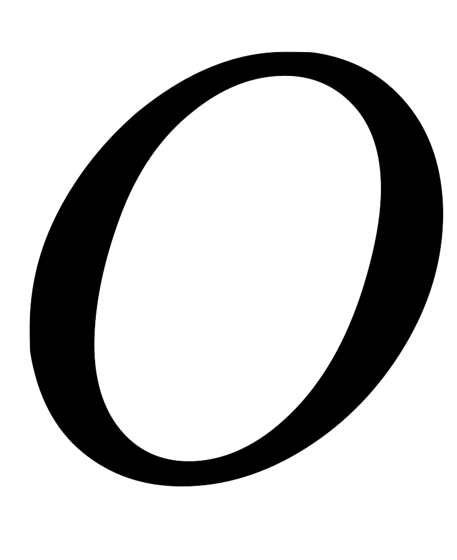

# 卷积动机

卷积运算通过三个重要的思想来帮助改进机器学习系统：稀疏交互(sparse interactions)、参数共享(parameter sharing)、等变表示(equivariant representations)。另外，卷积提供了一种处理大小可变的输入方法。

## 稀疏交互

传统的神经网络使用矩阵乘法来建立输入与输出的连接关系。其中，参数矩阵中每一个单独的参数都描述了一个输入单元与一个输出单元间的交互。这意味着每一个输出单元与每一个输入单元都产生交互。然而，卷积网络具有稀疏交互(sparse interactions)(也叫做稀疏连接(sparse connectivity)或者稀疏权重(sparse weights))的特征。这是使核的大小远小于输入的大小来达到的。举个例子，当处理一张图像时，输入的图像可能包含成千上万个像素点，但是我们可以通过只占用几十到上百个像素点的核来检测一些小的有意义的特征，例如图像的边缘。这意味着我们需要存储的参数更少，不仅减少了模型的存储需求，而且提高了它的统计效率。这也意味着为了得到输出我们只需要更少的计算量。这些效率上的提高往往是很显著的。如果有个输入和个输出，那么矩阵乘法需要个参数并且相应算法的时间复杂度为(对于每一个例子)。如果我们限制每一个输出拥有的连接数为，那么稀疏的连接方法只需要个参数以及的运行时间。在很多实际应用中，只需保持比小几个数量级，就能在机器学习的任务中取得好的表现。在深度卷积网络中，处在网络深层的单元可能与绝大部分输入是间接交互的。这允许网络可以通过只描述稀疏交互的基石来高效地描述多个变量的复杂交互。

## 参数共享

参数共享(parameter sharing)是指在一个模型的多个函数中使用相同的参数。在传统的神经网络中，当计算一层的输出时，权重矩阵的每一个元素只使用一次，当它乘以输入的一个元素后就再也不会用到了。作为参数共享的同义词，我们可以说一个网络含有绑定的权重(tied weights)，因为用于一个输入的权重也会被绑定在其他的权重上。在卷积神经网络中，核的每一个元素都作用在输入的每一位置上(是否考虑边界像素取决于对边界决策的设计)。卷积运算中的参数共享保证了我们只需要学习一个参数集合，而不是对于每一位置都需要学习一个单独的参数集合。这虽然没有改变前向传播的运行时间(仍然是)，但它显著地把模型的存储需求降低至个参数，并且通常要比小很多个数量级。因为和通常有着大致相同的大小，在实际中相对于是很小的。因此，卷积在存储需求和统计效率方面极大地优于稠密矩阵的乘法运算。

## 等变表示

对于卷积,参数共享的特殊形式使得神经网络层具有对平移等变(equivariance)的性质。如果一个函数满足输入改变，输出也以同样的方式改变这一性质，我们就说它是等变(equivariant)的。特别地，如果函数与满足，我们就说对于变换具有等变性。对于卷积来说，如果令是输入的任意平移函数，那么卷积函数对于具有等变性。举个例子，令表示图像在整数坐标上的亮度函数，表示图像函数的变换函数(把一个图像函数映射到另一个图像函数的函数)使得，其中图像函数满足。这个函数把中的每个像素向右移动一个单位。如果我们先对进行这种变换然后进行卷积操作所得到的结果，与先对进行卷积然后再对输出使用平移函数得到的结果是一样的。当处理时间序列数据时，这意味着通过卷积可以得到一个由输入中出现不同特征的时刻所组成的时间轴。如果我们把输入中的一个事件向后延时，在输出中仍然,会有完全相同的表示，只是时间延后了。图像与之类似，卷积产生了一个2维映射来表明某些特征在输入中出现的位置。如果我们移动输入中的对象，它的表示也会在输出中移动同样的量。当处理多个输入位置时，一些作用在邻居像素的函数是很有用的。例如在处理图像时，在卷积网络的第一层进行图像的边缘检测是很有用的。相同的边缘或多或少地散落在图像的各处，所以应当对整个图像进行参数共享。但在某些情况下，我们并不希望对整幅图进行参数共享。例如，在处理已经通过剪裁而使其居中的人脸图像时，我们可能想要提取不同位置上的不同特征(处理人脸上部的部分网络需要去搜寻眉毛，处理人脸下部的部分网络就需要去搜寻下巴了)。卷积对其他的一些变换并不是天然等变的，例如对于图像的放缩或者旋转变换,，需要其他的一些机制来处理这些变换。

---

# 卷积运算
对图像（不同的数据窗口数据）和滤波矩阵（一组固定的权重：因为每个神经元的多个权重固定，所以又可以看做一个恒定的滤波器filter）做内积（逐个元素相乘再求和）的操作就是所谓的“卷积”操作，也是卷积神经网络的名字来源。非严格意义上来讲，下图中红框框起来的部分便可以理解为一个滤波器，即带着一组固定权重的神经元。多个滤波器叠加便成了卷积层。

在下图对应的计算过程中，输入是一定区域大小(width*height)的数据，和滤波器filter（带着一组固定权重的神经元）做内积后等到新的二维数据。具体来说，左边是图像输入，中间部分就是滤波器filter（带着一组固定权重的神经元），不同的滤波器filter会得到不同的输出数据，比如颜色深浅、轮廓。相当于如果想提取图像的不同特征，则用不同的滤波器filter，提取想要的关于图像的特定信息：颜色深浅或轮廓。

## 卷积运算过程

比如下图，图中左边部分是原始输入数据，图中中间部分是滤波器filter，图中右边是输出的新的二维数据

上图中，中间滤波器filter（卷积核）与数据窗口做内积，计算过程为

### 相关参数

在CNN中，滤波器filter（带着一组固定权重的神经元）对局部输入数据进行卷积计算。每计算完一个数据窗口内的局部数据后，数据窗口不断平移滑动，直到计算完所有数据。这个过程中，有这么几个参数：

- 内核大小：即卷积核(滤波器filter)大小，定义了卷积的视野。二维常见的选择是或。
- 深度：神经元个数，决定输出的深度厚度。同时代表卷积核(滤波器filter)数量。
- 步长：步幅定义了遍历图像时内核移动的步长，即运算完后移动多少。
- 填充：定义样本的边框如何处理。

输入和输出通道：卷积层需要一定数量的输入通道，并计算出特定数量的输出通道。可以通过来计算这样一层所需的参数，其中等于内核中的值的数量。

### 运算过程

cs231n课程中的经典卷积动图如下，清晰描述了卷积的运算过程：左边为输入（中，代表图像的像素/长宽，3代表R、G、B三个颜色通道）。最右边是两个不同的输出（绿色）。这个例子里内核大小为，深度为（分别为下图中两个红色Filter w0和w1(每个各三个因为RGB三颜色通道)），步长为（每次移动个单位），填充为（即图中原数据四周灰色填区域）。  随着左边数据窗口的平移滑动，滤波器Filter w0和Filter w1对不同的局部数据进行卷积计算。具体运算以第一个输出为例（两个输出上面的那个中左上第一项如何来的）：当前卷积核w1与每个维度数据第一个局部区域做内积，然后三个内积相加，最后加偏置项记为对应输出，如下图所示：

0维：

1维：

2维：

求和加偏置项b0：

值得一提的是：

1、左边数据在变化，每次滤波器都是针对某一局部的数据窗口进行卷积，这就是所谓的CNN中的**局部感知机制**。打个比方，滤波器就像一双眼睛，人类视角有限，一眼望去，只能看到这世界的局部。如果一眼就看到全世界，你会累死，而且一下子接受全世界所有信息，你大脑接收不过来。当然，即便是看局部，针对局部里的信息人类双眼也是有偏重、偏好的。比如看美女，对脸、胸、腿是重点关注，所以这3个输入的权重相对较大。

2、数据窗口滑动，导致输入在变化，但中间滤波器Filter w0的权重（即每个神经元连接数据窗口的权重）是固定不变的，这个权重不变即所谓的CNN中的**参数（权重）共享机制**。再打个比方，某人环游全世界，所看到的信息在变，但采集信息的双眼不变。btw，不同人的双眼看同一个局部信息所感受到的不同，即一千个读者有一千个哈姆雷特，所以不同的滤波器就像不同的双眼，不同的人有着不同的反馈结果。

另值得注意的是，几个卷积核即会得到几个特征图，而特征图大小计算如下（注意长宽的加1）：

## 不同卷积类型

### 常规卷积

### 扩张卷积（Dilated Convolutions）

又名阿鲁斯卷积。扩张卷积引入另一个卷积层的参数被称为扩张率。这定义了内核中值之间的间距。扩张速率为的内核将具有与内核相同的视野，而只使用个参数。想象一下，使用内核并删除每个间隔的行和列。它使得系统能够以相同的计算成本提供更广泛的观察范围。扩张卷积在实时分割领域特别受欢迎。如果你需要更大的观察范围，且无法承受多个卷积或更大的内核，请考虑使用它。：

### 转置卷积（Transposed Convolutions）

又名反卷积或分段缠绕卷积。一些人使用反卷积这个名称，这不是特别恰当的，因为它不是一个反卷积。使事情变得更糟糕的反卷积确实存在，但在深度学习领域并不常见。实际的反卷积是反转卷积的过程。想象一下，将图像输入到单个卷积层。现在开始输出，把放置到一个黑盒子里，然后将你的原始图像再次输出。这个黑盒子进行了一个反卷积操作。这就是卷积层的数学反演。

转置的卷积在某种程度上来说是相似的，因为它和一个假设的反卷积层所产生的空间分辨率是相同的。但是，正在执行的实际数学运算在值上是不同的。转置卷积层执行的是常规卷积，但它会恢复其空间变换。关于这一点你可能会感到困惑，所以让我们来看一个具体的示例。将一个的图像馈送到卷积层。其步幅设置为，padding禁用，内核为。结果是产生一个的图像。

如果我们想反转这个过程，我们需要反数学运算，以便从我们输入的每个像素中生成个值。之后，我们以步幅的设置来遍历输出图像。这将是一个反卷积。

而转置卷积将不会进行此类操作。唯一的共同之处在于它保证输出也将是一个的图像，同时仍然执行正常的卷积运算。为了实现这一点，我们需要在输入上执行一些漂亮的padding。正如你现在可以想象的，这一步并不会从上面扭转这个过程。至少不包括数值。它只是在以往的基础上重建空间分辨率并执行卷积操作。这可能不是数学的反演，但是对于Encoder-Decoder架构来说，它仍然非常有用。这样，我们可以将图像的缩放与卷积相结合，而不是将两个过程单独分开进行。

## Source

[https://blog.csdn.net/v_JULY_v/article/details/51812459](https://blog.csdn.net/v_JULY_v/article/details/51812459) [http://cs231n.stanford.edu/](http://cs231n.stanford.edu/) [https://www.sohu.com/a/159591827_390227](https://www.sohu.com/a/159591827_390227) [https://www.jiqizhixin.com/articles/a-deeper-understanding-of-nnets?from=synced&keyword=卷积 动图](https://www.jiqizhixin.com/articles/a-deeper-understanding-of-nnets?from=synced&keyword=%E5%8D%B7%E7%A7%AF%20%E5%8A%A8%E5%9B%BE)
