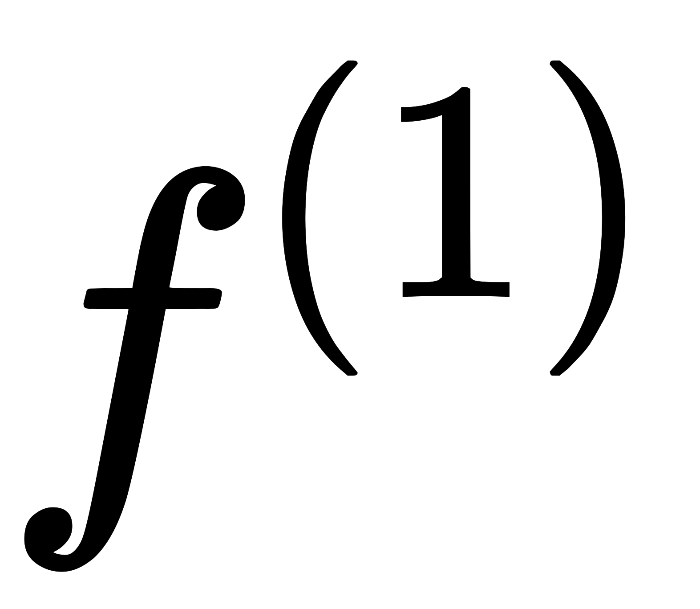
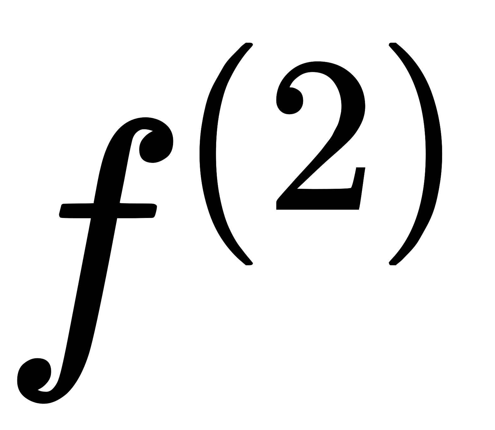
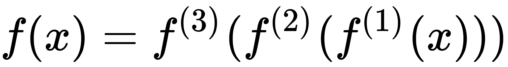
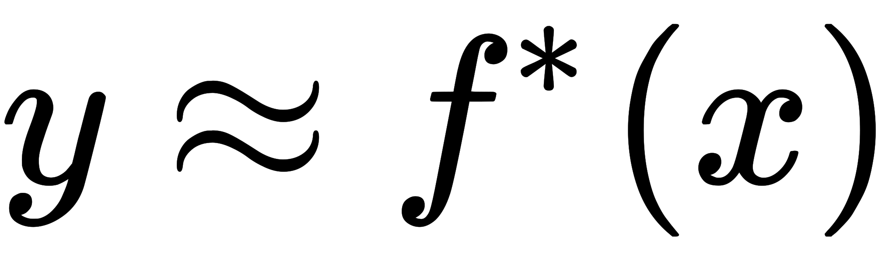
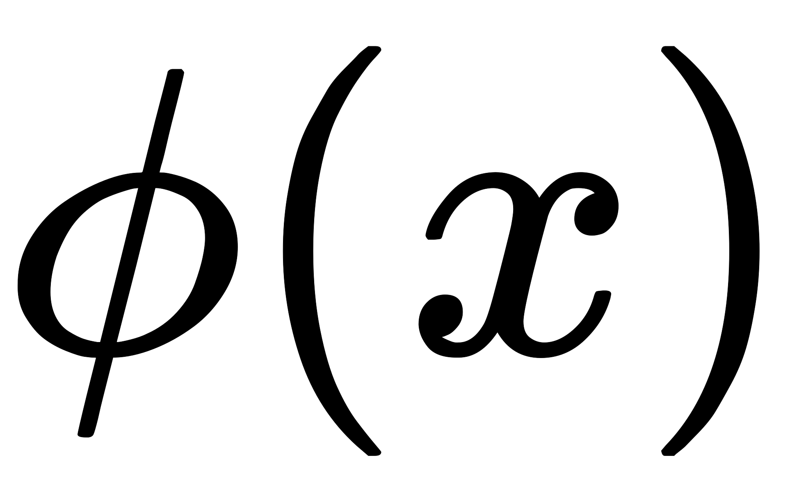
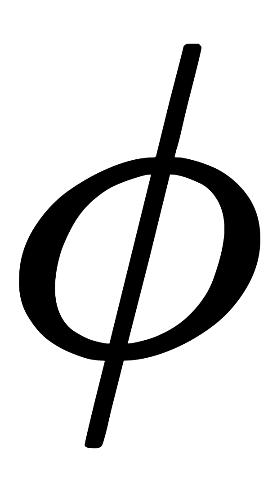
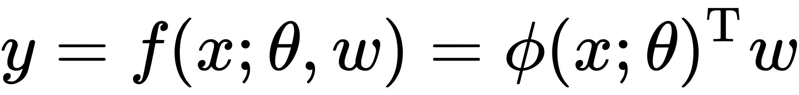
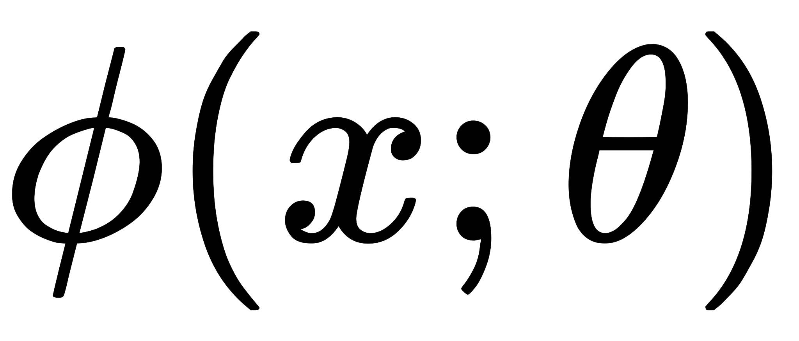

深度前馈网络(前馈神经网络或者多层感知机)，是典型的深度学习模型。[http://playground.tensorflow.org/](http://playground.tensorflow.org/)

前馈神经网络之所以被称作网络，是因为它们通常用许多不同函数复合在一起来表示。该模型与一个有向无环图相关联，而图描述了函数是如何复合在一起的。例如，我们有三个函数、和连接在一个链上以形成。在这种情况下，

- 被称为网络的**第一层**，被称为**第二层**，以此类推。链的全长称为模型的**深度**。正是因为这个术语才出现了“深度学习”这个名字。
- 前馈网络的最后一层被称为**输出层**。
- 每个样本都伴随着一个标签。训练样本直接指明了输出层在每一点上必须产生一个接近的值。但是训练数据并没有直接指明其他层应该怎么做，因为训练数据并没有给出这些层中的每一层所需的输出，所以这些层被称为**隐藏层**。

这些网络之所以被称为神经网络，是因为受到神经科学的启发。网络中的每个隐藏层通常都是向量值的。这些隐藏层的维数决定了模型的**宽度**。向量的每个元素都可以被视为起到类似一个神经元的作用。除了将层想象成向量到向量的单个函数，我们也可以把层想象成由许多并行操作的**单元**组成，每个单元表示一个向量到标量的函数。每个单元在某种意义上类似一个神经元，它接收的输入来源于许多其他的单元，并计算它自己的激活值。

一种理解前馈网络的方式是从线性模型开始，并考虑如何克服它的局限性。线性模型，例如逻辑回归和线性回归，无论是通过闭式解还是凸优化，它们都能高效且可靠地拟合。线性模型也有明显缺陷，那就是模型的能力被局限在线性函数里，所以它无法理解任何两个输入变量间的相互作用。

为了扩展线性模型来表示的非线性函数，我们可以不把线性模型用于本身，而是用在一个变换后的输入上。这里是一个非线性变换。例如核技巧，得到一个基于隐含地使用映射的非线性学习算法。我们可认为提供了一组描述的特征，或者认为它提供了的一个新的表示。剩下的问题就是如何选择映射：

- 使用一个通用，例如无限维的，它隐含地用在基于RBF核的核机器上。如果具有足够高的维数，我们总是有足够的能力来拟合训练集，但是对于测试集的泛化往往不佳。非常通用的特征映射通常只基于局部光滑的原则，并且没有将足够的先验信息进行编码来解决高级问题。
- 另一种选择是手动设计。在深度学习出现以前，这一直是主流方法。这种方法对于每个单独的任务都需要人们大量的努力，并且不同领域之间很难迁移。
- 深度学习的策略是去学习。在这种方法中，我们有一个模型我们现在有两种参数：用于从一大类函数中学习的参数，以及用于将映射到所需的输出的参数。这是深度前馈网络的一个例子，其中定义了一个一个隐藏层。这是三种方法中唯一一种放弃训练问题的凸性的方法，但是利大于弊。在这种方法中，我们将表示参数化为，并且使用优化算法来寻找，使它能够得到一个好的表示。
