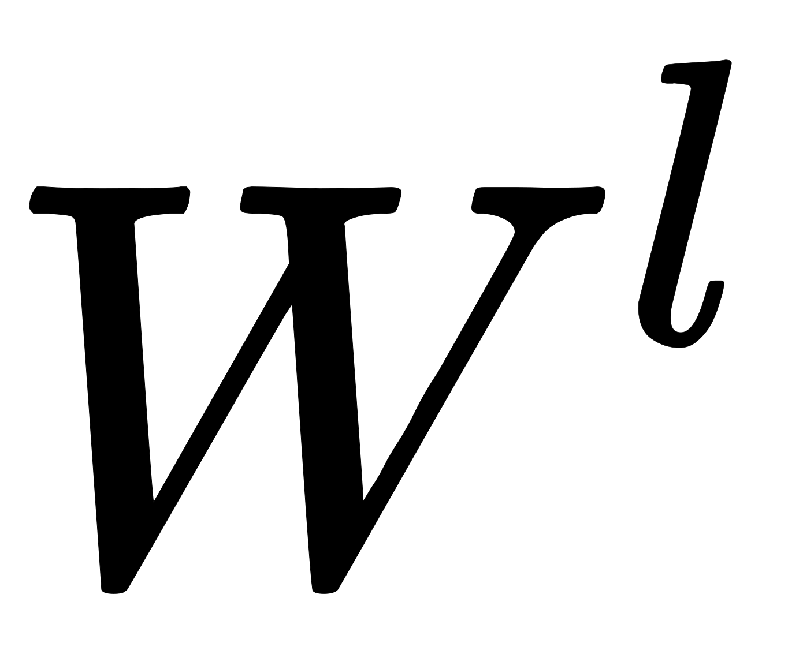

假设我们选择的激活函数是；隐藏层和输出层的输入值为，上标表示第几层，下标表示本层单元的index；隐藏层和输出层的输出值为，上标表示第几层，下标表示本层单元的index。则对于下图的三层DNN，利用和感知机一样的思路，我们可以利用上一层的输出计算下一层的输出，也就是所谓的DNN前向传播算法。建议边在[http://playground.tensorflow.org/](http://playground.tensorflow.org/)上操作，边看本文。

对于第二层的输出，，。的下标第一个数表示当前层的index，第二个数表示前一层的index，上标代表第一层到第二层，我们有

  

对于第三层的输出，我们有

将上面的例子一般化，假设第层共有个神经元，则对于第层的第个神经元的输出：

可以看出，使用代数法一个个的表示输出比较复杂，而如果使用矩阵法则比较的简洁。假设第层共有个神经元，而第层共有个神经元，则第层的线性系数组成了一个的矩阵，第层的偏倚组成了一个的向量，第层的输出组成了一个的向量，第层的未激活前线性输出组成了一个的向量，第层的输出组成了一个的向量。则用矩阵法表示，第层的输出为：

所谓的DNN的前向传播算法也就是利用我们的若干个权重系数矩阵和偏倚向量来和输入值向量进行一系列线性运算和激活运算，从输入层开始，一层层的向后计算，一直到输出层，得到输出结果为止。

输入：总层数，所有隐藏层和输出层对应的矩阵，偏倚向量，输入值向量 输出：输出层的输出

1. 初始化
2. ：
   1. 

最后结果即输出

## Source

[https://blog.csdn.net/anshuai_aw1/article/details/84615935](https://blog.csdn.net/anshuai_aw1/article/details/84615935)
