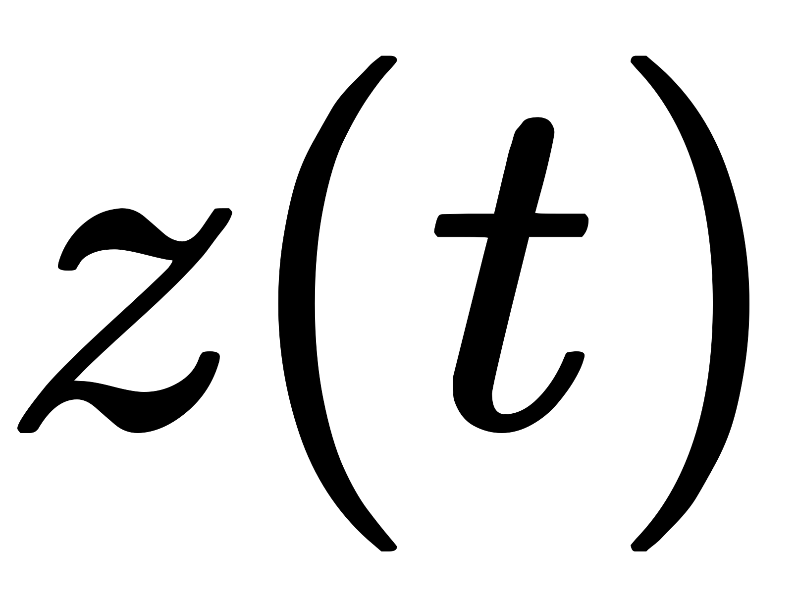
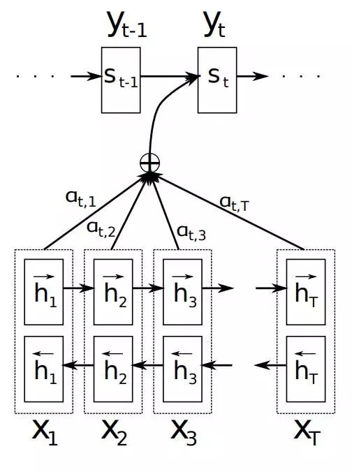
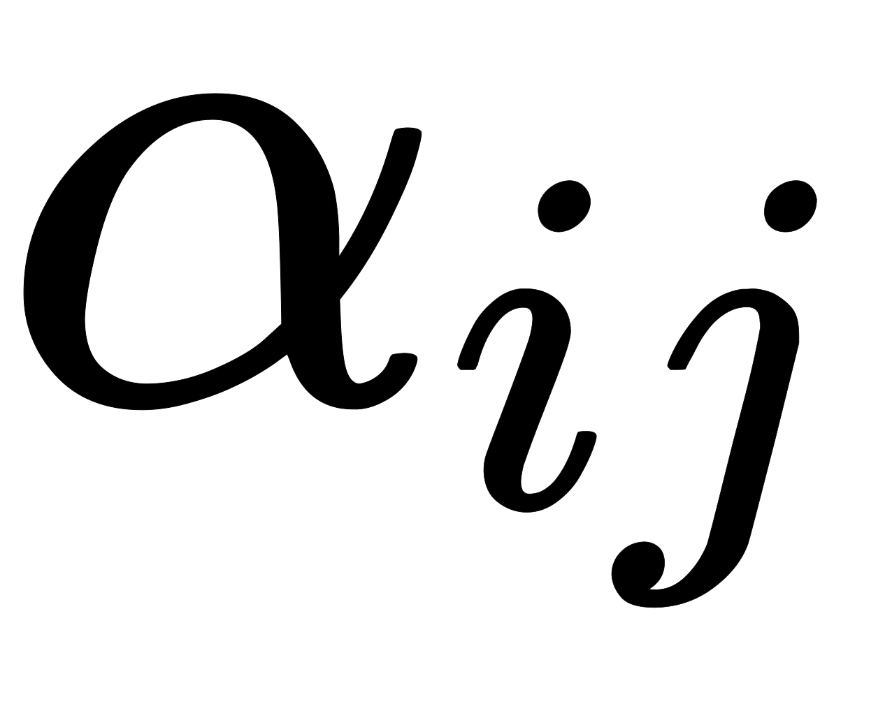
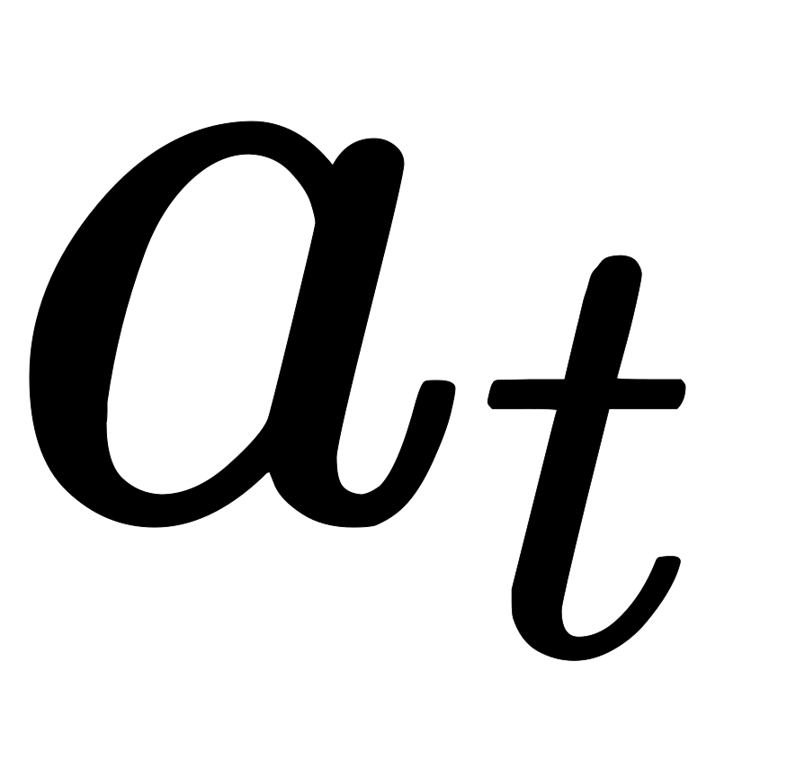
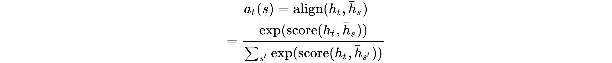

在循环和递归网络章节注意力机制里我们介绍了RNN中Attention的应用，这里我们摘录[优秀文章](https://zhuanlan.zhihu.com/p/31547842)深度剖析一下Attention。在CNN、FCN、RCNN等传统图像识别模型中，输入往往是一整张图，然后使用以卷积为主的模型迭代出结果。Google DeepMind的科学家指出，这种方式具有明显的不足。如果图像中要是别的目标过多、信息过大，RCNN之类模型的区域检测加识别的方式往往很慢，因为每一个ROI（Region Of Interest）都要先判定是否是候选框，如果是候选框，还要送去预测子网络做预测。尽管近年来的论文不断改进卷积模型，让大量卷积层实现共享以提升效率，但传统模型的总体效率和精度也难以再大幅提高了。

近年来对神经学和认知科学的研究表明，传统模型效率不高（准确率往往也不够高）的原因很可能在于其观察事物的方式不够好。既然我们想要解决ROI在哪里并且是什么，那么何必要在全图均匀探索信息（卷积），而不直接从一个ROI跳转到另一个呢？Attention机制据此另辟蹊径，提供了一种全新的认知图像的方式。

我们先来看看人是怎么辨别一张图上的信息的。人在看东西的时候往往会首先定位一个感兴趣的区域，这种该关注哪里就看哪里的机制就是注意力机制（Attention）。辨别出该区域的信息后，目标再移动到下一个感兴趣的区域，对于细节丰富、信息量大的地方，目光可能移动缓慢；对于背景等不重要的地方，可能只稍微看看甚至直接跳过；对于看不懂的地方，目光可能先跳过，最后再折回来（双向Attention）。目光按序扫完整张图后，人对图上的信息也就基本了解了。

Attention仿照上述观察方式，在深度学习网络中加入了感兴趣区域的移动和定位机制，使比较复杂的任务分解成相对简单的子步骤序列。每一步只关注特定小区域，抽取出区域表征的信息，再整合到之前的步骤所积累的信息中。在这样反复观察和整合中，模型逐步学懂了输入源中所蕴含的信息（甚至是层次关系），并对自己的判断也越来越有信心。同时，图片中信息分类置信度的变化，也作为一个反馈信号进一步刺激模型去学习怎样定位下一步的观测位置。

## Attention Mechanism

### Attention解决问题

[Sequence to Sequence Learning with Neural Networks](https://arxiv.org/abs/1409.3215)介绍了一种基于RNN的Seq2Seq模型，基于一个Encoder和一个Decoder来构建基于神经网络的End-to-End的机器翻译模型，其中，Encoder把输入编码成一个固定长度的隐向量，Decoder基于隐向量Z解码出目标输出。这是一个非常经典的序列到序列的模型，但是却存在两个明显的问题：

1. 把输入的所有信息有压缩到一个固定长度的隐向量，忽略了输入输入的长度，当输入句子长度很长，特别是比训练集中最初的句子长度还长时，模型的性能急剧下降。
2. 把输入编码成一个固定的长度，对于句子中每个词都赋予相同的权重，这样做是不合理的，比如，在机器翻译里，输入的句子与输出句子之间，往往是输入一个或几个词对应于输出的一个或几个词。因此，对输入的每个词赋予相同权重，这样做没有区分度，往往是模型性能下降。

同样的问题也存在于图像识别领域，卷积神经网络CNN对输入的图像每个区域做相同的处理，这样做没有区分度，特别是当处理的图像尺寸非常大时，问题更明显。比如近年来RNN模型的爆炸式发展使传统模型的整体输入（如整张图）分解为序列化的子输入（整张图的小块）变为可能。简单的RNN模型可以在积累多步的时序信息之后得出结论，但是这种迭代方式存在一定的问题。每步RNN的输出向量一般只依赖于上一步的输出，这样随着步数的增加，离时刻较远的信息会被慢慢丢失。

LSTM解决了长距离信息丢失的问题，它拥有一个记忆区，通过三个门开关（输入门、遗忘门、输出门）对记忆区进行维护。每当有新的输入到来时，LSTM就将新的信息有选择地加入到记忆区里，并对以往的信息进行有选择的保留，将记忆区的新老信息整合之后再选择性输出。但是这种方法也有明显的不足，即LSTM每一步接受的输入只能是事先给定的，因此这个输入可能是冗余信息，甚至是对当前时刻不恰当的信息。

基于Attention的模型则强调从之前输入已观察到的结果（从输入中观察到的信息）和下一步如何部署观察位置之间的互动，其采用的Attention机制就是根据已观察到的环境信息从众多备选输入中选择“最合适”的输入。当时刻输入到来时，会得到一个输出向量，同时RNN的内部信息状态也将被改变。输出向量，可以代表模型当前大脑中存储的对环境信息的表征（Encoded Vector），此时将反过来作为Attention模块的输入，用以计算出下一步RNN的模型的输入。

因此，2015年，Dzmitry Bahdanau等人在[Neural machine translation by jointly learning to align and translate](https://arxiv.org/abs/1409.0473)提出了Attention Mechanism，用于对输入的不同部分赋予不同的权重，进而实现软区分的目的

### Attention原理

为了解决这一由长序列到定长向量转化而造成的信息损失的瓶颈，Attention注意力机制被引入了。Attention机制跟人类翻译文章时候的思路有些类似，即将注意力关注于我们翻译部分对应的上下文。同样的，Attention模型中，当我们翻译当前词语时，我们会寻找源语句中相对应的几个词语，并结合之前的已经翻译的部分作出相应的翻译，如下图所示，当我们翻译“knowledge”时，只需将注意力放在源句中“知识”的部分，当翻译“power”时，只需将注意力集中在"力量“。这样，当我们decoder预测目标翻译的时候就可以看到encoder的所有信息，而不仅局限于原来模型中定长的隐藏向量，并且不会丧失长程的信息。

要介绍Attention Mechanism结构和原理，首先需要介绍下Seq2Seq模型的结构。基于RNN的Seq2Seq模型主要由两篇论文介绍，只是采用了不同的RNN模型。Ilya Sutskever等人与2014年在论文[Sequence to Sequence Learning with Neural Networks](https://arxiv.org/abs/1409.3215)中使用LSTM来搭建Seq2Seq模型。随后，2015年，Kyunghyun Cho等人在论文[Learning Phrase Representations using RNN Encoder–Decoder for Statistical Machine Translation](https://arxiv.org/abs/1406.1078)提出了基于GRU的Seq2Seq模型。两篇文章所提出的Seq2Seq模型，想要解决的主要问题是，如何把机器翻译中，变长的输入映射到一个变长输出的问题，其主要结构如下图所示 

其中，Encoder把一个变成的输入序列编码成一个固定长度隐向量（背景向量，或上下文向量context），有两个作用：1、做为初始向量初始化Decoder的模型，做为decoder模型预测的初始向量。2、做为背景向量，指导序列中每一个step的的产出。Decoder主要基于背景向量和上一步的输出解码得到该时刻的输出，直到碰到结束标志（EOS）为止。

如上文所述，传统的Seq2Seq模型对输入序列缺乏区分度，因此，2015年，Kyunghyun Cho等人在论文[Learning Phrase Representations using RNN Encoder–Decoder for Statistical Machine Translation](https://arxiv.org/abs/1406.1078)中，引入了Attention Mechanism来解决这个问题，他们提出的模型结构如下图所示

1、首先我们利用RNN结构得到encoder中的hidden state 

2、假设当前decoder的hidden state 是，我们可以计算每一个输入位置j与当前输出位置的关联性，，写成相应的向量形式即为，其中是一种相关性的算符，例如常见的有点乘形式，加权点乘，加和等

3、对于 进行softmax操作将其normalize得到attention的分布，，展开形式为

4、利用我们可以进行加权求和得到相应的context vector 

5、由此，我们可以计算decoder的下一个hidden state 以及该位置的输出

这里关键的操作是计算encoder与decoder state之间的关联性的权重，得到Attention分布，从而对于当前输出位置得到比较重要的输入位置的权重，在预测输出时相应的会占较大的比重。

#### 详细解释

在该模型中，定义了一个条件概率：

其中，是decoder中RNN在时刻的隐状态，其计算公式为：

这里的背景向量的计算方式，与传统的Seq2Seq模型直接累加的计算方式不一样，这里的是一个权重化（Weighted）之后的值，其表达式：

其中，表示encoder端的第个词，表示encoder端的第和词的隐向量，表示encoder端的第个词与decoder端的第个词之间的权值，表示源端第个词对目标端第个词的影响程度，的计算公式如公式：

 

在上式中，是一个softmax模型输出，概率值的和为1。表示一个对齐模型，用于衡量encoder端的位置个词，对于decoder端的位置个词的对齐程度（影响程度），换句话说：decoder端生成位置的词时，有多少程度受encoder端的位置的词影响。对齐模型的计算方式有很多种，不同的计算方式，代表不同的Attention模型，最简单且最常用的的对齐模型是dot product乘积矩阵，即把target端的输出隐状态与source端的输出隐状态进行矩阵乘。常见的对齐计算方式如下：

其中，表示源端与目标单单词对齐程度。可见，常见的对齐关系计算方式有，点乘（Dot product），权值网络映射（General）和concat映射几种方式。

通过Attention机制的引入，我们打破了只能利用encoder最终单一向量结果的限制，从而使模型可以集中在所有对于下一个目标单词重要的输入信息上，使模型效果得到极大的改善。还有一个优点是，我们通过观察attention 权重矩阵的变化，可以更好地知道哪部分翻译对应哪部分源文字，有助于更好的理解模型工作机制，如下图所示

## Attention Mechanism分类

### Soft Attention和Hard Attention

Attention模块所进行的选择过程可以表现为某种函数映射，具体实现分为两种形式：Soft Attention和Hard Attention。Kelvin Xu等人与2015年发表论文[Show, Attend and Tell: Neural Image Caption Generation with Visual Attention](https://arxiv.org/abs/1502.03044)，在Image Caption中引入了Attention，当生成第个关于图片内容描述的词时，用Attention来关联与个词相关的图片的区域。Kelvin Xu等人在论文中使用了两种Attention Mechanism，即Soft Attention和Hard Attention。我们之前所描述的传统的Attention Mechanism就是Soft Attention。Soft Attention是参数化的（Parameterization），因此可导，可以被嵌入到模型中去，直接训练。梯度可以经过Attention Mechanism模块，反向传播到模型其他部分。

总的来说如果所有候选都以一定的概率参与选择，即结果为所有候选向量的概率加权，则称为Soft Attention；如果只从候选中选取某一个候选向量，则称为Hard Attention。

比如图片经过多次卷积后得到一个网格，其中，，，对应于经过卷积之后从4个位置抽取出的候选向量。那么如何通过映射函数得到下一步输入到RNN中的向量呢？首先，Attention模块会在当前步根据RNN的环境变量算出一个候选向量的概率分布。对于Soft Attention，求需要将每个候选向量进行概率加权，即；Hard Attention则仅通过概率分布采样出一个候选向量赋值给

| 策略 | Soft Attention | Hard Attention |
| --- | --- | --- |
| 筛选范围 | 全部 | 一个 |
| 计算方式 | 概率加权 | 采样 |
| 是否可导 | 可导 | 不可导 |
| 训练方式 | 梯度下降 | 强化学习 |

两种Attention Mechanism都有各自的优势，但目前更多的研究和应用还是更倾向于使用Soft Attention，因为其可以直接求导，进行梯度反向传播。

### Global Attention和Local Attention

#### Global Attention

与传统的Attention model一样。所有的hidden state都被用于计算Context vector 的权重，即变长的对齐向量，其长度等于encoder端输入句子的长度。结构如下图所示。

在时刻，首先基于decoder的隐状态和源端的隐状态，计算一个变长的隐对齐权值向量，计算公式如下

是一个用于评价与之间关系的函数，即对齐函数，一般有三种计算方式，我们在上文中已经提到了。

#### Local Attention

Global Attention有一个明显的缺点就是，每一次，encoder端的所有hidden state都要参与计算，这样做计算开销会比较大，特别是当encoder的句子偏长，比如，一段话或者一篇文章，效率偏低。因此，为了提高效率，Local Attention应运而生。

Local Attention是一种介于Kelvin Xu所提出的Soft Attention和Hard Attention之间的一种Attention方式，即把两种方式结合起来。 

Local Attention首先会为decoder端当前的词，预测一个source端对齐位置（aligned position），然后基于选择一个窗口，用于计算背景向量。Position 的计算公式如下：

其中，是encoder端句子长度，和是模型参数。此时，对齐向量的计算公式如下：

总之，Global Attention和Local Attention各有优劣，在实际应用中，Global Attention应用更普遍，因为local Attention需要预测一个位置向量，这就带来两个问题：1、当encoder句子不是很长时，相对Global Attention，计算量并没有明显减小。2、位置向量的预测并不非常准确，这就直接计算的到的local Attention的准确率。

### Self Attention

Self Attention与传统的Attention机制非常的不同：传统的Attention是基于source端和target端的隐变量（hidden state）计算Attention的，得到的结果是源端的每个词与目标端每个词之间的依赖关系。但Self Attention不同，它分别在source端和target端进行，仅与source input或者target input自身相关的Self Attention，捕捉source端或target端自身的词与词之间的依赖关系；然后再把source端的得到的self Attention加入到target端得到的Attention中，捕捉source端和target端词与词之间的依赖关系。因此，self Attention Attention比传统的Attention mechanism效果要好，主要原因之一是，传统的Attention机制忽略了源端或目标端句子中词与词之间的依赖关系，相对比，self Attention可以不仅可以得到源端与目标端词与词之间的依赖关系，同时还可以有效获取源端或目标端自身词与词之间的依赖关系，如下图所示。

Self Attention的具体计算方式如下所示： 

Encoder的输入inputs和decoder的输入outputs，加上position embedding，做为各自的最初的输入，那么问题来了，self Attention具体是怎么实现的呢？从All Attention的结构示意图可以发现，Encoder和decoder是层叠多了类似的Multi-Head Attention单元构成，而每一个Multi-Head Attention单元由多个结构相似的Scaled Dot-Product Attention单元组成，结构如下图所示。 

Self Attention也是在Scaled Dot-Product Attention单元里面实现的，如上图左图所示，首先把输入Input经过线性变换分别得到Q、K、V，注意，Q、K、V都来自于Input，只不过是线性变换的矩阵的权值不同而已。然后把Q和K做dot Product相乘，得到输入Input词与词之间的依赖关系，然后经过尺度变换（scale）、掩码（mask）和softmax操作，得到最终的Self Attention矩阵。尺度变换是为了防止输入值过大导致训练不稳定，mask则是为了保证时间的先后关系。

最后，把encoder端self Attention计算的结果加入到decoder做为k和V，结合decoder自身的输出做为q，得到encoder端的attention与decoder端attention之间的依赖关系。

了解了模型大致原理，我们可以详细的看一下究竟Self-Attention结构是怎样的。其基本结构如下

对于self-attention来讲，Q(Query), K(Key), V(Value)三个矩阵均来自同一输入，首先我们要计算Q与K之间的点乘，然后为了防止其结果过大，会除以一个尺度标度，其中为一个query和key向量的维度。再利用Softmax操作将其结果归一化为概率分布，然后再乘以矩阵V就得到权重求和的表示。该操作可以表示为

这里可能比较抽象，我们来看一个具体的例子（图片来源于[The Illustrated Transformer](https://jalammar.github.io/illustrated-transformer/)，，该博客讲解的极其清晰，强烈推荐）假如我们要翻译一个词组Thinking Machines，其中Thinking的输入的embedding vector用表示，Machines的embedding vector用表示。

当我们处理Thinking这个词时，我们需要计算句子中所有词与它的Attention Score，这就像将当前词作为搜索的query，去和句子中所有词（包含该词本身）的key去匹配，看看相关度有多高。我们用代表Thinking对应的query vector，及分别代表Thinking以及Machines对应的key vector，则计算Thinking的attention score的时候我们需要计算与，的点乘，同理，我们计算Machines的attention score的时候需要计算与，的点乘。如上图中所示我们分别得到了与，的点乘积，然后我们进行尺度缩放与softmax归一化，如下图所示：

显然，当前单词与其自身的attention score一般最大，其他单词根据与当前单词重要程度有相应的score。然后我们在用这些attention score与value vector相乘，得到加权的向量。

如果将输入的所有向量合并为矩阵形式，则所有query, key, value向量也可以合并为矩阵形式表示

其中，，是我们模型训练过程学习到的合适的参数。上述操作即可简化为矩阵形式

而multihead就是我们可以有不同的Q,K,V表示，最后再将其结果结合起来，如下图所示：

这就是基本的Multihead Attention单元，对于encoder来说就是利用这些基本单元叠加，其中key, query, value均来自前一层encoder的输出，即encoder的每个位置都可以注意到之前一层encoder的所有位置。

对于decoder来讲，我们注意到有两个与encoder不同的地方，一个是第一级的Masked Multi-head，另一个是第二级的Multi-Head Attention不仅接受来自前一级的输出，还要接收encoder的输出，下面分别解释一下是什么原理。

第一级decoder的key, query, value均来自前一层decoder的输出，但加入了Mask操作，即我们只能attend到前面已经翻译过的输出的词语，因为翻译过程我们当前还并不知道下一个输出词语，这是我们之后才会推测到的。

第二级decoder也被称作encoder-decoder attention layer，即它的query来自于之前一级的decoder层的输出，但其key和value来自于encoder的输出，这使得decoder的每一个位置都可以attend到输入序列的每一个位置。

总结一下，k和v的来源总是相同的，q在encoder及第一级decoder中与k和v来源相同，在encoder-decoder attention layer中与k和v来源不同。

我们再来看看论文其他方面的细节，一个使position encoding，这个目的是什么呢？注意由于该模型没有recurrence或convolution操作，所以没有明确的关于单词在源句子中位置的相对或绝对的信息，为了更好的让模型学习位置信息，所以添加了position encoding并将其叠加在word embedding上。该论文中选取了三角函数的encoding方式，其他方式也可以，该研究组最近还有relation-aware self-attention机制，可参考这篇[论文](https://arxiv.org/abs/1803.02155)。

再来看看模型中这些Add & Norm模块的作用。

其中Add代表了Residual Connection，是为了解决多层神经网络训练困难的问题，通过将前一层的信息无差的传递到下一层，可以有效的仅关注差异部分，这一方法之前在图像处理结构如ResNet等中常常用到。

而Norm则代表了Layer Normalization，通过对层的激活值的归一化，可以加速模型的训练过程，使其更快的收敛，可参考这篇[论文](https://arxiv.org/abs/1607.06450)。

## 组合的Attention结构

### **Hierarchical Attention**

Zichao Yang等人在论文[Hierarchical Attention Networks for Document Classification](https://www.cs.cmu.edu/~hovy/papers/16HLT-hierarchical-attention-networks.pdf)提出了Hierarchical Attention用于文档分类。Hierarchical Attention构建了两个层次的Attention Mechanism，第一个层次是对句子中每个词的attention，即word attention；第二个层次是针对文档中每个句子的attention，即sentence attention。网络结构如下图所示。

整个网络结构由四个部分组成：一个由双向RNN（GRU）构成的word sequence encoder，然后是一个关于词的word-level的attention layer；基于word attention layar之上，是一个由双向RNN构成的sentence encoder，最后的输出层是一个sentence-level的attention layer。

### Attention over Attention

Yiming Cui与2017年在论文[Attention-over-Attention Neural Networks for Reading Comprehension](https://arxiv.org/abs/1607.04423)中提出了Attention Over Attention的Attention机制，结构如下图所示。

两个输入，一个Document和一个Query，分别用一个双向的RNN进行特征抽取，得到各自的隐状态h（doc）和h（query），然后基于query和doc的隐状态进行dot product，得到query和doc的attention关联矩阵。然后按列（colum）方向进行softmax操作，得到query-to-document的attention 值a（t）；按照行（row）方向进行softmax操作，得到document-to-query的attention值b（t），再按照列方向进行累加求平均得到平均后的attention值b（t）。最后再基于上一步attention操作得到a（t）和b（t），再进行attention操作，即attention over attention得到最终query与document的关联矩阵。

### Multi-step Attention

2017年，FaceBook 人工智能实验室的Jonas Gehring等人在论文[Convolutional Sequence to Sequence Learning](https://arxiv.org/abs/1705.03122)提出了完全基于CNN来构建Seq2Seq模型，除了这一最大的特色之外，论文中还采用了多层Attention Mechanism，来获取encoder和decoder中输入句子之间的关系，结构如下图所示。

完全基于CNN的Seq2Seq模型需要通过层叠多层来获取输入句子中词与词之间的依赖关系，特别是当句子非常长的时候，我曾经实验证明，层叠的层数往往达到10层以上才能取得比较理想的结果。针对每一个卷记得step（输入一个词）都对encoder的hidden state和decoder的hidden state进行dot product计算得到最终的Attention 矩阵，并且基于最终的attention矩阵去指导decoder的解码操作。

## [Attention应用场景](https://machinelearningmastery.com/attention-long-short-term-memory-recurrent-neural-networks/)

### **机器翻译（Machine Translation）**

给定一个法语句子做为输入序列，翻译并输出一个英文句子做为输出序列。Attention用于关联输出序列中每个单词与输入序列中的某个特定单词的关联程度。

“我们扩展了传统的编码器-解码器结构，赋予decoder，在生成目标端（target）的词时，可以自动（软）搜索一组与之相关的输入序列的能力。这使得模型不必将整个源句子编码成一个固定长度的向量，并且还使模型只关注源端与下一个目标词的生成有关的信息。” **-** Dzmitry Bahdanau等人，[Neural machine translation by jointly learning to align and translate](https://arxiv.org/abs/1409.0473)，2015。

通过Attention来解释法语到英语单词之间的对应关系。摘自Dzmitry Bahdanau的论文。

[Universal Transformers](https://arxiv.org/abs/1807.03819)主要是结合了Transformer结构与RNN中循环归纳的优点，使得Transformer结构能够适用更多自然语言理解的问题。其改进的结构如下

可以看到，通过引入Transition Function，我们对Attention可以进行多次循环。这一机制被有效的应用到诸如问答，根据主语推测谓语，根据上下填充缺失的单词，数字字符串运算处理，简易程序执行，机器翻译等场景。

[BERT](https://arxiv.org/abs/1810.04805)是最近自然语言处理领域比较火的文章，打破了多项benchmark，会在自然语言处理部分详细阐述，主要是利用双向Transformer进行预处理，得到包含有上下文信息的表示，这一表示可进一步用来fine-tune很多种自然语言处理任务。下图是BERT模型（双向Tansformer结构）与OpenAI GPT(单向Transformer结构）与ElMo（双向独立LSTM最终组合的结构）的对比。

BERT的表示进行fine-tuning后，对于GLUE Benchmark(主要包含MNLI,RTE：比较两个句子的语义关系，QQP：判别Quora上两个问题相似度，QNLI：问答，SST-2：情感分析，CoLA:语句合理性判别，STS-B, MRPC：句子相似度判别)，SQuAD(问答)，NER（命名实体识别）等都有极大的提高。将来，可能BERT pre-train在自然语言处理领域就会像VGG, ResNet, Inception等在图像识别里的作用而成为预处理的标配。

### **图像标注（Image Captain）**

基于序列的Attention Mechanism可以应用于计算机视觉问题，以帮助理解如何最好地利用卷积神经网络来省长一段关于图片内容的描述，也称为Caption。给定输入图像，输出图像的英文描述。使用Attention是为输出序列中的每个单词关注图像中不同部分。

“我们提出了一种基于Attention mechanism的方法，并在在三个标准数据集上都取得了最好的成绩...我们还展示了如何利用学到的Attention来提供更多对模型生成过程的解释，并且证明Attention学习到的对齐与人类视觉感知非常一致。” **-** Kelvin Xu等人，[Attend and Tell: Neural Image Caption Generation with Visual Attention](https://arxiv.org/abs/1502.03044), 2016

基于Attention来解释，生成英文描述中某一个词时，与图片中某一区域的高度依赖关系。

### **关系抽取（EntailMent Extraction）**

给定一个用英语描述前景描述（premise scenario）和假设（hypothesis），判读假设（premise）与假设（hypothesis）的关系：矛盾，相关或包含。

例如：前提：“一场婚礼中拍照”，假设：“有人结婚”

Attention被用来把假设中的每个单词与前提中的单词联系起来，反之亦然。

“我们提出了一个基于LSTM的神经模型，它一次读取两个句子来确定两个句子之间的蕴含关系，而不是将每个句子独立映射到一个语义空间。我们引入逐字的（word-by-word）Attention Mechanism来扩展这个模型，来强化模型对单词或短语对的关系推理能力。该模型比传统的仅基于LSTM的模型高2.6个百分点，取得了一个最高成就” - Tim Rocktäschel，[Reasoning about Entailment with Neural Attention](https://arxiv.org/abs/1509.06664), 2016

基于Attention来解释前提和假设中词与词之间的对应关系**。**

### **语音识别（Speech Recognition）**

给定一段英语语音片段做为输入序列，输出对应的音素序列。Attention被用联将输出序列中的每个音素与输入序列中的特定音频帧相关联。

“基于混合Attention机制的新型端到端可训练语音识别体系结构，其结合内容和位置信息帮助选择输入序列中的下一个位置用于解码。所提出的模型的一个理想特性就是它可以识别比训练集中句子的更长的句子。” - Jan Chorowski，[Attention-Based Models for Speech Recognition](https://arxiv.org/abs/1506.07503), 2015。

基于Attention来解释输出音素与输入端的声音片段的对应关系。

### **自动摘要生成（Text Summarization）**

给定一篇英文文章做为输入顺序，输出一个总结英文文章注意内容的摘要句子。Attention用于将输出摘要中的每个单词与输入文档中的特定单词相关联。

“将基于Attention的神经网络用语摘要抽取。我们将这个概率模型与可以产生准确的摘要的生成算法相结合。” - Alexander M. Rush，[A Neural Attention Model for Abstractive Sentence Summarization](https://arxiv.org/abs/1509.00685), 2015。

基于Attention来解释输入Sentence与输出Summary之间单词的对应关系。

## Source
[模型汇总24 - 深度学习中Attention Mechanism详细介绍：原理、分类及应用](https://zhuanlan.zhihu.com/p/31547842) [Attention机制详解（一）——Seq2Seq中的Attention](https://zhuanlan.zhihu.com/p/47063917) [Attention机制详解（二）——Self-Attention与Transformer](https://zhuanlan.zhihu.com/p/47282410) [Attention机制详解（三）——Attention模型的应用](https://zhuanlan.zhihu.com/p/47613793) [The Illustrated Transformer](https://jalammar.github.io/illustrated-transformer/)
