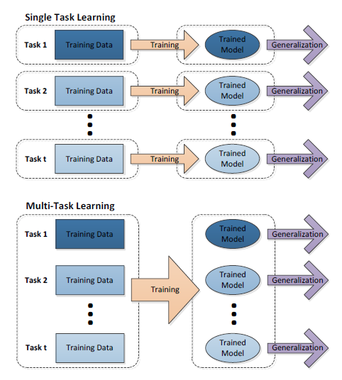
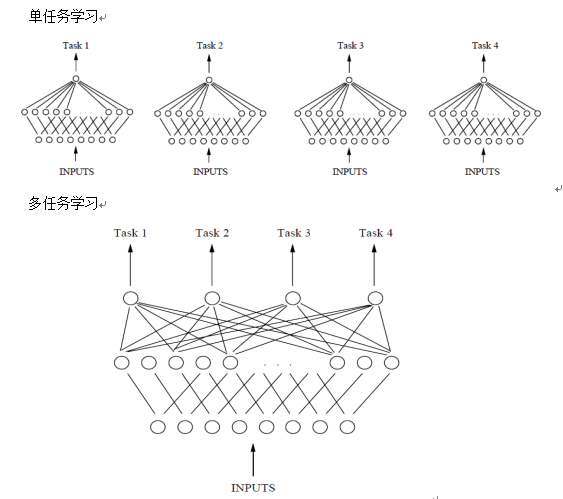
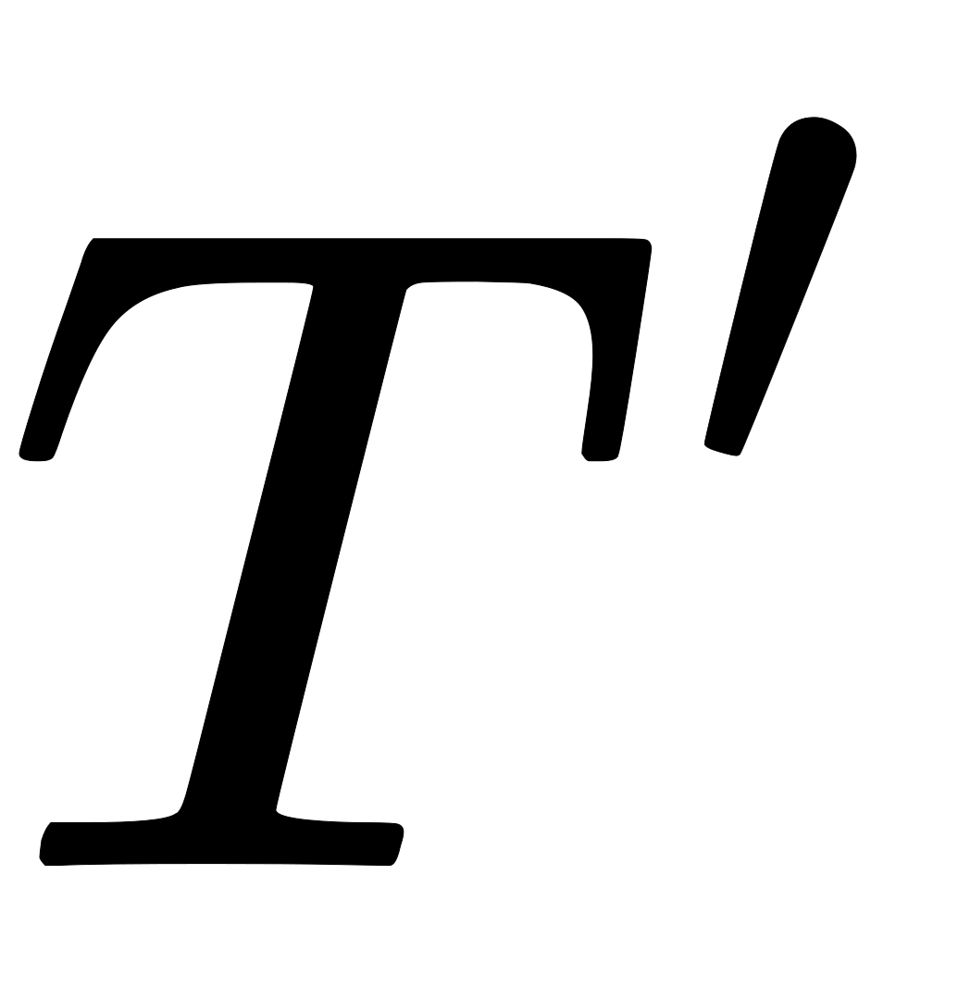
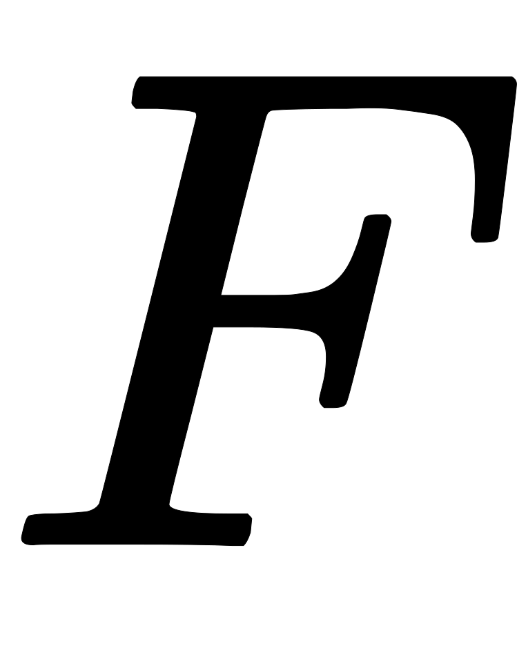
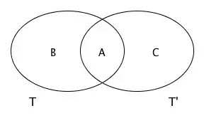
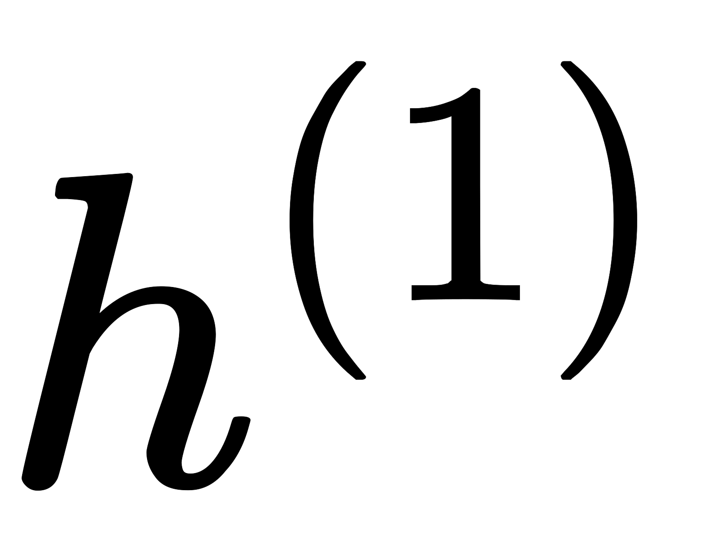
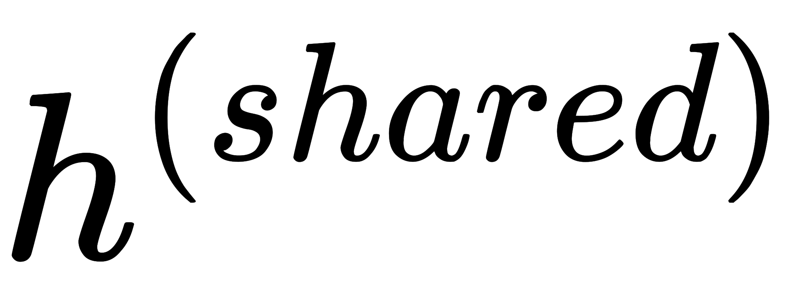
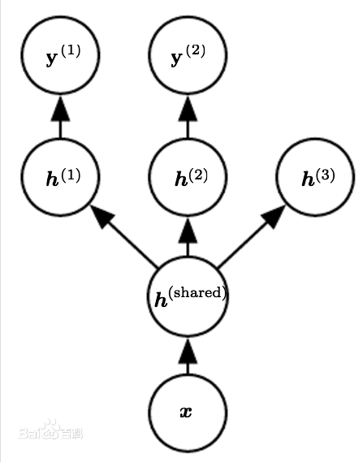
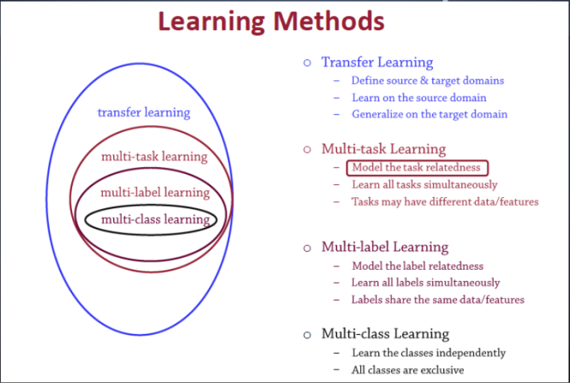

多任务学习（Multi-Task Learning，MTL）是一种采用归纳迁移机制的机器学习方法，主要目标是利用隐含在多个相关任务的训练信号中的特定领域信息来提高泛化能力。多任务学习通过使用共享表示并行训练多个任务来完成这一目标。总的来说，多任务学习在学习一个问题的同时，可以通过使用共享表示来获得其他相关问题的知识。归纳迁移学习（Inductive Transfer Learning）是一种专注于将解决一个问题的知识应用到相关问题上的方法，从而提高学习的效率。比如，学习行走时掌握的能力可以帮助学会跑，学习识别椅子的知识可以用到识别桌子的学习中，我们可以在相关的学习任务之间迁移通用的知识。

## 多任务学习定义

现在大多数机器学习任务都是单任务学习。对于复杂的问题，也可以分解为简单且相互独立的子问题来单独解决，然后再合并结果，得到最初复杂问题的结果。这样做看似合理，其实是不正确的，因为现实世界中很多问题不能分解为一个一个独立的子问题，即使可以分解，各个子问题之间也是相互关联的，通过一些共享因素或共享表示（share representation）联系在一起。把现实问题当做一个个独立的单任务处理，忽略了问题之间所富含的丰富的关联信息。多任务学习就是为了解决这个问题而诞生的。把多个相关（related）的任务（task）放在一起学习。这样做真的有效吗？答案是肯定的。多个任务之间共享一些因素，它们可以在学习过程中，共享它们所学到的信息，这是单任务学习所具备的。相关联的多任务学习比单任务学习能去的更好的泛化（generalization）效果。下图即单任务与多任务对比：

从上图中可以发现，单任务学习时，各个任务之间的模型空间（Trained Model）是相互独立的（图1上）。多任务学习时，多个任务之间的模型空间（Trained Model）是共享的。

假设用含一个隐含层的神经网络来表示学习一个任务，单任务学习和多任务学习可以表示成如下图所示。

从上图可以发现，单任务学习时，各个task任务的学习是相互独立的，多任务学习时，多个任务之间的浅层表示共享（shared representation）。

所以，多任务学习（Multitask learning）可以定义为：**基于共享表示（shared representation），把多个相关的任务放在一起学习的一种机器学习方法。**

多任务学习（Multitask Learning）是一种推导迁移学习方法，主任务（main tasks）使用相关任务（related tasks）的训练信号（training signal）所拥有的领域相关信息（domain-specific information），做为一直推导偏差（inductive bias）来提升主任务（main tasks）泛化效果（generalization performance）的一种机器学习方法。多任务学习涉及多个相关的任务同时并行学习，梯度同时反向传播，多个任务通过底层的共享表示（shared representation）来互相帮助学习，提升泛化效果。简单来说：多任务学习把多个相关的任务放在一起学习（注意，一定要是相关的任务，后面会给出相关任务（related tasks）的定义，以及他们共享了那些信息），学习过程（training）中通过一个在浅层的共享（shared representation）表示来互相分享、互相补充学习到的领域相关的信息（domain information），互相促进学习，提升泛化的效果。

共享表示shared representation：共享表示的目的是为了提高泛化（improving generalization），**上面**图中给出了多任务学习最简单的共享方式，多个任务在浅层共享参数。MTL中共享表示有两种方式：

- 基于参数的共享（Parameter based）：比如基于神经网络的MTL，高斯处理过程。
- 基于约束的共享（regularization based）：比如均值，联合特征（Joint feature）学习（创建一个常见的特征集合）。

## 多任务学习有效原因

为什么把多个相关的任务放在一起学习，可以提高学习的效果？关于这个问题，有很多解释。这里列出其中一部分：

- 多相关任务放在一起学习，有相关的部分，但也有不相关的部分。当学习一个任务（Main task）时，与该任务不相关的部分，在学习过程中相当于是噪声，因此，引入噪声可以提高学习的泛化（generalization）效果。
- 单任务学习时，梯度的反向传播倾向于陷入局部极小值。多任务学习中不同任务的局部极小值处于不同的位置，通过相互作用，可以帮助隐含层逃离局部极小值。
- 添加的任务可以改变权值更新的动态特性，可能使网络更适合多任务学习。比如，多任务并行学习，提升了浅层共享层（shared representation）的学习速率，可能，较大的学习速率提升了学习效果。
- 多个任务在浅层共享表示，可能削弱了网络的能力，降低网络过拟合，提升了泛化效果。

还有很多潜在的解释，为什么多任务并行学习可以提升学习效果（performance）。多任务学习有效，是因为它是建立在多个相关的，具有共享表示（shared representation）的任务基础之上的，因此，需要定义一下，什么样的任务之间是相关的。

## 相关任务定义

既然同时学习多个相关任务有重要的意义，那么什么是相关任务？有些理论对任务的相关性刻画已经很清楚了：

- 如果两个任务是处理输入的相同函数，但是在任务信号中加入独立的噪声处理，那么很明显这两个任务是相关的。
- 如果两个任务用于预测同一个个体的属性的不同方面，那么这些任务比预测不同个体的属性的不同方面更相关。
- 两个任务共同训练时能相互帮助并不意味着它们是相关的。例如，通过在后向传播网络的一个额外输出中加入噪声可以提高泛化能力，但是这个噪声任务与其他任务不相关。

相关（related）的具体定义很难，但我们可以知道的是，在多任务学习中，related tasks可以提升main task的学习效果，基于这点得到相关的定义，即效果更好，那就是相关的。

## 多任务学习如何发挥作用

为什么在一个神经网络上同时训练一个任务极其相关任务的学习效果会更好？这是因为额外任务的信息有助于共享的隐层学到更好的内部表示。那么，多任务学习是如何利用相关任务的训练信号中的信息的呢？

### 预防过拟合（overfitting prevention）

在某种程度上，不相关任务对聚合梯度的贡献对于其他任务来说可以视为噪声。那么，不相关任务也可以通过作为噪声源来提高泛化能力；再者增加任务会影响网络参数的更新。比如增加额外的任务提高了隐层有效的学习率，具体取决于每个任务输出的错误反馈权重；还有是网络的容量，多任务网络在所有任务之间共享网络底部的隐层，或许使用更小的容量就可以获得同水平或更好的泛化能力。

### 数据增强（data amplification）

相关任务的训练信号中的额外信息相当于有效地增加了样本的大小，特别是训练信号中存在噪声时，相当于做了数据增强。假定有两个任务和，在它们的训练信号中都加入了独立的噪声，都受益于计算隐层中输入的特征。一个同时学习了和的网络，如果发现两个任务共享，则可以使用两个训练信号通过在不同的噪声处理过程中平均化，从而更好地学习。

### 属性选择（attribute selection）

考虑两个任务和，使用共同的特征，假定网络由很多个输入，如果训练数据比较有限或噪声比较明显，那么一个学习的网络有时难以区分与相关和不相关的数据。然而，一个同时学习和的网络将可以更好地选择与相关的属性，因为数据增强为提供了更好的训练信号，使该网络能更好地判断哪些输入用于计算。属性选择是数据增强的结果。

### 信息窃取（eavesdropping）

考虑一个对任务和都有用的隐层特征，该特征在学习时比较容易学到，而在学习时比较难学到（因为用一种更复杂的方式使用，或者没有时学到的残留误差更大）。一个网络学习将可以学到，但一个只学习的网络将不能做到。如果一个网络在学习时还学习，那么可以在隐层中窃取已经学到的信息，因此可以学得更好。一旦和的表示建立了连接，就可以根据任务相对于独有的额外信息进一步学习。

### 表示偏置（representation bias）

因为神经网络以随机权重初始化，后向传播是一个随机搜索的过程，多次运行很少产生同样的网络。如下图所示，假定任务能够发现两个极小值区域和，一个学习任务的网络同样有两个极小值区域和，它们在共享极小值，但在和没有重叠区域。

设立了两个实验：

第一个实验中，单独训练的网络以均等概率找到和，单独训练的网络以均等概率找到和。而同时训练和的网络，通常两个任务都只找到。这表明多任务学习任务偏好其他任务也偏好的隐层表示，搜索对或单独学习到的表示的交集倾斜。

第二个实验中，选择使对有强烈偏好的极小值：一个训练的网络总是落入。然而，依然对或没有倾向。当和同时在一个网络上训练时，如预料中落入：未能帮助从拉入。令人惊讶的是，通常落入，未与共享极小值。在隐层表示中创建一个趋势 从流向，而对或没有任何倾向，但受制于创建的趋势，因此通常落入。多任务学习任务倾向于不使用其他任务不偏好使用的隐层表示。

## 多任务学习与正则化
多任务学习是通过合并几个任务中的样例（可以视为对参数施加的软约束）来提高泛化的一种方式。额外的训练样本以同样的方式将模型的参数推向泛化更好的方向，当模型的一部分在任务之间共享时，模型的这一部分更多地被约束为良好的值（假设共享是合理的），往往能更好地泛化。

下图是深度学习中多任务学习的一个例子，网络中的输入层和第一个隐藏层是在多个任务之间共享的，上层的和(对应一个无监督学习任务)是不同任务特有的参数。这里假设是对原始输入的某种公共的抽象表示，可以在多个任务间共享。

 因为共享参数，其统计强度可大大提高（共享参数的样本数量相对于单任务模式增加的比例），并能改善泛化和泛化误差的范围。当然，仅当不同的任务之间存在某些统计关系的假设是合理（意味着某些参数能通过不同任务共享）时才会发生这种情况。

从深度学习的观点看，底层的先验知识如下：能解释数据变化（在与之相关联的不同任务中观察到）的因素中，某些因素是跨两个或更多任务共享的。例如，在出来图像识别相关的任务时卷积层和pooling层可以在多个任务间共享。

## 多任务学习与其他学习关系

[迁移学习（Transfer learning）](http://www3.ntu.edu.sg/home/sinnopan/publications/TLsurvey_0822.pdf)顾名思义就是就是把已学训练好的模型参数迁移到新的模型来帮助新模型训练。考虑到大部分数据或任务是存在相关性的，所以通过迁移学习我们可以将已经学到的模型参数（也可理解为模型学到的知识）通过某种方式来分享给新模型从而加快并优化模型的学习效率不用像大多数网络那样从零学习（starting from scratch，tabula rasa）。迁移学习并不只用在深度学习中，只是近些年深度学习太火，所以迁移学习在深度学习上的成果比较多，更多相关内容移步[这里](https://zhuanlan.zhihu.com/p/44654536)。

多任务学习（Multitask learning）是迁移学习算法的一种，迁移学习之前介绍过。定义一个一个源领域source domain和一个目标领域（target domain），在source domain学习，并把学习到的知识迁移到target domain，提升target domain的学习效果（performance）。

多标签学习（Multilabel learning）是多任务学习中的一种，建模多个label之间的相关性，同时对多个label进行建模，多个类别之间共享相同的数据/特征。

多类别学习（Multiclass learning）是多标签学习任务中的一种，对多个相互独立的类别（classes）进行建模。

## Source

[https://zhuanlan.zhihu.com/p/27421983](https://zhuanlan.zhihu.com/p/27421983) [https://www.zhihu.com/question/41979241/answer/123545914](https://www.zhihu.com/question/41979241/answer/123545914) [https://zhuanlan.zhihu.com/p/44654536](https://zhuanlan.zhihu.com/p/44654536)
