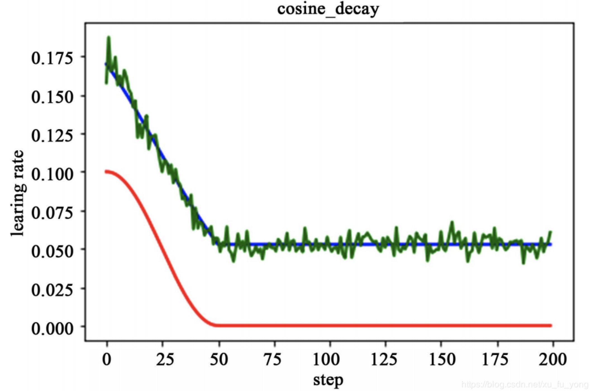

找到一个好的学习率非常重要。如果你设置得太高，训练可能会发散。如果你设置得太低，训练最终会收敛到最优解，但是这将花费很长时间。如果将它设置得稍微有点高，它一开始会很快，但是最终会围绕最优解震荡，不会真正稳定下来。如果你的计算力预算有限，则可能必须先中断训练，从而产生次优解。<br /><br />你可以对一个模型进行数百次的迭代训练以找到一个较好的学习率。但是，你可以做的比恒定学习率更好：如果你从一个较大的学习率开始，一旦训练没有取得进展后就降低它，那与恒定学习率相比，你就可以更快地找到一个最优解。有许多不同的策略可以降低训练期间的学习率。从低学习率开始，增加它，然后再降低它也是有好处的。这些策略称为学习率调度。以下这些是最常用的学习率调度。<br />
<a name="xXphK"></a>
# 常用参数
| 参数名称 | 参数说明 |
| --- | --- |
| learning_rate | 学习率 |
| initial_learning_rate | 初始学习率 |
| step(global_step) | 用于衰减计算的全局步数，非负，用于逐步计算衰减指数 |
| decay_steps | 衰减步数，必须是正值，决定衰减周期 |
| decay_rate | 衰减率 |
| end_learning_rate | 最低的最终学习率 |
| cycle | 学习率下降后是否重新上升 |
| alpha | 最小学习率 |
| num_periods | 衰减余弦部分的周期数 |
| initial_variance | 噪声的初始方差 |
| variance_decay | 衰减噪声的方差 |

<a name="k0RtZ"></a>
# [衰减方法](https://www.tensorflow.org/api_docs/python/tf/keras/optimizers/schedules)
<a name="oI1nY"></a>
## [余弦衰减(CosineDecay)](https://www.tensorflow.org/api_docs/python/tf/keras/optimizers/schedules/CosineDecay)
余弦衰减就是采用余弦的相关方式进行学习率的衰减，衰减图和余弦函数相似。其更新机制如下式所示：<br /><br /><br /><br />
```python
# 定义
def decayed_learning_rate(step):
    step = min(step, decay_steps)
    cosine_decay = 0.5 * (1 + cos(pi * step / decay_steps))
    decayed = (1 - alpha) * cosine_decay + alpha
    return initial_learning_rate * decayed

# 调用
tf.keras.optimizers.schedules.CosineDecay(
    initial_learning_rate, decay_steps, alpha=0.0, name=None
)

# 例子
decay_steps = 1000
lr_decayed_fn = tf.keras.optimizers.schedules.CosineDecay(
    initial_learning_rate, decay_steps)
```
如下图所示，红色即为标准的余弦衰减曲线，学习率从初始值下降到最低学习率后保持不变。蓝色的线是线性余弦衰减方式曲线，它是学习率从初始学习率以线性的方式下降到最低学习率值。绿色噪声线性余弦衰减方式。<br />
<a name="QBtCy"></a>
## [周期余弦衰减(CosineDecayRestarts)](https://www.tensorflow.org/api_docs/python/tf/keras/optimizers/schedules/CosineDecayRestarts)
```python
# 调用
tf.keras.optimizers.schedules.CosineDecayRestarts(
    initial_learning_rate, first_decay_steps, t_mul=2.0, m_mul=1.0, alpha=0.0,
    name=None
)

# 例子
first_decay_steps = 1000
lr_decayed_fn = (
  tf.keras.optimizers.schedules.CosineDecayRestarts(
      initial_learning_rate,
      first_decay_steps))
```
学习率以循环周期进行衰减。是循环学习率的cycle版本。余弦函数式的下降模拟了大lr找潜力区域然后小lr快速收敛的过程，加之restart带来的cycle效果，有涨1-2个点的可能。<br />
<a name="kZH6U"></a>
## [指数衰减(ExponentialDecay)](https://www.tensorflow.org/api_docs/python/tf/keras/optimizers/schedules/ExponentialDecay)
指数衰减的方式，学习率的大小和训练次数指数相关，指数衰减简单直接，收敛速度快，是最常用的学习率衰减方式，其数学公式为：<br />
```python
# 定义
def decayed_learning_rate(step):
    return initial_learning_rate * decay_rate ^ (step / decay_steps)

# 调用
tf.keras.optimizers.schedules.ExponentialDecay(
    initial_learning_rate, decay_steps, decay_rate, staircase=False, name=None
)

# 例子
initial_learning_rate = 0.1
lr_schedule = tf.keras.optimizers.schedules.ExponentialDecay(
    initial_learning_rate,
    decay_steps=100000,
    decay_rate=0.96,
    staircase=True)
model.compile(optimizer=tf.keras.optimizers.SGD(learning_rate=lr_schedule),
              loss='sparse_categorical_crossentropy',
              metrics=['accuracy'])
model.fit(data, labels, epochs=5)
```
如下图所示，红色的为学习率随训练次数的指数衰减方式，蓝色的即为分段常数衰减 。<br />
<a name="kWB7t"></a>
## [倒数衰减(InverseTimeDecay)](https://www.tensorflow.org/api_docs/python/tf/keras/optimizers/schedules/InverseTimeDecay)
倒数衰减的数学公式为：<br />
```python
# 定义
def decayed_learning_rate(step):   # staircase is False
  return initial_learning_rate / (1 + decay_rate * step / decay_step)

def decayed_learning_rate(step):   # staircase is True
  return initial_learning_rate / (1 + decay_rate * floor(step / decay_step))

# 调用
tf.keras.optimizers.schedules.InverseTimeDecay(
    initial_learning_rate, decay_steps, decay_rate, staircase=False, name=None
)

# 例子
...
initial_learning_rate = 0.1
decay_steps = 1.0
decay_rate = 0.5
learning_rate_fn = keras.optimizers.schedules.InverseTimeDecay(
  initial_learning_rate, decay_steps, decay_rate)

model.compile(optimizer=tf.keras.optimizers.SGD(
                  learning_rate=learning_rate_fn),
              loss='sparse_categorical_crossentropy',
              metrics=['accuracy'])

model.fit(data, labels, epochs=5)
```

<a name="tJam5"></a>
## [分段常数衰减(PiecewiseConstantDecay)](https://www.tensorflow.org/api_docs/python/tf/keras/optimizers/schedules/PiecewiseConstantDecay)
```python
# 调用
tf.keras.optimizers.schedules.PiecewiseConstantDecay(
    boundaries, values, name=None
)

# 例子
step = tf.Variable(0, trainable=False)
boundaries = [100000, 110000]
values = [1.0, 0.5, 0.1]
learning_rate_fn = keras.optimizers.schedules.PiecewiseConstantDecay(
    boundaries, values)
# Later, whenever we perform an optimization step, we pass in the step.
learning_rate = learning_rate_fn(step)
```
在对应区间置中不同的学习率的常数值，一般初始学习率会大一些，后面越来越小，要根据样本量的大小设置区间的间隔大小，样本量越大，区间间隔要小一点。在真正的网络训练中，需要操作人员根据具体任务对学习率具体设置。下图即为分段常数衰减的学习率变化图，横坐标代表训练次数，纵坐标代表学习率。该方法有助于针对不同任务进行精细地调参，在任意步长后下降任意数值的learning rate。<br />
<a name="h8Uny"></a>
## [多项式衰减(PolynomialDecay)](https://www.tensorflow.org/api_docs/python/tf/keras/optimizers/schedules/PolynomialDecay)
多项式衰减的方式进行更新学习率，需要给定初始学习率和最低学习率，然后按照给定的衰减方式将学习率从初始值衰减到最低值,其更新规则即为：

1. cycle is False：


2. cycle is True：

<br />可以用它来防止神经网络在训练的后期由于学习率过小而导致的网络一直在某个局部最小值附近震荡，在后期增大学习率跳出局部极小值。
```python
# 定义
def decayed_learning_rate(step):  # cycle is False
    step = min(step, decay_steps)
    return ((initial_learning_rate - end_learning_rate) *
          (1 - step / decay_steps) ^ (power)
         ) + end_learning_rate

def decayed_learning_rate(step):  # cycle is True
    decay_steps = decay_steps * ceil(step / decay_steps)
    return ((initial_learning_rate - end_learning_rate) *
          (1 - step / decay_steps) ^ (power)
         ) + end_learning_rate

# 调用
tf.keras.optimizers.schedules.PolynomialDecay(
    initial_learning_rate, decay_steps, end_learning_rate=0.0001, power=1.0,
    cycle=False, name=None
)

# 例子
...
starter_learning_rate = 0.1
end_learning_rate = 0.01
decay_steps = 10000
learning_rate_fn = tf.keras.optimizers.schedules.PolynomialDecay(
    starter_learning_rate,
    decay_steps,
    end_learning_rate,
    power=0.5)

model.compile(optimizer=tf.keras.optimizers.SGD(
                  learning_rate=learning_rate_fn),
              loss='sparse_categorical_crossentropy',
              metrics=['accuracy'])

model.fit(data, labels, epochs=5)
```

<a name="x0wx0"></a>
# Source
[https://github.com/tensorflow/tensor2tensor/blob/master/tensor2tensor/utils/learning_rate.py](https://github.com/tensorflow/tensor2tensor/blob/master/tensor2tensor/utils/learning_rate.py)<br />[https://www.tensorflow.org/api_docs/python/tf/keras/optimizers/schedules](https://www.tensorflow.org/api_docs/python/tf/keras/optimizers/schedules)<br />[tensorflow/learning_rate_decay.py at master · tensorflow/tensorflow](https://github.com/tensorflow/tensorflow/blob/master/tensorflow/python/training/learning_rate_decay.py)<br />[神经网络十大学习率衰减提效策略](https://zhuanlan.zhihu.com/p/379213781)<br />[常见学习率衰减方式](https://www.jianshu.com/p/125fe2ab085b)
