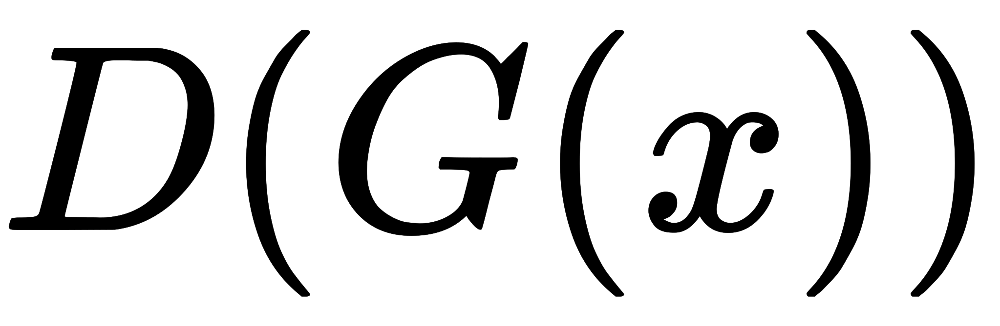

## [GAN原理介绍](https://arxiv.org/abs/1406.2661)

### 原理思想

生成对抗网络(Generative adversarial network, GAN)的基本原理其实非常简单，这里以生成图片为例进行说明。假设我们有两个网络，（Generator）和 （Discriminator）。正如它的名字所暗示的那样，它们的功能分别是：

-  是一个生成图片的网络，它接收一个随机的噪声  ，通过这个噪声生成图片，记做  。
- 是一个判别网络，判别一张图片是real/fake, real是指输入图片来自于训练集，而fake是指图像不是来自于训练集，也就是虚假图片。它的输入参数是  ，代表一张图片，输出 代表为真实图片的概率，如果为  ，就代表是真实的图片，而输出为  ，就代表不可能是真实的图片。

在训练过程中，**生成网络** **的目标就是尽量生成真实的图片去欺骗判别网络** **。而**  **的目标就是尽量把**  **生成的图片和真实的图片分别开来。**这样，  和  构成了一个动态的“博弈过程”。最后博弈的结果是什么？在最理想的状态下， 可以生成足以“以假乱真”的图片  。对于  来说，它难以判定  生成的图片究竟是不是真实的，因此  。这样我们的目的就达成了：我们得到了一个生成式的模型  ，它可以用来生成图片。所以GAN的核心思想就是对抗训练(adversarial traning)。

### 公式描述

以上只是大致说了一下GAN的核心原理，如何用数学语言描述呢？这里直接摘录论文里的公式：  简单分析一下这个公式：

- 整个式子由两项构成。 表示真实图片， 表示输入  网络的噪声，而 表示 网络生成的图片。
- 表示 网络判断真实图片是否真实的概率（因为就是真实的，所以对于来说，这个值越接近越好）。而是网络判断生成的图片的是否真实的概率。
- 的目的：上面提到过，是网络判断生成的图片是否真实的概率，应该希望自己生成的图片“越接近真实越好”。也就是说，希望尽可能得大，也就等价于使得尽可能小。因此我们看到式子的最前面的记号是 。
- 的目的：的能力越强，应该越大，应该越小。这时会变大。因此式子对于 来说是求最大 。

### 训练过程

下面这幅图片很好地描述了这个过程：  其中，黑色虚线是训练集中真实样本的概率密度分布，绿色实线是生成器G生成的假样本的概率密度分布，蓝色虚线是判别器D的概率分布。

1. 从随机噪声分布z中采样，经过G，生成假样本，此时G的拟合能力比较差，生成的样本与真实样本差别很大；
2. 经过训练的判别器D，很容易将真/假样本分辨出来；
3. 在判别器D的梯度引导下，生成器G能够生成更逼真的假样本；
4. 最终，经过多轮的对抗训练，生成器G能够完美拟合真实样本的概率分布，而判别器也已经无法分辨出真假样本，几乎处处D(G(z))=0.5;

那么如何用随机梯度下降法训练D和G？论文中也给出了算法：  这里红框圈出的部分是我们要额外注意的。第一步我们训练，是希望越大越好，所以是梯度上升求最大值，也就等价于加上梯度(ascending)。第二步训练时，越小越好，所以是梯度下降求最小值，也等价于减去梯度(descending)。整个训练过程交替进行直至收敛。

### 总结
生成对抗网络基于对抗训练的思想构建生成模型，只要是可微的模型，都可以用来构建判别器/生成器。模型训练直接使用反向传播算法，无需MCMC进行梯度估计，这是相比其他生成模型的优势。但是GAN仍然存在训练不稳定，模式塌陷等问题。

### Code实现
[https://github.com/jiqizhixin/ML-Tutorial-Experiment/blob/master/Experiments/tf_GAN.ipynb](https://github.com/jiqizhixin/ML-Tutorial-Experiment/blob/master/Experiments/tf_GAN.ipynb)

### Source
[https://arxiv.org/abs/1406.2661](https://arxiv.org/abs/1406.2661)
