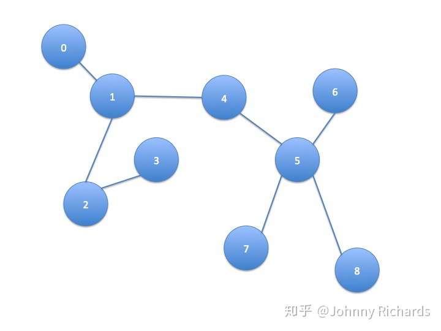

理解GCN重点的点是理解如何将卷积运算推广到图上。卷积运算推广到图上利用了卷积定理，而为了利用卷积定理，我们需要先计算傅立叶变换，而拉普拉斯矩阵是计算傅里叶变换的一步。所以，这篇基于这个思路，先解释拉普拉斯矩阵再到傅立叶变换然后将卷积运算推广到图上，自下而上的讲述GCN的相关细节。

# 通过热传播模型引入拉普拉斯算子
众所周知，没有外接干预的情况下，热量从温度高传播到温度低的地方并且不可逆，根据著名的牛顿冷却定律（Newton Cool's Law），热量传递的速度正比于温度梯度，直观上也就是某个地方A温度高，另外一个B地方温度低，这两个地方接触，那么温度高的地方的热量会以正比于他们俩温度差的速度从A流向B。

我们先建立一个一维的温度传播的模型，假设有一个均匀的铁棒，不同位置温度不一样，现在我们刻画这个铁棒上面温度的热传播随着时间变化的关系。预先说明一下，一个连续的铁棒的热传播模型需要列**温度对时间和坐标的偏微分方程**来解决，我们不想把问题搞这么复杂，我们把**空间离散化**，假设铁棒是一个**一维链条**，链条上每一个单元拥有一致的温度，温度在相邻的不同的单元之间传播，如下图：  对于第个单元，它只和与两个单元相邻，接受它们传来的热量（或者向它们传递热量，只是正负号的差异而已），假设它当前的温度为，那么就有：

和单元的比热容、质量有关，是个常数。右边第一项是下一个单元向本单元的热量流入导致温度升高，第二项是本单元向上一个单元的热量流出导致温度降低。做一点微小的数学变换可以得到：

注意观察第二项，它是两个差分的差分，在离散空间中，相邻位置的差分推广到连续空间就是**导数**，那么差分的差分，就是**二阶导数**！所以，我们可以反推出铁棒这样的连续一维空间的热传导方程就是：

同理，在高维的欧氏空间中，一阶导数就推广到**梯度**，二阶导数就是我们今天讨论的主角——**拉普拉斯算子**：

其中这个符号代表的是对各个坐标二阶导数的加和，现在的主流写法也可以写作。

综上所述，我们发现这样两个事实：

1. 在欧氏空间中，某个点温度升高的速度正比于该点周围的温度分布，用拉普拉斯算子衡量
2. 拉普拉斯算子，是二阶导数对高维空间的推广

# 图(Graph)上热传播模型的推广
现在，我们依然考虑热传导模型，只是这个事情不发生在欧氏空间了，发生在一个Graph上面。这个图上的每个节点（Node）是一个单元，且这个单元只和与这个节点相连的单元，也就是有边（Edge）连接的单元发生热交换。例如下图中，节点1只和节点0、2、4发生热交换，更远的例如节点5的热量要通过4间接的传播过来而没有直接热交换。  我们假设热量流动的速度依然满足牛顿冷却定律，研究任一节点，它的温度随着时间的变化可以用下式来刻画：

其中是这个图的邻接矩阵（Adjacency Matrix），定义非常直观： 对于这个矩阵中的每一个元素，如果节点和节点相邻(直接相连)，那么，否则。在这里，我们只讨论简单情况：

1. 这张图是无向图，和相邻那么和也相邻，所以，是个实对称矩阵
2. 节点自己到自己没有回环边，也就是对角线上元素都是

所以不难理解上面这个公式恰好表示了只有相邻的边才能和本结点发生热交换且热量输入（输出）正比于温度差

我们不妨用乘法分配律稍微对上式做一个推导：

先看右边括号里面第一项，代表对这个顶点求度（degree），一个顶点的度被定义为这个顶点有多少条边连接出去，很显然，根据邻接矩阵的定义，第一项的求和正是在计算顶点的度。再看右边括号里面的第二项，这可以认为是邻接矩阵的第行对所有顶点的温度组成的向量做了个内积。

为什么要作上述变化呢，我们只看一个点的温度不太好看出来，我们把所有点的温度写成向量形式再描述上述关系就一目了然了。首先可以写成这样：

然后我们定义向量，那么就有：

其中，被称为度矩阵，只有对角线上有值，且这个值表示对应的顶点度的大小。整理整理，我们得到：

回顾刚才在连续欧氏空间的那个微分方程：

二者具有一样的形式！我们来对比一下二者之间的关系：

相同点：刻画空间温度分布随时间的变化，且这个变化满足一个相同形式的微分方程。 不同点：**前者刻画拓扑空间有限结点**，用向量来刻画当前状态，单位时间状态的变化正比于线性变换算子作用在状态上。**后者刻画欧氏空间的连续分布**，用函数来刻画当前状态，单位时间状态变化正比于拉普拉斯算子作用在状态上。

不难发现，这就是**同一种变换、同一种关系在不同空间上面的体现**，实质上是一回事！

于是我们自然而然，可以把连续空间中的热传导，推广到图（Graph）上面去，我们把图上面和欧氏空间地位相同变换，以矩阵形式体现的叫做拉普拉斯（Laplacian）矩阵

  这里要说明的是：常用的拉普拉斯矩阵实际有三种：

1.  定义的Laplacian矩阵，更专业的名称叫Combinatorial Laplacian
2.  定义的叫Symmetric normalized Laplacian，很多GCN的论文中应用的这种
3.  定义的叫Random walk normalized Laplacian

现在问题已经很明朗了，只要你给定了一个空间，给定了空间中存在一种东西可以在这个空间上流动，两邻点之间流动的强度正比于它们之间的状态差异，那么**何止是热量可以在这个空间流动，任何东西都可以！**

自然而然，假设在图中各个结点流动的东西不是**热量**，而是**特征（Feature）**，而是**消息（Message）**，那么问题自然而然就被推广到了GCN。简而言之，即将上面我们得到的公式中温度转移常量和热量，换成我们的特征和消息。**所以GCN的实质是什么，是在一张Graph Network中特征（Feature）和消息（Message）中的流动和传播！这个传播最原始的形态就是状态的变化正比于相应空间（这里是Graph空间）拉普拉斯算子作用在当前的状态。**

抓住了这个实质，剩下的问题就是怎么去更加好的建模和解决这个问题。建模方面就衍生出了各种不同的算法，你可以在这个问题上面复杂化这个模型，不一定要遵从牛顿冷却定律，你可以引入核函数、引入神经网络等方法把模型建得更非线性更能刻画复杂关系。

解决方面，因为很多问题在频域解决更加好算，你可以通过Fourier变换把空域问题转化为频域问题，解完了再变换回来，于是便有了所有Fourier变换中的那些故事。

扯了这么多，总结一下，问题的本质就是：

1. 我们有张图，图上每个结点刻画一个实体，物理学场景下这个实体是某个有温度的单元，它的状态是温度，广告和推荐的场景下这个实体是一个user，一个item，一个ad，它的状态是一个embedding的向量。
2. 相邻的结点具有比不相邻结点更密切的关系，物理学场景下，这个关系是空间上的临近、接触，广告和推荐场景下这个是一种逻辑上的关系，例如用户购买、点击item，item挂载ad。
3. 结点可以传播热量/消息到邻居，使得相邻的结点在温度/特征上面更接近。

**本质上，这是一种Message Passing，是一种Induction，卷积、傅立叶都是表象和解法。**

Laplacian矩阵/算子不仅表现的是一种二阶导数的运算，另一方面，它表现了一种加和性，这个从图上热/消息传播方程最原始的形态就能一目了然：

可见，每个结点每个时刻的状态变化，就是所有邻居对本结点差异的总和，也就是所有的邻居把message pass过来，然后再Aggregate一下，这正是GraphSage等空域算法的关键步骤**Aggregate思想**的滥觞。

在实际建模中，我们的Aggregate不一定是加和，作为一个熟练的机器学习搬砖工，我们懂得可以把Aggregate推广成各种操作例如Sum Pooling，例如LSTM，例如Attention，以求刷效果，发paper :)

# 拉普拉斯矩阵的谱分解

GCN的核心是基于拉普拉斯矩阵的谱分解。矩阵的谱分解，特征分解，对角线化都是同一个[概念](https://www.yuque.com/angsweet/machine-learning/shu-xue-ji-chu_shu-xue-ji-chu_xian-xing-dai-shu#2d255d85)。当然，不是所有的矩阵都可以进行特征分解，其充要条件为阶方阵存在个[线性无关](https://baike.baidu.com/item/%E7%BA%BF%E6%80%A7%E7%8B%AC%E7%AB%8B?fromtitle=%E7%BA%BF%E6%80%A7%E6%97%A0%E5%85%B3&fromid=4705660)的[特征向量](https://baike.baidu.com/item/%E7%89%B9%E5%BE%81%E5%90%91%E9%87%8F)。

拉普拉斯矩阵是半正定实对称矩阵(具体可见[数学基础-线性代数章节半正定矩阵](https://www.yuque.com/angsweet/machine-learning/shu-xue-ji-chu_shu-xue-ji-chu_xian-xing-dai-shu#M2959)解释)，有如下三个性质：

- 实对称矩阵一定有个线性无关的特征向量
- 半正定矩阵的特征值一定非负
- 实对称矩阵的特征向量总是可以化成两两相互正交的正交矩阵

由上面性质可以知道拉普拉斯矩阵一定可以谱分解，且分解后有特殊形式。对于拉普拉斯矩阵，其谱分解为：

其中，是列向量为单位特征向量的矩阵，也就说是列向量。是个特征值构成的对角矩阵。由于是正交矩阵，即。所以特征分解又可以写成：

文献中都是最后导出的这个公式，但大家不要误解，特征分解最右边的是特征矩阵的逆，只是拉普拉斯矩阵的性质才可以写成特征矩阵的转置。

# [傅立叶变换类比到Graph上](https://arxiv.org/abs/1211.0053)

#### 

### 傅立叶变换

传统的[傅立叶变换](https://www.yuque.com/angsweet/machine-learning/shu-xue-ji-chu_shu-xue-ji-chu_shi-jian-xu-lie#f67aac3d)定义为：

信号与基函数的积分，那么为什么要找作为基函数呢？从数学上看，是拉普拉斯算子的特征函数(满足特征方程)，就和特征值有关。

广义的特征方程定义为：

其中是一种变换，是特征向量或者特征函数(无穷维的向量)，是特征值。满足：

当然就是变换的特征函数，和特征值密切相关。

**那么，可以联想了，处理Graph问题的时候，用到拉普拉斯矩阵，自然就去找拉普拉斯矩阵的特征向量了(拉普拉斯矩阵就是**[**离散拉普拉斯算子**](https://en.wikipedia.org/wiki/Discrete_Laplace_operator)**)，也就是我们费劲理解的上三个章节的用处了。**

是拉普拉斯矩阵，是其特征向量，自然满足下式：

离散积分就是一种内积形式，仿照上面定义Graph上的傅立叶变换：

**是Graph上的****维向量，****与Graph的顶点一一对应，****表示第****个特征向量的第****个分量。那么特征值(频率)****下的，****的Graph傅立叶变换就是与****对应的特征向量****进行内积计算。**注：上述的内积运算是在复数空间中定义的，所以采用了，也就是特征向量的共轭。

利用矩阵乘法将Graph上的傅立叶变换推广到矩阵形式：

即在Graph上的傅立叶变换的矩阵形式为：

这里的即拉普拉斯矩阵的谱分解中我们推导出的单位特征向量的矩阵的转置。

### 傅立叶逆变换

类似地，传统的傅立叶逆变换是对频率求积分：

迁移到Graph上变为对特征值求和：

利用矩阵乘法将Graph上的傅立叶逆变换推广到矩阵形式：

即在Graph上傅立叶逆变换的矩阵形式为：

这里的即拉普拉斯矩阵的谱分解中我们推导出的单位特征向量的矩阵。

# 卷积类比到Graph上
卷积的数学定义是

一般称(下面我用表示，这里因为找的图是用的)为作用在上的filter或kernel，下面为一维和大家常见的CNN二维卷积图。   在上面的基础上，利用[卷积定理](https://baike.baidu.com/item/%E5%8D%B7%E7%A7%AF%E5%AE%9A%E7%90%86)类比来将卷积运算推广到Graph上。**卷积定理：函数卷积的傅立叶变换是函数傅立叶变换的乘积，即对于函数****与****两者的卷积是其函数傅立叶变换乘积的逆变换。**

类比到Graph上并把傅立叶变换的定义代入，与卷积核在Graph上的卷积可按下列步骤求出：

的傅立叶变换为

卷积核的傅立叶变换写成对角矩阵的形式为：

是**根据需要设计的卷积核****在Graph上的傅立叶变换。**

两者的傅立叶变换乘积即为：

再乘以求两者傅立叶变换乘积的逆变换，则求出卷积：

式中的即拉普拉斯矩阵的谱分解中我们推导出的单位特征向量的矩阵，即拉普拉斯矩阵的谱分解中我们推导出的单位特征向量的矩阵的转置。注：很多论文中的Graph卷积公式(下式与上式等价，证明见[链接](https://zhuanlan.zhihu.com/p/121090537))：

表示Hadamard product(哈达马积)，对于两个维度相同的向量、矩阵、张量进行对应位置的逐元素乘积运算

# 为什么拉普拉斯矩阵的特征向量做傅立叶变换的基？特征表示频率？

### 拉普拉斯矩阵的特征向量为什么可作为傅立叶变换的基
傅立叶变换的一个本质理解就是：**把任意一个函数表示成若干个正交函数(由sin，cos构成)的线性组合。**

 通过上面推导的在Graph上傅立叶逆变换的矩阵形式，即

能看出，Graph傅立叶变换也把Graph上定义的任意向量，表示成了拉普拉斯矩阵特征向量的线性组合，即

那么：为什么Graph上任意的向量都可以表示成这样的线性组合？

原因在于是Graph上维空间中的个线性无关的正交向量，由线性代数的知识可以知道：维空间中个线性无关的向量可以构成空间的一组基，而且拉普拉斯矩阵的特征向量还是一组正交基。

### 怎么理解拉普拉斯矩阵的特征值表示频率
在Graph空间上无法可视化展示“频率”这个概念，那么从特征方程上来抽象理解。

将拉普拉斯矩阵的个非负实特征值，从小到大排列为，而且最小的特征值，因为维的全1向量对应的特征值为0(由的定义就可以得出)：

从特征方程的数学理解来看：

在由Graph确定的维空间中，越小的特征值表明：拉普拉斯矩阵其所对应的基上的分量“信息”越少，那么当然就是可以忽略的低频部分了。

其实图像压缩就是这个原理，把像素矩阵特征分解后，把小的特征值(低频部分)全部变成0，PCA降维也是同样的，把协方差矩阵特征分解后，按从大到小取出前个特征值对应的特征向量作为新的“坐标轴”。

# GCN迭代
任何一个图卷积层都可以写成这样一个非线性函数：

为第一层的输入，，为图的节点个数，为每个节点特征向量的维度，为邻接矩阵，不同模型的差异点在于函数的实现不同。现在主流的框架如下图所示 

### 第一版
最初的思路最简单直接，采用邻接矩阵，级节点与其所有邻居节点有关。邻接矩阵与特征相乘，等价于，某节点的邻居节点的特征相加。这样多层隐含层叠加，能利用多跳邻居的信息。

其中，为第层的权重参数矩阵，为非线性激活函数，比如ReLU等。 但是这样存在两个问题：

- 未考虑节点自身的影响
- 邻接矩阵没有被标准化，这在提取图特征时可能存在问题，比如邻居节点多的节点会更有影响力

### 第二版
第二版考虑了节点自身的影响，引入了度矩阵计算拉普拉斯矩阵，

其中，如下图 

### 第三版
第三版采用了标准化的拉普拉斯矩阵

其中，。都是一样的，只不过不同的论文或博客表述方式不一样，本质上还是解决两个问题进行的针对性改进

- 引入自身度矩阵，解决自传递问题
- 对邻接矩阵的归一化操作，通过对邻接矩阵两边乘以节点的度开方然后取逆得到

这里解释一下归一化操作。具体到每一个节点对和，矩阵中的元素由下面的式子给出(无向无权图)：

单个节点运算来说，做归一化就是除以它节点的度，这样每一条邻接边信息传递的值就被规范化了，不会因为某一个节点有10条边而另一个只有1条边导致前者的影响力比后者大，因为做完归一化前者的权重只有0.1了，从单个节点上升到二维矩阵的运算，就是对矩阵求逆了，乘以矩阵的逆的本质，就是做矩阵除法完成归一化。但左右分别乘以节点和度的开方，就是考虑一条边的两边的点的度。

其物理意义很好理解，比如学校里的教授合作网络，一篇论文通常有多个作者，而每个作者又有多篇论文，行和列都是作者，值是合作过论文的篇数。对于某两位教授和的相互影响，需要按各其一共发过多少篇paper进行归一化。

# Source
[图神经网络必读的5个基础模型: GCN, GAT, GraphSAGE, GAE, DiffPool.](https://mp.weixin.qq.com/s/t6n7wfov1fMj-QstKzN2Ow) [如何理解 Graph Convolutional Network（GCN）？ - 知乎](https://www.zhihu.com/question/54504471) [一文读懂图卷积GCN](https://zhuanlan.zhihu.com/p/89503068) [Deep Graph Learning](https://ai.tencent.com/ailab/ml/KDD-Deep-Graph-Learning.html)
