
## 社区检测与社区搜索比较

|  | Community Detection | Community Search |
| :---: | :---: | :---: |
| Goal | Find all communities with a global criterion | Find communities for particular persons |
| Cost | Expensive | Less expensive |
| Status | Graphs evolve | Online and dynamic |

## 常规算法比较

度量指标：1、计算时间复杂度；2、精确度（与实际标签比较、计算标准化互信息）；3、有效性（聚类系数、模块度、强度）；4、密度敏感性；5、混合社区敏感点；6、离群点检测。

基于下图可以看到，LPA（标签传播算法）和HANP（基于LPA的改进）效果好且高效。 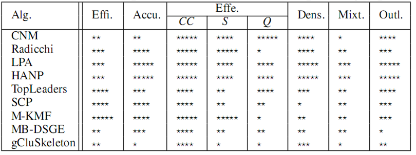

## 聚类

### 层次化聚类

输入：给以网络（邻接矩阵）

1. 由网络结构计算距离矩阵
2. 距离确定节点相似度（相邻即，隔最少个相连即）
3. 根据相似度从强到弱递归合并节点
4. 根据实际需求横切树状图（如下图要分类，可在切一刀：分为绿色，样本6，样本3，4）

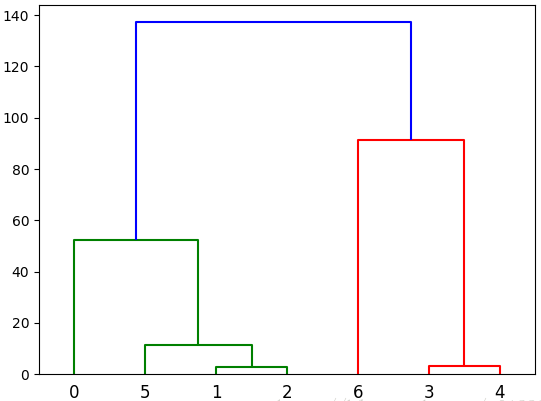

### 谱聚类

将图切分成相互没有连接的个子图：，要求且，设为边权重，优化目标为

将划分问题转化为求解拉普拉斯矩阵的个最小特征值问题。

算法过程：

1. 构建拉普拉斯矩阵：，其中：度矩阵（对角矩阵），：邻接矩阵
2. 标准化：
3. 求最小的个特征值对应的特征向量（降维）
4. 标准化后再用常规方法（k-means等）聚为各类

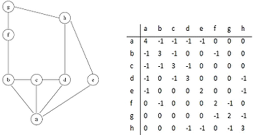

## 图划分

目标：划分为近似相等的分区，同时边切边最小。（明尼苏达大学的METIS是最权威的图划分工具） 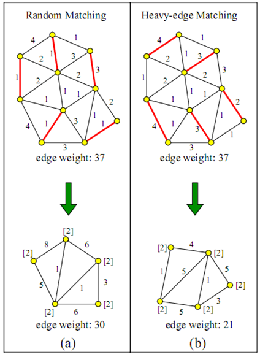

## 分裂算法-GN算法

思想：

1. 定义边介数（betweenness）指标：衡量的是网络里一个边占据其它节点间捷径的程度
2. 具有高边介数的边代表了社区的边界

边介数最常见的定义：图中通过该边的所有最短路径数量。如下图和之间的边即当前最可能切除的

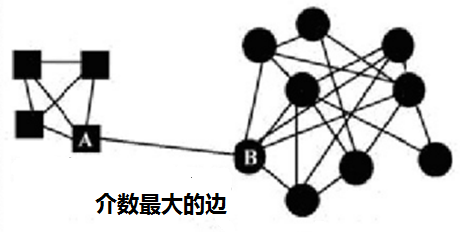

算法过程：

1. 找到网络中具有最大边介数的边
2. 删除该边
3. 重复1.和2.，直到所有边被移除或数量已满足要求类

## 模块度优化算法

思想：

1. 定义模块度（Modularity）指标：衡量一个社区的划分好坏
2. 以模块度为目标进行优化；例如在层次化聚类中使用贪婪算法

一种模块度的定义：

假设网络被划分为个社区，那么定义一个的对称矩阵，它的元素表示社区和社区之间的边的数量占比。表示连接社区的边的总数占比。

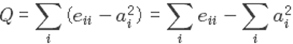 举例如下：

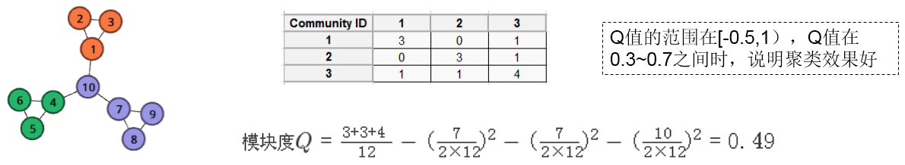 有小伙伴会疑惑，上图例子里这个7咋来的，这个10又咋来的？其实图链接被看作是双向的，所以完整的计算公式应该如下，第二部分分子3是社区1内有3个边，双向的所以乘以2，再加节点1有一个连接到社区外节点10的边，所以是2乘以3再加1：

## 标签传播算法

启发式规则：一个节点应该与多数邻居在同一社区内。特点：适合半监督和无监督、效率很高适合大规模、存在震荡->采取异步更新、结果可能不稳定

算法过程：

1. 给每个节点初始化一个标签
2. 在网络中传播标签
3. 选择邻居的标签中数量最多的进行更新（若有相同数量标签时，选择具有最高ID的标签）
4. 重复步骤2和3，直到收敛或满足迭代次数

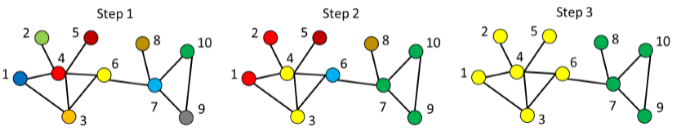

## 随机游走

思想：

1. 从节点出发随机游走，停留在社区内的概率高于到达社区外的。
2. 重复随机游走，强化并逐渐显现社区结构。

算法过程：

1. 建立邻接矩阵（含自环）
2. 标准化转移概率矩阵
3. Expansion操作，对矩阵计算次幂方
4. Inflation操作，对矩阵元素计算次幂方并标准化（这一步将强化紧密的点，弱化松散的点）
5. 重复直到稳定
6. 对结果矩阵进行常规聚类

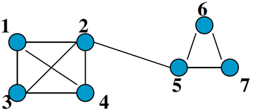  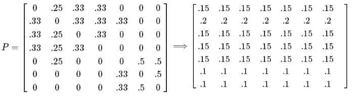

## [K-Truss](https://arxiv.org/pdf/1205.6693.pdf)

给以图，K-truss定义为：每个在最大的子图中的边至少在个存在于的三角形中，如下左图

1. K-truss: each edge within at least  triangles
2. Edge Connectivity: common edges shared by triangles
3. Maximal Subgraph

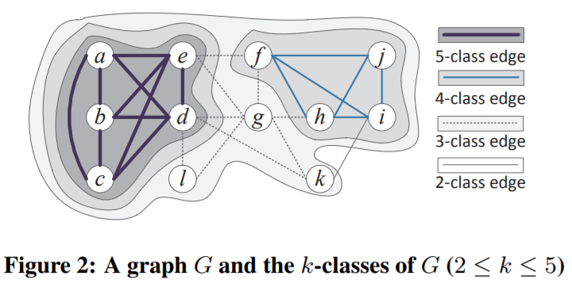  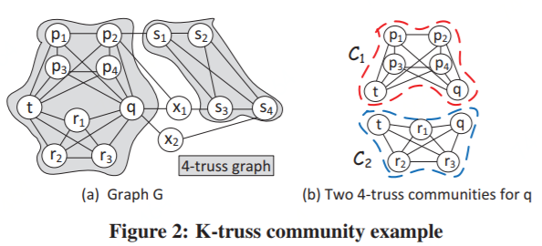

## 其它算法

派系过滤算法（clique percolation algorithm）- 社区的网络

领导力扩张（Leadership expansion）- 类似与kmeans

基于聚类系数的方法（Maximal K-Mutual friends）- 目标函数优化

HANP（Hop attenuation & node preference)- LPA增加节点传播能力

SLPA（Speak-Listen Propagation Algorithm)- 记录历史标签序列

Matrix blocking – 根据邻接矩阵列向量的相似性排序

Skeleton clustering – 映射网络到核心连接树后进行检测

算法在实现时通常需要关注：同步/异步，节点遍历方式，平局决胜，迭代终止，超大社区，串行/并行等问题。

## Source

[https://arxiv.org/pdf/1205.6693.pdf](https://arxiv.org/pdf/1205.6693.pdf) [https://arxiv.org/pdf/cs/0504107.pdf](https://arxiv.org/pdf/cs/0504107.pdf) [http://citeseerx.ist.psu.edu/viewdoc/download?doi=10.1.1.722.9193&rep=rep1&type=pdf](http://citeseerx.ist.psu.edu/viewdoc/download?doi=10.1.1.722.9193&rep=rep1&type=pdf) [http://keg.cs.tsinghua.edu.cn/jietang/publications/TKDE13-Sun-etl-al-co-evolution-of-multi-typed-objects-in-dynamic-networks.pdf](http://keg.cs.tsinghua.edu.cn/jietang/publications/TKDE13-Sun-etl-al-co-evolution-of-multi-typed-objects-in-dynamic-networks.pdf)
