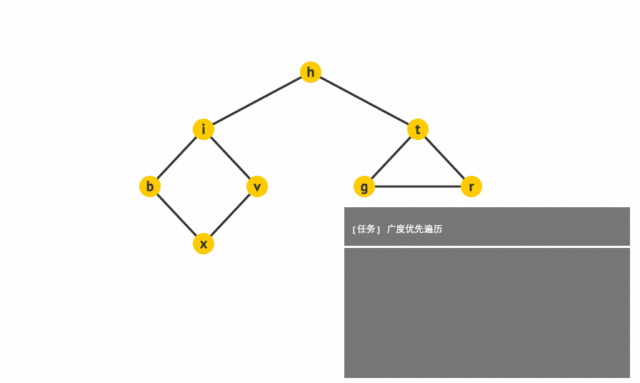
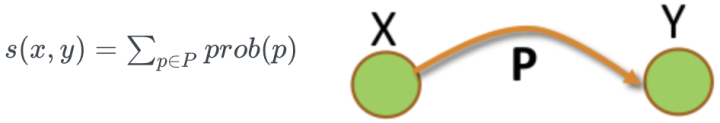
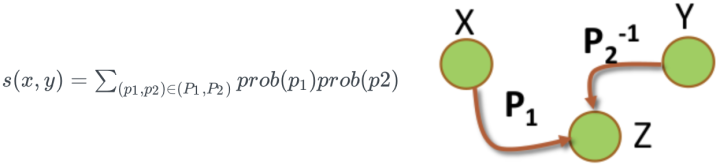
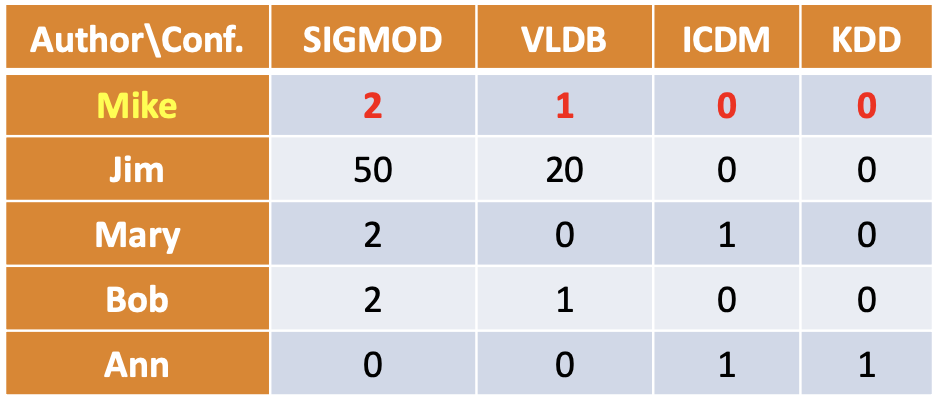
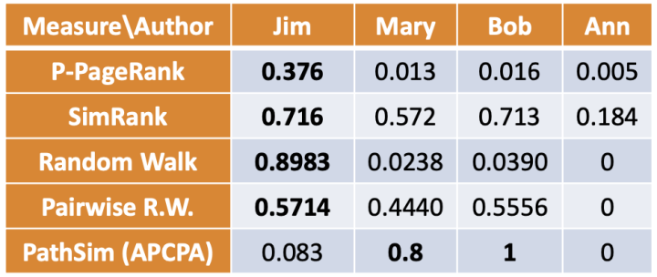

# 最短路径

最短路径是最早一批被关注的问题之一，DFS、BFS和Dijkstra都是解决最短路径的经典方法，也都非常基础，在这里我就不做过多展开。

## 深搜(DFS)

[DFS](https://link.zhihu.com/?target=https%3A//baike.baidu.com/item/%25E6%25B7%25B1%25E5%25BA%25A6%25E4%25BC%2598%25E5%2585%2588%25E6%2590%259C%25E7%25B4%25A2/5224976%3Ffromtitle%3DDFS%26fromid%3D5055)：深度优先搜索算法(Depth-First-Search，DFS)是一种用于遍历或搜索树或图的算法。沿着树的深度遍历树的节点，尽可能深的搜索树的分支。当节点的所在边都己被探寻过，搜索将回溯到发现节点的那条边的起始节点。这一过程一直进行到已发现从源节点可达的所有节点为止。如果还存在未被发现的节点，则选择其中一个作为源节点并重复以上过程，整个进程反复进行直到所有节点都被访问为止。属于盲目搜索。 

## 广搜(BFS)

[BFS](https://link.zhihu.com/?target=https%3A//baike.baidu.com/item/%25E5%25AE%25BD%25E5%25BA%25A6%25E4%25BC%2598%25E5%2585%2588%25E6%2590%259C%25E7%25B4%25A2/5224802%3Ffromtitle%3DBFS%26fromid%3D542084)：宽度优先搜索算法(Breadth-First-Search，DFS)以一种系统的方式探寻图的边，从而“发现”所能到达的所有顶点，并计算到所有这些顶点的距离(最少边数)，该算法同时能生成一棵根为且包括所有可达顶点的宽度优先树。所有因为展开节点而得到的子节点都会被加进一个先进先出的队列中。其邻居节点尚未被检验过的节点会被放置在一个被称为 open 的容器中，而被检验过的节点则被放置在被称为 closed 的容器中。 

## Dijkstra

[Dijkstra](https://link.zhihu.com/?target=https%3A//baike.baidu.com/item/%25E8%25BF%25AA%25E5%2585%258B%25E6%2596%25AF%25E7%2589%25B9%25E6%258B%2589%25E7%25AE%2597%25E6%25B3%2595/23665989%3Ffromtitle%3DDijkstra%25E7%25AE%2597%25E6%25B3%2595%26fromid%3D215612)：Dijkstra算法通过为每个顶点保留当前为止所找到从到的最短路径来工作的 

# 节点相似

## SimRank

如果两个节点被相似或相同的节点关联，则认为这两个主体相似

## Personalized PageRank(P-Pagerank)

P-Pagerank的分数被定义为：，其中为网络的转移矩阵，是一个称为Personalized vector随机向量，是隐形传输常数。

## Random Walk

通过元路径(meta-path)从节点随机游走到达的概率

## Pairwise Random Walk

根据元路径(meta-path)，从两点随机游走，到达共同节点的概率

## PathSim

简单回顾一下Meta-path，两个主体在Meta-level的路径，描述两主体的关系比如作者-论文-作者（两个人共写一篇论文，这是网络中两作者间一种联系），当然一个网络中有多种Meta-path，比如作者-论文-会议-论文-作者...

PathSim计算公式：

比如下图例子：

  
