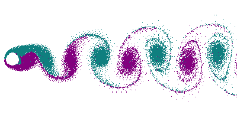

马格努斯效应解释了弧线球(香蕉球)的原理，那看似不符合常理的电梯球，S形轨迹球背后的原理又是什么呢？其背后的原理其实就是卡门涡街。卡门涡街，即卡门涡、卡门涡流（Kármán vortex street、von Kármán vortex street）是一个空气动力学术语，指流体中安置的阻流体，在特定条件下会出现不稳定的边界层分离，阻流体下游的两侧，会产生两道非对称地排列的旋涡，其中一侧的旋涡循时针方向转动，另一旋涡则反方向旋转，这两排旋涡相互交错排列，各个旋涡和对面两个旋涡的中间点对齐，如街道道两边的街灯一般，故名涡街。

该现象由匈牙利裔美国空气动力学家西奥多·冯·卡门最先从理论上阐明而得名。河水流过障碍物时，经常可见卡门涡街，冯·卡门曾在意大利北部博洛尼亚的一所教堂里，目睹一幅圣克里斯多福背负耶稣化身的儿童，赤足渡河的油画，画家画出圣克里斯多福的脚跟在河水中造成两排交错的旋涡，这是冯卡门关于卡门涡街论述的最早的记录。

 回到最开始足球的例子

- S形轨迹：因为足球在爬升中还在缓慢的向右旋转造成了顺风后退一侧的足球外皮接缝，制造了频率更高、强度更大的脱体漩涡具有更低的气压，而逆风前进的足球接缝使脱体涡的频率和强度都较弱，导致卡门涡街交变的侧向力大小不等形成指向右侧的合力让足球向右转弯。足球在爬升到顶点的过程中卡门涡街的指向也随飞行轨迹不断的向上偏移，使足球受到涡街移动的作用力而翻滚，造成缓慢右旋的足球变成了上下旋转。当足球进入下降段时，卡门涡街随飞行轨迹继续向上偏移，足球便继续翻滚造成足球的自转方向从上下旋转又变成了向左旋转，于是卡门涡街左侧的涡流强度和频率增加形成指向左侧的气动合力，球又向左转弯变成了S形轨迹。
- 电梯球：根据这一原理，让足球飞行时缓慢的向前翻滚，在抛物线轨迹的爬升阶段由于卡门涡街上移的速度越来越慢，与足球自转的速度差逐渐增大。因此涡街受到向下的气动合力不断增大，而下降阶段涡街向上偏移的速度越来越快，与足球自转的速度差不断减小，涡街受到的合力也逐渐减小。所以足球在抛物线顶点的一段距离受到了最大的向下的气动力，因此会加速坠落变成电梯球。

# Source
[https://zh.m.wikipedia.org/zh-hans/%E5%8D%A1%E9%97%A8%E6%B6%A1%E8%A1%97](https://zh.m.wikipedia.org/zh-hans/%E5%8D%A1%E9%97%A8%E6%B6%A1%E8%A1%97) [足球为什么能飞出S形轨迹？S形任意球与电梯球的飞行原理 - 知乎](https://www.zhihu.com/zvideo/1394727339696275456?playTime=6.5)
