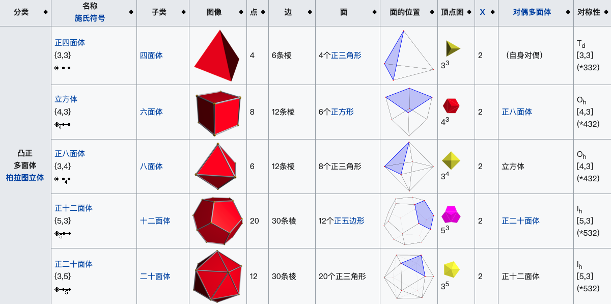
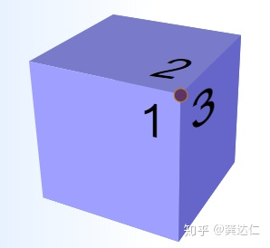
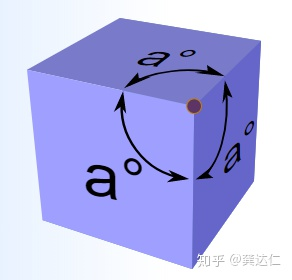
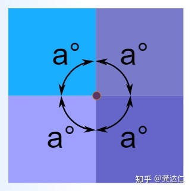

**凸正多面体有且仅有五种，即是正四面体、正六面体、正八面体、正十二面体和正二十面体** 

# 几何学证明
每一个顶点，至少有3个面相遇，把所有于一个顶点相遇的角加起来，它们的和小于360°，因为如果和等于360°，这些角必定处于同一平面。  正三边形：正三角形每个内角都等于60°， 因此对于一个全由正三角形组成的多面体

- 3个正三角形相遇，
- 4个正三角形相遇，
- 5个正三角形相遇，

正四边形：正方形每个内角都等于90°，所以在某个顶点，只可能是

- 3个正方形相遇，

正五边形：正五边形每个内角都等于108°，所以在某个顶点，只可能是

- 3个正五边形相遇，

从正六边形开始，3个正多边形相遇内角都大于或等于360°，正六边形内角120°，，所以不可能存在由正边形组成的凸正多面体，即我们只可能拥有5个柏拉图体，对应于上述5种可能的情形。

# 拓扑学证明
凸多面体服从[拓扑学欧拉公式](https://www.yuque.com/angsweet/machine-learning/huczfz#K8BH2)，记面(区域)个数，记顶点个数，记棱(边界)个数，则，这就是欧拉定理，具体证明可看百科里拓扑学中欧拉公式的证明。

设正多面体每个顶点有条棱，每个面都是正边形，因为两个相邻面有一公共棱，所以  因为两个相邻的顶点有一公共棱，所以  代入欧拉定理，得到  两边除以，得到  又因为，所以  由和定义可知，他们必须不小于(小于就构不成一个多边形了，小于构不成一个体了)。因此，只可能是，即正四面体、正六面体、正八面体、正十二面体和正二十面体。

# Source
[世界上只存在五种正多面体？](https://zhuanlan.zhihu.com/p/265526766)
