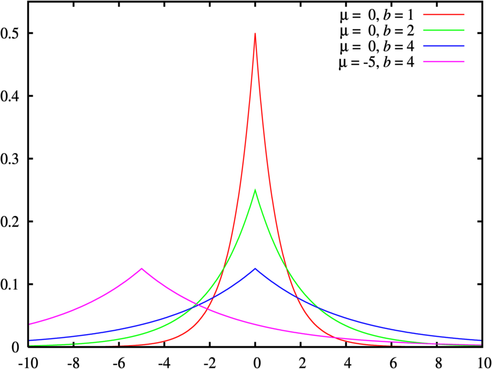

基于噪声的安全机制最出名应用最广的就是差分隐私，差分隐私的提出是为了有效地应对差分攻击，下面简单举例什么叫做差分攻击以及差分隐私的概念：

假设A公司想给X大学的2000名学生进行消费水平评级，从而决定在该大学投放广告的力度。由于缺乏相关数据，A公司希望与电商公司B合作，查询这2000名学生在B公司的月平均消费金额，并以此来支持决策。假设A公司第一次查询获取2000名学生的消费数据(记作)，第二次查询去掉某一名同学的数据，得到共1999名学生数据(记作)，**此时得到的两个数据集便可称为该场景中的相邻数据集**。A公司的得到的两次查询结果，仅差一条记录数据，那A公司这种仅差一条记录的数据分别进行查询的行为，便可视为一种差分攻击，因为使用即可知道第二次查询被去掉的同学的消费情况。

为了抵抗这种差分攻击，电商公司B可以使用差分隐私的方法对查询结果进行处理，即加入一个随机项(举个最简单的例子，取自离散均匀分布)：，dp表示差分隐私(Differential Privacy)，于是A公司得到的查询结果可能是如式：

加入随机项之后的查询结果便达到了掩盖真实结果的目的，但由于所使用的随机项分布过于简单，仍可能出现极端情况导致真实结果的泄露。所以，可以根据具体的场景，通过修改随机项的分布，对保护隐私的程度进行修改。当然，这里展示的虚拟案例只简单展示了差分攻击的手段和差分隐私的思想，所使用的随机项分布和方法都不能满足真实场景需求，下面会对差分隐私的定义和常用机制进行阐述。

# 差分隐私定义
对于任意两个相邻数据集和，如果一个随机化算法满足以下条件，那么可认为该算法是满足-差分隐私的(隐私程度可通过参数进行调节)，即

，其中

我们可以从字面上简单地理解该定义：在两个相邻数据集和上，算法获得同一个集合中输出结果的概率相差不大。其中，相差多少通过参数来调节，越小，对两个数据集输出结果的差距限制就越小，保护隐私的程度就越强。

## 隐私预算
在-差分隐私中，要求，即

也就是说，用于控制算法在相邻数据集上获得“相同”输出结果的概率比值。因此，当足够小(比如为)时，很难找到一个数据集使得在数据集上输出集合内结果的概率明显高于数据集，也就无法区分两个数据集，从而达到较高的隐私保护程度，但是，当足够小时，意味着数据的可用性非常低，所以参数也称为隐私预算(Privacy Budget)。在实际应用中，该参数通常取很小的值，例如或，我们应该根据具体的业务场景和隐私保护的期望要求，对该参数进行合理的设置。

## 敏感度
差分隐私通过增加噪声来掩盖真实数据，但噪声过大会影响数据的可用性，数据的可用性也是非常重要的一个指标。为了清晰地确认添加噪声的大小，可以使用敏感度(Sensitivity)的概念对噪声进行衡量。敏感度是指某算法在相邻数据集上的输出结果的最大差异。在差分隐私中，定义了两种敏感度，即全局敏感度和局部敏感度。

- 全局敏感度：对任意两个相邻数据集和，称为算法的全局敏感度(Global Sensitivity)。其中，为输出的两个结果的曼哈顿距离
- 局部敏感度：对于给定数据集及其任意相邻数据集，称为算法的局部敏感度(Local Sensitivity)。

全局敏感度在通常情况下要大于局部敏感度，二者的关系可表示如下

# 噪声机制
在实际应用中，添加噪声的不同方式称为不同的“机制”，最基础的三种添加机制分别是拉普拉斯机制(Laplace Mechanism)、高斯机制(Gaussian Mechanism)和指数机制(Exponential Mechanism)，其中：

- 拉普拉斯或高斯机制通常使用在输出域为数值型的算法上，向原始算法的真实输出结果添加服从拉普拉斯分布或高斯分布的噪声来实现-差分隐私
- 指数机制通常使用在输出域为枚举型的算法上，以一定的概率值返回结果，从而实现差分隐私

## 拉普拉斯机制
拉普拉斯机制(Laplace Mechanism)即通过向原始算法的真实输出结果添加服从[拉普拉斯分布](https://www.yuque.com/angsweet/machine-learning/shu-xue-ji-chu_shu-xue-ji-chu_gai-lv-tong-ji_gai-lv-fen-bu#FoH1D)的噪声来实现-差分隐私，即，其中服从拉普拉斯分布，而为算法的敏感度：

所以可以看到，在算法的敏感度保持不变的情况下，隐私预算越小，就越大，添加噪声越大  拉普拉斯机制通常作用在输出域为数值型的算法上，比如单日健身时长，用于计算的算法

| 真实结果 |  | 添加噪声之后的结果 |  |  |
| --- | --- | --- | --- | --- |
| 用户 | D(X) |  |  |  |
| 彭于晏 | 10 | -23 | 18 | 9 |
| 吴彦祖 | 8 | 50 | 2 | 8 |
| 陈冠希 | 6 | 21 | 3 | 6 |
| 噪声-彭于晏 | - | -33 | 8 | -1 |
| 噪声-吴彦祖 | - | 42 | -6 | 0 |
| 噪声-陈冠希 | - | 15 | -3 | 0 |

可以看到，噪声过大则最终结果无法使用，噪声过小很难保证数据安全性。所以我们需要针对业务场景对隐私预算进行合理设置以达到可用性和安全性的折中。

## [高斯机制](https://arxiv.org/pdf/1905.02383.pdf)
高斯机制(Gaussian Mechanism)和拉普拉斯机制相似，只不过采用[高斯分布](https://www.yuque.com/angsweet/machine-learning/shu-xue-ji-chu_shu-xue-ji-chu_gai-lv-tong-ji_gai-lv-fen-bu#Ht8aT)，所以比拉普拉斯机制更松弛，即，其中服从高斯分布  高斯分布的标准差就决定噪声的尺度了，但并不像拉普拉斯机制直接将代入，而是设置了一个松弛项来控制，其定义为，。看上去很复杂，实际其物理为如果松弛项，就表示只能容忍的概率违反严格差分隐私，具体证明可见[链接](https://arxiv.org/pdf/1905.02383.pdf)。

## 指数机制
指数机制(Exponential Mechanism)指的是，设算法的输出结果为枚举类型，即，为全部可能结果的集合(比如用户买鞋的颜色，有红橙黄绿蓝靛紫...)，可用性函数，为其敏感度。如果算法以正比于的概率输出，那么认为算法满足-差分隐私。解释一下这里的敏感度，因为输出域为枚举型，所以较难衡量其敏感度，所以这里使用可用性函数，其输出一般为实数，代表着输出结果的优劣程度。

我们接着上面的例子，如果算法输出最勤奋的用户，那么根据数据，结果应该是彭于晏

| 可用性函数 |  |  | 输出对应用户的概率 |  |  |
| --- | --- | --- | --- | --- | --- |
| 用户 |  | 无噪声 |  |  |  |
| 彭于晏 | 10 | 1 | 0.33 | 0.37 | 0.67 |
| 吴彦祖 | 8 | 0 | 0.33 | 0.33 | 0.24 |
| 陈冠希 | 6 | 0 | 0.33 | 0.3 | 0.09 |

从上面例子可以看出，指数机制并非直接向输出结果添加具体噪声，而是使用随机化算法，其输出结果不是固定的，而是以某种固定的概率进行输出。

# 差分隐私性质
差分隐私严格的数学定义也赋予了差分隐私一些性质，使其在实际业务场景中，即使面对需要多个差分隐私保护算法同时使用的复杂问题，也能让业务方准确地把握整体的隐私保护的程度。

## 序列组合性
设算法由个差分隐私保护算法组成，隐私预算分别为，则在数据集上，也满足差分隐私的要求，隐私预算为 也就是说，在同一个数据集上，一系列算法的组合算法会降低隐私保护的程度，其隐私预算为全部预算之和。

## 并行组合性
设算法由个差分隐私保护算法组成，隐私预算分别为，则对于不相交的数据集，也满足差分隐私的要求，隐私预算为 也就是说，在不相交的数据集上，一系列算法的组合算法的隐私保护程度取决于隐私保护最弱的算法，即其隐私预算为组合算法中的最大者。这也与木桶效应类似，隐私保护最弱的算法相当于最短的木板。

## 变换不变性

## 

## 中凸性
