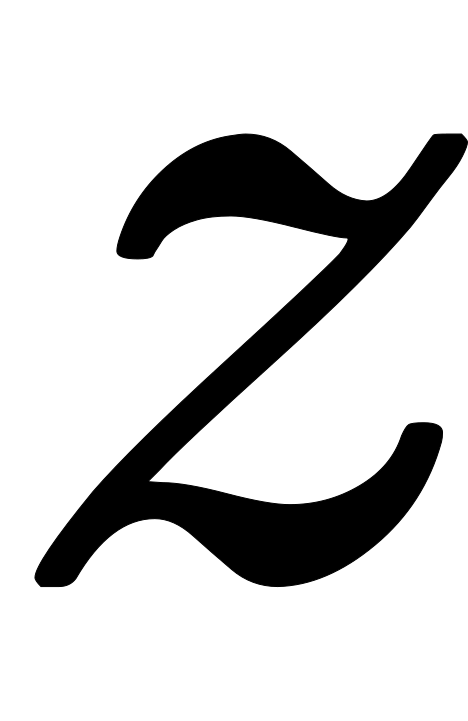
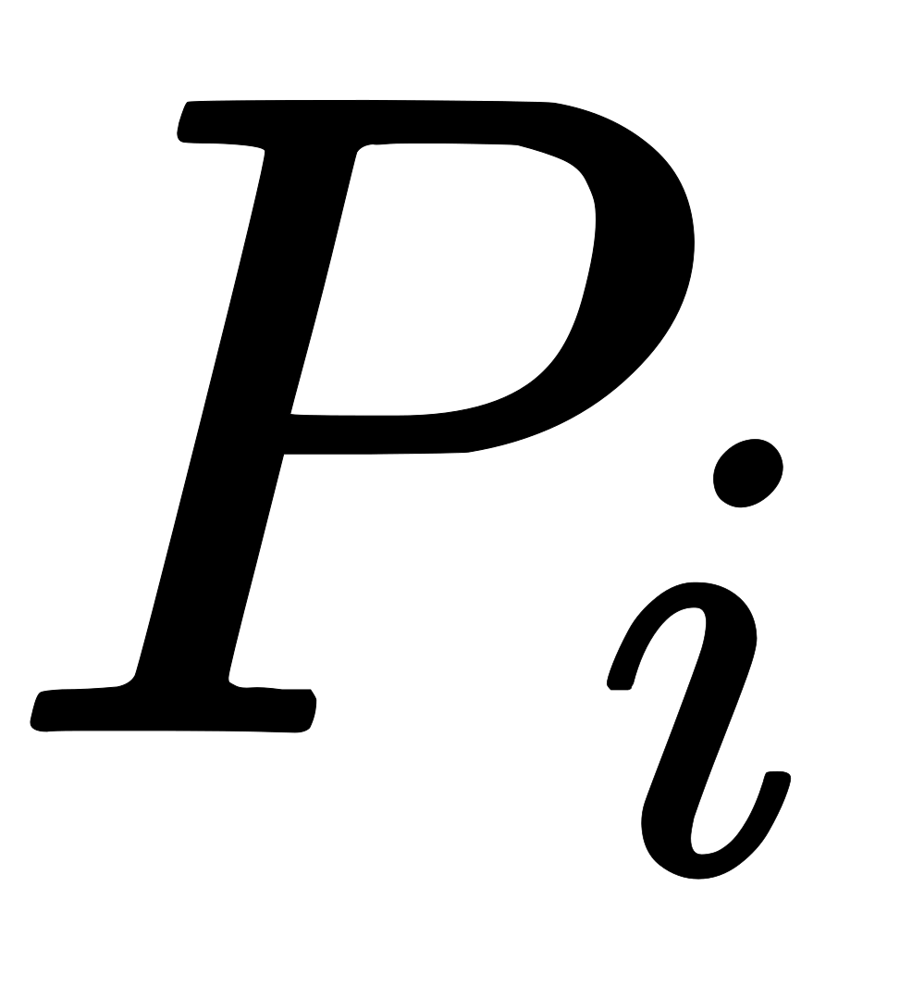
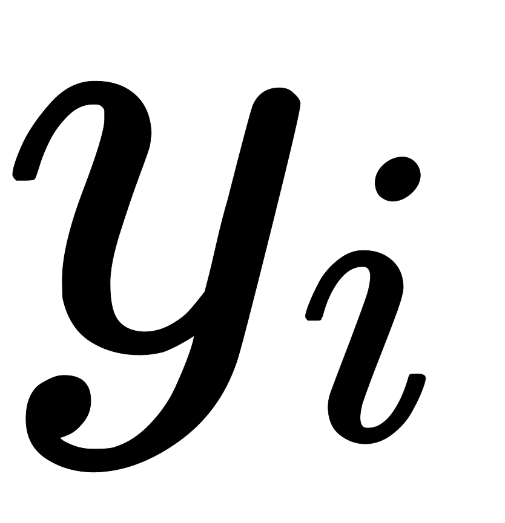
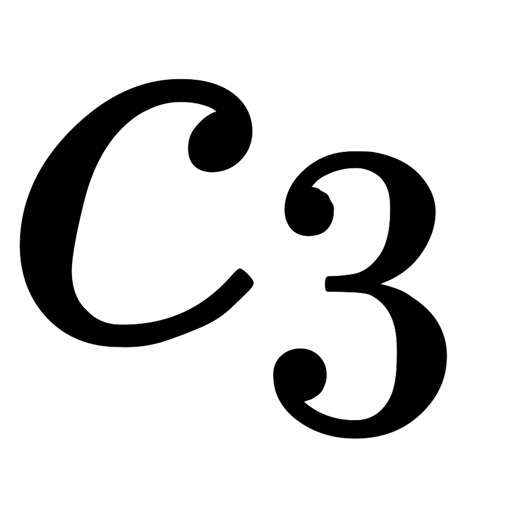

虽然同态加密为很多隐私保护的场景提供了解决方案，但由于其算法的特殊性以及实用性不佳的问题，其应用场景受到了明显的限制。对于其他复杂的场景，则需要使用安全多方计算完成类似的功能。安全多方计算的概念由姚期智院士首先提出，现在已经发展成为密码学的一个重要分支。

姚期智院士于1982年提出了安全多方计算这个概念，并设计了百万富翁问题来说明安全多方计算的目标：两个百万富翁相比较谁更富有，但都不想泄漏自己的具体财富值。解决该问题最自然的方法是找到一个可信第三方对二者的财富进行比较，然后公布结果，但实际中很难找到完全可信的第三方，而安全多方计算便提供了无须可信第三方的解决方案。

如下图，假设百万富翁A(Alice)有x百万，B(Bob)有y百万，Alice准备带序号的1-9个箱子，且钥匙均相同，对于序号小于x，放入苹果，否则放入香蕉，(相等的时候可以放入另一水果比如橘子)。Bob收到带序号的箱子，只允许挑选一次箱子，挑选序号为y的箱子，按照约定扔掉其他箱子，再从Alice处拿到钥匙打开箱子，根据箱子中的水果即可分辨出谁更富有。  以上便是百万富翁问题的解决方法之一，这个简单的协议建立在双发都是诚实的参与方的前提下，双方不会恶意地输入错误的财富值扰乱协议的正确执行。因此，在实际应用中，双方通常使用密码协议实现这些理想的限制条件，即使面对半诚实参与方，也可以确保隐私不会泄漏。比如，密码学中的不经意传输协议，便可以保证在以上场景中富翁B只能从富翁A发送内容中获取其中一个盒子，而不能获取其他盒子的相关信息，同时，富翁A也无从得知富翁B所选取的具体是哪个编号的盒子。

# 不经意传输
在上文描述的百万富翁问题的解决方案中，在富翁B得到9个箱子后，如何确定其会将其余盒子全部销毁是一个在现实中很难解决的问题。不经意传输(Oblivious Transfer，OT)协议则从根本上提出了一个解决方案，避免了富翁B未按照协议销毁其他盒子而产生的安全问题。从直观上看，不经意传输协议的功能是保证富翁B从富翁A提供的两个或多个备选中只能选择其中一个，且得不到其他备选信息，同时还能保证富翁A不知道富翁B的选择。

我们可以按照以下方式直观地理解利用不经意传输协议完成这个目标的主要思想：

1. 在富翁A发送9个盒子之前，富翁B先使用所需要的箱子编号y构造一把“复杂”的组合锁，并发送给富翁A(其中编号y是构造锁的关键信息，而且富翁A无法根据锁的信息恢复出富翁B使用的编号)。
2. 富翁A在拿到锁之后，可以以一种黑盒的方式对组合锁进行改造，改造结果为9把不同的新锁，并分别对9个盒子进行上锁，再将9个盒子发送给富翁B。新锁的特殊性质：由于这些新锁均改造于编号y构造的组合锁，因此只有编号y的盒子上的新锁可以用富翁B的钥匙打开，其余盒子均被锁死无法打开。

Tzeng构造了一个两轮的“n取1”不经意传输协议，过程如下：

1. 双发协商出两个公共参数、，二者均为阶循环群中的元素
2. Alice输入个消息，同时Bob确定欲选择的消息编号
3. Bob选择随机数，并计算，将发送给Alice
4. Alice选择一组随机数，使用计算组消息：并发送给Bob。其中，
5. Bob计算

不经意传输协议的过程看似比较复杂，但如果我们对比上下文中百万富翁问题的解决方案的不经意传输协议结构，就会更容易理解。其中，对应的便是“组合锁”，而则对应由组合锁改造的新锁保护的明文，Bob在收到所有被保护的明文之后，只能对第个明文进行解密，因为是由构造的。

# [混淆电路](https://zhuanlan.zhihu.com/p/41172002)
安全多方计算的目前的主流构造方法主要有两种，第一种是使用混淆电路，第二种则是通过秘密分享的思想。

混淆电路是姚期智院士针对百万富翁问题，于1986年提出的一种解决方案，该方案的提出也验证了安全多方计算的可行性。混淆电路的思想比较简单：将双方需要计算的函数(所需参数为双方各自的输入信息)转化为“加密电路”的形式，该“加密电路”可以保证双方在不泄漏各自输入信息的情况下，正确地计算出函数的结果。因此，“加密电路”的设计是混淆电路方法的研究重点和难点。但是，由于任意函数在理论上均存在一个等价的电路表示，在计算机中可以用加法器和乘法器等电路进行实现，而这些加法器或乘法器又可以通过“与门”“异或门”等逻辑电路来表示。也就是说，如果能够实现基本的加密版本逻辑电路，那么可以实现加密版本的计算函数。 

## 例子
假设在安全两方计算中，交互双方A和B欲计算的门电路为“与门”，两个输入数据分别为a和b，一个输出数据为r，即。我们用下表来描述该电路门

|  |  |  |
| --- | --- | --- |
|  |  |  |
|  |  |  |
|  |  |  |
|  |  |  |

### 第一步：A方进行密钥生成
为了避免使用真实的输入数据和输出数据，对输入和输出的每一个值都生成相应的密钥，在交互过程中只使用该密钥代替真实值进行传递，从而避免了真实输入数据的泄漏。输入及输出结果对应的密钥见下表

|  |  |  |
| --- | --- | --- |
|  |  |  |
|  |  |  |
|  |  |  |
|  |  |  |
|  |  |  |

### 第二步：A方进行电路的加密
对原始的真值表中真实的输入和输出数据进行替换得到其加密版本，见下表

|  |  |  |
| --- | --- | --- |
|  |  |  |
|  |  |  |
|  |  |  |
|  |  |  |

### 第三步：A方将输出的密文发送给B方
A将第二步得到的密文打乱顺序之后发送给B，同时要告知B方和的信息，让B方进行解密：

- 对应A方输入的数据，比如输入是，那就发，是，那就发
- 同时把和B有关的都发给B，然后B根据自己的输入挑选相关的

因为B收到的这些密文都是随机数，所以其实并没有有效信息泄漏

### 第四步：B方进行解密
B方使用A方提供的和自己的，对A方传过来打乱顺序的加密表的每一行尝试解密，最终只有一行能解密成功，并提取相应的。使用的加密算法可以保证只有在使用正确的密钥进行解密才可以得到合法的明文，也就是说，如果和对应的密文为，那么只有在对使用密钥和进行解密是才能得到合法的明文，其他解密出的都是乱码或无意义特殊符号等。B方将解密得出的明文或发送给A，A便可得出正确的结果或，并同步给B即可。

在这个过程中，A方并没有告诉B方对应的真实值或，因此A方的信息未泄漏。另外，B方通过不经意传输协议选择了输入对应的密钥，在计算出正确结果并发送给A方之前，也并未泄漏自己的数据。所以，双方均在未泄漏自己输入数据的前提下，完成了“与门”的计算。

以上便是混淆电路协议的简单构造，加密过程就是第二步将真值表中每一行对应的和的密钥加密的密钥，以及第三步打乱顺序，这两步就是混淆电路的核心思想。混淆电路源于安全两方计算方案，现在已经被推广到安全多方计算的方案设计。另外，也有众多技术(如“Free-XOR”)用于混淆电路的构造中，以提高基于混淆电路的安全多方计算的效率。

# 秘密共享
除了使用混淆电路，秘密共享是另外一个用于构造安全多方计算的主流技术。秘密共享是现代密码学的一共重要工具，是门限密码学的基础。门限密码学是指将基本的密码系统分布于多个参与方之间，只有所有的参与方或者足够多的参与方联合起来才能保证密码系统正常运行。

假设某国的特工局局长将本国的特工名单存放在一个保险箱中，而局长希望将保险箱的密钥切分为4个部分，由4位副局长分别持有。考虑到特工职业的特殊性，局长提出了两个要求：

1. 因为特工属于高位行业，为防止因某位局长意外牺牲而导致部分密钥消失，希望无需4位局长同时提供密钥，也能打开保险箱(容错性要求)
2. 为防止因某几位局长叛变而导致特工名单泄露，希望至少3位副局长同时提供密钥才能开保险箱(安全性要求)

将密钥分为6段，每段都有两份，那么每个副局长都持有其中3段，比如a副局长有1、2和3段，使用这样的分割方法可以保证任意3位局长都可以恢复完整的密钥，但如果只有1或2位副局长，就无法完成密钥的恢复

| 副局长/密钥段 | 1 | 2 | 3 | 4 | 5 | 6 |
| --- | --- | --- | --- | --- | --- | --- |
| a | 持有 | 持有 | 持有 |  |  |  |
| b | 持有 |  |  | 持有 | 持有 |  |
| c |  | 持有 |  |  | 持有 | 持有 |
| d |  |  | 持有 | 持有 |  | 持有 |

在安全多方计算中，秘密共享的应用场景主要为使用秘密共享方案的同态特性进行约定函数的计算。也就是说，秘密共享的内容不再是密钥，而是参与方的输入数据，通过将输入数据切分成多个随机碎片，分发给其他参与方。每个参与方根据自己掌握的碎片进行相关计算，将中间结果进行聚合，从而得到最终结果。使用秘密共享进行函数计算的协议主要由两部分构成：秘密分发和秘密重构。

## 例子

### 定值
在此以Shamir秘密共享协议来介绍秘密分发和秘密重构两部分是如何完成的。Shamir秘密共享协议使用多项式对秘密输入进行分发，并通过拉格朗日插值法对秘密输入进行修复。我们仍以4位副局长对密钥保管为例，局长希望将密钥分发给4位副局长，且只要其中3位副局长同时提供各自持有的信息就可恢复密钥。

1. 秘密分发阶段：Shamir秘密共享协议会为密钥生成一个多项式，并随机选择该多项式的点值，即作为密钥的局部信息分发给各位副局长。这便完成了秘密分发。
2. 秘密重构阶段：由于该多项式共有3个未知的系数，故至少需要3个点值擦爱能对密钥进行恢复，且任意3个不同的点值均可。这便完成了秘密重构。

### 求和
以3个参与方之间的安全计算场景为例，假设某公司3个员工希望在不泄漏自己真实工资的情况下，计算3人的平均工资。从本质上讲，这个问题可以抽象为多方之间的求和问题。我们假设员工，，的工资为，，。为了计算，可以采用以下两个步骤：

1. 秘密分发阶段：每个员工将自己的输入信息(工资)切分为3份，并分发给另外两个同事，分发完成之后，每位员工拥有3个值，分别为，，
2. 秘密重构阶段：每个员工分别在本地计算，最终三个员工再将自己的结果进行公开，3人的平均工资即为

在以上两个步骤中，每个员工只得到了同事工资的部分信息，并不能恢复其真实工资。另外，根据最终公布的结果也无法直接推断出，，三个碎片信息。因此，该方法使用秘密共享思想，在保护了各个参与方输入信息的前提下，完成了均值计算。

### 乘积
使用秘密共享的方法计算求和函数是非常简单、直观的，但如果要计算两个数的乘积，就需要引入一些“辅助信息”。仍以上述的场景为例，假设3个员工具有很强的好奇心，希望在对自己工资保密的前提下，计算工资的乘积。此时，仅通过将工资的数值进行简单的切分和分享是很难做到的，因为乘法会涉及交叉项的计算，，其中直接计算，是比较困难的。如果加入“辅助信息”，就可以解决这个问题

1. 生成随机三元组(辅助信息)：

  

2. 秘密分发阶段：

同加法秘密分发阶段一样，每个员工将自己的输入信息(工资)切分为3份，并分发给另外两个同事，分发完成之后，每位员工拥有3个值，分别为，，。同时，将随机生成的三元组也进行分发。

| 员工 | 持有的信息碎片 |
| --- | --- |
|  | ，，，，， |
|  | ，，，，， |
|  | ，，，，， |

3. 秘密重构阶段：

为让公式简洁，令 ，即每个员工算自己持有信息的值进行公开后加和 ，即每个员工算自己持有信息的值进行公开后加和 ，即每个员工算自己持有信息的值进行公开后加和 我们想要计算乘积，公式拆解如下，     拆解后的八项中，、和为各员工计算的真实数据切分值，，分别与随机三元组，，差值公开后的合并项，、和为随机生成的辅助信息数据。可以看到，每个员工只得到了同事工资的部分信息，并不能恢复其真实工资；公布的、和也无法直接推断出，，三个碎片信息；、和为随机数据无意义。因此，该方法使用秘密共享思想，在保护了各个参与方输入信息的前提下，完成了乘积计算。

