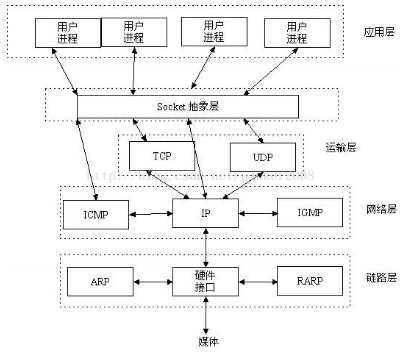

<a name="qF3Qx"></a>
# socket介绍
套接字(socket)是指伯克利套接字(Berkeley socket)，也称为BSD(Berkeley Software Distribution)套接字(BSD scoket)。它是一种程序接口(Application Programming Interface，API)，主要用于实现进程间通信和计算机网络通信。socket起源于UNIX，可以看成一种特殊的文件。一些socket函数就是对其进行的操作，例如读、写、I/O、打开、关闭。

socket是应用层TCP/IP协议族通信的中间软件抽象层，它是一组通信接口。它是一组通信接口。在设计模式中，socket其实就是一个封装模式，把复杂的TCP/IP协议族隐藏在socket接口后面。对用户来说，一组简单的接口就是全部让socket去组织数据，以符合制定的通信协议。但socket本质上并不是一个协议，它工作在OSI模型的会话层(第5层)，是为了方便直接使用低层协议(一般是TCP或者UDP)而存在的一个抽象层。最早的一套socket API是Berkeley sockets，采用c语言实现。它也成为网络套接字的事实标准，大多数其他的变成语言使用与这套用c语言写成的程序接口类似的接口。<br /><br />从概念上说，socket是一种通信端点，对应于一个IP地址和一个端口号。如果应用程序要通过底层网络发送某些数据，可以把这些数据写入套接字，然后从套接字中读出数据。对应于每一种特定的传输协议，本地操作系统都要使用一个实际的通用端点，而套接字形成了位于实际通信端点之上的一个抽象层。

socket书通信的基石，是支持TCP/IP协议的网络通信的基本操作单元。它是网络通信过程中端点的抽象表示，包含进行网络通信所必需的五种信息：连接使用的协议、本地主机的IP地址、本地进程的协议端口、远地主机的IP地址、远地进程的协议端口。
<a name="SqU9N"></a>
# [基于socket库的实现](https://docs.python.org/3/library/socket.html)
Python内置了BSD socket的网络编程接口，实现了基本的socket网络通信功能，支持包括UDP、TCP等传输层协议，Python的套接字包括服务端套接字和客户端套接字。
<a name="bRjts"></a>
### 基于TCP协议的服务器端
```python
import socket
def server(host, port):
    with socket.socket(socket.AF_INET, socket.SOCK_STREAM) as sock:
        sock.bind((host, port))
        sock.listen(1)
        conn, addr = sock.accept()
        with conn:
            print ("connected by ", addr)
            while True:
                data = conn.recv(1024)
                if not data:
                    break
                conn.sendall(data)
```

- 首先调用socket接口创建一个空的套接字。socket()函数一般有两个参数，第一个参数固定为AF_INET，第二个参数表示要创建的套接字的类型。SOCK_DGRAM表示创建的是UDP套接字；SOCK_STREAM表示创建的是TCP套接字
- 调用bind函数来绑定网络地址，然后开始监听
- 设置一个while循环来接收与其相连的客户端发送的消息，通过sendall和recv函数分别进行发送和接收数据
<a name="Uk7QF"></a>
### 基于TCP协议的客户端
```python
import socket
def client(host, port):
    with socket.socket(socket.AF_INET, socket.SOCK_STREAM) as sock:
        sock.connect((host, port))
        sock.sendall(b"hello world")
        data = sock.recv(1024)
    print ("Received ", repr(data))
```
客户端的实现首先同样使用socket()函数创建套接字对象，然后使用connect接口连接服务器，最后通过sendall和recv函数分别发送和接收数据。
<a name="JmhSw"></a>
# [基于socketio的实现](https://python-socketio.readthedocs.io/en/latest/)
Python-SocketIO是一个基于事件、在客户端和服务器之间实现双向通信的Python开源库。
<a name="Oemv5"></a>
### 客户端
```python
import socketio
sio = socketio.Client()

@sio.event
def connect():
    print ("connection established")

@sio.event
def my_message(data):
    print ("message received with ", data)

@sio.event
def disconnect():
    print ("disconnected from server")

sio.connect("http://localhost:5000")
sio.wait()
```
基于Python-SocketIO实现的客户端程序具有下面一些特点：

- 利用Python-SocketIO编写的客户端程序能够连接到其他Socket.IO兼容服务端，即使该服务器并不是使用Python-SocketIO包编写的
- 使用由Python装饰器实现的基于事件的体系结构，该体系结构隐藏了协议的详细信息
- 实现HTTP长轮询机制和WebSocket传输
- 实现了重连机制。如果客户端断开连接，能够自动重新连接到服务器
<a name="x9tVE"></a>
### 服务端
```python
import eventlet, socketio

sio = socketio.Server()
app = socketio.WSGIApp(sio, static_files = {'/':{"content_type":'text/html',
                                                 "filename":"index.html"}})

@sio.event
def connect(sid, environ):
    print ("connect ", sid)

@sio.event
def my_message(sid, data):
    print ("message ", data)

@sio.event
def disconnect(sid):
    print ("disconnect ", sid)

if __name__ = "__main__":
    eventlet.wsgi_server(eventlet.listen(('', 5000)), app)
```
该程序需要托管在Eventlet服务器上执行，基于Python-SocketIO实现的服务端程序具有下面一些特点：

- 利用Python-SocketIO编写的服务端程序能够连接到其他Socket.IO兼容客户端，即使该客户端并不是使用Python-SocketIO包编写的
- 由于采用的是异步调用的方式，即使在硬件条件不太好的情况下也能支持大量客户端
- 可以托管在任何WSGI和ASGI Web服务器上，包括[Gunicorn](https://gunicorn.org/)、[Uvicorn](https://www.uvicorn.org/)、[Eventlet](https://eventlet.net/)和[Gevent](http://www.gevent.org/)
- 可以与[Flask](https://dormousehole.readthedocs.io/en/latest/)、[Django](https://www.djangoproject.com/)等框架编写的WSGI应用程序集成
- 支持HTTP长轮询和WebSocket传输
- 支持文本和二进制的消息发送与接收，支持gzip和deflate HTTP压缩
<a name="xLkPD"></a>
# [基于Flask-socketio的实现](https://flask-socketio.readthedocs.io/en/latest/)
[Flask](https://dormousehole.readthedocs.io/en/latest/)是一个使用Python编写的轻量级Web应用框架。Flask-SocketIO是对Flask的扩展，能够实现客户端和服务器之间的低延迟双向通信。Flask-SocketIO模块实际上封装了Flask对WebSocket的支持，以Flask-SocketIO编写的服务器程序，可以与任意socketIO编写的客户端兼容。
