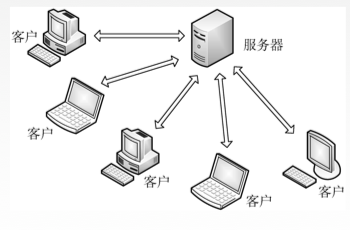
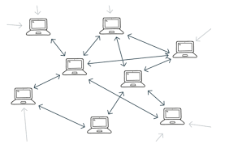
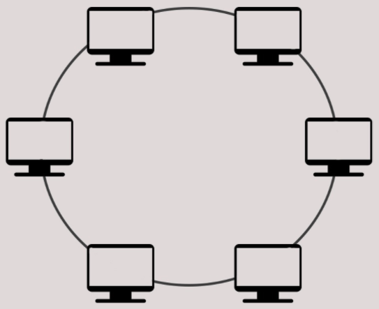

依据实际应用场景的不同，联邦学习的系统里可能有，也可能没有协调方(即中心服务器或者参数服务器)，从而产生了不同的联邦学习架构，常见的包括带中心服务器的客户-服务器(Clinet-Server，C-S)架构、去中心化的对等网络(Peer-to-Peer，P2P)架构及环状网络(Ring)架构。

# 客户-服务器架构
下图展示了带有中心服务器的客户-服务器参考架构(C-S架构)。在这个架构中，协调方就是一个聚合服务器(Aggregation Server，AS)，也称为参数服务器(Parameter Server，PS)。  **横向联邦学习：**使用C-S架构构建的横向联邦学习系统，中心服务器将初始模型发送给各参与者(即数据拥有者，也称为客户端)，其中，表示参与方的数量，通常的值大于或等于2.数据拥有者分别使用各自的本地数据集来更新初始模型，并将更新后的模型权重参数(或者梯度)发送给聚合服务器。之后，聚合服务器将从数据拥有者处接收到的模型参数，使用模型聚合的方法，比如联邦平均(FedAvg)算法得到全新的全局模型，服务器将结合后的全局模型重新发送给各参与方，进行下一轮的联邦训练。这一过程重复进行，直至模型收敛或达到最大迭代次数或达到最长训练时间为止。 **纵向联邦学习：**使用C-S架构构建的纵向联邦学习系统，中心服务器扮演了一个可信第三方的角色，主要负责对训练过程中产生的中间数据进行加密、解密等工作，并将其结果分发到相应的客户端设备。在C-S结构的设计场景中，联邦学习可以很方便地与其他密码学安全方案结合，例如同态加密、差分隐私等，以进一步保障数据安全。因此，C-S的架构设计模式也是当前设计联邦学习框架时经常在用的一种方案，它有以下优缺点：

| 优点 | 缺点 |
| --- | --- |
| 架构设计简单，通过中心节点管理联邦学习客户端设备 | 该架构需要依赖可信的第三方中心服务器进行模型的聚合、参数的加密和解密等敏感性操作。在现实场景中，找到一个让各参与方都可信的第三方服务器比较困难 |
| 客户端容错性好，当少量客户端节点发生故障时，不会影响联邦学习的计算过程 | 系统虽然对客户端容错性好，但如果中心服务器发生故障，将导致整个联邦学习系统无法正常运行 |

正式由于C-S的架构设计存在的问题，在联邦学习场景下去中心化架构设计也成为当前联邦学习系统设计领域研究的一个热点。

# 对等网络架构
联邦学习系统架构也可以被设计为对等网络(P2P)方式，即不需要协调方。这是一种去中心化的架构设计模式。  这种对等网络架构设计与客户-服务器设计相比，能够更好地确保联邦学习系统的安全性。因为各方的数据传输不需要借助第三方进行，任意两个节点可以相互交互，为了实现数据的安全传输和数据的隐私保护，通常会结合安全多方计算，例如秘密共享、差分隐私来实现。这样，任意一个参与者即使获得了其他参与者发送过来的数据，也无法知道该参与者的原始真实数据。

显然，对等网络架构设计由于不需要可信的第三方进行中转交互，安全性相对较高。但由于采用了安全多方协议的隐私保护机制，往往需要更多的计算及传输更多的中间临时结果，从而增加额外的通信开销和性能消耗，并且这种设计在实现上也更加复杂(与C-S相比)。

# 环状架构
联邦学习系统架构也可以被设计为环状(Ring)结构，这同样是一种不需要协调方的去中心化设计。  与对等网络结构类似，相比于C-S架构，环状架构设计同样能够确保联邦学习系统的安全性，因为参与方无须借助第三方协调者就可以直接通信，不会向第三方泄漏任何信息。

这种环状结构的优点是，与P2P网络架构一样，能有效提高联邦学习系统的安全性，且每个设备只需要与其中两个设备进行通信，其中一个设备端作为输入，另一个设备端作为输出，因此，在系统设计上比P2P架构要简单，出现网络拥堵的概率较低。当然有一些专门针对环状结构的通信方式，例如Ring AllReduce，可以进一步提升通信效率。

但与P2P架构相比，这种结构的每个参与方只能与某一个参与方进行通信，以一种环状的防水剂完成数据在各个参与方之间的传输流动，这就限制了其使用场景。当前在联邦学习中使用环状架构的系统设计还比较少。

