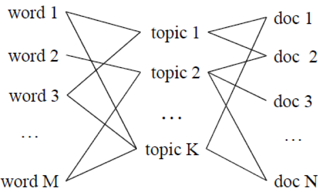
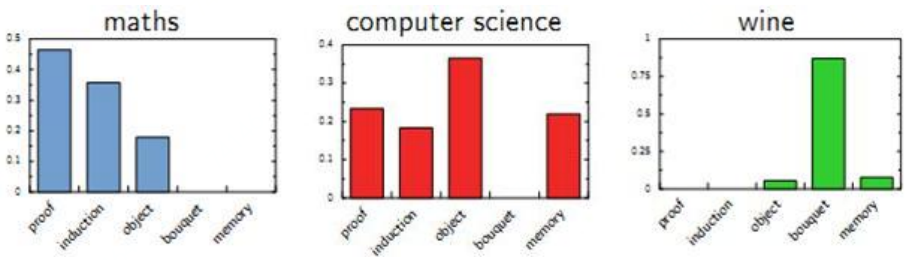
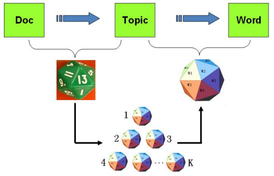
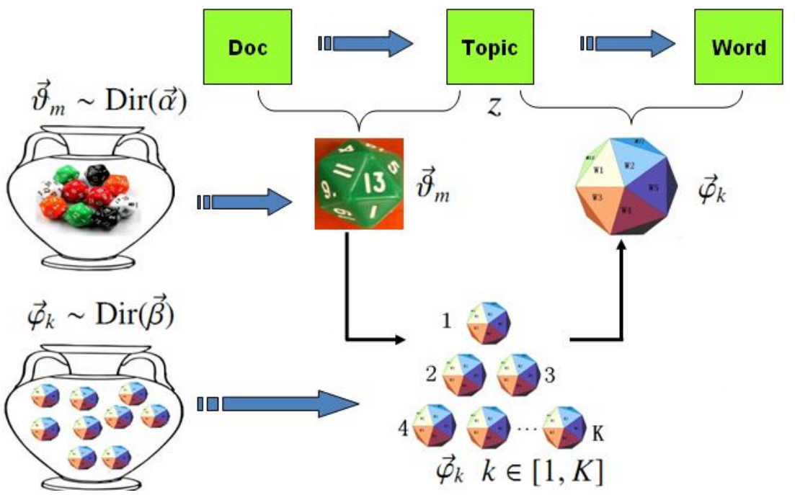

有些关键词不一定会显式的出现在文档中，比如动物科普文，介绍狮子老虎等，但全文没显式的出现动物二字，这种情况下，TF-IDF和TextRank就无法提出动物这个隐含主题信息了，这时候就需要主题模型。



如上图，主题模型认为词与文档之间没有直接联系，他们之间还有主题(Topic)这个维度来维系。每个文档都对应着一个或多个主题，而每个主题有对应的词的分布(比如动物主题中“狮子”词的概率高，而在其他不相关主题中“狮子”出现的概率低)，通过主题，就可以得到每个文档的词分布。依据这一原理：


在一个已知的数据集中，每个词和文档对应的是已知的。而主题模型就是根据这个已知的信息，通过计算和的值，从而得到主题的词分布和文档的主题分布信息。常用的LSA(LSI)主要采用SVD(奇异值分解)来解决，pLSA与LDA则对分布信息进行拟合。

<a name="0392605d"></a>
## LSA/LSI

LSA(Latent Semantic Analysis，潜在语义分析)和LSI(Latent Semantic Index，潜在语义索引)二者常被认为是一种算法，只是在潜在语义分析(LSA)后，还会利用分析的结果建立索引(LSI)。

```
1) 使用BOW模型将每个文档表示为向量
2) 将所有的文档词向量拼接起来构成词-文档矩阵(m×n)
3) 对词-文档矩阵进行奇异值分解(SVD)操作[m×n]=[m×r]·[r×r]·[r×n]
4) 根据SVD的结果，将词-文档矩阵映射到一个更低维度k([m×k]·[k×k]·[k×n],0<k<r)的近似SVD结果
   每个词和文档都可以表示为k个主题构成的空间中的一个点，通过计算每个词和文档的相似度(余弦或KL)，
   可以得到每个文档对每个词的相似度，取相似度最高的一个词即文档的关键词
```

然而SVD的计算复杂度非常高，效率低，另外LSA得到的分布是基于已知的数据集，要是新加一篇文档进来就需要重新计算，且存在对词的频率分布不敏感、物理解释性差等问题。

<a name="58cc0640"></a>
## [pLSA/LDA](http://www.victoriawy.com/wp-content/uploads/2017/12/LDA%E6%95%B0%E5%AD%A6%E5%85%AB%E5%8D%A6.pdf)

pLSA 模型本质上是频率学派思想，LDA则是利用贝叶斯学派的方法进行考虑。（[学派介绍](https://www.zhihu.com/question/20587681)）

<a name="pLSA"></a>
### pLSA

pLSA认为一篇文档可以由多个主题混合而成，而每个主题都是词汇上的概率分布，文章中的每个词都是一个固定的主题生成的，比如：



```
1、有两种类型的骰子，一类是doc-topic骰子，每个doc-topic骰子有K个面，每个面是一个topic的编号；
一类是topic-word骰子，每个topic-word骰子有V个面，每个面对应一个词。
2、一共有K个topic-word骰子，每个骰子编号1到K
3、生成每篇文档之前，都为这篇文章制造一个特定的doc-topic骰子，然后重复如下过程生成文档中的词：
    3.1、投掷这个doc-topic骰子，得到一个topic编号z
    3.2、选择K个topic-word骰子中编号为z的那个，投掷这个骰子，于是得到一个词
```



上述个topic-word骰子，我们记为，对于包含篇文档的语料中的每篇文档，都会有一个特定的doc-topic骰子，所有对应的骰子记为。为方便，我们假设每个词都是一个编号，对应到topic-word骰子的面。于是pLSA模型中，第篇文档中的每个词的生成概率为：


所以整篇文档的生成概率(词生成概率相乘)为：


使用EM算法对模型参数进行求解，我们就得到了文档-主题概率，词-主题概率。某主题的下词生成概率最高的即可提取为关键词。

<a name="LDA"></a>
### LDA

pLSA是基于频率学派的思想，贝叶斯学派则认为，doc-topic骰子和topic-word骰子都是模型中的参数，参数都是随机变量，怎么能没有先验分布。于是我们可以如下在两个骰子参数前加上先验分布从而把pLSA对应的游戏过程改造为一个贝叶斯的游戏过程。由于和都对应多项分布，假设先验分布是Drichlet分布，于是我们就得到了LDA(Latent Dirichlet Allocation)模型。



```
1、有两大坛子的骰子，第一个坛子装的是doc-topic骰子，第二个坛子装的是topic-word骰子
2、随机从第二个坛子中独立的抽取了K个topic-word骰子，编号1到K
3、每次生成一篇新的文档前，从第一个坛子中随机抽取一个doc-topic骰子，然后重复如下过程：
    3.1、投掷这个doc-topic骰子，得到一个topic编号z
    3.2、选择K个topic-word骰子中编号为z的那个，投掷这个骰子，得到一个词
```

主要分为两个过程：

1、生成第篇文档的时候，先从第一个坛子中抽了一个doc-topic骰子，然后投掷这个骰子生成了文档中第个词的主题编号：

2、生成语料中第篇文档的第个词，在个topic-word骰子中，挑选编号为的那个骰子进行投掷，然后生成词：

LDA假设文档中主题的先验分布和主题中词的先验分布都服从Drichlet分布。在贝叶斯学派看来，先验分布+数据(似然)=后验分布。我们通过已有数据集的统计，就可以得到每篇文档中主题的多项式分布和每个主题对应词的多项式分布。然后就可以依据贝叶斯学派的方法，通过先验的Drichlet分布和观测的数据得到的多项式分布，得到一组Dirichlet-multi共轭，并据此来推断文档中主题的后验分布和主题中词的后验分布，也就是我们需要的参数。那么具体的LDA模型如何进行求解，其中一种主流方法就是吉布斯采样。结合吉布斯采样的LDA训练过程一般如下：

```
1、随机初始化，对语料中每篇文档的每个词w，随机地赋予一个topic编号z
2、重新扫描语料库，对每个词w按照吉布斯采样公式重新采样它的topic，在语料中进行更新
3、重复以上语料库的重新采样过程直到吉布斯采样收敛
4、统计语料库的topic-word共现频率矩阵，该矩阵就是LDA模型
```

经过以上的步骤，就得到一个训练好的LDA模型，接下来就可以按照一定的方式很对新文档的topic进行预估，具体步骤如下：

```
1、随机初始化，对当前文档中的每个词w，随机地赋一个topic编号z
2、重新扫描当前文档，按照吉布斯采样公式，重新采样它的topic
3、重复以上过程直到吉布斯采样收敛
4、统计文档中的topic分布即为预估结果
```
