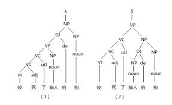
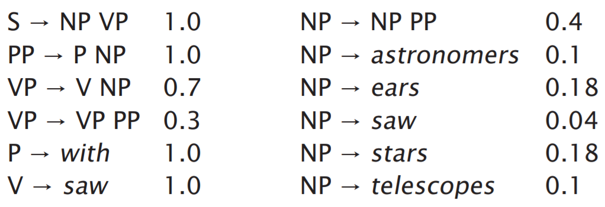
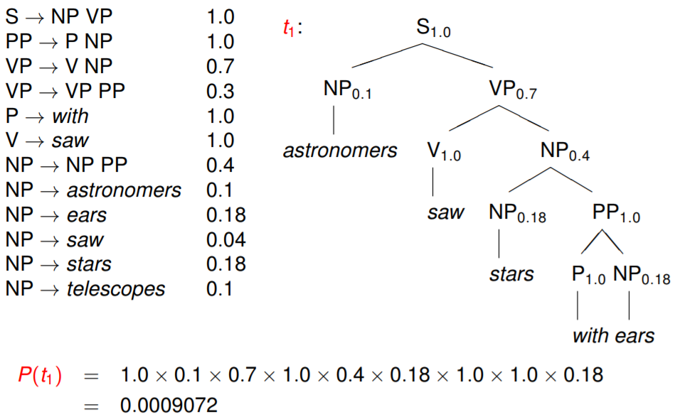
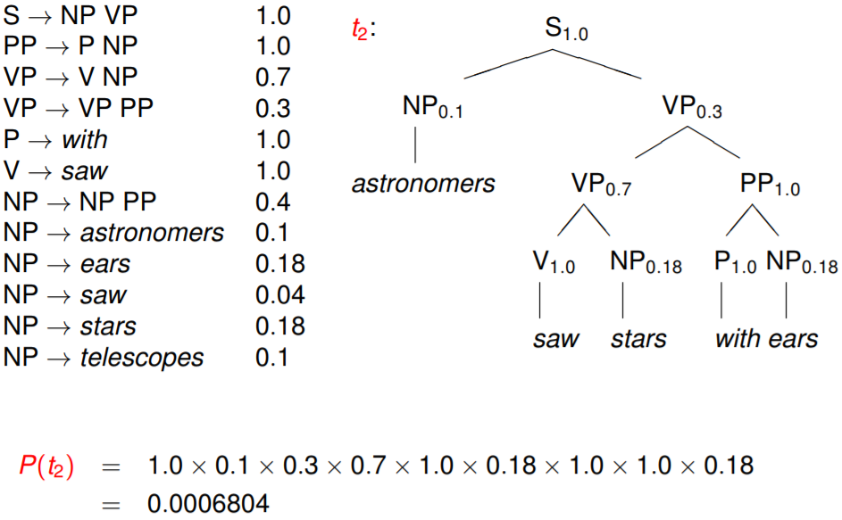

句法分析(Parsing)的主要任务是识别出句子所包含的句法成分以及这些成分之间的关系，一般以句法树来表示句法分析的结果。句法分析是从单词串得到句法结构的过程，实现该过程的工具或程序被称为句法分析器(Parser)。基于分析目标可分为完全句法分析和局部句法分析。

句法分析主要有以下两个难点：1、歧义    2、搜索空间

- 歧义：自然语言区别于人工语言的饿一个重要特点就是它存在大量的歧义现象。人类自身可以依靠大量的先验知识有效地消除各种歧义，而机器由于在知识表示和获取方面存在严重不足，很难像人类那样进行句法消歧。
- 搜索空间：句法分析时一个极为复杂的任务，候选数个数随句子增多呈指数级增长，搜索空间巨大。因此，必须设计出合适的解码器，以确保能够在可以容忍的时间内搜索到模型定义最优解。

句法分析（Parsing）是从单词串得到句法结构的过程，而实现该过程的工具或程序被称为句法分析器（Parser）。句法分析的种类很多，这里我们根据其侧重目标将其分为完全句法分析和局部句法分析两种。两者的区别在于，完全句法分析以获取整个句子的句法结构为目的；而局部句法分析只关注局部的一些成分，例如常用的依存句法分析就是一种局部分析方法。

句法分析中所用方法可以简单地分为基于规则的方法和基于统计的方法两大类。基于规则的方法在处理大规模真实样本时，会存在语法规则覆盖有限、系统可迁移差等缺陷。随着大规模标注树库的建立，基于统计学习模型的句法分析方法开始兴起，句法分析器的性能不断提高，最典型的就是风靡于20世纪70年代的PCFG（Probabilistic Context Free Grammar），它在句法分析领域得到了极大的应用，也是现在句法分析中常用的方法。统计句法分析模型本质是一套面向候选树的评价方法，其会给正确的句法树赋予一个较高的分值，而给不合理的句法树赋予一个较低的分值，这样就可以借用候选算法树的分值进行消歧。

## 句法分析数据集

相较于分词或词性标注，句法分析的数据集要复杂很多，其是一种树形的标注结构，因此又称树库。

目前使用最多的树库来自美国宾夕法尼亚大学加工的英文宾州树库（Penn TreeBank，PTB）。PTB的前身为ATIS（Air Travel Information System）和WSJ（Wall Street Journal）树库，具有较高的一致性和标注准确率。

中文树库建设较晚，比较著名的有中文宾州树库（Chinese TreeBank，CTB）、清华树库（Tsinghua Chinese TreeBank，TCT）、台湾中研院树库。其中CTB是宾夕法尼亚大学标注的而汉语句法树库，也是目前绝大多数的中文句法分析研究的基准语料库。TCT是清华大学计算机系智能技术与系统国家重点实验室人员从汉语平衡语料库中提取100万规模的汉字语料文本，经过自动句法分析和人工校对，形成的高质量的标注有完整句法结构的中文句法树语料库。Sinica TreeBank是中国台湾中研院词库小组从中研院平衡语料库抽取句子，经过电脑自动分析成句法树，并加以人工修改、检验后所得的成果。

不同的树库有着不同的标记体系，使用时切记使用一种树库的句法分析器，然后用其他树库的标记体系来解释。

## 句法分析评测方法

句法分析评测的主要任务是评测句法分析器生成的树结构与手工标注的树结构之间的相似程度。其主要考虑两个方面的性能：满意度和效率。其中满意度是指测试句法分析器是否适合或胜任某个特定的自然语言处理任务；而效率主要用于对比句法分析器的运行时间。

目前主流的句法分析评测方法是PARSEVAL评测体系，它是一种力度比较适中、较为理想的评价方法，主要指标有准确率、召回率、交叉括号数。准确率表示分析正确的短语个数在句法分析结构中所占的比例，即分析结果中与标准句法树中相匹配的短语个数占分析结果中所有短语个数的比例。召回率表示分析得到的正确短语个数占标准分析树全部短语个数的比例。交叉括号表示分析得到的某一个短语的覆盖范围与标准句法分析结果的某个短语的覆盖范围存在重叠又不存在包含关系，即构成了一个交叉括号。

## 句法分析工具

### SyntaxNet

SyntaxNet是深度神经网络在NLP中的一个应用。

### Stanford Parser

Stanford Parser是斯坦福大学自然语言小组开发的开源句法分析器，是基于概率统计句法分析的一个Java实现。该句法分析器目前提供了5个中文文法的实现。

# 句法分析方法

## 基于PCFG的句法分析
PCFG（Probabilistic Context Free Grammar）是基于概率的短语结构分析方法，是目前研究最为充分、形式最为简单的统计句法分析模型，也可以认为是规则方法与统计方法的结合。

PCFG是上下文无关文法的扩展，是一种生成式的方法，其短语结构文法可以表示为一个五元组()：

- 是一个有限词汇的集合（词典），它的元素称为词汇或终结符。
- 是一个有限标注的集合，称为非终结符集合。
- 称为文法的开始符合，其包含于，即。
- 是有序偶对（）的集合，也就是产生的规则集。
- 代表每个产生规则的统计概率。

PCFG可以解决以下问题：

- 基于PCFG可以计算分析树的概率值。
- 若一个句子有多个分析树，可以依据概率值对所有的分析树进行排序。
- PCFG可以用来进行句法排歧，面对多个分析结果选择概率值最大的。

下面根据一个例子来看PCFG求解最优句法树的过程。有一个规则集，内容如下：

其中第一列表示规则，第二列表示该规则成立的概率。

给定句子：astronomers saw stars with ears，得到两个句法树，如下图所示：

 

因为，因此选择作为最终的句法树。

根据上述例子，我们很自然想到关于PCFG的三个基本问题。

- 给定上下文无关文法，如何计算句子的概率，即计算？
- 给定上下文无关文法以及句子，如何选择最佳的句法树，即计算？
- 如何为文法规则选择参数，使得训练句子的概率最大，即计算 ？

可以使用[内向和外向算法](https://godweiyang.com/2018/04/19/inside-outside/)解决第一个问题，可以使用Viterbi算法解决第二个问题，使用EM算法解决第三个问题。

作为目前最成功的基于语法驱动的统计句法分析方法，PCFG衍生出了各种形式的算法，包括基于单纯PCFG的句法分析方法、基于词汇化的PCFG的句法分析方法、基于子类划分PCFG的句法分析方法等。这些方法各有千秋，使用时可根据具体效果进行甄选。

## 基于最大间隔马尔可夫网络的句法分析

最大间隔是SVM（支持向量机）中的重要理论，而马尔可夫网络是概率图模型中一种具备一定结构处理关系能力的算法。最大间隔马尔可夫网络（Max-Margin Markov Networks）就是这两者的结合，能够解决复杂的结构化预测问题，尤为适合用于句法分析任务。这是一种判别式的句法分析方法，通过丰富特征来消解分析过程中产生的歧义。其判别函数采用如下形式：

其中，表示与相对应的句法树的特征向量，表示特征权重。

类似SVM算法，最大间隔马尔可夫网络要实现多元分类，可以采用多个独立而且可以并行计算的二元分类器来代替。这样，每个二元分类器识别一个短语标记，通过组合这些分类器就能完成句法分析任务，同时也能通过并行方式，大大提升训练速度。

## 基于条件随机场的句法分析

当将句法分析作为序列标注问题来解决时，同样可以采用条件随机场（CRF）模型。与前面PCFG的模型相比，采用CRF模型进行句法分析，主要不同点在于概率计算方法和概率归一化的方式。CRF模型最大化的是句法树的条件概率而不是联合概率值，并且对概率进行归一化。同基于最大间隔马尔可夫网络的句法分析一样，基于CRF的句法分析也是一种判别式的方法，需要融合大量的特征。

## 基于移进-归约的句法分析

移进—归纳方法（Shift—Reduce Algorithm）是一种自下而上的方法。其从输入串开始，逐步进行“归约”，指导归约到文法的开始符号。移进—归纳算法类似于下推自动机的LR分析法，其操作的基本数据结构是堆栈。

移进—归纳算法主要涉及四种操作（这里符号表示句法树的根节点）。

1. 移进：从句子左端将一个终结符移到栈顶。
2. 归约：根据规则，将栈顶的若干个字符替换为一个符号。
3. 接受：句子中所有词语都已移进栈中，且栈中只剩下一个符号，分析成功，结束。
4. 拒绝：句子中所有词语都已移进栈中，栈中并非只有一个符号，也无法进行任何归约，分析失败，结束。

## Source

[https://godweiyang.com/2018/04/19/inside-outside/](https://godweiyang.com/2018/04/19/inside-outside/) [https://nlp.stanford.edu/fsnlp/pcfg/fsnlp-pcfg-slides.pdf](https://nlp.stanford.edu/fsnlp/pcfg/fsnlp-pcfg-slides.pdf) [https://gawron.sdsu.edu/compling/course_core/lectures/pcfg/prob_gram.pdf](https://gawron.sdsu.edu/compling/course_core/lectures/pcfg/prob_gram.pdf)
