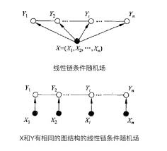

命名实体识别的目的是识别语料库中的人名、地名、组织机构名等命名实体。命名实体识别(Named Entity Recognition)研究的命名实体一般分为3大类（实体类、时间类、数字类）和7小类（人名、地名、组织机构名、时间、日期、货币和百分比）。由于数量、时间、日期、货币等实体识别通常可以采用模式匹配的方式获得较好识别，相比之下人名、地名、机构名较复杂，因此近年来的研究主要以这几种实体为主。

### 基于条件随机场的命名实体识别

条件随机场是在给定观察的标记序列下，计算整个标记序列的联合概率，其定义为：

设和是联合随机变量，若随机变量构成一个无向图表示的马尔可夫模型，则其条件概率分布称为条件随机场(Conditional Random Field, CRF)，即：

其中表示图中与节点有边连接的所有节点，表示节点以外所有节点

#### 示例说明

现有个由个字符构成的NER的句子，每个字符的标签都在我们已知的标签集合(B、M、E、S和O)中选择(如下表)，当我们为每个字符选定标签后，就形成了一个随机场。

| 标注 | 含义 |
| :---: | :---: |
| B | 当前词为地理命名实体的首部 |
| M | 当前词为地理命名实体的内部 |
| E | 当前词为地理命名实体的尾部 |
| S | 当前词独立构成地理命名实体 |
| O | 当前词为不是地理命名实体或组成部分 |

如果在其中加 一些约束，如所有字符的标签只与相邻的字符的标签有关，那么久转化成马尔可夫随机场问题。从马尔可夫随机场到条件随机场就好理解很多，其假设马尔可夫随机场中有和两种变量，一般是给定的，是在给定条件下的输出。在前面的例子中，是字符，是标签，就是条件随机场。在条件随机场的定义中，我们并没有要求变量与具有相同的结构。实际在自然语言处理中，多假设其结构相同，即:

一般将这种结构称为线性链条件随机场。定义如下：

设和均为线性链表示的随机变量序列，若在给定的随机变量序列的条件下，随机变量序列的条件概率分布构成条件随机场，且满足马尔可夫性：

则称为线性链的条件随机场。线性链CRF不仅考虑上一状态还考虑后续的状态结果。因此，HMM是一个有向图（HMM处理时，每个状态依赖上一个状态），而线性链CRF是一个无向图（每个状态依赖于当前状态的周围节点状态）。

对句子“我来到牛家村”进行标注，正确标注后的结果应为“我/O 来/O 到/O 牛/B 家/M 村/E”。(O,O,O,B,M,E)是一种标注序列，还有(O,O,O,B,B,E)...等各种标记方法，NER的任务就是在如此多的可选标注序列中，找出最靠谱的作为句子的标注。在CRF中，定义一个特征函数集合，然后使用这个特征集合为标注序列打分，据此选出最靠谱的标注序列。该序列的分值是通过综合考虑特征集合中的函数得出的。

在CRF中有两种特征函数，分别为转移函数和状态函数：

依赖于当前和前一个位置，表示从标注序列中位置的标记转移到位置上的标记的概率。依赖当前位置，表示标记序列在位置上为标记的概率。通常特征函数取值为或，表示符不符合该条件约束。完整的线性链CRF的参数形式如下：

其中：

是规范化因子，其求和操作是在所有可能的输出序列上做的；和为转移函数和状态函数对应的权值。通常为了计算方便，简化为下式：

对应的为：

其中，为两特征函数和的统一符号。

使用CRF来做命名实体识别时，目标是求，该问题和HMM求解最大可能序列路径一样，用维特比(Veterbi)算法即可。
