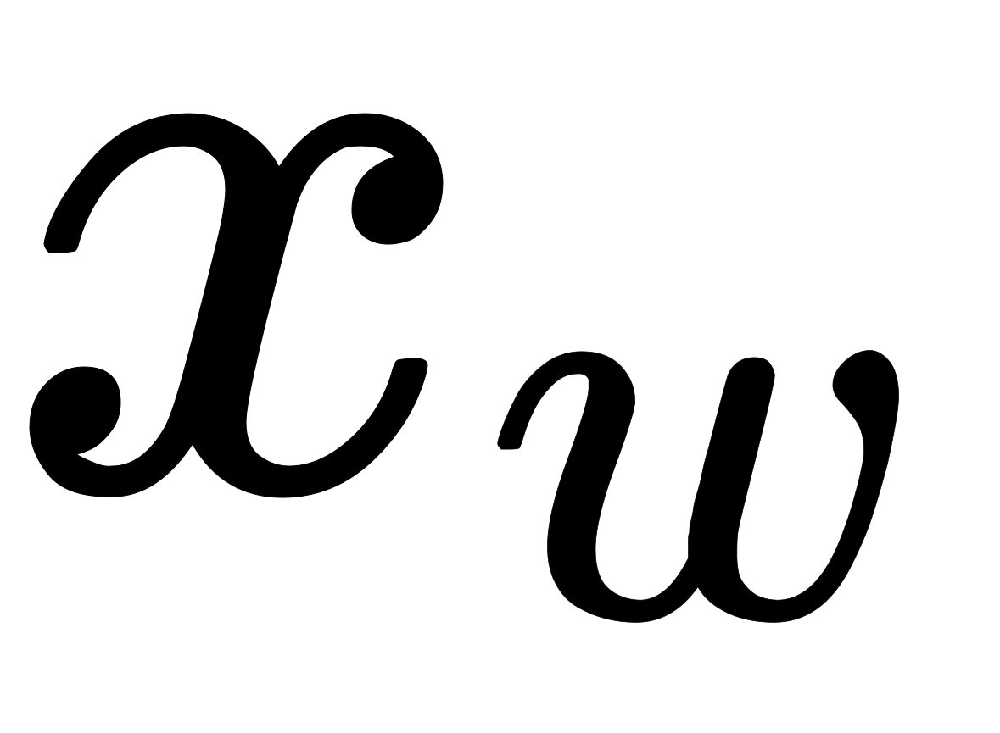
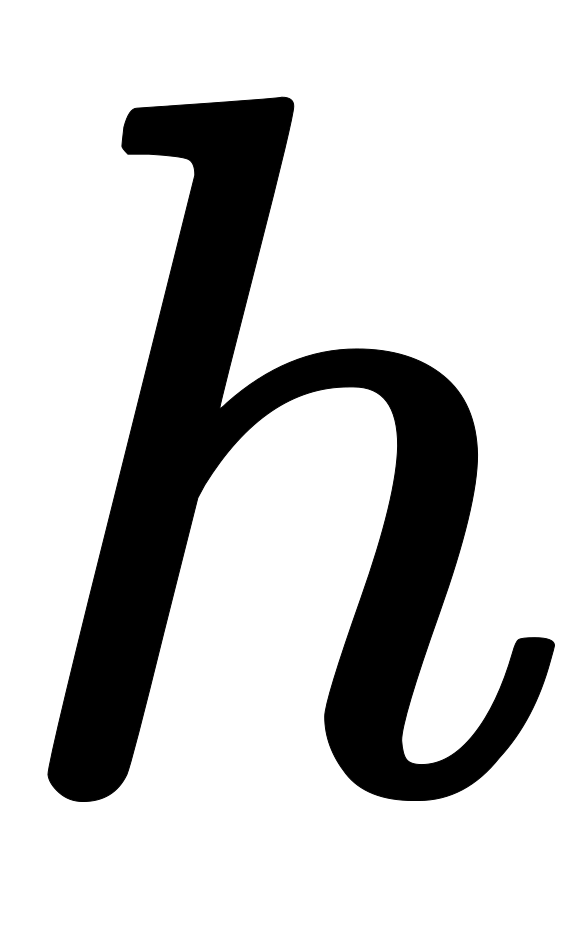
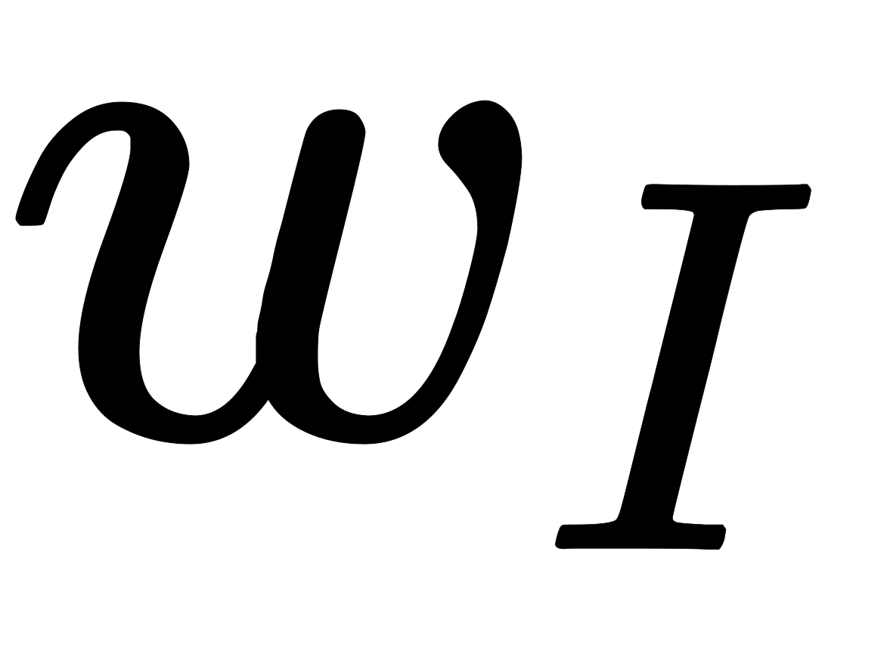
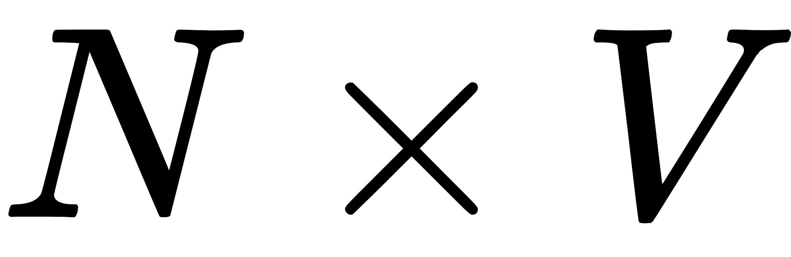

Continuous Bag-of-Word(CBOW)顾名思义，即连续词袋模型，即文本以单个词为最小单位，像“support vector machine”词组也会被当做三个独立的词考虑，且是连续词袋，即目标词的前后词也作为因素考虑。

## One-word context

### 模型结构

下图为网络模型例子，词汇表大小为；隐藏层宽度为(即我们想要的词向量维度)，各层连接为全连接方式；输入为one-hot编码的向量，即词汇表出现的个非重复词，一个词的向量为对应的位置为，其他位置都为；真实的为文本中输入词的下一个词的one-hot编码的向量。

输入层和隐藏层间的权重可由一个的矩阵表示。的每一行是一个维向量，表示输入层对应的词向量。

的第行是，给定一个词且对于(即这个词的one-hot向量只有位置为)，可得：

其实就是将的第行复制给了，因为只有在第位置是（因为输入是one-hot，经过矩阵相乘其实就是把权重对应行的值传递给下一层）。即是输入词的向量表示。（这就意味着隐藏层的激活函数是线性的即可，不需要使用ReLU之类的对它们进行非线性变换。比如Multi-word context model中直接把这层的输入进行加权求和传给下层）

隐藏层到输出层的权重可用一个的矩阵表示：

基于权重，我们对于每一个词汇表里的词可计算一个分数：

其中是第列。然后我们用softmax去获得这个词的后验分布，是一个多项式分布：

其中是输出层第个单元的输出。结合输入层到隐藏层和隐藏层到输出层公式代入softmax，我们得到：

这里和是词的两种表达形式。源自输入层到隐藏层权重矩阵的行，源自隐藏层到输出层权重矩阵的列。我们将和分别称为“输入向量”和“输出向量”。

模型目标是最大化，即模型输入，模型输出(表示它的index在输出层为) 与真实(输入词的下一个词的one-hot向量)一致。即向量第位为，其他为，我们期望的最佳模型是输出层第个单元为，其他为。模型使用反向传播进行训练。

### 模型训练

#### 隐藏层到输出层权重更新

训练目标即最大化， 公式（4）代表的就是给定上下文信息（这里为一个单词）以及其权重矩阵的情况下，预测其实际输出单词（即上下文信息的中心词）的条件概率

  

上式给了损失函数的定义，即，我们旨在最小化。的表示方式由公式（2）而来，则为实际输出单词的索引下标。我们注意到该损失函数可以理解为一种特殊情形下的交叉熵计算。

首先我们对损失函数求关于的偏导数，我们可得

上式给出了的定义，其中只有在第个单元是所期待的输出词（即真实的）时才为，其他情况下为。这个导偏数其实就是表示在输出层的预测误差。

我们根据链式法则求出损失函数关于矩阵元素的偏导数以获得隐藏层到输出层权重的梯度

因此，用随机梯度下降法，我们可以得到隐藏层到输出层的权重更新公式：

或者

其中是学习率，，是隐藏层第个单元；是的输出向量。这个更新公式其实就表明了我们需要查看词汇表中每一个可能的词，比较网络的输出与期望的输出(实际值) ：

- ，那么就从向量中减去隐藏向量的一部分（例如），这样向量就会与向量相差更远
- （这种情况只有在时，才会发生，此时），则将隐藏向量的一部分加入，使得与更接近
- 与非常接近，则此时由于公式（8）非常接近于，故更新参数基本没什么变化

#### 输入层到隐藏层权重更新

我们继续对损失函数求关于隐藏层的偏导数，得：

其中为隐藏层第个神经单元的输出；在公式（2）中已经定义，表示输出层第个神经单元的输入；为输出层第个单元的预测误差。因此应该是一个维度向量，它的每个元素代表的是词汇表中的每个单词的预测误差与其输出向量在到上的乘积之和。

接下来，我们需要求出损失函数关于权重矩阵的偏导数。首先，分解公式（1），我们知道隐藏层激活单元的输出是输入层与权重的线性组合，即

因此对于权重矩阵的每一个元素，我们求关于的偏导数，得到

因此我们利用张量乘积的方式，便可得到

我们再次得到了一个的矩阵。由于向量只有一个非元素，因此只有一行是维非向量，因此矩阵的更新公式为

其中是矩阵的其中一行，是唯一的上下文单词的“输入向量”，也是矩阵唯一的导数非的行向量。除了以外，矩阵的其他行向量在参数更新迭代过程中都会保持不变（因为其导数为)

与矩阵的更新过程相似，对于公式（16），我们分析如下：

- 如果过高地估计了某个单词作为最终输出单词的概率（即：），则上下文单词(context word)的输入向量与单词的输出向量在更新的过程中会相差越来越大。
- 如果相反，某个单词作为最终输出单词的概率被低估（即：），则单词的输入向量与单词的输出向量在更新过程中会越来越接近。
- 如果对于单词的概率预测是准确的，则对于单词的输入向量在更新过程中几乎保持不变。

因此，上下文单词（context word ）的输入向量的更新取决于词汇表中所有单词的预测误差。预测误差越大，则该单词对于上下文单词的输入向量的更新过程影响越大。

## Multi-word context

根据字面意思我们就可以看出，基于multi-word context的CBOW模型就是利用多个上下文单词来推测中心单词target word的一种模型。比如下面这段话，我们的上下文大小取值为4，特定的这个词是"Learning"，也就是我们需要的输出词向量,上下文对应的词有8个，前后各4个，这8个词是我们模型的输入。由于CBOW使用的是词袋模型，因此这8个词都是平等的，也就是不考虑他们和我们关注的词之间的距离大小，只要在我们上下文之内即可

### 模型结构

其隐藏层的输出值的计算过程为：首先将输入的上下文单词（context words）的向量叠加起来并取其平均值，接着与输入层到隐藏层的权重矩阵相乘，作为最终的结果，公式如下：

 

其中为上下文单词的个数，为上下文单词，为单词的输入向量。损失函数为

  

网络结构如下：

### 模型训练

#### 隐藏层到输出层权重更新

同样，由隐藏层到输出层的权重更新公式与One-word context模型下的一模一样，即类似于公式（11），我们直接写在下面：

#### 输入层到隐藏层权重更新

由输入层到隐藏层的权重矩阵更新公式与公式（16）类似，只不过现在我们需要对每一个上下文单词都执行如下更新公式：

其中为context中第个单词的输入向量；为正学习速率；由公式（12）给出。

## Source

[https://arxiv.org/pdf/1411.2738.pdf](https://arxiv.org/pdf/1411.2738.pdf) [https://blog.csdn.net/lanyu_01/article/details/80097350](https://blog.csdn.net/lanyu_01/article/details/80097350) [https://www.cnblogs.com/pinard/p/7160330.html](https://www.cnblogs.com/pinard/p/7160330.html)
