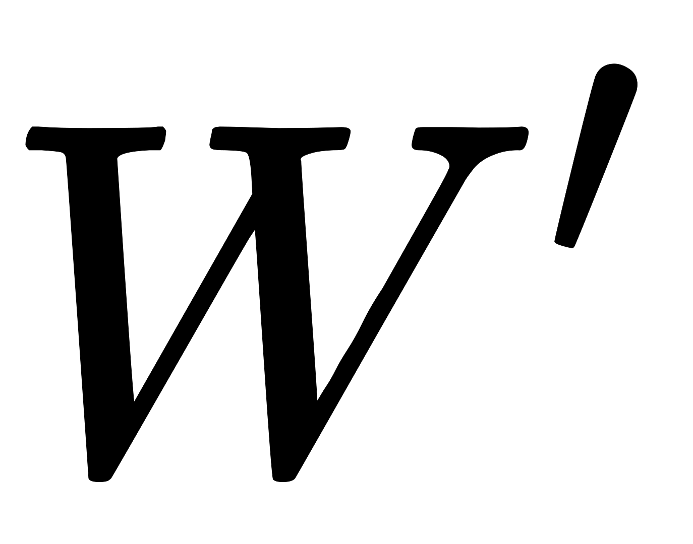
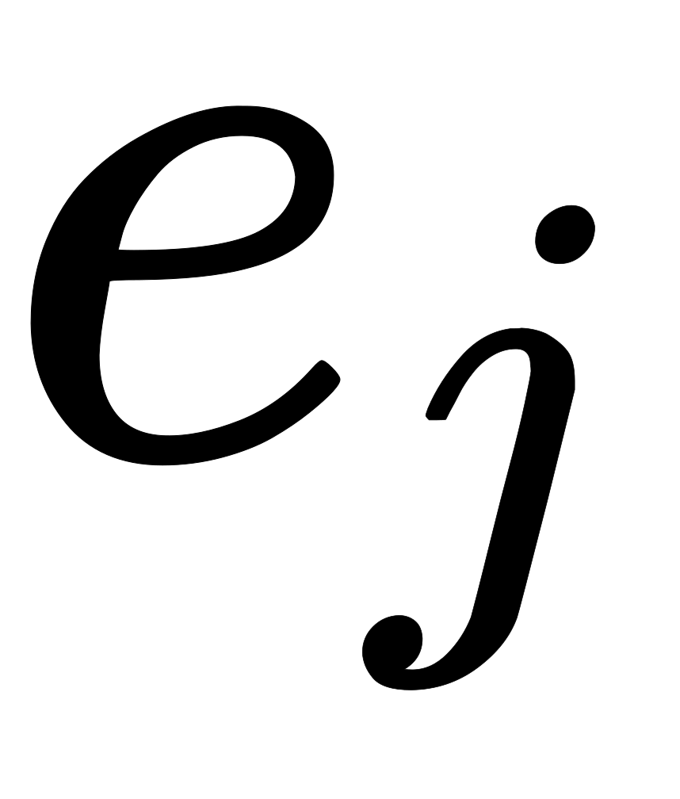
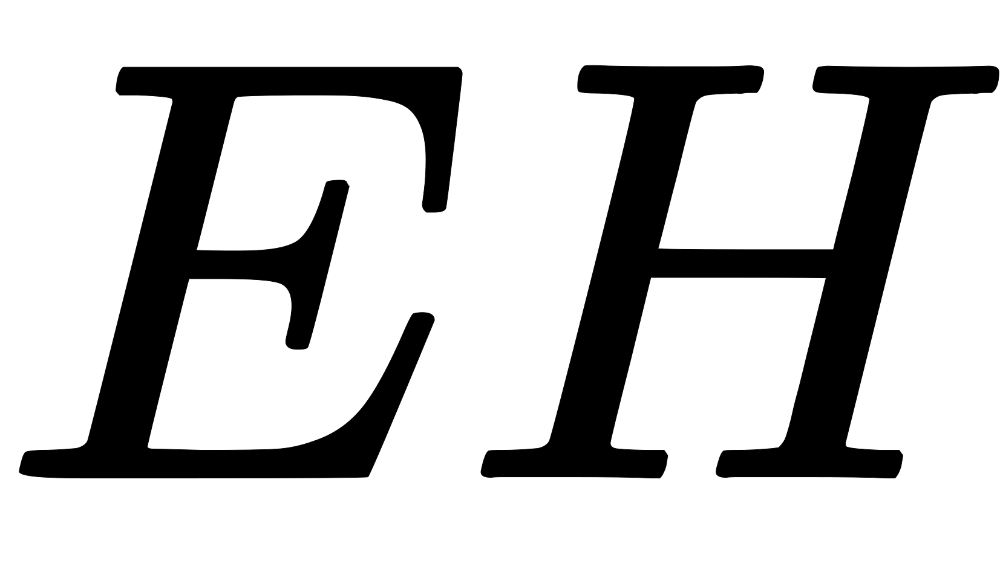

## 模型结构

与CBOW模型正好相反，Skip-Gram模型是根据中心单词（target word）来预测其上上下文信息（context words）。如下图所示，为Skip-Gram模型的结构示意图

我们仍然使用来表示输入层上唯一的那个单词的输入向量，因此，我们对于隐藏层的输出值的计算公式与CBOW相同，表示如下：

上式显示，向量其实就是输入层到隐藏层权重矩阵某一行结合输入单词的向量拷贝。在输出层，与CBOW模型的输出为单个多项式分布不同的是，Skip-Gram模型在输出层输出了C个多项式分布。每个输出都使用相同的隐藏层到输出层矩阵计算：

其中，表示输出层的第个panel的第j个单词（何为panel？就是输出层的表示每个上下文单词的神经元的组合，图中一共有个context words，所以总共有个panel）；实际上表示的是输出上下文单词（output context words）的第个单词；是唯一的输入单词；为输出层的第个panel上的第个神经单元的概率输出值；表示的是输出层第个panel的第个神经元的输入值；由于输出层的所有panels共享同一权重矩阵，因此：

其中，为词汇表第个单词的输出向量；同样，它也是取自于隐藏层到输出层权重矩阵的一列。

## 模型训练

Skip-Gram模型参数更新公式的推导过程与One-word context 模型的推导过程大体上一样。这里我们将损失函数变为：

  

其中，为第个输出层输出的上下文单词在词汇表中的真实索引。

在得到损失函数之后，我们对输出层的每一个panel上的所有激活单元的输入值均求其关于的偏导数：

其中为输出层神经元的预测误差。为了简化符号，我们定义一个维的向量作为所有上下文单词的预测误差之和，用公式定义如下：

接下来，我们计算隐藏层到输出层权重矩阵关于的偏导数为：

### 隐藏层到输出层权重更新

这样，我们就得到了隐藏层到输出层权重矩阵的参数更新公式为：

或者表示为

上述参数更新公式的直观概念理解与CBOW无二，除了一点就是：输出层的预测误差的计算是基于多个上下文单词context words，而不是单个目标单词 target word；需注意的是对于每一个训练样本，我们都要利用该参数更新公式来更新隐藏层到输出层权重矩阵的每个元素。

### 输入层到隐藏层权重更新

同样，对于输入层到隐藏层权重矩阵的参数更新公式的推导过程，除了考虑要将预测误差替换为外，其他也与CBOW类似。这里我们直接给出更新公式：

其中，是一个维向量，组成该向量的每一个元素可以用如下公式表示：

## Source

[https://arxiv.org/pdf/1411.2738.pdf](https://arxiv.org/pdf/1411.2738.pdf) [https://blog.csdn.net/lanyu_01/article/details/80097350](https://blog.csdn.net/lanyu_01/article/details/80097350) [https://www.cnblogs.com/pinard/p/7160330.html](https://www.cnblogs.com/pinard/p/7160330.html)
