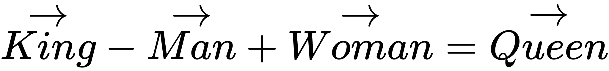
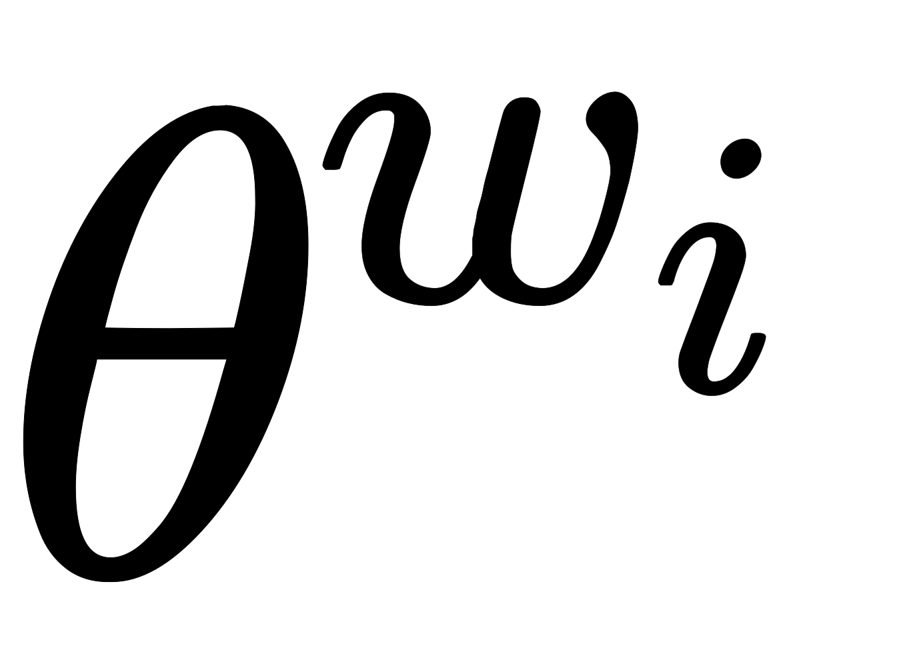
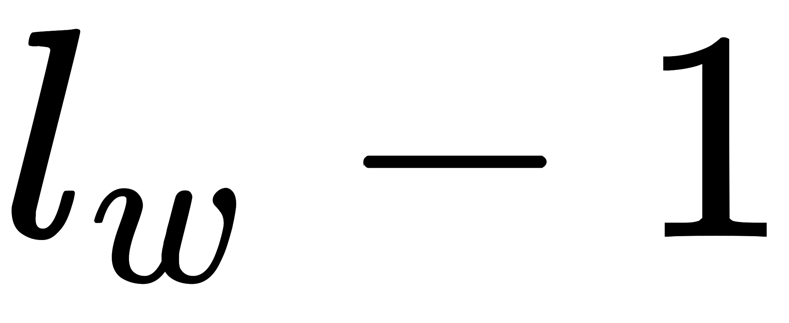

word2vec为什么不用现成的DNN模型，要继续优化出新方法呢？最主要的问题是DNN模型的这个处理过程非常耗时。我们的词汇表一般在百万级别以上，这意味着我们DNN的输出层需要进行softmax计算各个词的输出概率的的计算量很大。

word2vec转换的向量相比于one-hot编码是低维稠密的。我们称其为Dristributed representation，这可以解决one-hot representation的问题，它的思路是通过训练，将每个词都映射到一个较短的词向量上来。所有的这些词向量就构成了向量空间，进而可以用普通的统计学的方法来研究词与词之间的关系。这个较短的词向量维度我们可以在训练时自己来指定。有了用Dristributed representation表示的较短的词向量，我们就可以较容易的分析词之间的关系了，比如我们将词的维度降维到2维，有一个有趣的研究表明，用下图的词向量表示我们的词时，我们可以发现：  

为了加速训练过程，Google论文里真实实现的word2vec对模型提出了两种改进思路，即Hierarchical Softmax模型和Negative Sampling模型。Hierarchical Softmax是用输出值的霍夫曼编码代替原本的one-hot向量，用霍夫曼树替代Softmax的计算过程。Negative Sampling（简称NEG）使用随机采用替代Softmax计算概率，它是另一种更严谨的抽样模型NCE的简化版本。将这两种算法与前面的两个模型组合，在Google的论文里一共包含了4种Word2Vec的实现：

- Hierarchical Softmax CBOW 模型
- Hierarchical Softmax Skip-Gram 模型
- Negative Sampling CBOW 模型
- Negative Sampling Skip-Gram 模型

# Hierarchical Softmax vs. Negative Sampling
在这两种模型中，每个词的模型参数有什么区别：

- 时候词对应的模型参数。在Negative Sampling中每个词只有一个模型参数。而在Hierarchical Softmax中，每个词有模型参数，这些参数即在树结构中的内部节点的参数。

为什么Negative Sampling能得到和Hierarchical Softmax类似的效果：

- 可以理解为负采样是分层softmax的一种近似。正常我们是需要拿中心词和对应的上下文来一起训练的，只是给出的正例，不是采样得来的。但是为了应付海量数据的训练，同时可以加快训练速度，我们需要做一些精度的牺牲。这时我们直接通过少量的负采样(负采样更容易找到合适的词)样本来训练，可以加快速度同时减少内存负担。本质上它们都是在一颗二叉树上选择合适的路径下到叶子节点。只是分层softmax里面是正例训练，而负采样是负例训练，同时负词的个数较分层softmax少，不需要那么大一颗哈夫曼树来保存，方便训练快速收敛，同时内存消耗少。

在Hierarchical Softmax中，如果每次都是更新上下文的词向量的话，那skip-gram模也是把上下文作为输入进行更新，而中心词作为输出去训练上下文，那结构不就和CBOW差不多了吗：

- 迭代更新的过程的确是类似的，只有一些细节上的不同。在CBOW中，在霍夫曼树从上而下使用的输入是个窗口词词向量的均值，只有一个。而在Skip-Gram里面，在霍夫曼树从上而下使用的输入分别是各个词向量，一共个。所以可以看到在Skip-Gram算法里面会多一层循环。 其实在Negative Sampling中也是一样的。

word2vec就是求解每一个的单词的embedding？那知道一个中心词求上下文（CBOW）和已知上下文求中心词（Skip-Gram）在其中起到了什么作用呢：

- word2vec就是求解每一个的单词的embedding的词向量。CBOW和Skip-Gram只是2个求出似然函数的途径，我们根据这2个思路得到似然函数进行梯度下降的求解。且这2个思路没有本质区别（在梯度更新的公式上），都是更新个词向量。

## Source
[https://kexue.fm/usr/uploads/2017/04/146269300.pdf](https://kexue.fm/usr/uploads/2017/04/146269300.pdf) [https://arxiv.org/pdf/1411.2738.pdf](https://arxiv.org/pdf/1411.2738.pdf) [《word2vec Parameter Learning Explained》论文学习笔记_lanyu_01的博客-CSDN博客](https://blog.csdn.net/lanyu_01/article/details/80097350) [word2vec原理(一) CBOW与Skip-Gram模型基础 - 刘建平Pinard - 博客园](https://www.cnblogs.com/pinard/p/7160330.html) [（一）理解word2vec：原理篇_word embedding 原理篇_anshuai_aw1的博客-CSDN博客](https://blog.csdn.net/anshuai_aw1/article/details/84241279) [万物皆Embedding，从经典的word2vec到深度学习基本操作item2vec](https://zhuanlan.zhihu.com/p/53194407)
