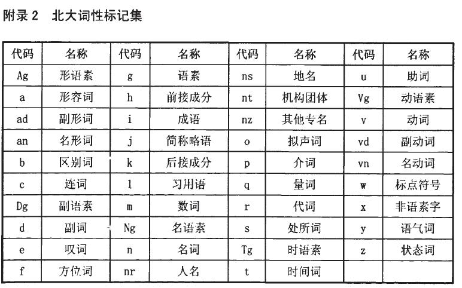
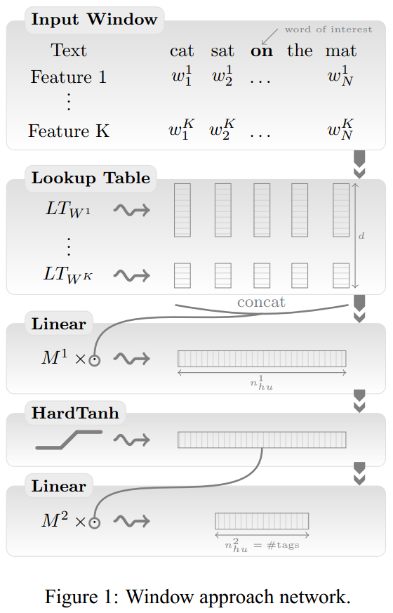
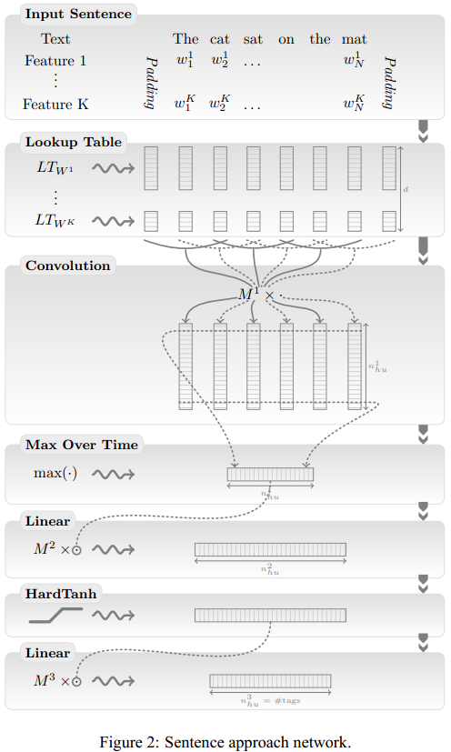
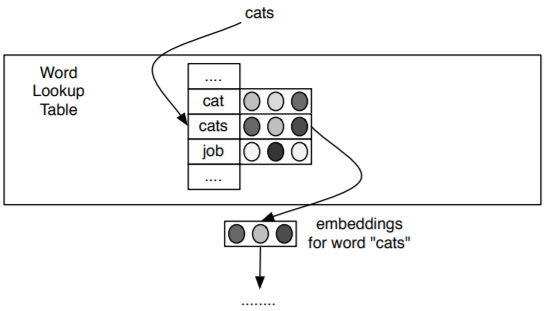
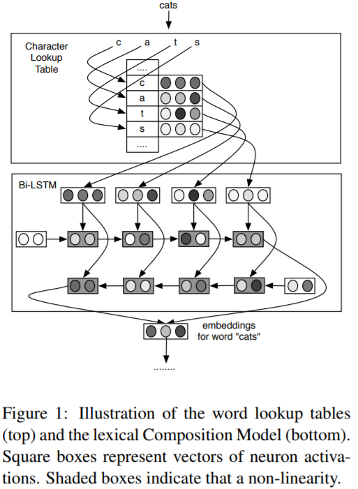
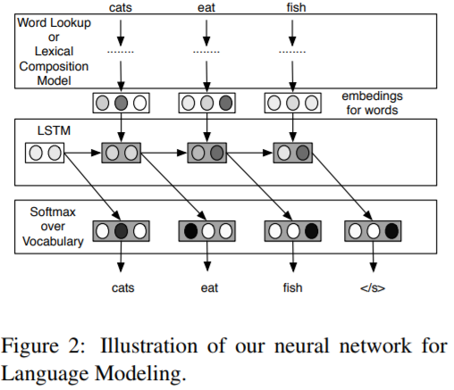

词性标注（Part-of-Speech Tagging，POS Tagging）是在给指定句子中判定每个词的语法范畴，确定其词性并加以标注的过程。比如“这儿/代词 是/动词 个/量词 非常/副词 漂亮/形容词 的/结构助词 公园/名词”。词性标注的困难之处在于，同一个词在不同的句子中可能是不同的词性，例如“I have a book.”和“I book a room”，在第一句中“book”的词性标签是名词(NN)，而在第二个句子中“book”的词性标签是非第三人称单数动词(VBP)。

词性标注最简单的方法就是从语料库中统计每个词所对应的高频词性，将其作为默认词性，但这样显然还有提升空间。目前较主流的方法是如同分词一样，将句子的词性标注作为一个序列标注问题来解决，如隐含马尔可夫模型、条件随机场模型等皆可在词性标注任务中使用。

# 词性标注规范

中文领域标注标准较为主流的主要为北大的词性标注集和滨州词性标注集两大类。下图北大词性标注集。

# Jieba库中词性标注

1. 首先基于正则表达式进行汉字判断，正则表达式如下：
   1. re_han_internal = re.compile("([\u4E00-\u9FD5a-zA-Z0-9+#&\._]+)")
2. 分类处理
   1. 若符合上面的正则表达式，则判定为汉字，然后基于前缀词典构建有向无环图，再基于有向无环图计算最大概率路径，同时在前缀词典中找出它所分的词性，若在词典中未找到，则赋予词性为"x"(代表未知)。当然，若在这个过程中，设置HMM，且待标注词为未登录词，则会通过HMM方式进行词性标注。
   2. 若不符合上面的正则表达式，那么继续通过正则表达式进行类型判断，分别赋予"x"(未知)、"m"(数词)、"eng"(英文)

HMM在2.a步骤中，将基于字标注的分词方法与词性标注结合，使用复合标注集。比如对于名词“人民”，它的词性标注是n，而分词的标注序列是BE，于是“人”的标注就是B_n，“民”的标注是E_n

# 传统词性标注

传统的词性标注方法有隐马尔可夫模型（HMM）和最大熵马尔可夫模型（MEMM）等。其中，HMM是生成模型，MEMM是判别模型。

基于MEMM的词性标注器抽取当前待标注单词附近的特征，然后利用这些特征判别当前词的特性。MEMM是最大熵模型（ME）在处理序列模型方面的变种。其思想是在一串满足约束的标签中选出一个熵最大的标签。用表示标签集合，表示其中的某一个标签，表示当前单词的上下文信息。这种模型可以用来估计句子的标注的概率，公式如下：

当前单词的上下文信息又叫作特征。根据在语料中出现的频次，可以将单词分为常见词和罕见词。常见词周围的特包括：待标注的单词、待标注单词附近的单词、待标注单词附近已标注单词的词性标签等；罕见词的特征包括：单词的后缀、单词的前缀、单词是否包含数字、单词是否首字母大写等。

模型可以使用最大似然的方法来训练，公式如下：

HMM模型与MEMM模型的概率表示和求解都不相同。HMM前面机器学习-概率图模型章节已经介绍很清楚，在此不再赘述。基于HMM的词性标注模型的目标函数如下：

HMM和MEMM存在同一个问题，就是只能从一个方向预测接下来的标注。但是在很多情况下当前单词后面的标注信息对当前标注的反馈也非常重要。要解决这个问题有很多种方法。一种方法是采用更强的模型，比如条件随机场（CRF）。但是条件随机场的计算开销太大，并且对标注效果的提升有限。还有一种方法是斯坦福的词性标注器中用到的，一种叫循环依赖网络（Cyclic Dependency Network）的模型，这种模型本质上式MEMM的变种

# 基于神经网络的词性标注

传统的词性标注需要从句子中抽取一系列精心设计的特征。Bengio将词向量引入自然语言处理中，大大减少了特征工程的工作量。

首先介绍一个简单的基于神经网络模型的词性标注器。模型从左向右依次标注句子中的单词，对于当前单词，抽取周围一定窗口大小内的特征，然后将其作为特征向量送入前馈神经网络分类器。这个分类器会预测出当前单词在上下文中最可能的词性。

如下图所示，整个神经网络分为多层。第一层把每个单词映射到一个特征向量，得到单词级别的特征；第二层利用滑动窗口得到单词上下文的特征向量，不像传统的词袋方法，这个方法保留了窗口内单词的顺序关系。同时也可以加入其他特征，如单词是否首字母大写、单词的词干等。单词上下文的特征向量被送入后续的隐层，最终到达输出层。对于每个单词，输出层会有个输出，其中是词性标签集合的大小。每个输出值都可以看作该词性标签的得分，其中最大的输出值对应的标签就是当前单词最可能的词性。

在计算上下文特征时只考虑当前单词附近窗口大小为范围内的单词，这种方法叫作窗口方法（Window Approach）。将整个句子的单词特征向量送入后续网络中，这种方法叫作句子方法（Sentence Approach）。对于词性标注来说，句子方法并不能带来明显的效果提升，但是对于自然语言处理的某些任务，如语义角色标注（SRL），句子方法带来的效果提升会比较明显。此外，因为句子长度一般是不定的，所以在使用句子方法的神经网络模型中会增加卷积层。

一般来说，神经网络模型的优化目标是最大化对数似然函数。公式右侧的是模型的对数似然函数，模型的优化目标就是最大化这个函数，得到参数估计。其中是训练数据集，是输入的特征向量，是对应的标注，是模型的参数，是神经网络输出层的输出结果。

单词级别的最大似然是通过每个单词分别计算得到的。给定一个输入特征向量，设模型的参数为，输入的标注的索引为。表示的是模型在给定和的情况下，第个词性得到的分数。根据Softmax操作，对于一条训练数据来说，对数似然函数如下：

对于自然语言里的某些任务，如语义角色标注（SRL），需要用到句子级别的对数似然函数。不过，对词性标注效果提升不大。

上面使用的是有监督的训练方法。此外，还可以借助大量的无标注数据来训练语言模型，从而得到更好的单词特征向量表示。用无监督训练得到词向量初始化词性标注模型的词向量，能明显提升词性标注的准确率。值得一提的是，越大的语料训练出的模型越好。不过，这个训练过程比较缓慢，可以通过一点点地增加语料迭代优化。

## 基于Bi-LSTM的词性标注模型

在神经网络中常见的词向量模型是给词汇表建立一个查找表（Lookup Table），每个单词都可以在查找表中找到一个对应的词向量，然后多个词向量再组合成后续神经网络层的输入。

普通的词向量结合大量语料可以学习到单词间语义（Semantic）和语法（Syntactic）上的相似性。举个例子，模型可以学到cats、kings、queens之间的线性相关性与cat、king、queen之间的线性相关性一样。不过模型并不能学到前面这组单词是由后面这组单词在末尾加s得到的。也就是说，对于没见过的单词，普通的词向量模型是没有办法的，即使这些单词是词汇表中单词的变形或者组合。除此之外，英语的词汇表是非常庞大的，想要建立一个完善的查找表并不是一件容易的事情。

普通的词向量模型查找表过于庞大，于是就有人提出将单词拆成更小的单元——词素（Morpheme）。不过，词素的切分本身又要依赖于词素解析器（Morphological Analyzer）。因此又有人提出了基于字符的词向量（Character-based Embedding of Words）模型，在Ling等人2015年发表的论文中也叫[C2W（Compositional Character to Word）模型](https://aclweb.org/anthology/D15-1176)。

基于字符的词向量模型的输入、输出和普通的词向量模型是一样的，因此在神经网络模型中这两种模型可以相互替换。与普通的词向量模型类似，基于字符的词向量模型是给字符集合建立一个查找表。字符集合包括大小写字母、数字、标点等。每个字符都可以在查找表中找到对应的字符向量。每个单词都可以看成一串字符，将单词中的字符串对应的词向量从左到右依次送入LSTM模型，再从右向左依次送入LSTM模型。两个方向的LSTM模型生成的结果组合成当前单词的词向量，这样就可以利用Bi-LSTM模型得到单词的向量表示。整个过程如下图所示。

有了词向量模型就可以构建词性标注模型了。下面介绍用来做词性标注的Bi-LSTM模型架构，如下图。Bi-LSTM的输入是一串单词的特征值，这些特征值既可以用普通的词向量模型得到，也可以用基于字符的词向量模型得到。按照单词从左向右的顺序，把这些单词对应的词向量融入LSTM；同理，按照单词从右向左的顺序，把这些单词的词向量送入LSTM模型。两个LSTM模型的输出线性组合成Bi-LSTM的输出，将这个输出送入Softmax层，得到最终的词性标注结果。

相对于普通的词向量模型，基于字符的词向量模型减少了很多参数。不过，因为英文中单词构成的复杂性，该模型在词性标注上的表现并没有超越现有模型。因为，虽然基于字符的词向量模型可以学习ed，ily这种形变特征，但是英文中有些字符构成很像的单词之间差异却很大。比如lesson和lessen，虽然从字符角度看起来很像，但是它们的含义却完全不同。不过，在一些单词形态更丰富的语言（如：土耳其语）中，基于字符的词向量模型的表现优于普通模型。

# Source

[https://arxiv.org/abs/1103.0398](https://arxiv.org/abs/1103.0398) [https://arxiv.org/abs/1508.02096](https://arxiv.org/abs/1508.02096)

