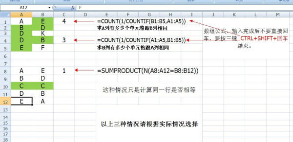
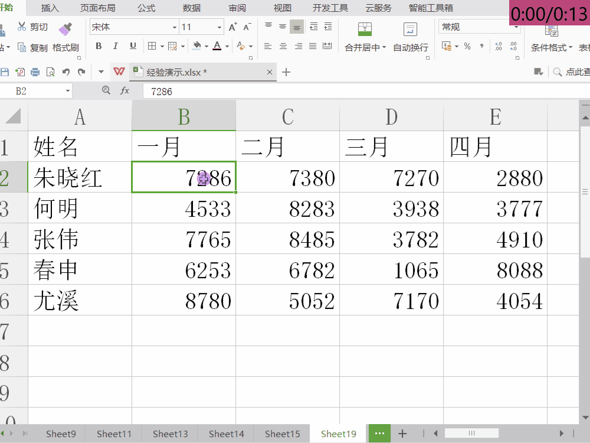
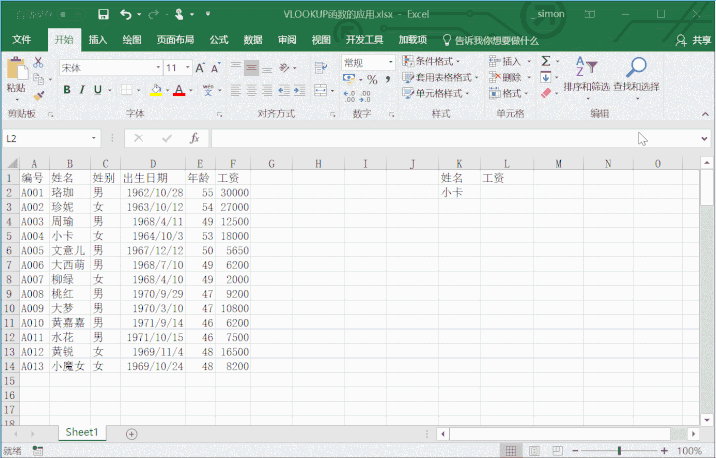

## [计算两列中相同内容单元格的个数](https://zhidao.baidu.com/question/554732002.html)

求A列有多少个单元格跟B列相同 =COUNT(1/COUNTIF(B1:B5,A1:A5))

求B列有多少个单元格跟A列相同 =COUNT(1/COUNTIF(A1:A5,B1:B5))

只计算同一行是否相等 =SUMPRODUCT(N(A8:A12=B8:B12))

以上是数组公式，输入完成后不要直接回车，要按三键  CTRL+SHIFT+回车  结束。

## [高亮显示每行或每列的最小值或最大值](https://www.taodabai.com/how/504546652.html)

公式举例：=B2=MAX($B2:$AH2)

## [vlookup](https://support.microsoft.com/zh-cn/office/vlookup-%E5%87%BD%E6%95%B0-0bbc8083-26fe-4963-8ab8-93a18ad188a1)

