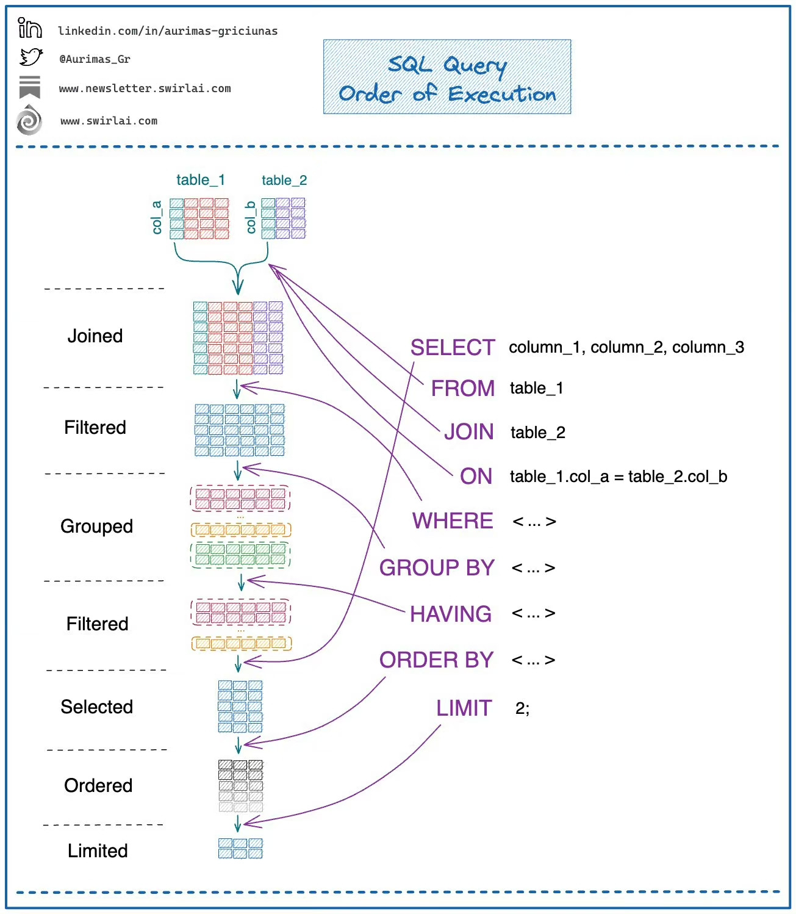
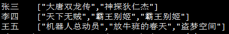
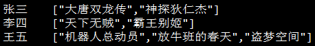

<a name="0cac17409cead79098b45050b82297d2_h2_0"></a>
## JOIN


<a name="5eb859c2bd392ece15aa15bfca6e2b31_h2_1"></a>
## 建表

```latex
CREATE TABLE IF NOT EXISTS tableName(columnName string comment '列注释') PARTITIONED BY (dt string);
INSERT OVERWRITE TABLE tableName PARTITION(dt=20200214)
SELECT
```

```latex
CREATE TABLE tableName(
    columnName1 string comment '列1注释',
    columnName2 string comment '列2注释')
ROW FORMAT DELIMITED
FIELDS TERMINATED BY ','
LINES TERMINATED BY '\n'

LOAD DATA LOCAL INPATH 'data.csv' OVERWRITE INTO TABLE tableName
```

<a name="ffbbd932822018c8c0a8d98df43da50f_h2_2"></a>
## [查看表占用空间大小](https://blog.csdn.net/dzjun/article/details/84749738)

要查看一个hive表文件总大小时，我们可以通过一行脚本快速实现，其命令如下：

```latex
hadoop fs -ls  /user/hive/warehouse/test_table/ds=20151111|awk -F ' ' '{print $5}'|awk '{a+=$1}END{print a}'
```

这样可以省去自己相加，下面命令是列出该表的详细文件列表

```latex
hadoop fs -ls  /user/hive/warehouse/test_table/ds=20151111
```

方法二：查看该表总容量大小，单位为Ｇ

```latex
hadoop fs -du /user/hive/warehouse/test_table|awk ' { SUM += $1 } END { print SUM/(1024*1024*1024) }'
```

<a name="9106e0f436af3271b48342ab123dcd59_h2_3"></a>
## collect_list/collect_set

<a name="fe37f2636149f694bdb9ba904ffb8f9d_h3_0"></a>
### collect_list：不去重直接成list(李四看了两次霸王别姬)

```bash
SELECT
      username
    , collect_list(video_name)
FROM
    t_visit_video
GROUP BY
		username
```



<a name="bfaeb5d6e331ee995827c73f6bc95ff9_h3_1"></a>
### collect_set：进行去重(李四看过霸王别姬)

```bash
SELECT
      username
    , collect_set(video_name)
FROM
    t_visit_video
GROUP BY
		username
```



<a name="304d00d7de1cc45c72211f7787b59b4e_h2_4"></a>
## concat/concat_ws
| 命令 | 说明 | 举例 | 常用 |
| --- | --- | --- | --- |
| CONCAT(s1,s2...sn) | 字符串 s1,s2 等多个字符串合并为一个字符串 | SELECT CONCAT("SQL ", "Runoob ", "Gooogle ", "Facebook") AS ConcatenatedString | SELECT CONCAT(collect_set(video_name)) AS ConcatenatedString |
| CONCAT_WS(x, s1,s2...sn) | 同 CONCAT(s1,s2,...) 函数，但是每个字符串之间要加上 x，x 可以是分隔符 | SELECT CONCAT_WS("-", "SQL", "Tutorial", "is", "fun!")AS ConcatenatedString; | SELECT CONCAT_WS(",",collect_set(video_name)) AS ConcatenatedString |


<a name="f7d5475b97a9c33e4e65d739898399b0_h2_5"></a>
## split

split(str, regex) - Splits str around occurances that match regex

split('a,b,c,d',',') 得到的结果：["a","b","c","d"]

split('a,b,c,d',',')[0] 得到的结果：a

<a name="a3168055c19ee6e8296a7cf921645233_h2_6"></a>
## 数组转行

```latex
SELECT ID,itemsName,name,loc
FROM Table
LATERAL VIEW explode(items) itemTable AS itemsName;
```

```latex
ID   |    items                                  | name  |  loc  
_________________________________________________________________

id1  | ["item1","item2","item3","item4","item5"] | Mike | CT
id2  | ["item3","item7","item4","item9","item8"] | Chris| MN
```

```latex
ID   |    items                       | name  |  loc  
______________________________________________________
id1  | item1                          | Mike  | CT
id1  | item2                          | Mike  | CT
id1  | item3                          | Mike  | CT
id1  | item4                          | Mike  | CT
id1  | item5                          | Mike  | CT
id2  | item3                          | Chris | MN
id2  | item7                          | Chris | MN
id2  | item4                          | Chris | MN
id2  | item9                          | Chris | MN
id2  | item8                          | Chris | MN
```

<a name="b23feee4fd7468034a72d000299356d2"></a>
## 取top percent数据
```sql
SELECT
		  id
    , price
FROM
		(SELECT
    			 id
     		 , price
     		 , row_number() over(order by price desc) r1
         , count(*) over()*(20/100) ct
     FROM
     			table_name) final
WHERE
		r1<=ct
```
<a name="e7fa8b4a5b7461d92b1f68eea25a330f"></a>
## 列名为数字
使用“`”符号，比如
```sql
SELECT `101`,`102` FROM table_name
```
<a name="3ab785e130dec693d2018bf947f54fdf"></a>
## 多列合为数组
调用arry函数
```sql
SELECT array(column1, column2) FROM table_name
```
<a name="GN39J"></a>
## 日期运算
**注意日期是yyyy-mm-dd格式，其他格式如yyyymmdd进行运算时需转化成这个格式才能进行运算！**<br />**还有一定要注意月份 mm 还是 MM 表示！**
```sql
SELECT datediff('2015-04-09','2015-04-01')
--日期差，结果为8

SELECT date_sub('2015-04-09',4)
--2015-04-05

SELECT date_add('2015-04-09',4)
--2015-04-13

SELECT from_unixtime(unix_timestamp('20171205','yyyymmdd'),'yyyy-mm-dd')
--20171205转成2017-12-05

SELECT from_unixtime(unix_timestamp('2017-12-05','yyyy-mm-dd'),'yyyymmdd')
--2017-12-05转成20171205

SELECT from_unixtime(unix_timestamp(date_sub(from_unixtime(unix_timestamp('202104025','yyyymmdd'),'yyyy-mm-dd'),1),'yyyy-mm-dd'),'yyyyMMdd')
--注意，当运算后切换格式，mm和MM要注意
```
<a name="P46FI"></a>
## 数据采样
使用rand()函数进行随机抽样，limit关键字限制抽样返回的数据，其中rand函数前的distribute和sort关键字可以保证数据在mapper和reducer阶段是随机分布的
```sql
SELECT
    	*
FROM
		  table_name
WHERE
			col=xxx
distribute by rand() sort by rand()
LIMIT num;
```

<a name="31081abc1ffb626a13df26f2bc58b754_h2_7"></a>
## 各种问题

<a name="5750c12172e116bcc1a351c51377a27b_h3_2"></a>
### 内存溢出

```latex
SET yarn.app.mapreduce.am.resource.mb=4096;
SET yarn.app.mapreduce.am.command-opts=-Xmx4000m;
```

<a name="ebd3b8df06f27a769b208e355f5e82d9_h3_3"></a>
### 动态分区

```latex
SET hive.exec.dynamic.partition=true;
SET hive.exec.dynamic.partition.mode=nonstrict;
```

<a name="583b03c729da9d7542bd309bce168199_h3_4"></a>
### 数据压缩

```latex
SET hive.exec.compress.intermediate=true;
SET mapreduce.map.output.compress=true;
SET mapred.map.output.compression.codec=org.apache.hadoop.io.compress.SnappyCodec;
SET mapred.map.output.compression.codec=com.hadoop.compression.lzo.LzoCodec;
SET hive.exec.compress.output=true;
SET mapred.output.compression.codec=org.apache.hadoop.io.compress.SnappyCodec;
```

<a name="cc3195fc1200d24907d65f6bf66281f2_h3_5"></a>
### 晚起reduce

```latex
SET mapreduce.job.reduce.slowstart.completedmaps=0.9;
```

<a name="0f661576f75cce505e5c032a8c2dfbac_h3_6"></a>
### 增加reduce

```latex
SET mapred.reduce.tasks=1000;
```

<a name="f86ea9a3888416d14fcb137abcd0868b_h3_7"></a>
### 不限制数据分块数

```latex
SET mapreduce.jobtracker.split.metainfo.maxsize=-1;
```

<a name="KGNBE"></a>
### 数据倾斜
一般小表join一个特别大的表时，可能会出现数据倾斜，可以选择将小表广播解决问题
```latex
SELECT /*+ BROADCAST(x) */
	x.a
  y.b
 FROM
 	() x
 INNER JOIN
  () y
 ON x.c=y.c
```

<a name="2a1b9d6a4c6a63d7acac9c1eaccb1ad8_h2_8"></a>
## Source

[https://www.cnblogs.com/cc11001100/p/9043946.html](https://www.cnblogs.com/cc11001100/p/9043946.html)<br />[https://www.runoob.com/mysql/mysql-functions.html](https://www.runoob.com/mysql/mysql-functions.html)
