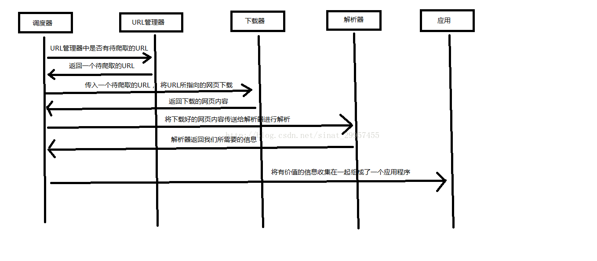

# python爬虫
Python 爬虫架构主要由五个部分组成，分别是调度器、URL管理器、网页下载器、网页解析器、应用程序（爬取的有价值数据）：

- 调度器：相当于一台电脑的CPU，主要负责调度URL管理器、下载器、解析器之间的协调工作。
- URL管理器：包括待爬取的URL地址和已爬取的URL地址，防止重复抓取URL和循环抓取URL，实现URL管理器主要用三种方式，通过内存、数据库、缓存数据库来实现。
- 网页下载器：通过传入一个URL地址来下载网页，将网页转换成一个字符串，网页下载器有urllib2（Python官方基础模块）包括需要登录、代理、和cookie，requests(第三方包)
- 网页解析器：将一个网页字符串进行解析，可以按照我们的要求来提取出我们有用的信息，也可以根据DOM树的解析方式来解析。网页解析器有正则表达式（直观，将网页转成字符串通过模糊匹配的方式来提取有价值的信息，当文档比较复杂的时候，该方法提取数据的时候就会非常的困难）、html.parser（Python自带的）、beautifulsoup（第三方插件，可以使用Python自带的html.parser进行解析，也可以使用lxml进行解析，相对于其他几种来说要强大一些）、lxml（第三方插件，可以解析 xml 和 HTML），html.parser 和 beautifulsoup 以及 lxml 都是以 DOM 树的方式进行解析的。
- 应用程序：就是从网页中提取的有用数据组成的一个应用。

# 网页结构
通过浏览器的开发者工具，查看要爬取网页的网页结构，下图是chrome浏览器，[runoob主页](https://www.runoob.com/)的例子。如下右图所示，通过网页下载器下载下来的就是开发者工具中的Elements里的内容，所以可以现在浏览器中通过开发者工具获取想要信息的层级结构，如图中我想获取左侧导航栏里的信息，就可以看到其层级为：div(id：main-left-cloumn)，再用beautifulsoup解析的时候直接获取对应层级内的信息即可。 

# beautifulsoup
Beautiful Soup 是一个可以从HTML或XML文件中提取数据的Python库。它能够通过你喜欢的转换器实现惯用的文档导航，查找，修改文档的方式。就像上文python爬虫阐述的那样，beautifulsoup是一个网页解析器，我们先通过网页下载器，如[requests](https://www.yuque.com/angsweet/machine-learning/xsn63b6ga1xyaebv)下载网页，然后通过beautifulsoup进行解析，获得相应的数据。

还是以上图，我们获取[runoob主页](https://www.runoob.com/)的数据的例子，先用requests.get下载网页数据，用beautifulsoup进行解析，通过上面网页结构分析我们得知我们要获取的左导航栏是一个id为main-left-cloumn的div，通过beautifulsoup的find函数，即可获取信息，如下图。 

# Source
[Python 爬虫介绍 | 菜鸟教程](https://www.runoob.com/w3cnote/python-spider-intro.html) [Beautiful Soup 4.4.0 文档 — Beautiful Soup 4.2.0 中文 文档](https://beautifulsoup.readthedocs.io/zh_CN/v4.4.0/)
