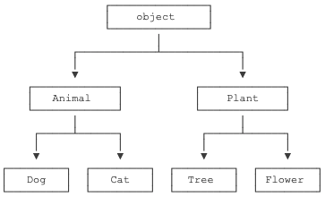

<a name="UzJbK"></a>
# 类和实例
面向对象最重要的概念就是类（Class）和实例（Instance），必须牢记类是抽象的模板，比如Student类，而实例是根据类创建出来的一个个具体的“对象”，每个对象都拥有相同的方法，但各自的数据可能不同。

仍以Student类为例，在Python中，定义类是通过class关键字：
```python
class Student(object):
    pass

>>> bart = Student()
>>> bart
<__main__.Student object at 0x10a67a590>
>>> Student
<class '__main__.Student'>

# 可以自由地给一个实例变量绑定属性，比如，给实例bart绑定一个name属性
>>> bart.name = 'Bart Simpson'
>>> bart.name
'Bart Simpson'
```
由于类可以起到模板的作用，因此，可以在创建实例的时候，把一些我们认为必须绑定的属性强制填写进去。通过定义一个特殊的__init__方法，在创建实例的时候，就把name，score等属性绑上去。注意到__init__方法的第一个参数永远是self，表示创建的实例本身，因此，在__init__方法内部，就可以把各种属性绑定到self，因为self就指向创建的实例本身。
```python
class Student(object):

    def __init__(self, name, score):
        self.name = name
        self.score = score

>>> bart = Student('Bart Simpson', 59)
>>> bart.name
'Bart Simpson'
>>> bart.score
59
```
有了__init__方法，在创建实例的时候，就不能传入空的参数了，必须传入与__init__方法匹配的参数，但self不需要传，Python解释器自己会把实例变量传进去。和普通的函数相比，在类中定义的函数只有一点不同，就是第一个参数永远是实例变量self，并且，调用时，不用传递该参数。除此之外，类的方法和普通函数没有什么区别，所以，你仍然可以用默认参数、可变参数、关键字参数和命名关键字参数。
<a name="FpzvA"></a>
## 数据封装
面向对象编程的一个重要特点就是数据封装。在上面的Student类中，每个实例就拥有各自的name和score这些数据。我们可以通过函数来访问这些数据，比如打印一个学生的成绩：
```python
>>> def print_score(std):
...     print('%s: %s' % (std.name, std.score))
...
>>> print_score(bart)
Bart Simpson: 59
```
但是，既然Student实例本身就拥有这些数据，要访问这些数据，就没有必要从外面的函数去访问，可以直接在Student类的内部定义访问数据的函数，这样，就把“数据”给封装起来了。这些封装数据的函数是和Student类本身是关联起来的，我们称之为类的方法：
```python
class Student(object):

    def __init__(self, name, score):
        self.name = name
        self.score = score

    def print_score(self):
        print('%s: %s' % (self.name, self.score))

>>> bart.print_score()
Bart Simpson: 59
```
这样一来，我们从外部看Student类，就只需要知道，创建实例需要给出name和score，而如何打印，都是在Student类的内部定义的，这些数据和逻辑被“封装”起来了，调用很容易，但却不用知道内部实现的细节。
<a name="bxIL6"></a>
# 访问限制
如果要让内部属性不被外部访问，可以把属性的名称前加上两个下划线__，在Python中，实例的变量名如果以__开头，就变成了一个私有变量（private），只有内部可以访问，外部不能访问，所以，我们把Student类改一改：
```python
class Student(object):

    def __init__(self, name, score):
        self.__name = name
        self.__score = score

    def print_score(self):
        print('%s: %s' % (self.__name, self.__score))
```
改完后，对于外部代码来说，没什么变动，但是已经无法从外部访问实例变量.__name和实例变量.__score了。这样就确保了外部代码不能随意修改对象内部的状态，这样通过访问限制的保护，代码更加健壮。但是如果外部代码要获取name和score怎么办？可以给Student类增加get_name和get_score这样的方法。

需要注意的是，在Python中，变量名类似__xxx__的，也就是以双下划线开头，并且以双下划线结尾的，是特殊变量，特殊变量是可以直接访问的，不是private变量，所以，不能用__name__、__score__这样的变量名。

有些时候，你会看到以一个下划线开头的实例变量名，比如_name，这样的实例变量外部是可以访问的，但是，按照约定俗成的规定，当你看到这样的变量时，意思就是，“虽然我可以被访问，但是，请把我视为私有变量，不要随意访问”。

双下划线开头的实例变量是不是一定不能从外部访问呢？其实也不是。不能直接访问__name是因为Python解释器对外把__name变量改成了_Student__name，所以，仍然可以通过_Student__name来访问__name变量。但是强烈建议你不要这么干，因为不同版本的Python解释器可能会把__name改成不同的变量名。
```python
>>> bart = Student('Bart Simpson', 59)
>>> bart.get_name()
'Bart Simpson'

>>> bart.__name = 'New Name' # 设置__name变量！
>>> bart.__name
'New Name'

>>> bart.get_name() # get_name()内部返回self.__name
'Bart Simpson'
```
表面上看，外部代码“成功”地设置了__name变量，但实际上这个__name变量和class内部的__name变量不是一个变量！内部的__name变量已经被Python解释器自动改成了_Student__name，而外部代码给bart新增了一个__name变量。
<a name="mJVCK"></a>
# 继承和多态
在OOP程序设计中，当我们定义一个class的时候，可以从某个现有的class继承，新的class称为子类（Subclass），而被继承的class称为基类、父类或超类（Base class、Super class）。

比如，我们已经编写了一个名为Animal的class，有一个run()方法可以直接打印。当我们需要编写Dog和Cat类时，就可以直接从Animal类继承。对于Dog来说，Animal就是它的父类，对于Animal来说，Dog就是它的子类。Cat和Dog类似。

继承有什么好处？最大的好处是子类获得了父类的全部功能。由于Animial实现了run()方法，因此，Dog和Cat作为它的子类，什么事也没干，就自动拥有了run()方法：
```python
class Animal(object):
    def run(self):
        print('Animal is running...')

class Dog(Animal):
    pass

class Cat(Animal):
    pass

dog = Dog()
dog.run()

cat = Cat()
cat.run()

# 结果输出
Animal is running...
Animal is running...
```
当子类和父类都存在相同的run()方法时，我们说，子类的run()覆盖了父类的run()，在代码运行的时候，总是会调用子类的run()。这样，我们就获得了继承的另一个好处：多态。
```python
class Dog(Animal):

    def run(self):
        print('Dog is running...')

class Cat(Animal):

    def run(self):
        print('Cat is running...')

# 再次运行，结果如下
Dog is running...
Cat is running...
```
继承还可以一级一级地继承下来，就好比从爷爷到爸爸、再到儿子这样的关系。而任何类，最终都可以追溯到根类object，这些继承关系看上去就像一颗倒着的树。比如如下的继承树：<br />
<a name="Za3gN"></a>
## 静态语言vs动态语言
对于静态语言（例如Java）来说，如果需要传入Animal类型，则传入的对象必须是Animal类型或者它的子类，否则，将无法调用run()方法。

对于Python这样的动态语言来说，则不一定需要传入Animal类型。我们只需要保证传入的对象有一个run()方法就可以了：
```python
class Timer(object):
    def run(self):
        print('Start...')
```
这就是动态语言的“鸭子类型”，它并不要求严格的继承体系，一个对象只要“看起来像鸭子，走起路来像鸭子”，那它就可以被看做是鸭子。

Python的“file-like object“就是一种鸭子类型。对真正的文件对象，它有一个read()方法，返回其内容。但是，许多对象，只要有read()方法，都被视为“file-like object“。许多函数接收的参数就是“file-like object“，你不一定要传入真正的文件对象，完全可以传入任何实现了read()方法的对象。
<a name="CqNxF"></a>
# 获取对象信息
<a name="ozEnq"></a>
## type()
```python
>>> type(123)
<class 'int'>
```
<a name="t0OtZ"></a>
## isinstance()
对于class的继承关系来说，使用type()就很不方便。我们要判断class的类型，可以使用isinstance()函数
```python
# object -> Animal -> Dog -> Husky
>>> a = Animal()
>>> d = Dog()
>>> h = Husky()

>>> isinstance(h, Husky)
True
>>> isinstance(h, Dog)
True
>>> isinstance(d, Husky)
False
```
<a name="tEiiB"></a>
## dir()
如果要获得一个对象的所有属性和方法，可以使用dir()函数，它返回一个包含字符串的list，比如，获得一个str对象的所有属性和方法：
```python
>>> dir('ABC')
['__add__', '__class__',..., '__subclasshook__', 'capitalize', 'casefold',..., 'zfill']
```
仅仅把属性和方法列出来是不够的，配合getattr()、setattr()以及hasattr()，我们可以直接操作一个对象的状态
```python
>>> class MyObject(object):
...     def __init__(self):
...         self.x = 9
...     def power(self):
...         return self.x * self.x
...
>>> obj = MyObject()

>>> hasattr(obj, 'x') # 有属性'x'吗？
True
>>> obj.x
9
>>> hasattr(obj, 'y') # 有属性'y'吗？
False
>>> setattr(obj, 'y', 19) # 设置一个属性'y'
>>> hasattr(obj, 'y') # 有属性'y'吗？
True
>>> getattr(obj, 'y') # 获取属性'y'
19
>>> obj.y # 获取属性'y'
19

>>> hasattr(obj, 'power') # 有属性'power'吗？
True
>>> getattr(obj, 'power') # 获取属性'power'
<bound method MyObject.power of <__main__.MyObject object at 0x10077a6a0>>
>>> fn = getattr(obj, 'power') # 获取属性'power'并赋值到变量fn
>>> fn # fn指向obj.power
<bound method MyObject.power of <__main__.MyObject object at 0x10077a6a0>>
>>> fn() # 调用fn()与调用obj.power()是一样的
81
```
<a name="CBA5y"></a>
# 实例属性和类属性
由于Python是动态语言，根据类创建的实例可以任意绑定属性。给实例绑定属性的方法是通过实例变量，或者通过self变量。但是，如果Student类本身需要绑定一个属性呢？可以直接在class中定义属性，这种属性是类属性，归Student类所有。

在编写程序的时候，千万不要对实例属性和类属性使用相同的名字，因为相同名称的实例属性将屏蔽掉类属性，但是当你删除实例属性后，再使用相同的名称，访问到的将是类属性。
```python
>>> class Student(object):
...     name = 'Student'
...
>>> s = Student() # 创建实例s
>>> print(s.name) # 打印name属性，因为实例并没有name属性，所以会继续查找class的name属性
Student
>>> print(Student.name) # 打印类的name属性
Student
>>> s.name = 'Michael' # 给实例绑定name属性
>>> print(s.name) # 由于实例属性优先级比类属性高，因此，它会屏蔽掉类的name属性
Michael
>>> print(Student.name) # 但是类属性并未消失，用Student.name仍然可以访问
Student
>>> del s.name # 如果删除实例的name属性
>>> print(s.name) # 再次调用s.name，由于实例的name属性没有找到，类的name属性就显示出来了
Student
```
<a name="g1E5m"></a>
# __slots__
如果我们想要限制实例的属性怎么办？比如，只允许对Student实例添加name和age属性。为了达到限制的目的，Python允许在定义class的时候，定义一个特殊的__slots__变量，来限制该class实例能添加的属性。
```python
class Student(object):
    __slots__ = ('name', 'age') # 用tuple定义允许绑定的属性名称

>>> s = Student() # 创建新的实例
>>> s.name = 'Michael' # 绑定属性'name'
>>> s.age = 25 # 绑定属性'age'
>>> s.score = 99 # 绑定属性'score'
Traceback (most recent call last):
  File "<stdin>", line 1, in <module>
AttributeError: 'Student' object has no attribute 'score'
```
由于'score'没有被放到__slots__中，所以不能绑定score属性，试图绑定score将得到AttributeError的错误。使用__slots__要注意，__slots__定义的属性仅对当前类实例起作用，对继承的子类是不起作用的，除非在子类中也定义__slots__，这样，子类实例允许定义的属性就是自身的__slots__加上父类的__slots__。
<a name="UQy9f"></a>
# [装饰器](https://zhuanlan.zhihu.com/p/435467555)
我们在编程过程中，常常会遇到这种需求：比如，我想开发一款计算器，我已经写好了一堆函数，用于执行各种计算，那么我们需要在执行各种计算函数前，首先对输入的数据进行检查，确保他们必须得是数值才允许执行函数，而不能是字符串；又如，我想编写一个用于计算三角形周长、面积、某个角角度的模块，已经写好几个函数用于计算，那么，在执行计算前，首先要确保输入的三条边长能够构成三角形，再进行计算才有意义；再比如，我想开发某款网络应用，写了一些函数用于实现用户的某些操作，那么，得要先检查确认该用户已经登录了，才允许执行这些操作。

这些需求，归纳起来，就是，在执行主函数之前，常常要先执行某个预函数，进行一些校验之类的操作。这类需求是非常常见的，也是保证程序完整性、健壮性的重要举措。所以，怎么做才比较简单呢？你会说，这很简单啊，在每个函数里面写上if语句不就得了。就拿那个计算器而言，如果我们要写加减乘除，我们可以这样：
```python
def plus(a,b):
    if type(a)==type(0) and type(b)==type(0): #假设该计算器只能计算整数，如果要计算小数再or type(0.0)
        return a+b
    else:
        print('Type must be number') #检测到数据类型不对，先输出报警，函数值返回None
        return None

def minus(a,b):
    if type(a)==type(0) and type(b)==type(0):
        return a-b
    else:
        print('Type must be number')
        return None

def multiply(a,b):
    if type(a)==type(0) and type(b)==type(0):
        return a*b
    else:
        print('Type must be number')
        return None

def divide(a,b):
    if type(a)==type(0) and type(b)==type(0):
        return a/b
    else:
        print('Type must be number')
        return None
```
这个嘛，直接暴力。但是呢，这里只有4个函数，假如你开发的计算器有几十几百个函数，每个函数都要套上if语句，这不得麻烦死了，不烦死也啰嗦死了。所以怎么弄简单一点呢？聪明的你肯定想到了，我们可以把那个判断if也单独定义一个函数，然后把计算用的函数套在里面，就像这样：
```python
def check(a,b,func): #定义检查函数，变量为待检测参数a,b和检测通过后执行的函数func
    if type(a)==type(0) and type(b)==type(0):
        return func(a,b)
    else:
        print('Type must be number')
        return None

def plus(a,b):
    return a+b

def minus(a,b):
    return a-b
...

#主程序
check(1,2,plus) #计算1+2
check(1,2,minus) #计算1-2
check(1,2,multiply) #计算1*2
check(1,2,divide) #计算1/2
```
这里面有一点一定要特别注意，主程序的check(1,2,plus) 是把plus函数本身作为变量传递给check，由check函数决定如何执行plus函数，此处不能写成check(1,2,plus(1,2))，plus不能带参数和括号，不是执行plus()后把结果传给check。

这么写程序简洁了不少，加减乘除函数只需要定义他们本身的运算就可以了，变量检测交给了check函数。这么写也是比较容易理解的。但是对于使用该程序的用户来说，就不是这么回事了，他们会觉得这么写非常难看。为什么呢？我是要拿程序做加减乘除计算的，但我不论计算什么，每次都是在主调用check这个函数！那有没有什么办法，可以既好看，又简洁呢？装饰器就是起到了这个神奇的作用。上面这个需求，用装饰器可以这么写：
```python
def check(func):
    ...

@check
def plus(a,b):
    return a+b

@check
def minus(a,b):
    return a-b

...

#主程序
plus(1,2) #计算1+2
minus(1,2) #计算1-2
...
```
先直观感受一下，通过@check，check函数就被“注入”到了plus函数中，使得plus函数拥有了参数检测的功能。这样，在主程序中，若要计算加法就可直接调用plus，便可先校验再计算。那么，这个装饰器check要怎么定义呢？我们来看一下
```python
def check(func): #定义装饰器check
    def newfunc(a,b): #定义函数模板，即如何处理func
        if type(a)==type(0) and type(b)==type(0):
            return func(a,b)
        else:
            print('Type must be number!')
            return None
    return newfunc #将处理后的func作为新函数newfunc输出

@check
def plus(a,b):
    return a+b

#主程序，计算1+2
plus(1,2)
```
我们可以看到，当装饰器@check作用于plus函数时，plus函数本身作为参数func传入装饰器中。在装饰器check的定义内部，定义了一个函数模板，描述了对输入的func如何处理。可以看到，newfunc对func（也就是输入的plus）套用了判断数据类型的if语句，最后，再将套好的newfunc输出，替代原来的func。这样，此时执行func就是在执行newfunc，执行plus就是在执行套上if语句的新函数。

所以，通过装饰器，添加上了判断语句的新函数替换了原来的plus函数，但仍通过plus这个函数名调用，所以看起来就是plus函数被“装饰”了。当然了，如果大家在网络上搜索，关于如何定义装饰器，看到的是一个更加规范的版本。看起来更难理解一些，但其实是一样的：
```python
def checkall(func):
    def wrapper(*args,**kwargs):
        if type(args[0])==type(0) and type(args[1])==type(0):
            return func(*args,**kwargs)
        else:
            print('Type must be number!')
            return None
    return wrapper
```
模板函数一般习惯用wrapper来表示，这个没啥，建议大家都这么写，规范一些。参数一般用不定长的*args,**kwargs来表示，这个可能有些人就困惑了。因为被装饰的函数可能有很多种，参数的个数一般也不确定。然后*args,**kwargs是什么东西？args，kwargs这两个形参英文字母是什么无所谓可以自己定，关键是前面的单星号*和双星号**。

假如我定义一个函数，不能确定参数有多少个，例如要对输入的一组数字做连加操作。那么就可以定义plus(*x)，当调用该函数时，若输入多个变量plus(1,2,3)，那么就会把输入的变量组合成一个元祖x=(1,2,3)输入。定义双星号plus(**x)的意思是，调用该函数时若写出形参变量plus(a=1,b=2,c=3)，那么输入变量就会组合成字典x={a:1,b:2,c:3}传入函数。

当然也可以反向操作，定义函数的时候参数个数是明确的plus(a,b,c)，那么调用该函数时，加上星号plus(*(1,2,3))，就是对输入元祖(1,2,3)执行炸开操作，转换为plus(1,2,3)输入。装饰器里这么写有什么用呢？我们仔细观察一下我们之前写的newfunc(a,b)，那就意味着，指明了新函数有两个参数a,b，假如被装饰的原函数有三个参数怎么办呢？不就没用了吗？

我们来看别人写的，定义时用了wrapper(*args,**kwargs)，即不管有多少个参数，打包输入wrapper。在wrapper当中，调用原函数时又func(*args,**kwargs)，即把输入的元祖解包再传入func。这么一打包一解包，虽然看起来啥都没干，但确适应了函数参数不确定的情况，使得该装饰器可以装饰多种参数数量不同的函数。

<a name="DHLri"></a>
# 多重继承
```python
# 父类1
class Animal(object):
    pass

class Mammal(Animal):
    pass

# 父类2
class Runnable(object):
    def run(self):
        print('Running...')

# 继承两个父类
class Dog(Mammal, Runnable):
    pass
```
<a name="ETLqO"></a>
# Source
[https://www.liaoxuefeng.com/wiki/1016959663602400/1017495723838528](https://www.liaoxuefeng.com/wiki/1016959663602400/1017495723838528)
