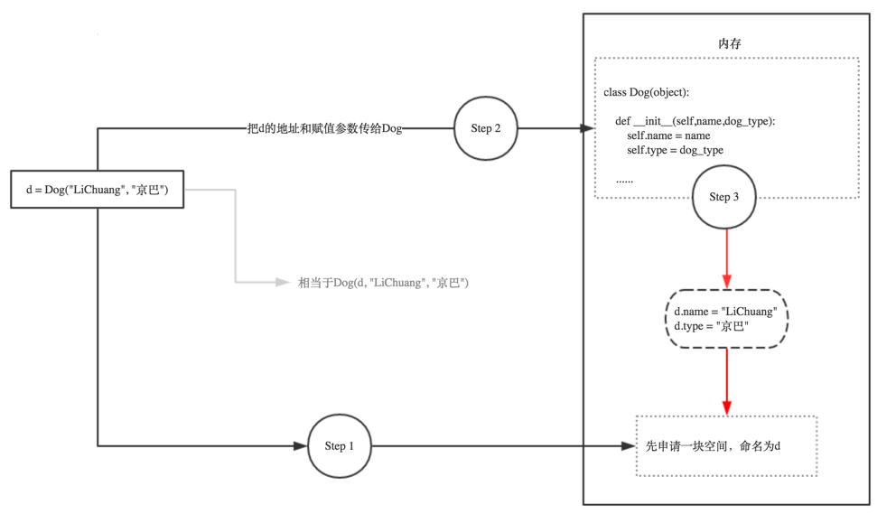

<a name="f6zoi"></a>
# if __name__ == '__main__' 
通俗的理解 **name == 'main'**：假如你叫小明.py，在朋友眼中，你是小明(**name == '小明'**)；在你自己眼中，你是你自己(**name == 'main'**)。

**if name == 'main' 的意思是：当.py文件被直接运行时，if name == 'main' 之下的代码块将被运行；当.py文件以模块形式被导入时，if name == 'main' 之下的代码块不被运行。**

对于很多编程语言来说，程序都必须要有一个入口，比如C，C++，以及完全面向对象的编程语言Java，C#等。如果你接触过这些语言，对于程序入口这个概念应该很好理解，C，C++都需要有一个main函数作为程序的入口，也就是程序的运行会从main函数开始。同样，Java，C#必须要有一个包含Main方法的主类，作为程序入口。而Python则不同，它属于脚本语言，不像编译型语言那样先将程序编译成二进制再运行，而是动态的逐行解释运行。也就是从脚本第一行开始运行，没有统一的入口。

一个Python源码文件（.py）除了可以被直接运行外，还可以作为模块（也就是库），被其他.py文件导入。不管是直接运行还是被导入，.py文件的最顶层代码都会被运行（Python用缩进来区分代码层次），而当一个.py文件作为模块被导入时，我们可能不希望一部分代码被运行。
```python
PI = 3.14
 
def main():
    print("PI:", PI)
 
main()
 
# 运行结果：PI: 3.14
```
现在，我们写一个用于计算圆面积的area.py文件，area.py文件需要用到const.py文件中的PI变量。从const.py中，我们把PI变量导入area.py：
```python
from const import PI
 
def calc_round_area(radius):
    return PI * (radius ** 2)
 
def main():
    print("round area: ", calc_round_area(2))
 
main()
 
'''
运行结果：
PI: 3.14
round area:  12.56
'''
```
我们看到const.py中的main函数也被运行了，实际上我们不希望它被运行，因为const.py提供的main函数只是为了测试常量定义。这时if **name** == '**main**' 派上了用场，我们把const.py改一下，添加if **name** == "**main**"：
```python
PI = 3.14
 
def main():
    print("PI:", PI)
 
if __name__ == "__main__":
    main()
```
运行const.py，输出如下
```python
PI: 3.14
```
运行area.py，输出如下：
```python
round area:  12.56
```
如上，我们可以看到if **name** == '**main**' 相当于Python模拟的程序入口，Python本身并没有这么规定，这只是一种编码习惯。由于模块之间相互引用，不同模块可能有这样的定义，而程序入口只有一个。到底哪个程序入口被选中，这取决于**name** 的值。
<a name="CZoX5"></a>
# __init__与self
self，英文单词意思很明显，表示自己，本身。python的self，是个对象（Object），是当前类的实例。

在类的代码（函数）中，需要访问当前的实例中的变量和函数的，即，访问Instance中的：

- 对应的变量（属性，property)：Instance.ProperyName，去读取之前的值和写入新的值
- 调用对应函数（function）：Instance.function()，即执行对应的动作

而需要访问实例的变量和调用实例的函数，当然需要对应的实例Instance对象本身。而Python中就规定好了，函数的第一个参数，就必须是实例对象本身，并且建议，约定俗成，把其名字写为self。如果没有用到self，即代码中，去掉self后，那种写法所使用到的变量，实际上不是你所希望的，不是真正的实例中的变量和函数，而是的访问到了其他部分的变量和函数了。甚至会由于没有合适的初始化实例变量，而导致后续无法访问的错误。

下面，就通过代码，来演示，如果去掉self，或者没有合理的使用self，会出现哪些错误。
```python
#!/usr/bin/env python
# -*- coding:utf-8 -*-
 
class Person(object):
    def __init__(self, name, lang, website):
        self.name = name
        self.lang = lang
        self.website = website
 
        print('self: ', self)
        print('type of self: ', type(self))
'''
未实例化时，运行程序，构造方法没有运行
'''
 
p = Person('Tim', 'English', 'www.universal.com')   
 
'''实例化后运行的结果
self:  <__main__.Person object at 0x00000000021EAF98>
type of self:  <class '__main__.Person'>
'''
```
可以看出self为实例变量p，是一个Person类型的对象。
```python
class Dog(object):       
    def __init__(self,name,dog_type):
        self.name = name
        self.type = dog_type
   
    def sayhi(self):
        print("hello,I am a dog, my name is ",self.name)
   
   
d = Dog('LiChuang',"京巴")            # 实例化
d.sayhi()
```
以下是d = Dog('LiChuang',"京巴")实例化的示意图：<br /><br />如下代码，完整的演示了，如果没有在类Class的最初的**init**函数中，正确的初始化实例变量，则会导致后续没有变量可用，因而出现AttributeError的错误：
```python
#!/usr/bin/env python
# -*- coding:utf-8 -*-
# Author: antcolonies
 
name = 'whole global name'
'''
注：此处全局的变量名，写成name，只是为了演示而用
实际上，好的编程风格，应该写成gName之类的名字，
以表示该变量是Global的变量
'''
 
class Person(object):
    def __init__(self, newPersonName):
        # self.name = newPersonName
        '''
        如果此处不写成self.name
        那么此处的name，只是__init__函数中的局部临时变量name而已
        和全局中的name，没有半毛钱关系
        '''
        name = newPersonName
        '''
        此处只是为了代码演示，而使用了局部变量name，
        不过需要注意的是，此处很明显，由于接下来的代码也没有利用到此处的局部变量name
        则就导致了，此处的name变量，实际上被浪费了，根本没有利用到
        '''
    def sayYourName(self):
        '''
        此处由于找不到实例中的name变量，所以会报错：
        AttributeError: Person instance has no attribute 'name'
        '''
        print('My name is %s' %self.name)
 
def selfAndInitDemo():
    personInstance = Person('Tim')
    personInstance.sayYourName()
 
if __name__ == '__main__':
    selfAndInitDemo()
 
 
'''  未使用self.name时抛异常
Traceback (most recent call last):
  File "E:/python14_workspace/s14/day06/test_1.py", line 18, in <module>
    selfAndInitDemo()
  File "E:/python14_workspace/s14/day06/test_1.py", line 15, in selfAndInitDemo
    personInstance.sayYourName()
  File "E:/python14_workspace/s14/day06/test_1.py", line 11, in sayYourName
    print('My name is %s' %self.name)
AttributeError: 'Person' object has no attribute 'name'
'''
```
从上述代码可见，由于在类的初始化（实例化）的init函数中，没有给self.name设置值，使得实例中，根本没有name这个变量，导致后续再去访问self.name，就会出现AttributeError的错误了。

对应的，如果写成self.name，则意思就正确了，就是初始化的时候，给实例中新增加，并且正常设置了正确的值newPersionName了，所以后续再去通过self.name，就可以访问到，当前实例中正确的变量name了。

相应的正确写法的代码如下：
```python
#!/usr/bin/env python
# -*- coding:utf-8 -*-
# Author: antcolonies
 
name = 'whole global name'
'''
注：此处全局的变量名，写成name，只是为了演示而用
实际上，好的编程风格，应该写成gName之类的名字，
以表示该变量是Global的变量
'''
 
class Person(object):
    def __init__(self, newPersonName):
        self.name = newPersonName
        '''
        此处正确的，通过访问self.name的形式，实现了：
            1.给实例中，增加了name变量
            2.并且给name赋了初值，为newPersionName
        '''
    def sayYourName(self):
        '''
        此处由于开始正确的初始化了self对象，使得其中有了name变量，
        所以此处可以正确访问了name值了
        '''
        print('My name is %s' %self.name)
 
def selfAndInitDemo():
    personInstance = Person('Tim')
    personInstance.sayYourName()
 
if __name__ == '__main__':
    selfAndInitDemo()
 
 
'''My name is Tim'''
```
在函数中，使用对应的变量，虽然代码是可以运行的，但是实际上使用的，不是实例中的变量。有时候，虽然你写的代码，可以运行，但是使用到的变量，由于没有加self，实际上是用到的不是实例的变量，而是其他的变量。此类问题，主要和Python中的变量的作用域有关，但是此处例子中，也和是否使用self有关：
```python
#!/usr/bin/env python
# -*- coding:utf-8 -*-
# Author: antcolonies
 
name = 'whole global name'
'''
注：此处全局的变量名，写成name，只是为了演示而用
实际上，好的编程风格，应该写成gName之类的名字，
以表示该变量是Global的变量
'''
 
class Person(object):
    name = 'class global name'
 
    def __init__(self, newPersonName):
        # self.name = newPersonName
        '''
        此处，没有使用self.name
        而使得此处的name，实际上仍是局部变量name
        虽然此处赋值了，但是后面没有被利用到，属于被浪费了的局部变量name
        '''
        name = newPersonName
    def sayYourName(self):
        '''
        此处，之所以没有像之前一样出现：
        AttributeError: Person instance has no attribute 'name'
        那是因为，虽然当前的实例self中，没有在__init__中初始化对应的name变量，实例self中没有对应的name变量
        但是由于实例所对应的类Person，有对应的name变量,所以也是可以正常执行代码的
        对应的，此处的self.name，实际上是Person.name
        '''
        print('My name is %s' %self.name)
        print('Name within class Person is actually the global name: %s' %name)
        print("Only access Person's name via Person.name = %s" %(Person.name))
 
def selfAndInitDemo():
    personInstance = Person('Tim')
    personInstance.sayYourName()
    print('whole global name is %s' %name)
 
if __name__ == '__main__':
    selfAndInitDemo()
 
 
'''
My name is class global name
Name within class Person is actually the global name: whole global name
Only access Person's name via Person.name = class global name
whole global name is whole global name
'''
```
其中，可见，此处开始_init_中，没有给self实例初始化对应的name，而后面的函数sayYourName中，虽然可以调用到self.name而没有出现AttributeError错误，但是实际上此处的值，不是所期望的，传入的name，即"Tim"，而是类中的name的值，即"class global name"。
<a name="nBYtb"></a>
# 切片
```python
>>> L = ['Michael', 'Sarah', 'Tracy', 'Bob', 'Jack']

>>> L[0:3]
['Michael', 'Sarah', 'Tracy']

>>> L[:3]
['Michael', 'Sarah', 'Tracy']

>>> 'ABCDEFG'[::2]
'ACEG'
```
<a name="t9nJY"></a>
# 列表生成式
```python
# 写列表生成式时，把要生成的元素x * x放到前面，后面跟for循环，就可以把list创建出来，十分有用
>>> [x * x for x in range(1, 11)]
[1, 4, 9, 16, 25, 36, 49, 64, 81, 100]

# for循环后面还可以加上if判断，这样我们就可以筛选出仅偶数的平方
>>> [x * x for x in range(1, 11) if x % 2 == 0]
[4, 16, 36, 64, 100]

# 在一个列表生成式中，for前面的if ... else是表达式，而for后面的if是过滤条件，不能带else
>>> [x if x % 2 == 0 else -x for x in range(1, 11)]
[-1, 2, -3, 4, -5, 6, -7, 8, -9, 10]
```
<a name="LPqyi"></a>
# 生成器
<a name="faBkW"></a>
## 简单生成器
通过列表生成式，我们可以直接创建一个列表。但是，受到内存限制，列表容量肯定是有限的。而且，创建一个包含100万个元素的列表，不仅占用很大的存储空间，如果我们仅仅需要访问前面几个元素，那后面绝大多数元素占用的空间都白白浪费了。简单生成器

要创建一个generator，有很多种方法。第一种方法很简单，只要把一个列表生成式的[]改成()，就创建了一个generator：
```python
>>> L = [x * x for x in range(10)]
>>> L
[0, 1, 4, 9, 16, 25, 36, 49, 64, 81]
>>> g = (x * x for x in range(10))
>>> g
<generator object <genexpr> at 0x104feab40>
```
创建L和g的区别仅在于最外层的[]和()，L是一个list，而g是一个generator。 我们可以直接打印出list的每一个元素，但我们怎么打印出generator的每一个元素呢？ 如果要一个一个打印出来，通过generator的next()方法：
```python
# python 2.x为next()，3.x为__next__()

>>> g.next()
0
>>> g.next()
1
>>> g.next()
4
>>> g.next()
9
>>> g.next()
16
>>> g.next()
25
>>> g.next()
36
>>> g.next()
49
>>> g.next()
64
>>> g.next()
81
>>> g.next()
Traceback (most recent call last):
  File "<stdin>", line 1, in <module>
StopIteration
```
我们讲过，generator保存的是算法，每次调用next(g)，就计算出g的下一个元素的值，直到计算到最后一个元素，没有更多的元素时，抛出StopIteration的错误。

当然，上面这种不断调用next(g)实在是太变态了，正确的方法是使用for循环，因为generator也是可迭代对象：
```python
>>> g = (x * x for x in range(10))
>>> for n in g:
...     print(n)
... 
0
1
4
9
16
25
36
49
64
81
```
<a name="EvN9Y"></a>
## 带yeild的生成器
我们先来看一个函数：
```python
def fib(max):
    n, a, b = 0, 0, 1
    while n < max:
        print (b)
        a, b = b, a + b
        n = n + 1
```
调用结果：
```python
fib(6)
1
1
2
3
5
8
```
仔细观察，可以看出，fib函数实际上是定义了斐波拉契数列的推算规则，可以从第一个元素开始，推算出后续任意的元素，这种逻辑其实非常类似generator。 就是说，上面的函数和generator仅一步之遥。要把fib函数变成generator，只需要把print b改为yield b就可以了：
```python
def fib(max):
    n, a, b = 0, 0, 1
    while n < max:
        yield b
        a, b = b, a + b
        n = n + 1
```
这就是定义generator的另一种方法。如果一个函数定义中包含yield关键字，那么这个函数就不再是一个普通函数，而是一个generator：
```python
>>> fib(6)
<generator object fib at 0x104feaaa0>
```
这里，最难理解的就是generator和函数的执行流程不一样。函数是顺序执行，遇到return语句或者最后一行函数语句就返回。而变成generator的函数，在每次调用next()的时候执行，遇到yield语句返回，再次执行时从上次返回的yield语句处继续执行。 举个简单的例子，定义一个generator，依次返回数字1，3，5：
```python
>>> def odd():
...     print ('step 1')
...     yield 1
...     print ('step 2')
...     yield 3
...     print ('step 3')
...     yield 5
...
>>> o = odd()
>>> o.next()
step 1
1
>>> o.next()
step 2
3
>>> o.next()
step 3
5
>>> o.next()
Traceback (most recent call last):
  File "<stdin>", line 1, in <module>
StopIteration
```
可以看到，odd不是普通函数，而是generator，在执行过程中，遇到yield就中断，下次又继续执行。执行3次yield后，已经没有yield可以执行了，所以，第4次调用next()就报错。 回到fib的例子，我们在循环过程中不断调用yield，就会不断中断。当然要给循环设置一个条件来退出循环，不然就会产生一个无限数列出来。 同样的，把函数改成generator后，我们基本上从来不会用next()来调用它，而是直接使用for循环来迭代：
```python
>>> for n in fib(6):
...     print (n)
...
1
1
2
3
5
8
```
<a name="Evijx"></a>
## 加强的生成器
生成器中有一些加强特性,所以除了 next()来获得下个生成的值,用户可以将值回送给生成器send(),在生成器中抛出异常,以及要求生成器退出close()
```python
def gen(x):
    count = x
    while True:
        val = (yield count) 
        if val is not None:
            count = val
        else:
            count += 1
 
f = gen(5)
print (f.next())
print (f.next())
print (f.next())
print ('====================')
print (f.send(9))#发送数字9给生成器
print (f.next())
print (f.next())
```
输出：
```python
5
6
7
====================
9
10
11
```
<a name="E8qAR"></a>
# Source
[https://www.liaoxuefeng.com/wiki/1016959663602400/1017269965565856](https://www.liaoxuefeng.com/wiki/1016959663602400/1017269965565856)<br />[https://www.liaoxuefeng.com/wiki/1016959663602400/1017317609699776](https://www.liaoxuefeng.com/wiki/1016959663602400/1017317609699776)<br />[https://www.liaoxuefeng.com/wiki/1016959663602400/1017318207388128](https://www.liaoxuefeng.com/wiki/1016959663602400/1017318207388128)
