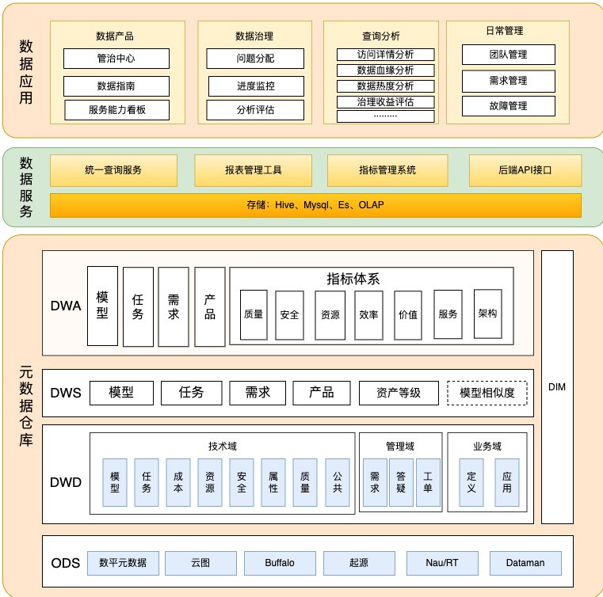

# 数仓层级
数据分层是数据仓库设计中一个十分重要的环节，良好的分层设计能够让整个数据体系更容易被理解和使用 以阿里巴巴的数仓层级为例(见下图)，数仓层级通常自上而下分为3层 

# Source
[数仓分层 - 云原生大数据计算服务 MaxCompute - 阿里云](https://help.aliyun.com/document_detail/114447.html) [业务数据治理体系化思考与实践](https://tech.meituan.com/2022/05/12/business-data-governance.html)
