## **四大任务**

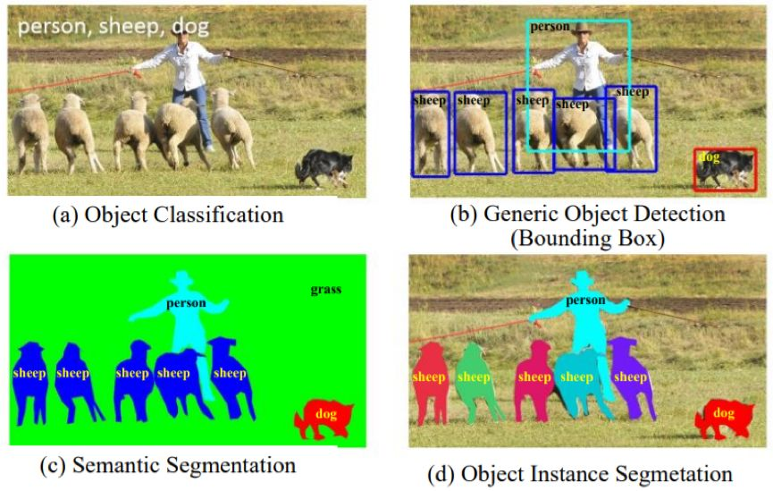 （a）图像层面的目标分类（b）边界框层面的一般目标检测（c）像素层面的形义分割（d）实例层面的形义分割

## 主要难题

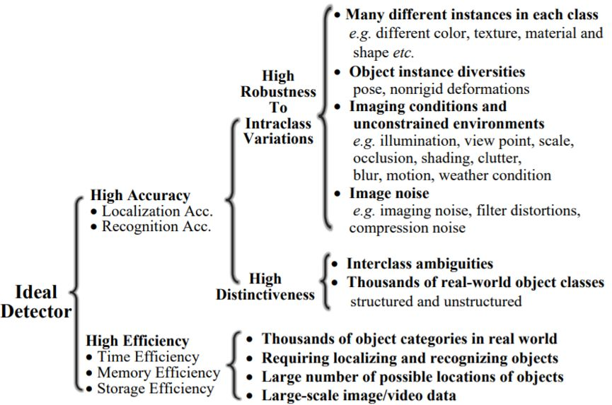

## 框架发展
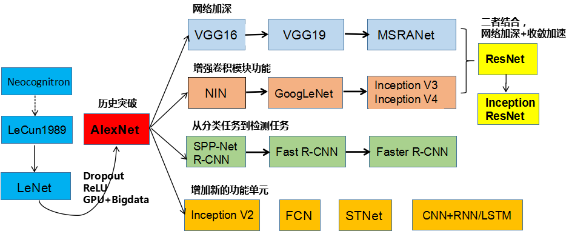

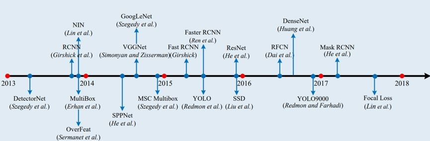

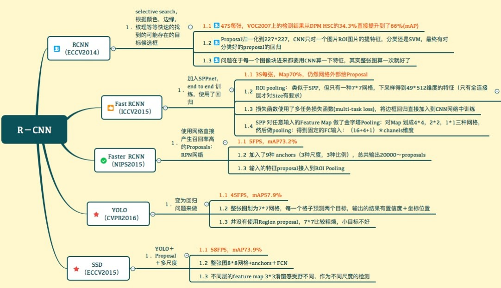

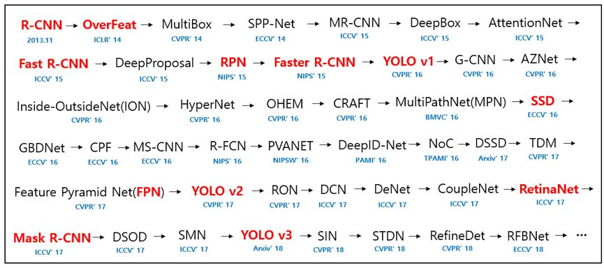

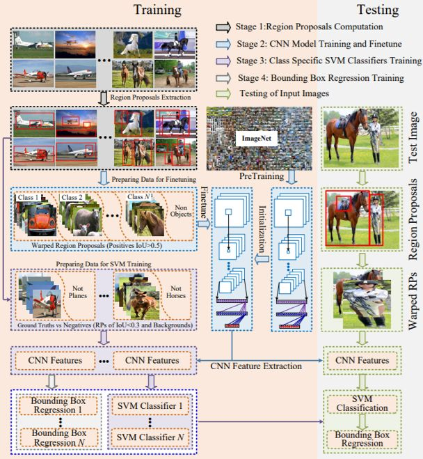

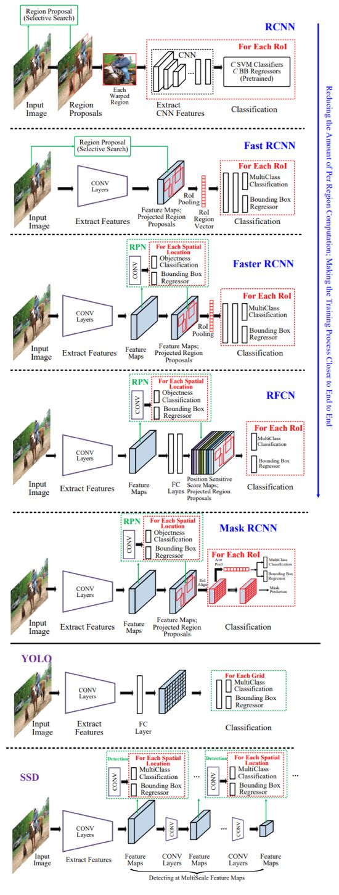

## **基础性子问题**

这一节将描述重要的子问题，包括特征表示、区域提议、形境信息挖掘和训练策略。每种方法都会通过其主要贡献进行回顾。

### **基于 DCNN 的目标表示**

作为任何检测器的主要组件之一，优良的特征表示在目标检测中至关重要。

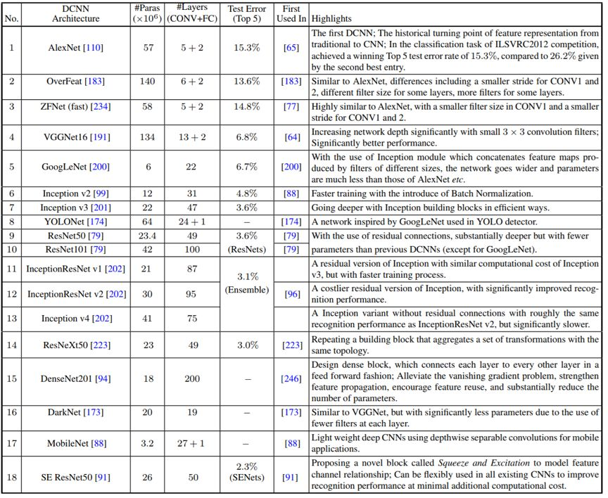、

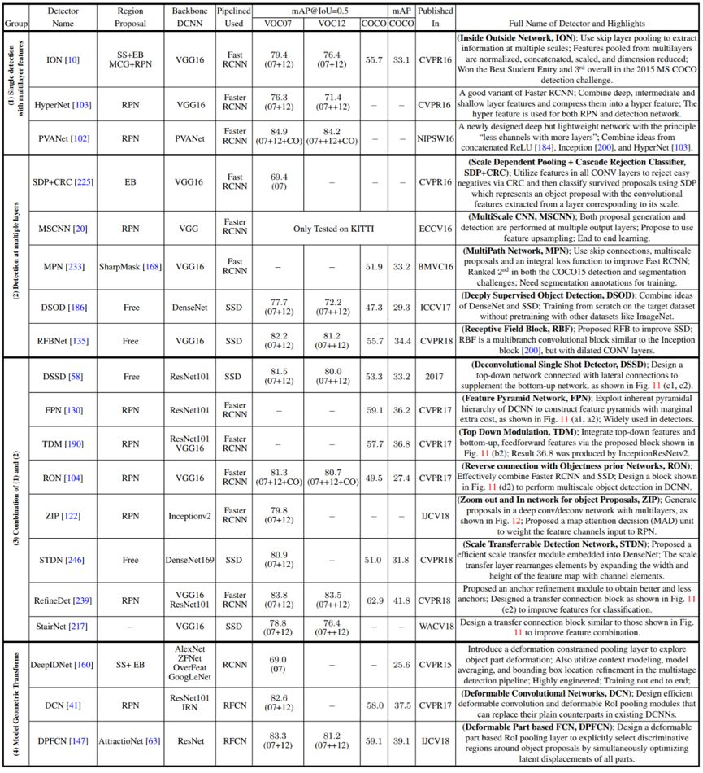

### **形境建模**

在物理世界中，视觉目标通常会出现在特定的环境中，并且通常与其它相关目标共同存在，而且有强大的心理学证据表明形境在人类目标识别中发挥着关键性的作用。人们也认识到对形境适当建模有助于目标检测和识别，尤其是当目标尺寸过小、存在遮挡或图像质量差等原因造成目标外观特征不充分时。已有研究者探讨了很多不同类型的形境。形境大致可分为这三大类：

1. 形义形境：目标出现在某些场景而非其它场景中的可能性；
2. 空间形境：在场景中目标与其它物体存在某些位置关系而非其它位置关系的可能性；
3. 尺寸形境：在场景中目标相对其它物体所存在的尺寸限制。

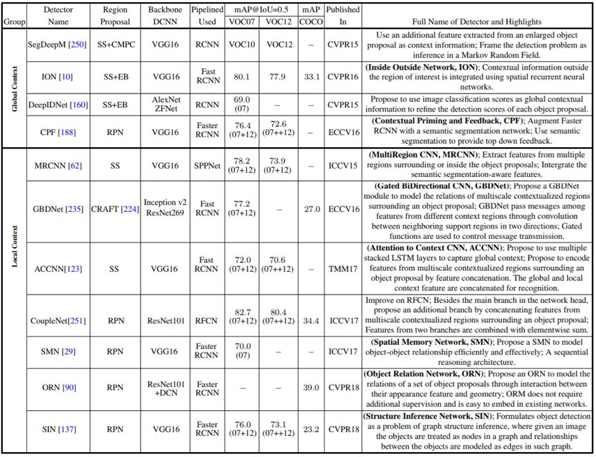

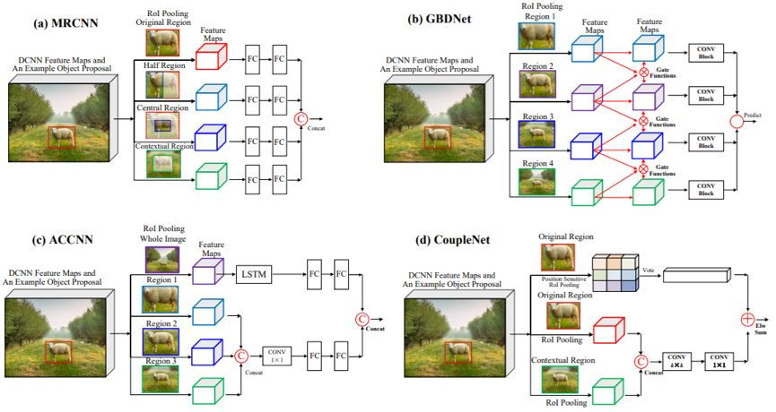

### **检测提议方法**

检测提议（detection proposal）通常被用作一个预处理步骤，以通过限制需要检测器评估的区域的数量来降低计算的复杂性。因此，一个优良的检测提议应当具备以下特点：

1. 高召回率，只使用少量提议就可以实现；
2. 提议尽可能准确地匹配目标；
3. 高效率。

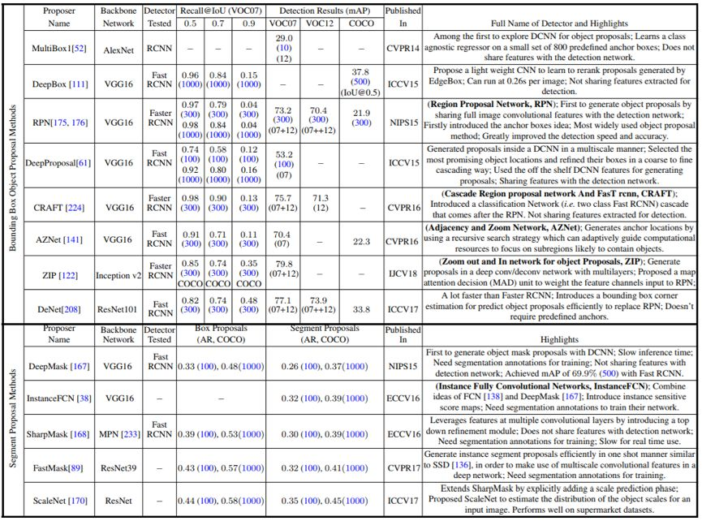 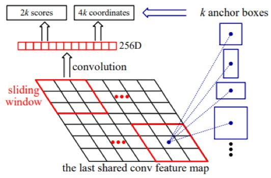

### **其它特殊问题**
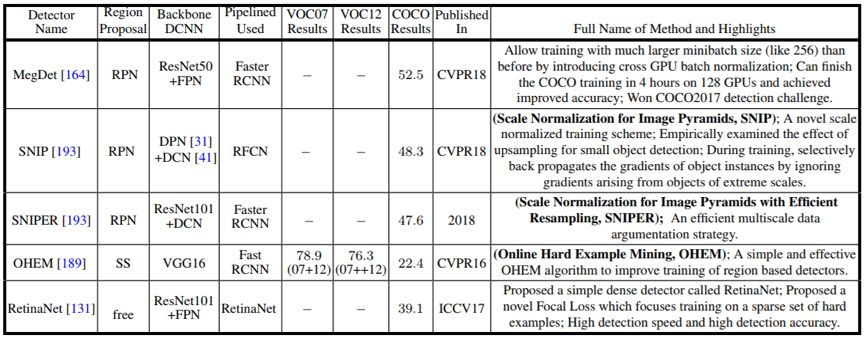

## **数据集和表现评估**

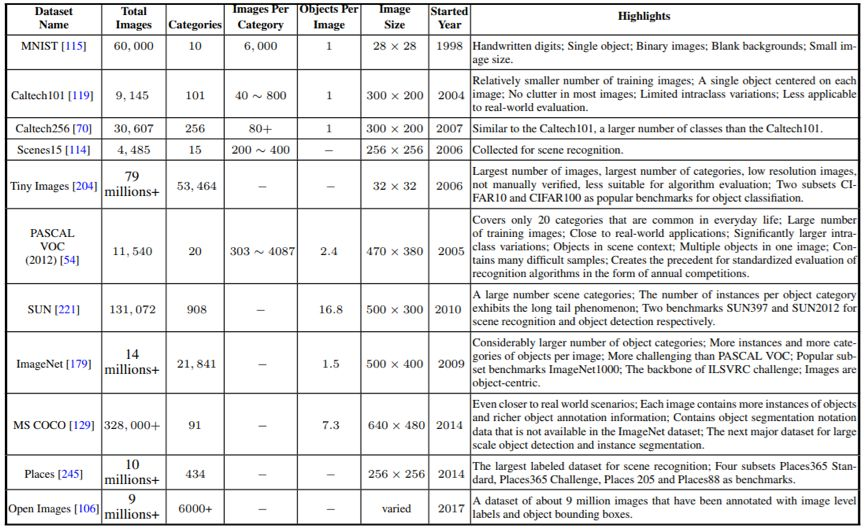

## Source

[https://www.jiqizhixin.com/articles/092301](https://www.jiqizhixin.com/articles/092301)
