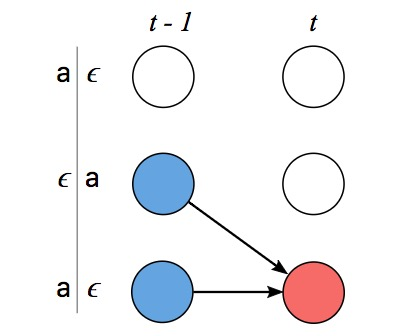

 谈及光学字符识别(OCR)和语音识别，如果这里有一个剪辑音频的数据集和对应的转录，而我们不知道怎么把转录中的字符和音频中的音素对齐，这会大大增加了训练语音识别器的难度。如果不对数据进行调整处理，那就意味着不能用一些简单方法进行训练。

对此，我们可以选择的第一个方法是制定一项规则，如“一个字符对应十个音素输入”，但人们的语速千差万别，这种做法很容易出现纰漏。为了保证模型的可靠性，第二种方法，即手动对齐每个字符在音频中的位置，训练的模型性能效果更佳，因为我们能知道每个输入时间步长的真实信息。但它的缺点也很明显——即便是大小合适的数据集，这样的做法依然非常耗时。

事实上，制定规则准确率不佳、手动调试用时过长不仅仅出现在语音识别领域，其他工作，如手写识别、在视频中添加动作标记，同样会面对这些问题。  这种场景下，正是**CTC（Connectionist Temporal Classification）**用武之地。CTC是一种让网络自动学会对齐的好方法，十分适合语音识别和书写识别。

为了描述地更形象一些，我们可以把输入序列（音频）映射为，其相应的输出序列（转录）即为。这之后，将字符与音素对齐的操作就相当于在和之间建立一个准确的映射。如果想直接用非监督学习算法，我们还有3个难点：

- X和Y的长度是可变化的；
- X和Y的长度比例也是可变化的；
- X和Y没有严格对齐。

而CTC算法刚好能解决这些问题，给定一个，它能基于所有可能是准确映射的给出输出分布。根据这个分布，我们可以推理最可能的输出，或计算分布内各字符的可能性概率。CTC在损失计算和推理上十分高效。

**损失函数：**为了给出准确的输出，经训练的模型必须在分布中最大化正确输出的概率，为此，我们需要计算概率（输入后输出为的概率），这个应该是可微的，所以才能使用梯度下降法。

**推理：**如果已经训练好了一个模型，我们就应该针对输入推理一个可能的，这就意味着要解决这个问题：

理想情况下，这个可以被快速找到。有了CTC，就意味着我们能在低投入情况下迅速找到一个近似的输出。

# CTC算法
CTC算法可以根据输入映射一些带有概率的，而计算概率的关键在于算法如何看待输入和输出之间的一致性。在讨论它是如何计算损失和进行推理前，我们先来看一下什么叫对齐。

## 对齐
CTC算法不要求输入和输出的严格对齐，但是为了计算概率大小，总结两者的一些对齐规律的必要的，这之中涉及一些损失计算。

我们可以实验一个简单的例子。假设输入长度为6，输出，那么对齐X和Y的一种有效方法是为每个输入长度分配一个输出字符并重复折叠：  这样做会出现两个问题：

- 通常情况下，强制要求输入与输出的严格对齐是没有意义的。例如在语音识别中，输入可以有一些静音，但模型不必给出相应的输出；
- 无法产生连续多个相同字符。如果输入是[h, h, e, l, l, l, o]，CTC会折叠重复的字符输出“helo”，而不是“hello”。

为了解决这些问题，CTC加入了一个空白符号——blank。在这个语音识别问题里，我们暂时把它设为，它不对应任何输入，最后会从输出中被删除。

由于CTC允许路径长度和输入长度等长，映射到的相邻可以合并整合，最后统一去除：  如果Y在同一行中的相邻位置有两个相同的字符，为了做到有效对齐，它们之间必须插入一个空白符号。有了这个规则，模型才能准确区分collapse到“hello”的路径和collapse到“helo”的路径。

让我们回到之前[c, a, t]的例子，以下是它的两个无效对齐示例： 

可以发现，CTC选择的路径有一些明显的性质。首先，整个对齐过程是单调（monotonic）的，如果我们前进到下一个输入，输出会保持现状或显示下一个输出；其次，到的对齐形式是多对一，一个或多个输入只能对齐到一个输出。第三，由第二个特征可得，输出Y的长度不得大于输入。

## 损失函数
CTC的对齐方式展示了一种利用时间步长概率推测输出概率的方法。  确切地说，如果CTC的目标是一对输入输出，那Y的路径的概率之和为：  用CTC训练的模型通常用递归神经网络（RNN）来预测每个时间步长概率：。由于RNN能考虑输入中的上下文，它的表现可圈可点，但我们也可以自由选用一些学习算法，让算法在给定固定输入片段的情况下产生输出分布。

当然，如果操作不当，CTC计算损失占用的资源会很惊人。一种简单的方法是逐一计算每种对齐路径的概率，之后再进行求和，但它的缺点是路径数量往往非常惊人，这样做对于大多数任务来说太慢了。

值得庆幸的是，我们能用动态规划算法快速计算loss，其关键思路是如果两种路径用相同步长映射到同一输出，那它们就能被合并。

 因为CTC允许在中的字符前任意加入，所以为了更直观地描述算法，我们可以把输出序列设为：

设为相同对齐路径合并后的CTC得分（概率），更准确地说，即是输入后子序列的得分。可以发现，如果要获得，我们可以从最后那个时间步长开始计算。只要能算出最后时间步长时的值，我们就能得到。有两种情形

### 情形1
 如上图所示，在这一情形下，我们不能跳过，中的前一个token. 第一个理由是，之前的token可能是中的元素，而我们不能跳过中的元素。由于中的每个元素后面跟着一个，当时我们可以推断出这一点。第二个理由是，中的重复元素间，必然有一个ϵ. 当时我们可以推断出这一点。

为了保证没有跳过，我们或者在前一时步，或者已经通过了之前的时步。我们转换之前的位置有两种可能： 

### 情形2
 在这一情形下，我们可以跳过中之前的token. 当为位于两个不同字符间的时，构成这一情形。因此，我们转换之前的位置有三种可能：  第个输入时之后3个有效子序列的CTC得分；第个输入时当前路径的概率。以下是一个用动态编程算法执行计算的示例，每个有效对齐对应图中的一条路径。  表示第个输入时的CTC得分

如上图所示，它有两个有效起始节点和两个最终节点，排除空白标记，总概率即两个最终节点之和。

现在我们可以有效地计算损失函数，下一步就是计算一个梯度并训练模型。CTC损失函数对于每个时间步长输出概率是可微的，因为它只是它们的总和和乘积。鉴于此，我们可以分析计算相对于（非标准化）输出概率的损失函数的梯度，并像往常那样从那里运行反向传播。

对于训练集D，模型参数先要调整以使负对数似然值最小化，而不是直接使似然值最大化： 

## 推理 

训练好模型后，我们就需要根据给定输入计算可能的输出，更准确地说，我们需要计算：

一种启发式方法是根据每个时间步长计算路径的可能性，它能计算最高概率：

之后，我们反复折叠并删除空白标记得到。

这种启发式方法对于大多数程序都运行良好，尤其是当概率集中于某条路径时。但是，由于没有考虑到单个输出可能有多个对齐的事实，它有时也会错过真正的高概率输出。

对此我可以举个例子。假设输出和的概率比低，但它们的概率之和高于后者。在这种情况下，启发式方法会给出这样的错误结论，因为它忽视了和可以折叠为一个输出，而真正的答案应该是。

对于这个问题，我们可以通过修改集束搜索来解决。基于有限的计算，集束搜索不一定能找到最优可能的，但它至少具有一个良好的性质，让我们可以在更多计算（更大的集束尺寸）和渐近更优解之间折衷。

常规的集束搜索算法会在每个输入中计算一组假设路径。这组假设基于原路径集合产生，通过扩展路径，算法会选择其中得分最高的几种路径作为当前路径。  如果要处理多个对齐映射到同一输出这种情况，我们可以修改原始集束搜索，即不保留束中的对齐列表，而是存储折叠重复字符并移除后的输出前缀。在搜索的每一步，我们都会基于映射到给定前缀的所有对齐为该前缀累计分数。  出现重复字符时，提议扩展可以映射到两个输出，如上图T3所示，其中红是前缀蓝的提议扩展，对该扩展而言，和都是有效输出。

当我们将扩展为时，我们只需统计之前以空白标记结尾的所有路径的概率（位于字符中间的也要统计）。同样的，如果是扩展到，那我们计算的就是不以ϵ尾的所有路径概率。

鉴于此，我们需要跟踪当前输出在搜索树中前两处输出。无论是以结尾还是不以结尾，如果我们在剪枝时为每一种假设做好得分排序，我们就能在计算中使用组合分数。

这个算法的实现并不需要太多代码，而且它十分巧妙，我用Python写了一个[示例](https://link.zhihu.com/?target=https%3A//gist.github.com/awni/56369a90d03953e370f3964c826ed4b0)。在一些语言识别问题中，也会有人在输出中加入语言模型来提高准确率，所以我们也可以把语言模型作为推理的一个考虑因素：   L(Y)以语言模型token为单位，计算Y的长度，起到单词插入奖励的作用。如果 L(Y)是一个基于单词的语言模型，那它计数的是Y中的单词数量；如果是一个基于字符的语言模型，那它计数的就是Y中的字符数。语言模型的一个突出特点是它只为单词/字符扩展前的形式计分，不会统计算法每一步扩展时的输出，这一点有利于短前缀词汇的搜索，因为它们在形式上更稳定。

集束搜索可以添加语言模型得分和单词插入项奖励，当提出扩展字符时，我们可以在给定前缀下为新字符添加语言模型评分。

# CTC的性质
到目前为止，我们提到了CTC的一些重要性质，在这个章节中，我们将更深入地了解这些性质及它们带来的影响。

## 有条件的独立
CTC最广为人知的一个缺点是它的条件独立假设。

 模型假设，对给定输入而言，每个输出与其他输出条件独立。在许多序列排序问题中，这一假设有问题。假如我们有一个音频，内容为“三个A（triple A）”，那么一个有效的转录可能是“AAA”，如果CTC预测转录的第一个字母是‘A’，那下一个字母是‘A’的概率应该远高于‘r’，但是条件独立性假设不允许CTC这样做。 

如果预测转录的第一个字母是‘A’，那下一个字母是‘A’的概率应该远高于‘r’；相反地，如果转录的第一个字母是‘t’，那第二个应该是‘r’。事实上，利用CTC建立的语音识别器既不能根据输出学习语言模型，也不能学习条件依赖语言模型，它只能通过包含独立语言模型来提高准确性。

当然，这种假设虽然会产生不小的麻烦，但也不是一无是处，它能使模型迅速适应相互对立的新场景。如果我们用和朋友的通话录音训练识别器生成语音答复信息，由于领域不同，同一模型可能会把语音内容归类为完全不同的两个领域，而CTC的模型可以弥补这一点，它能在领域转换时更换新的语言模型。

## 对齐属性
CTC算法不要求对齐，目标函数在所有路径上都是边缘化的，虽然它确实对输入X和输出Y之间的对齐规律做了一系列假设，并计算了相关概率，但模型并不知道它们之间的概率分布。在一些问题中，CTC最终会把大部分概率集中到具体某一条路径中。当然，也有例外。

如上文所述，CTC只允许单调对齐，这在语音识别问题中可能是一个有效的假设，但对于机器翻译等其他问题而言，目标语句中的future word可以与其在源语句中的形式相对应，这种单调对齐的假设是不准确的。

CTC的另一个重要特征是输入和输出的关系是多对一。在某些情况下，这种设定并不理想，因为有时我们会希望输入X和输出Y之间是严格的一对一关系，或者一个输入能对应到多个输出。例如，字符‘th’可以对齐到单个音素输入，但CTC不允许这种操作。

多对一的特性意味着输出的时间步长要比输入短，这对于语音识别和手写识别没有太大影响，因为输入会比输出长很多，但在一些Y比X长的问题里，CTC就不奏效了。

# CTC和其他算法
在这一节中，我会探讨CTC和其他序列建模算法之间的联系。

## HMM模型

乍一看，隐马尔可夫模型（Hidden Markov Model，HMM）似乎和CTC完全不同，但是，它们在本质上还是很相似的。了解它们之间的关系将有助于我们把握CTC在序列建模中的优势，同时掌握在各种情况下调整CTC的方法。 让我们继续沿用之间的符号，X是输入序列，Y是长度从T到U的输出序列，p(Y|X)是输入X后输出为Y的概率。为了计算p(Y|X)，我们可以用贝叶斯定理简化这个问题：

由于p(Y)可以是任何语言模型，让我们把关注点放在p(Y|X)。就像之前做的，我们同样设A为X与Y之间所有路径的集合，路径长度均为T，通过对齐我们可得到：

为了简化符号，我们先不考虑Y的条件限制，它将在所有p(·)中出现，这样我们就能利用两个假设列出一个标准的HMM：

第一个假设是平常的马尔可夫性质，  独立于扩展前状态  ；第二个假设则是当输入为  时，  有条件地独立于其他所有输出。

 现在我们只需要几个步骤就可以将HMM转换成CTC.。

首先，我们假设转录概率p(at∣at−1)是统一的，即： 

这个算式和CTC计算损失的算式只有两处不同，一是我们需要计算的是模型输入X后输出Y的概率，而不是针对Y计算X；二是如何产生集合A。对于这两个问题，我们依次来解决。

HMM可以用于估算p(a|x)的判别模型，要做到这一点，我们需要应用贝叶斯定理来改写模型：

 假定以X中的所有元素为条件的状态a有一个统一的先验（而不是每次一个元素），我们有：

 假定集合 相同，这时等式基本上已经是CTC的损失函数了。事实上，HMM框架并没有规定集合该由什么组成，模型的这部分可以根据具体问题进行设计。在很多情况下，这个模型可能并不取决于Y，而集合包含输出字母表的所有可能的长度为T的序列。这时我们就可以把HMM看做一个**遍历**转录图，其中每个状态都和其他所有状态相连接。下图展示了模型在输入{ a ，b ，c }后各字符间的“隐状态”。

在我们的例子中，这个模型的转录需要与输出Y强烈相关，所以HMM应当能反映这一点。对此，一个可能的模型是一个简单的线性状态转换图，如下图所示，图中得出的结论是Y= [a, b]，另外的常用模型还有Bakis和左右HMM。  在CTC算法中，我们有空白标记ϵ；而在HMM里，我们有允许交换子集的左右模型。CTC和HMM都有两个起始状态和两个接受状态。

容易造成混淆的一个原因可能是在HMM中，模型会因不同的输出Y而出现差异，事实上，这在语音识别领域是准确的，模型状态图的确会因输出Y出现一定变化。转录过程中的观察预计和概率函数是共享的。

最后就是如何用CTC对原始HMM模型做一些改进。首先，我们可以将CTC状态图看做一个特殊情况下的HMM，可以用来解决很多有趣的问题；因为空白标记可以被作为“隐状态”结合到HMM中，所以我们可以用Y表示其他“隐状态”。在一些问题中，这个模型可以给出一些可行的路径。

当然，也许最重要的是，CTC和HMM还是有一些区别的，它直接为p(X|Y)建模。判别式训练允许我们用RNN等方法解决问题。

## Encoder-Decoder模型
Encoder-Decoder（编码-解码）模型可能是利用神经网络进行序列建模最常用的框架，它有一个编码器和一个解码器，其中编码器能把输入序列X映射为隐序列，解码器则消耗隐序列的表示产生输出的概率分配：

encode(⋅)和decode(⋅)通常是RNN，解码器可以有选择性地配备**attention mechanism（注意力机制）**，已知隐序列H长度为T，解码器二次抽样后，H中路径的时间步长会变为T/s。

**编码器：**CTC模型的编码器可以是常用Encoder-Decoder模型中的任意一种编码器，如，它可以是多层双向卷积网络。当然，它也有一个限制，就是经多次取样的输入长度T/s不能小于输出长度。

**解码器：**我们可以把CTC模型的解码器视为一种简单的线性变换，然后用softmax归一化。 正如之前提到的，CTC建设输出序列中的字符都是有条件独立的，这是其他Encoder-Decoder相对于CTC的最大优势之一——它们可以模拟对输出的依赖。然而在实践中，CTC在语音识别等任务中仍然比较常用，因为我们可以通过外部语言模型来部分弥补条件独立假设的缺陷。

# 一些实用技巧
现在我们对CTC已经有了概念上的理解，接下来，我会介绍一些从业人员常用的实用技巧。

## 软件
即便你对CTC有深刻了解，自己写代码实现还是非常困难的，因此，一些开源软件工具必不可少：

- warp-ctc。百度的开源软件warp-ctc是用C ++和CUDA编写，它可以在CPU和GPU上运行，支持Torch、TensorFlow和PyTorch。
- TensorFlow内置CTC损失和CTC集束搜索，可以在CPU上跑；
- Nvidia也有一些支持CTC的开源工具，需要cuDNN7.0及以上环境。

## 数值稳定性
直接计算CTC损失是很不稳定的，而避免这种情况的一种方面就是在每个时间步长规范α。具体的操作细节可以参考一些教材，那上面还会涉及渐变调整。在具体实践中，对于中等长度的序列，这种方法效果显著，但如果面对的较长的序列，那可以用log-sum-exp计算对数空间中的损失，并用log-sum-exp进行推理。

## 集束搜索
关于如何使用集束搜索，以下是一些小技巧：

- 任意输入一个X，然后进行集束搜索；
- 保存推理得到的输出¯Y及相应分数¯c；
- 计算¯Y的CTC实际得分c；
- 检查¯c是否约等于c，且前者是否小于后者。随着集束宽度增加，输出¯Y可能会发生变化，而¯c和c会越来越接近。

使用集束搜索的一个常见问题就是集束宽度大小，它是精度和运行时间之间的一个折衷。

# Source
[https://www.zhihu.com/question/47642307/answer/458514202](https://www.zhihu.com/question/47642307/answer/458514202)
