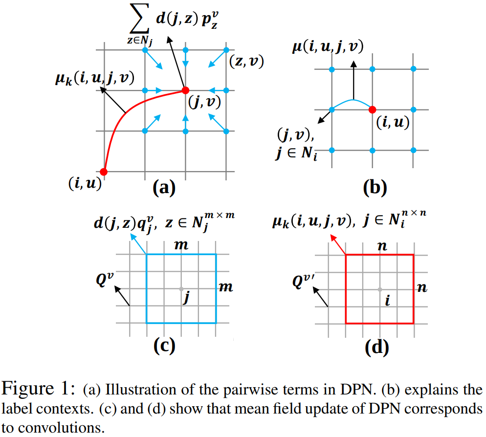

DPN（Deep Parsing Network）使用现有的CNN来完成一元问题，然后又精心设计了其他层来模拟平均场算法的二元问题。DPN的优点如下：

- 在综合使用了CNN和随机场的一般工作中，需要对随机场做多次迭代，然而DPN只做一次迭代就可以获得比较好的效果。
- DPN同时考虑了空间上下文关系如高阶关系，有能力对各种二元问题进行建模，使得很多二元问题成为DPN的特例。
- DPN使得马尔可夫场问题能够并行化解决，通过GPU来加速计算。DPN使用卷积和池化操作来近似MF，可以通过近似来加速。

二元势函数都是通过考虑任意两个像素点之间的关系来构造的。如中的表示像素点是否被标记为；表示像素点，之间的关系，比如RGB像素点的距离或者空间距离；则表示，这两个标记全局共现的惩罚。在空间上相近且看起来相似的两个点，应该更容易获得相同的标签。然而这种建模方式的两个缺点：（1）它只考虑了共现的频率，却没有考虑空间上下文关系，比如，当人和椅子一起出现的时候，人应该是坐在椅子上的，而不太可能在椅子下；（2）它只考虑了像素点之间成对（Pairwise）的关系，却没有考虑更高阶的关系。为了解决这些缺点，在二元势函数中引入了三元惩罚项：

这个式子学习了局部标记上下文的混合。是混合组件的数量，取值为或，表示哪个组件被激活，且。如下图（b）所示，红色点和蓝色点描述了中心点和它的邻域。表示像素点被标记为。表示根据和的相对关系，和同时存在的代价。上式的第二项就为三元惩罚项，表示像素点，以及的邻域的关系。当和相容时，也应该相容于，其中是的邻域，如下图（a）所示。所以DPN的主要贡献就是把上式分两步建模成CNN。第一步如图（c）所示，用的卷积核作用于每个点来表示，平滑了像素点和它的邻域之间的预测。第二步使用的卷积核作用于每个点来表示，如图（d）所示。

