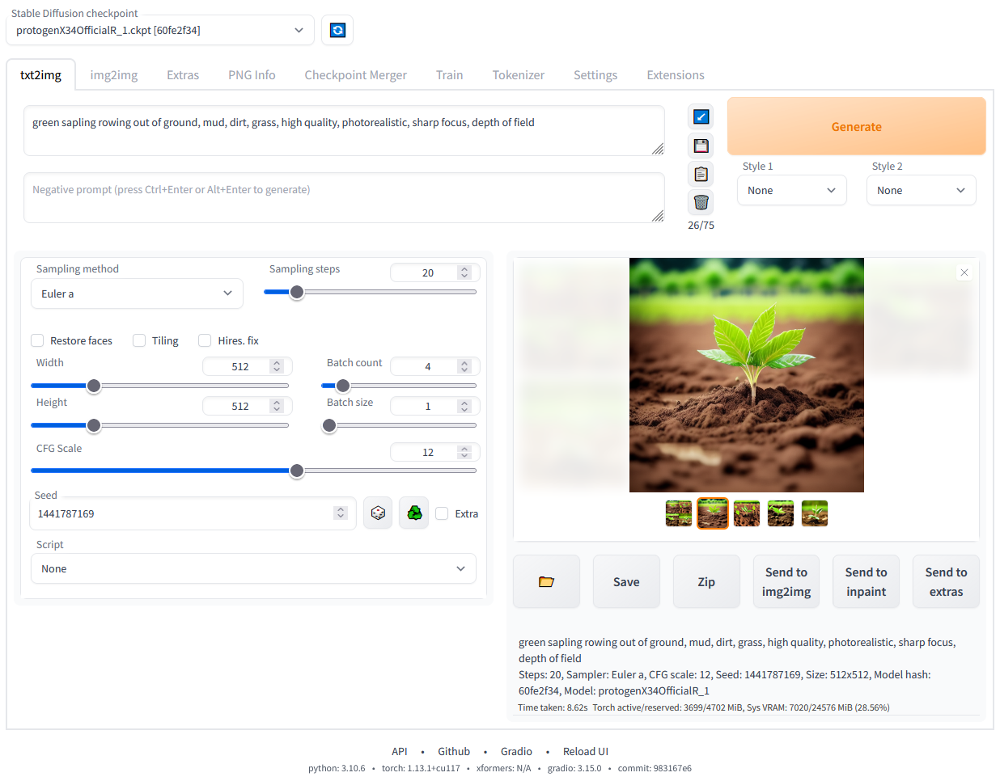
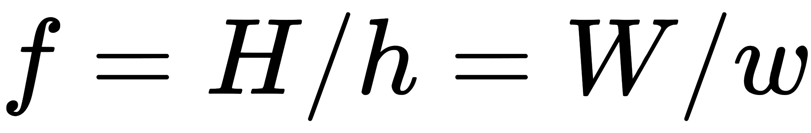
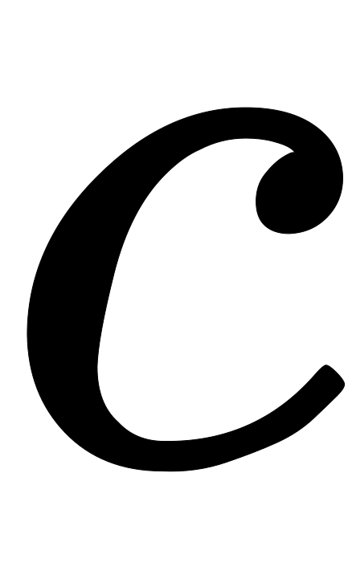

Stable Diffusion是CompVis、Stability AI和LAION等公司研发的一个文生图模型，主要应用包括文生图，图生图以及图像inpainting。其中文生图是Stable Diffusion的基础功能：根据输入文本生成相应的图像，而图生图和图像inpainting是在文生图的基础上延伸出来的两个功能。

# 功能部署

## 文生图
根据文本生成图像这是文生图的最核心的功能，下图为SD的文生图的推理流程图：首先根据输入text用text encoder提取text embeddings，同时初始化一个随机噪音noise（latent上的，512x512图像对应的noise维度为64x64x4），然后将text embeddings和noise送入扩散模型UNet中生成去噪后的latent，最后送入autoencoder的decoder模块得到生成的图像。 

## 图生图
图生图（image2image）是对文生图功能的一个扩展，这个功能来源于[SDEdit](https://arxiv.org/abs/2108.01073)这个工作，其核心思路也非常简单：给定一个笔画的色块图像，可以先给它加一定的高斯噪音（执行扩散过程）得到噪音图像，然后基于扩散模型对这个噪音图像进行去噪，就可以生成新的图像，但是这个图像在结构和布局和输入图像基本一致。  对于SD来说，图生图的流程图如下所示，相比文生图流程来说，这里的初始latent不再是一个随机噪音，而是由初始图像经过autoencoder编码之后的latent加高斯噪音得到，这里的加噪过程就是扩散过程。要注意的是，去噪过程的步数要和加噪过程的步数一致，就是说你加了多少噪音，就应该去掉多少噪音，这样才能生成想要的无噪图像 

## 图像inpainting
最后我们要介绍的一项功能是图像inpainting，它和图生图一样也是文生图功能的一个扩展。SD的图像inpainting不是用在图像修复上，而是主要用在图像编辑上：给定一个输入图像和想要编辑的区域mask，我们想通过文生图来编辑mask区域的内容。SD的图像inpainting原理可以参考论文[Blended Latent Diffusion](https://arxiv.org/abs/2206.02779)，其主要原理图： 

## webUI部署
以web UI交互的stable diffusion为例，在GitHub上将项目克隆到本地，执行webui.sh，进行相关配置的安装，如果提示无法安装哪些package，可以手动去GitHub上找到相应的项目下载并安装，或者pip install安装已经存在于pip库的配置。详细的安装GitHub项目的readme里已写的十分详细，大家可以按步骤操作。 [GitHub - AUTOMATIC1111/stable-diffusion-webui: Stable Diffusion web UI](https://github.com/AUTOMATIC1111/stable-diffusion-webui) 

# Diffusion Model
什么是diffusion model，一句话概括即存在一系列高斯噪声(轮)，将输入图片变为纯高斯噪声。而我们的模型则负责将复原回图片。这样一来其实diffusion model和GAN很像，都是给定噪声生成图片，但是diffusion model的噪声与图片是同维度的。当然后续出现了基于压缩的latent diffusion mode，Stable Diffusion是一个基于latent的扩散模型。

# Stable Diffusion
Stable Diffusion是一个基于latent的扩散模型 ，它在UNet中引入text condition来实现基于文本生成图像。Stable Diffusion的核心来源于[Latent Diffusion](https://arxiv.org/abs/2112.10752) 这个工作，常规的扩散模型是基于pixel的生成模型，而Latent Diffusion是基于latent的生成模型，它先采用一个autoencoder将图像压缩到latent空间，然后用扩散模型来生成图像的latents，最后送入autoencoder的decoder模块就可以得到生成的图像。  基于latent的扩散模型的优势在于计算效率更高效，因为图像的latent空间要比图像pixel空间要小，这也是Stable Diffusion的核心优势 。文生图模型往往参数量比较大，基于pixel的方法往往限于算力只生成64x64大小的图像，比如OpenAI的DALL-E2和谷歌的Imagen，然后再通过超分辨模型将图像分辨率提升至256x256和1024x1024；基于latent的Stable Diffusion是在latent空间操作的，它可以直接生成256x256和512x512甚至更高分辨率的图像

Stable Diffusion模型的主体结构如下图所示，主要包括三个模型：

- autoencoder ：encoder将图像压缩到latent空间，而decoder将latent解码为图像；
- CLIP text encoder ：提取输入text的text embeddings，通过cross attention方式送入扩散模型的UNet中作为condition；
- UNet ：扩散模型的主体，用来实现文本引导下的latent生成。

 对于Stable Diffusion模型，其autoencoder模型参数大小为84M，CLIP text encoder模型大小为123M，而UNet参数大小为860M，所以Stable Diffusion模型的总参数量约为1B 。

## Autoencoder
autoencoder是一个基于encoder-decoder架构的图像压缩模型，对于一个大小为的输入图像，encoder模块将其编码为一个大小为的latent，其中下采样率（downsampling factor）。在训练autoencoder过程中，除了采用L1重建损失外，还增加了[感知损失（perceptual loss），即LPIPS](https://richzhang.github.io/PerceptualSimilarity/)以及基于patch的对抗训练。辅助loss主要是为了确保重建的图像局部真实性以及避免模糊。同时为了防止得到的latent的标准差过大，采用了两种正则化方法：第一种是KL-reg，类似VAE增加一个latent和标准正态分布的KL loss，不过这里为了保证重建效果，采用比较小的权重；第二种是VQ-reg，引入一个VQ （vector quantization）layer，此时的模型可以看成是一个VQ-GAN，不过VQ层是在decoder模块中，这里VQ的codebook采样较高的维度（8192）来降低正则化对重建效果的影响。 latent diffusion论文中实验了不同参数下的autoencoder模型，如下表所示，可以看到当较小和较大时，重建效果越好（PSNR越大），这也比较符合预期，毕竟此时压缩率小。 

## CLIP text encoder
Stable Diffusion采用CLIP text encoder来对输入text提取text embeddings，具体的是采用目前OpenAI所开源的[最大CLIP模型](https://huggingface.co/openai/clip-vit-large-patch14)。这个CLIP的text encoder是一个transformer模型（只有encoder模块）：层数为12，特征维度为768，模型参数大小是123M。对于输入text，送入CLIP text encoder后得到最后的hidden states（即最后一个transformer block得到的特征），其特征维度大小为77x768（77是token的数量），这个细粒度的text embeddings将以cross attention的方式送入UNet中。

## UNet
Stable Diffusion的扩散模型是一个860M的UNet，其主要结构如下图所示（这里以输入的latent为64x64x4维度为例），其中encoder部分包括3个CrossAttnDownBlock2D模块和1个DownBlock2D模块，而decoder部分包括1个UpBlock2D模块和3个CrossAttnUpBlock2D模块，中间还有一个UNetMidBlock2DCrossAttn模块。encoder和decoder两个部分是完全对应的，中间存在skip connection。注意3个CrossAttnDownBlock2D模块最后均有一个2x的downsample操作，而DownBlock2D模块是不包含下采样的。  其中CrossAttnDownBlock2D模块的主要结构如下图所示，text condition将通过CrossAttention模块嵌入进来，此时Attention的query是UNet的中间特征，而key和value则是text embeddings。 CrossAttnUpBlock2D模块和CrossAttnDownBlock2D模块是一致的，但是就是总层数为3。 

# Source
[GitHub - AUTOMATIC1111/stable-diffusion-webui: Stable Diffusion web UI](https://github.com/AUTOMATIC1111/stable-diffusion-webui) [GitHub - Stability-AI/stablediffusion: High-Resolution Image Synthesis with Latent Diffusion Models](https://github.com/Stability-AI/stablediffusion) [GitHub - CompVis/stable-diffusion: A latent text-to-image diffusion model](https://github.com/CompVis/stable-diffusion) [GitHub - CompVis/latent-diffusion: High-Resolution Image Synthesis with Latent Diffusion Models](https://github.com/CompVis/latent-diffusion) [文生图模型之Stable Diffusion](https://zhuanlan.zhihu.com/p/617134893) [由浅入深了解Diffusion Model](https://zhuanlan.zhihu.com/p/525106459) [High-Resolution Image Synthesis with Latent Diffusion Models](https://arxiv.org/abs/2112.10752)
