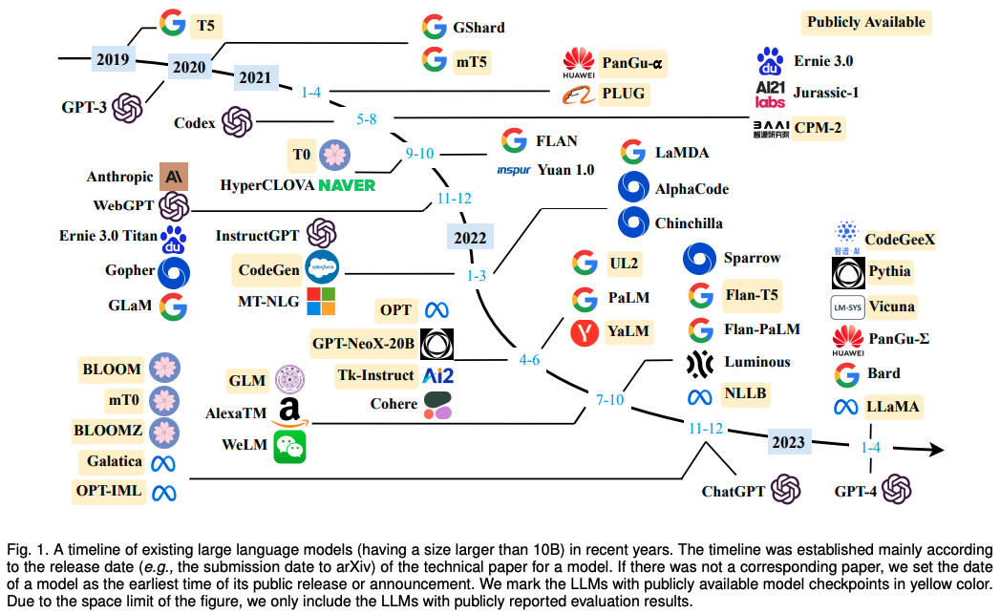
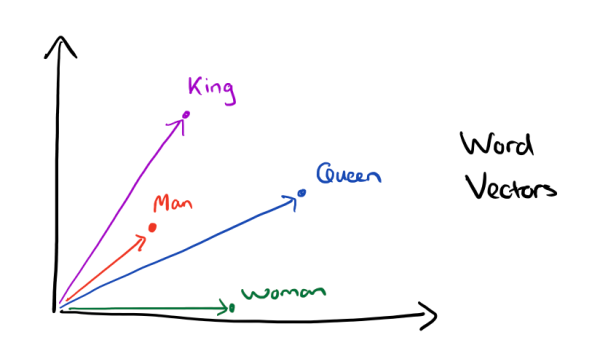
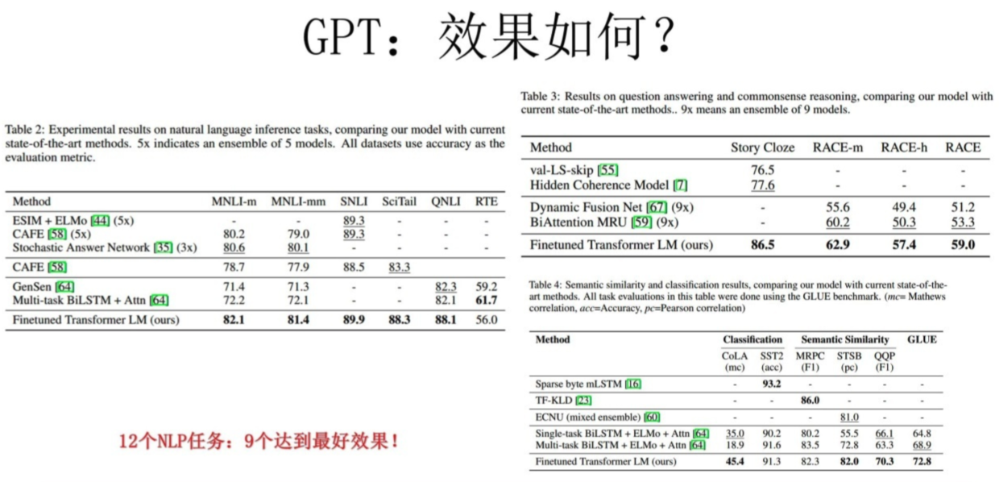
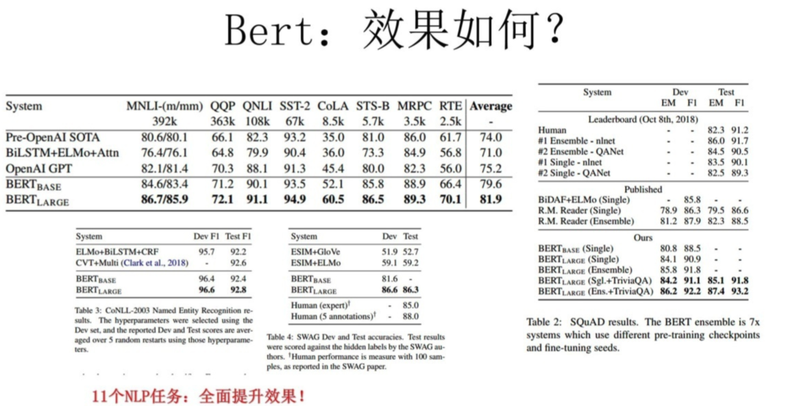
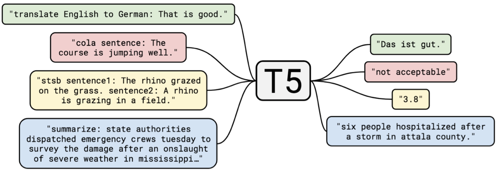
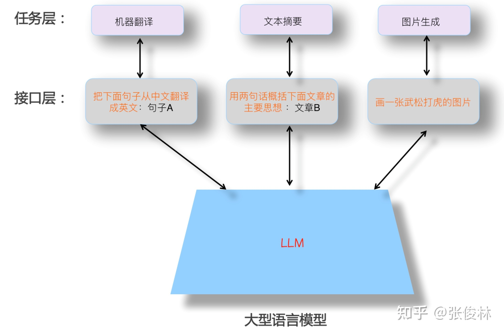
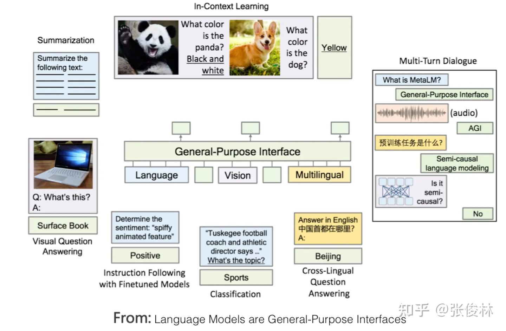

# 发展历程
简单来说发展经历了三个阶段，主要以word2vec、Bert、GPT-3的发表与应用为分界：

1. Word Embedding -> Bert，[从Word Embedding到Bert模型—自然语言处理中的预训练技术发展史](https://zhuanlan.zhihu.com/p/49271699)
   1. 2013年-2018年，word2vec在13年发表，18年Bert横空出世
   2. 借鉴计算机视觉经验(CV)，将深度学习引入自然语言处理(NLP)领域
   3. 模型代表：Word2Vec、Glove、ELMO、GPT
2. Bert -> GPT-3，[乘风破浪的PTM：两年来预训练模型的技术进展](https://zhuanlan.zhihu.com/p/254821426)
   1. 2018年-20年，bert在18年发表，20年GPT-3横空出世，22年底chatGPT大火
   2. 确立预训练+Fine-tuning两阶段流程，探索各种econder/decoder架构
   3. 模型代表：Bert、RoBerta
3. GPT-3 -> 今，[通向AGI之路：大型语言模型（LLM）技术精要](https://zhuanlan.zhihu.com/p/597586623)
   1. 20年-今，22年底chatGPT大火，学术界工业界包括投资界等的目光都投向这里
   2. 确立自回归语言模型+Prompt模式
   3. 模型代表：GPT-3

## Word Embedding -> Bert
word2vec在[自然语言处理-文本向量化-word2vec](https://www.yuque.com/angsweet/machine-learning/zi-ran-yu-yan-chu-li_zi-ran-yu-yan-chu-li_wen-ben-xiang-liang-hua_word2vec)章节已经详细阐述，这里就不做过多展开，感兴趣的朋友可以点开链接进行回顾，这里主要再说一下word2vec的初衷与优势：

- 以前硬件资源还没那么强，DNN模型处理过程非常耗时，我们的词汇表一般在百万级别以上，这意味着我们DNN的输出层需要进行softmax计算各个词的输出概率的的计算量很大
- word2vec转换的向量相比于one-hot编码是低维稠密的。我们称其为Dristributed representation，这可以解决one-hot representation的问题
- 所有的词向量构成了向量空间，进而可以用普通的统计学的方法来研究词与词之间的关系

 

## Bert -> GPT-3
Bert和GPT在[自然语言处理-文本向量化-Bert](https://www.yuque.com/angsweet/machine-learning/zi-ran-yu-yan-chu-li_zi-ran-yu-yan-chu-li_wen-ben-xiang-liang-hua_bert)章节也有详细阐述，这里就不做过多展开，感兴趣的朋友可以点开链接进行回顾，这里主要再说一下贡献与影响：

- 以大量的改进LSTM模型及少量的改进CNN模型作为典型的特征抽取器
- 以Sequence to Sequence（或叫encoder-decoder亦可）+Attention作为各种具体任务典型的总体技术框架
- 确立预训练+Fine-tuning两阶段流程，首先是语言模型预训练；其次是使用Fine-tuning模式解决下游任务

在Bert和GPT模型出现之前，NLP领域流行的技术是深度学习模型，而NLP领域的深度学习，主要依托于以下几项关键技术：以大量的改进LSTM模型及少量的改进CNN模型作为典型的特征抽取器；以Sequence to Sequence（或叫encoder-decoder亦可）+Attention作为各种具体任务典型的总体技术框架。 在这些核心技术加持下，NLP领域深度学习的主要研究目标，如果归纳一下，是如何有效增加模型层深或模型参数容量。就是说，怎么才能往encoder和decoder里不断叠加更深的LSTM或CNN层，来达成增加层深和模型容量的目标。这种努力，尽管确实不断增加了模型层深，但是从解决具体任务的效果角度看，总体而言，不算很成功，或者说和非深度学习方法相对，带来的优势不算大。 深度学习之所以不够成功，张俊林老师认为主要原因来自于两个方面：

1. 某个具体任务有限的训练数据总量。随着模型容量的增加，需要靠更大量的训练数据来支撑，否则即使你能把深度做起来，任务效果也做不上去。而在预训练模型出现之前，很明显这是NLP研究领域一个严重问题；
2. 另外一个方面是LSTM／CNN特征抽取器，表达能力不够强。意思是就算给你再多的数据也没用，因为你不能有效地吸收数据里蕴含的知识。主要应该是这两个原因，阻碍了深度学习在NLP领域的成功突围。

### 贡献与影响

#### 中间任务的消亡
NLP是一个宏观研究领域的统称，里面有五花八门具体的子领域与子方向，如果仔细分析，从任务的性质角度，可以把这些任务分成两大类：一类可以叫做“中间任务”，一类可以称为“最终任务”。

典型的中间任务包括：中文分词、词性标注、NER、句法分析、指代消解、语义Parser等，这类任务一般并不解决应用中的实际需求，大多数是作为那些解决实际需求任务的中间阶段或者辅助阶段存在的，比如几乎没有需求说，我要一个句法Parser，把这个句子的句法分析树给用户看看，用户不需要看到这些NLP的中间阶段处理结果，他只关心某个具体任务你有没有干好。“最终任务”包括比如文本分类、文本相似性计算、机器翻译、文本摘要等等，有很多。这类任务的特点是每个子领域都解决某个实际需求，任务结果基本能直接呈现给用户，比如用户确实存在给你一句英文，告诉他中文是什么的需求。

按理说，“中间任务”就不应该出现，而之所以会存在，这是NLP技术发展水平不够高的一种体现。在技术发展早期阶段，因为当时的技术相对落后，很难一步做好有难度的最终任务。比如机器翻译，早期技术要做好机器翻译是很困难的，于是科研人员就把难题分而治之，分解成分词、词性标注、句法分析等各种中间阶段，先把每个中间阶段做好，然后再拼起来完成最终任务，这也是没办法的事情。

但是自从Bert／GPT出现之后，其实就没有必要做这些中间任务了，因为通过大量数据的预训练，Bert／GPT已经把这些中间任务作为语言学特征，吸收到了Transformer的参数里，此时我们完全可以端到端地直接解决那些最终任务，而无须对这种中间过程专门建模。这里可能争议最大的是中文分词，其实道理也是一样的，哪些字应该组成一个词，这个其实你不用管，让LLM自己当特征去学就行了，只要对于解决任务有帮助，它自然会去学该学的合理分词方式，也未必一定要和我们人类理解的分词规则相同。

#### 研究路线的统一
在说明具体影响前，我们先讨论下另外一种NLP任务划分方式，这对于理解后面内容有帮助。如果对“最终任务”进一步进行分类，又大致可以分为两大不同类型的任务：自然语言理解类任务和自然语言生成类任务。如果排除掉“中间任务”的话，典型的自然语言理解类任务包括文本分类、句子关系判断、情感倾向判断等，这种任务本质上都是分类任务，就是说输入一个句子（文章），或者两个句子，模型参考所有输入内容，最后给出属于哪个类别的判断。自然语言生成也包含很多NLP研究子方向，比如聊天机器人、机器翻译、文本摘要、问答系统等。生成类任务的特点是给定输入文本，对应地，模型要生成一串输出文本。这两者的差异主要体现在输入输出形式上。自从Bert/GPT模型诞生后，出现了明显的技术统一趋向。首先，NLP中不同的子领域，其特征抽取器都逐渐从LSTM/CNN统一到Transformer上。

## GPT-3 -> 今(各种LLM)
技术演进发展到现在，以GPT 3.0为代表的“自回归语言模型+Prompting”模式逐步开始占据统治地位，在预训练模型发展的早期，技术框架收敛到了Bert模式和GPT模式这两种不同的技术范型，而且人们普遍更看好Bert模式一些，相当多数的后续技术改进，都是沿着Bert那条路走的。但是，随着技术的继续发展，你会发现，目前规模最大的LLM模型，几乎清一色都是类似GPT 3.0这种“自回归语言模型+Prompting”模式的，比如GPT 3、PaLM、GLaM、Gopher、Chinchilla、MT-NLG、LaMDA等，没有例外。为什么会这样呢？背后一定有其必然性，张俊林老师认为可能主要源于两个原因：

1. 首先，Google的T5模型，在形式上统一了自然语言理解和自然语言生成任务的外在表现形式。如下图所示，标为红色的是个文本分类问题，黄色的是判断句子相似性的回归或分类问题，这都是典型的自然语言理解问题。在T5模型里，这些自然语言理解问题在输入输出形式上和生成问题保持了一致，也就是说，可以把分类问题转换成让LLM模型生成对应类别的字符串，这样理解和生成任务在表现形式就实现了完全的统一。这说明自然语言生成任务，在表现形式上可以兼容自然语言理解任务，若反过来，则很难做到这一点。这样的好处是：同一个LLM生成模型，可以解决几乎所有NLP问题。而如果仍然采取Bert模式，则这个LLM模型无法很好处理生成任务。既然这样，我们当然倾向于使用生成模型，这是一个原因。

2. 如果想要以零示例提示语（zero shot prompting）或少数示例提示语（few shot prompting）的方式做好任务，则必须要采取GPT模式。现在已有研究（参考：[On the Role of Bidirectionality in Language Model Pre-Training](https://arxiv.org/abs/2205.11726)）证明：**如果是以fine-tuning方式解决下游任务，Bert模式的效果优于GPT模式；若是以zero shot/few shot prompting这种模式解决下游任务，则GPT模式效果要优于Bert模式。**这说明了，生成模型更容易做好zero shot/few shot prompting方式的任务，而Bert模式以这种方式做任务，是天然有劣势的。

### Large Language Model
为什么我们要追求zero shot/few shot prompting这种方式来做任务呢？要解释清楚这个问题，我们首先需要搞清楚另外一个问题：什么样的LLM模型，对我们是最理想的？  上图展示了一个理想的LLM该有的样子：

1. 首先，LLM应该具备强大的自主学习能力。假设我们把世界上能获得的所有文本或者图片等不同类型的数据喂给它，它应该能够自动从中学习到里面包含的所有知识点，学习过程不需要人的介入，并且能灵活应用所学知识，来解决实际问题。因为数据是海量的，要吸收所有知识，就要非常多的模型参数来存储知识，所以这个模型必然会是一个巨无霸模型。
2. 其次，LLM应该能解决NLP任何子领域的问题，而不仅支持有限领域，甚至它应该可以响应NLP之外其它领域的问题，最好是任意领域的问题都能得到很好地回答。
3. 再者，当我们使用LLM解决某个具体领域问题的时候，应该用我们人类习惯的表达方式，就是说LLM应该理解人类的命令。这体现出让LLM适配人，而不是反过来，让人去适配LLM模型。人适配LLM的典型例子，比如绞尽脑汁去尝试各种不同的prompt，以试图找到好的提示语，才能很好地解决手头问题。关于这点，上图在人类和LLM交互的接口层，举了几个例子，说明什么是好的人使用LLM模型的接口形式。

### zero shot/few shot prompting
看完这个理想中的LLM，我们再回头解释上面遗留的问题：为什么我们要追求zero shot/few shot prompting这种方式来做任务呢？有两个原因：

1. 第一，这个LLM模型规模必然非常巨大，有能力作出这个模型，或改动这个模型参数的机构必然很少。而任务需求方是千千万万的中小机构甚至是个人，就算你把模型开源出来，他们也无力部署这个模型，更不用说再用Fine-tuning这种模式去修改模型参数了。所以，我们应该追求不修正模型参数，就能让任务需求方完成任务的方式，也就是应该采取prompt模式完成任务，而非Fine-tuning模式（由此可看出，soft prompting技术方向是违背这个发展趋势的）。模型制作方则将LLM作成公用服务，以LLM as Service的模式运行。作为服务支持方，考虑到千变万化的用户需求，所以LLM模型制作方更要追求让LLM能完成尽可能多类型的任务，这是附带的影响，也是为何超级大模型一定会追求走向AGI的现实因素。
2. 第二，zero shot prompting也好，few shot prompting也好，甚至促进LLM推理能力的思维链（CoT,Chain of Thought）Prompting也好，就是上图中接口层中的现有技术。具体而言，zero shot prompting的初衷，其实就是人类和LLM的理想接口，直接用人类所习惯的任务表述方式让LLM做事情，但是发现LLM并不能很好地理解，效果也不好。经过继续研究，转而发现：对于某项任务，如果给LLM几个示例，用这些示例来代表任务描述，效果会比zero shot prompting好，于是大家都去研究更好的few shot prompting技术。可以理解为，本来我们希望LLM能够用人类常用的命令方式来执行某个任务，但是目前技术还做不到，所以退而求其次，用这些替代技术来表达人类的任务需求。

### 贡献与影响
如果理解了上述逻辑，很容易得出如下结论：few shot prompting（也被称为In Context Learning）只是一种过渡时期的技术。如果我们能够更自然地去描述一个任务，而且LLM可以理解，那么，我们肯定会毫不犹豫地抛弃这些过渡期的技术，原因很明显，用这些方法来描述任务需求，并不符合人类的使用习惯。这也是为何我将GPT 3.0+Prompting列为过渡期技术的原因，ChatGPT的出现，改变了这个现状，用Instruct取代了Prompting，由此带来新的技术范式转换，并产生若干后续影响。

#### 适配人的交互
在理想LLM的背景下，我们再来看ChatGPT，能更好理解它的技术贡献。ChatGPT应该是目前所有的现有技术里，最接近理想LLM的技术方法。如果归纳下ChatGPT最突出特点的话，我会用下面八个字：“能力强大，善解人意”。“能力强大”这一点，我相信应该主要归功于ChatGPT所依托的基础LLM GPT3.5。因为ChatGPT 尽管加入了人工标注数据，但是量级只有数万，这个规模的数据量，和训练GPT 3.5模型使用的几千亿token级别的数据量相比，包含的世界知识（数据中包含的事实与常识）可谓沧海一粟，几可忽略，基本不会对增强GPT 3.5的基础能力发挥什么作用。所以它的强大功能，应该主要来自于隐藏在背后的GPT 3.5。GPT 3.5对标理想LLM模型中的那个巨无霸模型。 那么，ChatGPT向GPT 3.5模型注入新知识了吗？应该是注入了，这些知识就包含在几万人工标注数据里，不过注入的不是世界知识，而是人类偏好知识。所谓“人类偏好”，包含几方面的含义：首先，是人类表达一个任务的习惯说法。比如，人习惯说：“把下面句子从中文翻译成英文”，以此表达一个“机器翻译”的需求，但是LLM又不是人，它怎么会理解这句话到底是什么意思呢？你得想办法让LLM理解这句命令的含义，并正确执行。所以，ChatGPT通过人工标注数据，向GPT 3.5注入了这类知识，方便LLM理解人的命令，这是它“善解人意”的关键。其次，对于什么是好的回答，什么是不好的回答，人类有自己的标准，例如比较详细的回答是好的，带有歧视内容的回答是不好的，诸如此类。这是人类自身对回答质量好坏的偏好。人通过Reward Model反馈给LLM的数据里，包含这类信息。ChatGPT把人类偏好知识注入GPT 3.5，以此来获得一个听得懂人话、也比较礼貌的LLM。 可以看出，ChatGPT的最大贡献在于：基本实现了理想LLM的接口层，让LLM适配人的习惯命令表达方式，而不是反过来让人去适配LLM，绞尽脑汁地想出一个能Work的命令（这就是instruct技术出来之前，prompt技术在做的事情），而这增加了LLM的易用性和用户体验。是InstructGPT/ChatGPT首先意识到这个问题，并给出了很好的解决方案，这也是它最大的技术贡献。相对之前的few shot prompting，它是一种更符合人类表达习惯的人和LLM进行交互的人机接口技术。而这必将启发后续的LLM模型，继续在易用人机接口方面做进一步的工作，让LLM更听话。

#### NLP子领域独立研究价值减少
就NLP领域而言，这次范式转换，意味着很多目前独立存在的NLP研究领域，将被纳入LLM的技术体系，进而不再独立存在，逐步消失。经过第一次范式转换，尽管NLP中很多“中间任务”，继续作为独立研究领域存在不再必要，但是大多数“最终任务”，仍然是以独立研究领域存在的，只是切换成在“预训练+fine-tuning”框架下，面对领域独有问题，陆续提出新的改进方案。 目前研究表明，很多NLP任务，随着LLM模型规模增长，效果会大幅提升。据此，我觉得可得到如下推论：大多数某领域所谓“独有”的问题，大概率只是缺乏领域知识导致的一种外在表象，只要领域知识足够多，这个所谓领域独有的问题，就可以被很好地解决掉，其实并不需要专门针对某个具体领域问题，冥思苦想去提出专用解决方案。也许AGI的真相超乎意料地简单：你只要把这个领域更多的数据交给LLM，让它自己学习更多知识即可。 在这个背景下，同时，ChatGPT证明了我们现在是可以直接去追求理想LLM模型的，那么，未来的技术发展趋势应该是：追求规模越来越大的LLM模型，通过增加预训练数据的多样性，来涵盖越来越多的领域，LLM自主从领域数据中通过预训练过程学习领域知识，随着模型规模不断增大，很多问题随之得到解决。研究重心会投入到如何构建这个理想LLM模型，而非去解决某个领域的具体问题。这样，越来越多NLP的子领域会被纳入LLM的技术体系，进而逐步消失。张俊林老师认为，判断某个具体领域是否该立即停止独立研究，其判断标准可采取以下两种方法，占其一即可：

1. 第一，判断某个任务，是否LLM的研究效果超过人类表现，对于那些LLM效果超过人类的研究领域，已无独立研究的必要。举个例子，GLUE与SuperGLUE测试集合里的很多任务，目前LLM效果已超过人类表现，与这个数据集合密切相关的研究领域，其实就没有继续独立存在的必要。
2. 第二，对比两种模式的任务效果，第一种模式是用较大的领域专用数据进行Fine-tuning，第二种是few-shot prompting或instruct-based方法。如果第二种方法效果达到或超过第一种方法，则意味着这个领域没有继续独立存在的必要性。如果用这个标准来看，其实很多研究领域，目前fine-tuning效果还是占优的（因为这种模式领域训练数据量大），看似还可独立存在。但是考虑到很多任务随着模型规模增大，few shot prompting效果持续增长，随着更大模型的出现，这个拐点很可能短期就会达到。

#### NLP之外领域并入LLM技术体系
如果站在AGI的视角，参照之前描述的理想LLM模型，它所能完成的任务，不应局限于NLP领域，或某一两个学科领域，理想中的LLM应该是领域无关的通用人工智能模型，它现在在某一两个领域做得好，不代表只能做这些任务。ChatGPT的出现，证明了现在这个时期，我们去追求AGI是有可行性的，而现在是抛开“领域学科”这个思维束缚的时候了。 ChatGPT除了展示出以流畅的对话形式解决各种NLP任务外，也具备强大的代码能力。很自然的，之后越来越多其它的研究领域，也会被逐步纳入LLM体系中，成为通用人工智能的一部分。  LLM从NLP向外进行领域拓展，一个自然的选择就是图像处理及多模态相关任务。目前已经有些工作在尝试把多模态融入，让LLM成为一个支持多模态输入输出的通用人机接口，典型的例子包括DeepMind的Flamingo和微软的“Language Models are General-Purpose Interfaces”，上图展示了这种方式的概念结构。 无论是图像还是多模态，未来被融入LLM成为好用的功能，可能比我们想象的进度要慢。主要原因在于：尽管图像领域最近两年也一直在模仿Bert预训练的路子，尝试引入自监督学习，释放模型自主从图像数据中学习知识的能力，典型技术就是“对比学习”和MAE，这是两条不同的技术路线。然而，从目前效果来看，尽管取得了很大的技术进步，但貌似这条路尚未走通，这体现在图像领域预训练模型应用到下游任务，带来的效果收益，远不如Bert或GPT应用在NLP下游任务那样显著。所以，图像预处理模型仍需深入探索，以释放图像数据的潜力，而这会迟滞它们被统一到LLM大模型的时间。当然，如果哪天这条路被趟通，大概率会复现NLP领域目前的局面，就是图像处理各个研究子领域可能会逐步消失，被融入到大型LLM中来，直接完成终端任务。除了图像与多模态，很明显，其它领域也会逐渐被纳入到理想LLM中来，这个方向方兴未艾，是具备高价值的研究主题。

# 应用与局限
| LLMs | Model |  |  | Data |  |
| --- | --- | --- | --- | --- | --- |
|   | **License** | **Commercial Use** | **Other noteable restrictions** | **License** | **Corpus** |
| **Encoder-only** |  |  |  |  |  |
| BERT series of models (general domain) | Apache 2.0 | ✅ |   | Public | BooksCorpus, English Wikipedia |
| RoBERTa | MIT license | ✅ |   | Public | BookCorpus, CC-News, OpenWebText, STORIES |
| ERNIE | Apache 2.0 | ✅ |   | Public | English Wikipedia |
| SciBERT | Apache 2.0 | ✅ |   | Public | BERT corpus, [1.14M papers from Semantic Scholar](https://aclanthology.org/N18-3011.pdf) |
| LegalBERT | CC BY-SA 4.0 | ❌ |   | Public (except data from the [Case Law Access Project](https://case.law/) ) | EU legislation, US court cases, etc. |
| BioBERT | Apache 2.0 | ✅ |   | [PubMed](https://www.nlm.nih.gov/databases/download/terms_and_conditions.html) | PubMed, PMC |
| **Encoder-Decoder** |  |  |  |  |  |
| T5 | Apache 2.0 | ✅ |   | Public | C4 |
| Flan-T5 | Apache 2.0 | ✅ |   | Public | C4, Mixture of tasks (Fig 2 in paper) |
| BART | Apache 2.0 | ✅ |   | Public | RoBERTa corpus |
| GLM | Apache 2.0 | ✅ |   | Public | BooksCorpus and English Wikipedia |
| ChatGLM | [ChatGLM License](https://github.com/THUDM/ChatGLM-6B/blob/main/MODEL_LICENSE) | ❌ | No use for illegal purposes or military research, no harm the public interest of society | N/A | 1T tokens of Chinese and English corpus |
| **Decoder-only** |  |  |  |  |  |
| GPT2 | [Modified MIT License](https://github.com/openai/gpt-2/blob/master/LICENSE) | ✅ | Use GPT-2 responsibly and clearly indicate your content was created using GPT-2. | Public | WebText |
| GPT-Neo | MIT license | ✅ |   | Public | [Pile](https://pile.eleuther.ai/) |
| GPT-J | Apache 2.0 | ✅ |   | Public | Pile |
| ---> Dolly | CC BY NC 4.0 | ❌ |   | CC BY NC 4.0, Subject to terms of Use of the data generated by OpenAI | Pile, Self-Instruct |
| ---> GPT4ALL-J | Apache 2.0 | ✅ |   | Public | [GPT4All-J dataset](https://huggingface.co/datasets/nomic-ai/gpt4all-j-prompt-generations) |
| Pythia | Apache 2.0 | ✅ |   | Public | Pile |
| ---> Dolly v2 | MIT license | ✅ |   | Public | Pile, databricks-dolly-15k |
| OPT | [OPT-175B LICENSE AGREEMENT](https://github.com/facebookresearch/metaseq/blob/main/projects/OPT/MODEL_LICENSE.md?fbclid=IwAR1BFK5X1XdUpx_QXoiqyfzYWdNAXJPcg8Cf0ddv5T7sa2UrLUvymj1J8G4) | ❌ | No development relating to surveillance research and military, no harm the public interest of society | Public | RoBERTa corpus, the Pile, PushShift.io Reddit |
| ---> OPT-IML | [OPT-175B LICENSE AGREEMENT](https://github.com/facebookresearch/metaseq/blob/main/projects/OPT/MODEL_LICENSE.md?fbclid=IwAR1BFK5X1XdUpx_QXoiqyfzYWdNAXJPcg8Cf0ddv5T7sa2UrLUvymj1J8G4) | ❌ | same to OPT | Public | OPT corpus, Extended version of Super-NaturalInstructions |
| YaLM | Apache 2.0 | ✅ |   | Unspecified | Pile, Teams collected Texts in Russian |
| BLOOM | [The BigScience RAIL License](https://bigscience.huggingface.co/blog/the-bigscience-rail-license) | ✅ | No use of generating verifiably false information with the purpose of harming others; content without expressly disclaiming that the text is machine generated | Public | ROOTS corpus (Lauren¸con et al., 2022) |
| ---> BLOOMZ | [The BigScience RAIL License](https://bigscience.huggingface.co/blog/the-bigscience-rail-license) | ✅ | same to BLOOM | Public | ROOTS corpus, xP3 |
| Galactica | [CC BY-NC 4.0](https://github.com/paperswithcode/galai/blob/main/LICENSE-MODEL.md) | ❌ |   | N/A | The Galactica Corpus |
| LLaMA | [Non-commercial bespoke license](https://docs.google.com/forms/d/e/1FAIpQLSfqNECQnMkycAp2jP4Z9TFX0cGR4uf7b_fBxjY_OjhJILlKGA/viewform) | ❌ | No development relating to surveillance research and military, no harm the public interest of society | Public | CommonCrawl, C4, Github, Wikipedia, etc. |
| ---> Alpaca | CC BY NC 4.0 | ❌ |   | CC BY NC 4.0, Subject to terms of Use of the data generated by OpenAI | LLaMA corpus, Self-Instruct |
| ---> Vicuna | CC BY NC 4.0 | ❌ |   | Subject to terms of Use of the data generated by OpenAI; Privacy Practices of ShareGPT | LLaMA corpus, 70K conversations from [ShareGPT.com](http://sharegpt.com/) |
| ---> GPT4ALL | GPL Licensed LLaMa | ❌ |   | Public | [GPT4All dataset](https://huggingface.co/datasets/nomic-ai/gpt4all_prompt_generations) |
| OpenLLaMA | Apache 2.0 | ✅ |   | Public | [RedPajama](https://www.together.xyz/blog/redpajama) |
| CodeGeeX | [The CodeGeeX License](https://github.com/THUDM/CodeGeeX/blob/main/MODEL_LICENSE) | ❌ | No use for illegal purposes or military research | Public | Pile, CodeParrot, etc. |
| StarCoder | [BigCode OpenRAIL-M v1 license](https://huggingface.co/spaces/bigcode/bigcode-model-license-agreement) | ✅ | No use of generating verifiably false information with the purpose of harming others; content without expressly disclaiming that the text is machine generated | Public | [The Stack](https://arxiv.org/pdf/2211.15533.pdf) |
| MPT-7B | Apache 2.0 | ✅ |   | Public | [mC4 (english)](https://arxiv.org/abs/2010.11934) , [The Stack](https://arxiv.org/pdf/2211.15533.pdf) , [RedPajama](https://www.together.xyz/blog/redpajama) , [S2ORC](https://aclanthology.org/2020.acl-main.447/) |
| [falcon](https://huggingface.co/tiiuae/falcon-40b) | [TII Falcon LLM License](https://huggingface.co/tiiuae/falcon-40b/blob/main/LICENSE.txt) | ✅/❌ | Available under a license allowing commercial use | Public | [RefinedWeb](https://huggingface.co/datasets/tiiuae/falcon-refinedweb) |

# Source
[GitHub - Mooler0410/LLMsPracticalGuide: A curated list of practical guide resources of LLMs (LLMs Tree, Examples, Papers)](https://github.com/Mooler0410/LLMsPracticalGuide) [GitHub - RUCAIBox/LLMSurvey: The official GitHub page for the survey paper “A Survey of Large Language Models”.](https://github.com/RUCAIBox/LLMSurvey) [https://arxiv.org/pdf/2304.13712.pdf](https://arxiv.org/pdf/2304.13712.pdf) [https://arxiv.org/pdf/2303.18223.pdf](https://arxiv.org/pdf/2303.18223.pdf) [https://arxiv.org/pdf/2204.05832.pdf](https://arxiv.org/pdf/2204.05832.pdf) [从Word Embedding到Bert模型—自然语言处理中的预训练技术发展史](https://zhuanlan.zhihu.com/p/49271699) [乘风破浪的PTM：两年来预训练模型的技术进展](https://zhuanlan.zhihu.com/p/254821426) [通向AGI之路：大型语言模型（LLM）技术精要](https://zhuanlan.zhihu.com/p/597586623)
