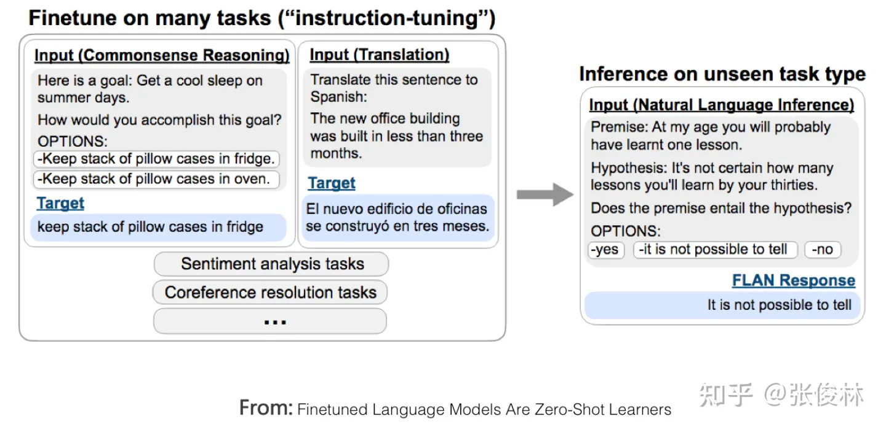
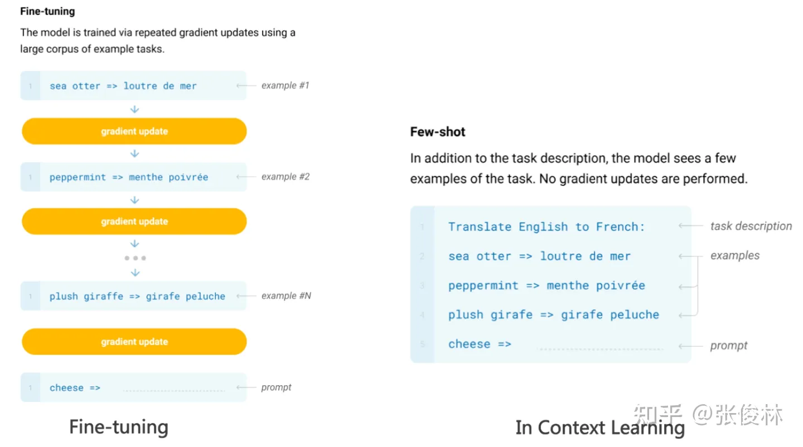
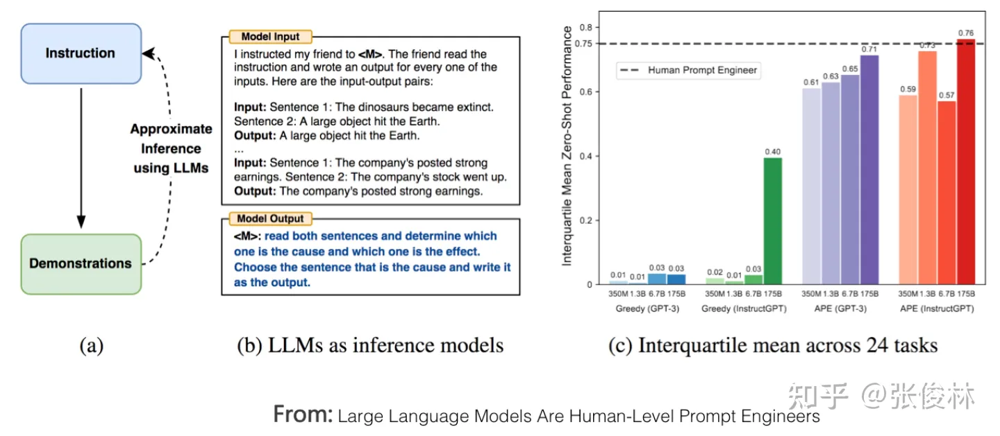
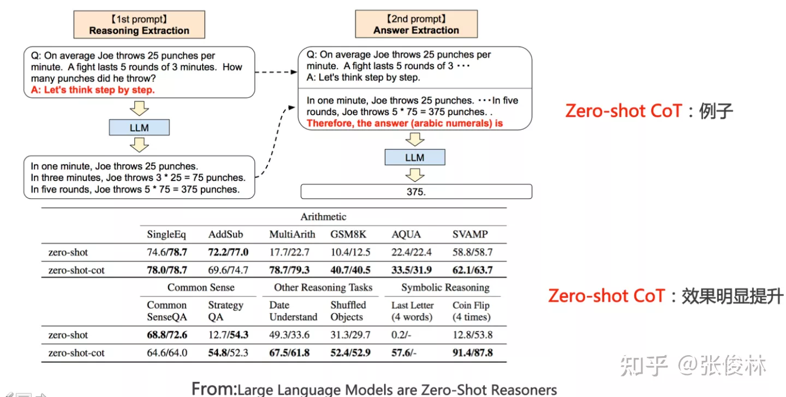
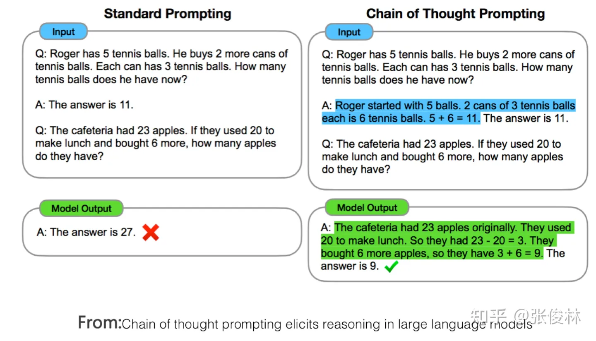
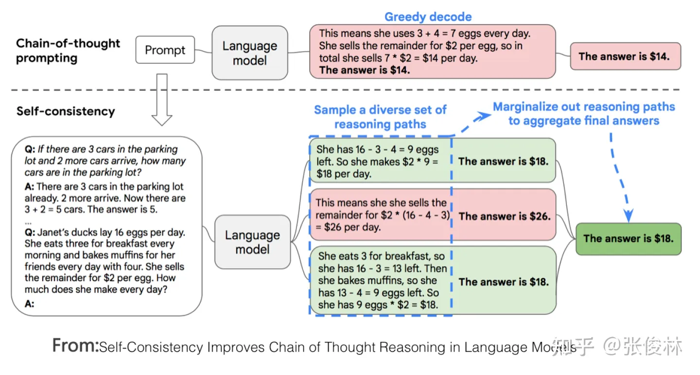
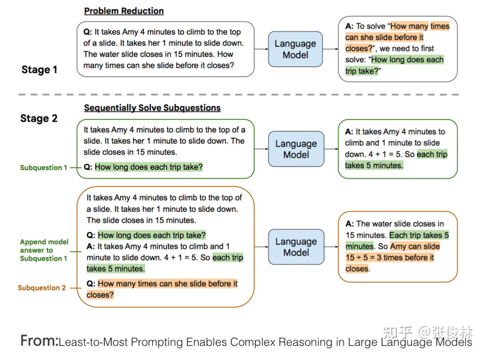
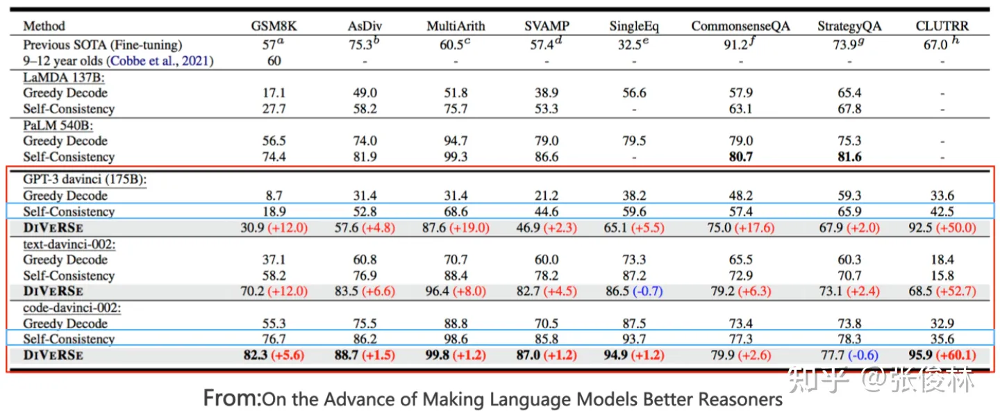

# 人机接口
一般我们经常提到的人和LLM的接口技术包括：zero shot prompting、few shot prompting、In Context Learning，以及Instruct。这些其实都是表达某个具体任务的描述方式。不过如果你看文献，会发现叫法比较乱。

- Instruct/zero shot

其中Instruct是ChatGPT的接口方式，就是说人以自然语言给出任务的描述，比如“把这个句子从中文翻译成英文”，类似这种。zero shot prompting我理解其实就是现在的Instruct的早期叫法，以前大家习惯叫zero shot，现在很多改成叫Instruct。尽管是一个内涵，但是具体做法是两种做法。早期大家做zero shot prompting，实际上就是不知道怎么表达一个任务才好，于是就换不同的单词或者句子，反复在尝试好的任务表达方式，这种做法目前已经被证明是在拟合训练数据的分布，其实没啥意思。目前Instruct的做法则是给定命令表述语句，试图让LLM理解它。所以尽管表面都是任务的表述，但是思路是不同的。

- In Context Learning/few shot prompting

而In Context Learning和few shot prompting意思类似，就是给LLM几个示例作为范本，然后让LLM解决新问题。我个人认为In Context Learning也可以理解为某项任务的描述，只是Instruct是一种抽象的描述方式，In Context Learning是一种例子示范的例子说明法。

所以我们此处只对In Context Learning和Instruct进行介绍，不再提zero shot和few shot了。

## Instruct
我们可以把Instruct当作一种方便人类理解的任务表述，在这个前提下，目前关于Instruct的研究可以分成两种：偏学术研究的Instruct，以及关于人类真实需求描述的Instruct。 

### 偏学术研究
我们先来看第一种：偏学术研究的Instruct。它的核心研究主题是多任务场景下，LLM模型对Instruct理解的泛化能力。如上图中FLAN模型所示，就是说有很多NLP任务，对于每个任务，研究人员构造一个或者多个Prompt模版作为任务的Instruct，然后用训练例子对LLM模型进行微调，让LLM以同时学习多个任务。训练好模型后，给LLM模型一个它没见过的全新任务的Instruct，然后让LLM 解决zero shot任务，从任务解决得是否足够好，来判断LLM模型是否有对Instruct理解的泛化能力。

如果归纳下目前的研究结论（可参考“Scaling Instruction-Fine-tuned Language Models”／“Super-NaturalInstructions: Generalization via Declarative Instructions on 1600+ NLP Tasks”），能够有效增加LLM模型Instruct泛化能力的因素包括：增加多任务的任务数量、增加LLM模型大小、提供CoT Prompting， 以及增加任务的多样性。如果采取任意一项措施，都可以增加LLM模型的Instruct理解能力。

## 偏真实诉求
第二种是人类真实需求下的Instruct，这类研究以InstructGPT和ChatGPT为代表。这类工作也是基于多任务的，但是和偏向学术研究类工作最大的不同，在于它是面向人类用户真实需求的。为什么这么说呢？因为它们用于LLM多任务训练的任务描述Prompt，是从大量用户提交的真实请求中抽样而来的，而不是固定好研究任务的范围，然后让研究人员来写任务描述prompt。这里所谓的“真实需求”，体现在两个方面：首先，因为是从用户提交的任务描述里随机抽取的，所以涵盖的任务类型更多样化，也更符合用户的真实需求；其次，某个任务的prompt描述，是用户提交的，体现了一般用户在表达任务需求时会怎么说，而不是你认为用户会怎么说。很明显，这类工作改出来的LLM模型，用户体验会更好。

InstructGPT论文里，也拿这种方法和FLAN那种Instruct based方法做了比较。首先在GPT3上用FLAN提到的任务、数据以及Prompt模版进行微调，来在GPT 3上复现FLAN方法，然后和InstructGPT进行比较，因为InstructGPT的基础模型也是GPT3，所以只有数据和方法的差别，两者可比，结果发现FLAN方法的效果，距离InstructGPT有很大的差距。那么背后的原因是什么呢？论文分析数据后认为，FLAN方法涉及到的任务领域相对少，是InstructGPT涉及领域的子集，所以效果不好。也就是说，FLAN论文里涉及到的任务和用户真实需求是不符的，而这导致在真实场景下效果不够好。而这对我们的启示是：从用户数据中收集真实需求，这事情是很重要的

# In Context Learning
如果你细想，会发现In Context Learning是个很神奇的技术。它神奇在哪里呢？神奇在你提供给LLM几个样本示例，然后给它，LLM竟然能够成功预测对应的。听到这你会反问：这有什么神奇的呢？Fine-tuning不就是这样工作的吗？你要这么问的话，说明你对这个问题想得还不够深入。  Fine-tuning和In Context Learning表面看似都提供了一些例子给LLM，但两者有质的不同（参考上图示意）：Fine-tuning拿这些例子当作训练数据，利用反向传播去修正LLM的模型参数，而修正模型参数这个动作，确实体现了LLM从这些例子学习的过程。但是，In Context Learning只是拿出例子让LLM看了一眼，并没有根据例子，用反向传播去修正LLM模型参数的动作，就要求它去预测新例子。既然没有修正模型参数，这意味着貌似LLM并未经历一个学习过程，如果没有经历学习过程，那它为何能够做到仅看一眼，就能预测对新例子呢？这正是In Context Learning的神奇之处。这是否让你想起了一句歌词：“只是因为在人群中多看了你一眼 再也没能忘掉你容颜”，而这首歌名叫“传奇”。你说传奇不传奇？

看似In Context Learning没从例子里学习知识，实际上，难道LLM通过一种奇怪的方式去学习？还是说，它确实也没学啥？关于这个问题的答案，目前仍是未解之谜。现有一些研究各有各的说法，五花八门，很难判断哪个讲述的是事实的真相，甚至有些研究结论还相互矛盾。这里提供几个目前的说法，至于谁对谁错，只能你自己把握了。当然，我认为追求这个神奇现象背后的真相，是一个好的研究课题。

试图证明In Context Learning没有从例子中学习的工作是“Rethinking the Role of Demonstrations: What Makes In-Context Learning Work?”。它发现了：在提供给LLM的样本示例中，是否对应的正确答案，其实并不重要，如果我们把正确答案替换成随机的另外一个答案，这并不影响In Context Learning的效果。这起码说明了一点：In Context Learning并没有提供给LLM那个从映射到的映射函数信息：，否则的话你乱换正确标签，肯定会扰乱这个映射函数。也就是说，In Context Learning并未学习这个输入空间到输出空间的映射过程。

真正对In Context Learning影响比较大的是：和的分布，也就是输入文本的分布和候选答案有哪些，如果你改变这两个分布，比如把替换成候选答案之外的内容，则In Context Learning效果急剧下降。

总之，这个工作证明了In Context Learning并未学习映射函数，但是输入和输出的分布很重要，这两个不能乱改。有些工作认为LLM还是从给出的示例学习了这个映射函数，不过是种隐式地学习。比如“What learning algorithm is in-context learning? Investigations with linear models”认为Transformer能够隐式地从示例中学习到 的映射过程，它的激活函数中包含了一些简单映射函数，而LLM通过示例能够激发对应的那一个。而“Why Can GPT Learn In-Context? Language Models Secretly Perform Gradient Descent as Meta-Optimizers”这篇文章则将ICL看作是一种隐式的Fine-tuning。总而言之，目前这还是一个未解之谜。

## In Context Learning和Instruct的联系
如果我们假设In Context Learning是用一些例子来具象地表达任务命令，Instruct是一种更符合人类习惯的抽象任务描述。那么，一个很自然的问题是：它们之间有什么联系吗？比如，我们是否能够提供给LLM完成某个任务的若干具体示例，让LLM找出其对应的自然语言描述的Instruct命令？  目前有零星的工作在探索这个问题，我认为这个方向是很有研究价值的。先说答案，答案是：Yes，LLM Can。“Large Language Models Are Human-Level Prompt Engineers”是做这个方向很有趣的工作，如上图所示，对于某项任务，给LLM一些示例，让LLM自动生成能够描述这项任务的自然语言命令，然后它再用LLM生成的任务描述去测试任务效果。它使用的基础模型是GPT 3和InstructGPT，经过这项技术加持后，LLM生成的Instruct的效果相比未采用这项技术的GPT 3 以及InstuctGPT来说，指标有极大地提升，而且在一些任务上超过人类的表现。这说明了：具象的任务示例和任务的自然语言描述之间，有种神秘的内在联系。至于这种联系到底是什么？我们目前对此还一无所知。

# 推理能力
目前很多研究已证明LLM对于知识具有强大的记忆能力，但是，一般我们不会因为一个人记忆能力强，就说这人很聪明，是否具有强大的推理能力，往往是我们判断一个人是否聪明的重要标准。类似的，如果LLM的效果想让人觉得很惊艳，强大的推理能力是必备的。推理能力本质上是综合运用很多相关知识点，去推导出新知识或新结论。关于LLM的推理能力，是最近一年来LLM里最重要和热门的研究领域之一。于是，我们关心的问题就是：LLM具备推理能力吗？如果具备，那么它的推理能力够强吗？

这两个问题目前的答案似乎应该是：当模型规模足够大的时候，LLM本身是具备推理能力的，在简单推理问题上，LLM已经达到了很好的能力，但是复杂推理问题上，还需要更多深入的研究。

如果梳理现有LLM推理相关工作的话，我把它们归到两大类，体现出挖掘或促进LLM推理能力不同的技术思路：

1. 第一类研究比较多，可以统称为基于Prompt的方法，核心思想是通过合适的提示语或提示样本，更好地激发出LLM本身就具备的推理能力，Google在这个方向做了大量很有成效的工作。
2. 第二类做法是在预训练过程中引入程序代码，和文本一起参与预训练，以此进一步增强LLM的推理能力，这应该是OpenAI实践出的思路。比如ChatGPT肯定具备很强的推理能力，但它并不要求用户必须提供一些推理示例，所以ChatGPT强大的推理能力，大概率来源于使用代码参与GPT 3.5的预训练。

这两种思路其实大方向是迥异的：利用代码增强LLM推理能力，这体现出一种通过增加多样性的训练数据，来直接增强LLM推理能力的思路；而基于Prompt的方法，它并不会促进LLM本身的推理能力，只是让LLM在解决问题过程中更好地展示出这种能力的技术方法。可以看出，前者（代码方法）治本，后者治标。当然，两者其实也是互补的，但从长远看，治本的方法更重要。

## 基于Prompt的方法
这方面工作非常多，如果归纳一下的话，大致可以分为三条技术路线。 

### 追加辅助推理Prompt
第一种思路是直接在问题上追加辅助推理Prompt。这种方法简单直接，但在众多领域都很有效。这个做法是由“Large language models are zero-shot reasoners”提出的，也被称为zero-shot CoT。具体而言，分为两个阶段（如上图所示），第一阶段在提问的问题上追加“Let’s think step by step”这句提示语，LLM会输出具体的推理过程；第二阶段，在第一阶段的问题后，拼接LLM输出的具体推理过程，并再追加Prompt=“Therefore, the answer (arabic numerals) is”，此时LLM会给出答案。如此简单的操作，却可以大幅增加LLM在各项推理任务中的效果，比如在数学推理测试集GSM8K上，加上提示语后，推理准确率直接从原先的10.4%提升到了40.4%，可谓神奇。

为什么LLM会具备给一句“Let’s think step by step”提示语，就能列出详细的推理步骤并算出答案呢？其原因目前尚无定论，我的猜测是：很可能因为预训练数据里面存在大量的此种数据，就是以“Let’s think step by step”开头，然后后面是详细的推理步骤，最后给出答案，而LLM在预训练的时候记住了这些模式。而当我们输入这个提示语的时候，激发LLM模糊得“回忆”起某些例子的推导步骤，于是即可模仿这些例子进行步骤推理并给出答案。当然这只是我的无依据推论，若事实真的如此，如果你看过后面介绍的标准CoT做法，会发现Zero-shot CoT 本质上和标准CoT很可能没什么区别，只是标准CoT由人工来写推理步骤的示例，而Zero-shot CoT大概率是通过提示语，激活了记忆中的某些包含推理步骤的示例，很可能是如此区别。而标准CoT效果比Zero-Shot CoT效果好也完全可以理解，因为毕竟靠LLM回忆示例，精准性估计不会太高，而人工给出的示例，准确性是有保障的，所以自然标准CoT效果会更好。

这侧面说明了一个道理，就是LLM本身是具备推理能力的，只是我们没有办法把它的这种能力激发出来而已，通过合适的提示语来进行两步提示，就在一定程度上可以释放出它的这种潜力。另外，对于中文，很可能存在另外一个黄金提示语，比如“详细解题思路如下”，类似这种，因为中文语料在讲解推理步骤的时候，经常用的引导句和“让我们一步一步来思考”应该是不同的，这是明显的西方说法，而探索出这个中文黄金提示语，其实也是很有必要的。

### 基于示例的思维链
第二种思路一般被称为基于示例的思维链（few-shot CoT,Chain of Thought）Prompting。这个方向目前是LLM推理研究的主方向，很多工作都是在这个思路上做的，我们简单介绍几个效果显著的代表性工作，基本能代表CoT的技术发展方向。  CoT的主体思想其实很直白；为了教会LLM模型学会推理，给出一些人工写好的推理示例，示例里把得到最终答案前，一步步的具体推理步骤说清楚，而这些人工写的详细推理过程，就是思维链Prompting，具体例子可参照上图中蓝色文字部分。CoT的意思是让LLM模型明白一个道理；就是在推理过程中，步子不要迈得太大，否则很容易出错，改变思维模式，化大问题为小问题，步步为营，积小胜为大胜。最早明确提出CoT这个概念的文章是“Chain of thought prompting elicits reasoning in large language models”，论文发布于22年1月份，虽然做法很简单，但是应用CoT后LLM模型的推理能力得到了巨大提升，GSM8K数学推理测试集准确率提高到60.1%左右。当然，这种给出详细推理步骤和中间过程的思想，并非CoT最早提出的，更早一些的“scratchpad”技术（可参考：Show Your Work: Scratchpads for Intermediate Computation with Language Models）首先采用了类似思路  CoT提出不久，很快在22年3月份，一项被称为“Self-Consistency”的改进技术就将GSM8K测试集准确率提高到74.4%，提出这项改进的论文是“Self-Consistency Improves Chain of Thought Reasoning in Language Models”。“Self-Consistency”的思路也很直观（参考上图）：首先可以利用CoT给出几个写了推理过程的示例，然后要求LLM对给定的问题进行推理，如果是CoT，直接输出一个推理过程和答案，整个过程就结束了。“Self-Consistency”则不然，它要求LLM输出多个不同的推理过程和答案，然后采用投票的方式选出最佳答案，思路非常简单直接，但是效果也确实好。“Self-Consistency”其实是教导LLM学会这么一个道理：孔乙己说过茴香豆的“茴”字有四种写法，类似的，一个数学题的正确解法也可以有很多种，每个不同的推导过程都指向最终的答案。条条大路通罗马，虽说也有个别迷路走到北京的，但是迷路的毕竟是少数，看看大多数人走到哪里，哪里就是正确答案。简单的方法往往蕴含着深刻的哲学含义，是不是这道理？

再往后，“On the Advance of Making Language Models Better Reasoners”这个工作在“Self-Consistency”基础上，进一步集成了“从一个Prompt问题拓展到多个Prompt问题、检查推理中间步骤的正确性以及对多个输出的回答加权投票”这三个改进点，将GSM8K测试集准确率提高到83%左右。 

### 分治算法思想
第三种思路体现了一种分治算法的思想。当然这个所谓“分治”是我归纳的，别人没这么说。这种思路的核心思想是：对于一个复杂的推理问题，我们把它分解成若干容易解决的子问题，一一解决掉子问题后，我们再从子问题的答案推导复杂问题的答案。你看这确实比较类似分治算法的思想吧。我个人觉得，这种思路可能才是揭示问题本质、最终解决LLM复杂推理问题正宗的道路。我们以“Least-to-most prompting”技术为例来说明这种思路的一种具体实现方式，如上图所示：它分为两个阶段，第一个阶段，从原始问题我们可以得知最终要问的问题是什么，我们假设最终问题是Final Q，然后从原始问题填充Prompt模版：“如果要解决Final Q问题，那么我需要先解决”，然后把原始问题和这个Prompt交给LLM，让LLM模型给出答案，等于让LLM给出最终问题的前置子问题Sub Q；接下来我们进入第二个阶段，让LLM先回答刚才拿到的子问题Sub Q，并拿到对应的答案，然后原始问题拼接子问题Sub Q及对应答案，再去问LLM最终那个问题Final Q，此时LLM会给出最后的答案。如此这般，体现出拆解子问题，并从子问题的答案逐步找出最终答案的思路。

## 代码预训练增强LLM推理能力
以上是目前利用Prompt激发LLM模型推理能力的三种主流做法，而关于LLM的推理能力，目前还观察到一个有趣且费解的现象：除了文本外，如果能够加入程序代码一起参与模型预训练，则能大幅提升LLM模型的推理能力。这个结论从不少论文的实验部分都可以得出（可以参考：AUTOMATIC CHAIN OF THOUGHT PROMPTING IN LARGE LANGUAGE MODELS／Challenging BIG-Bench tasks and whether chain-of-thought can solve them等论文的实验部分）。  上图给出了一份实验数据，来自于论文“On the Advance of Making Language Models Better Reasoners”，其中GPT3 davinci就是标准的GPT 3模型，基于纯文本训练；code-davinci-002（OpenAI内部称为Codex）是同时在Code和NLP数据上训练的模型。如果比较两者效果，可以看出，不论采用具体哪种推理方法，仅仅是从纯文本预训练模型切换到文本和Code混合预训练模型，在几乎所有测试数据集合上，模型推理能力都得到了巨大的效果提升，比如我们以“Self Consistency”方法为例，在大多数据集合上的性能提升，都直接超过了20到50个百分点，这是很恐怖的性能提升，而其实在具体推理模型层面，我们什么也没做，仅仅是预训练的时候除了文本，额外加入了程序代码而已。

除了这个现象，从上图数据中，我们还可以得出其它一些结论，比如GPT 3这种纯文本预训练模型，其实是具备相当程度的推理能力的，除了在GSM8K这种数学推理上效果比较差外，其它推理数据数据集合表现也还可以，前提你需要采用合适的方法，来激发出它本身就具备的这种能力；再比如，text-davinci-002，也就是在code-davinci-002基础上加入instruct fine-tuning后的模型（就是加入InstructGPT或ChatGPT模型的第一步），其推理能力要弱于Codex，但是有其它研究表明它在自然语言处理任务又要强于Codex。而这貌似说明了，加入instruct fine-tuning，会损害LLM模型的推理能力，但是会在一定程度上提升自然语言理解能力。而这些结论其实都是很有意思的，也能启发后续进一步的思考和探索。

那么，一个自然的疑问是：为何预训练模型可以从代码的预训练中获得额外的推理能力？确切原因目前未知，值得深入探索。我猜测可能是因为原始版本的Codex（只使用代码训练，可参考文献：Evaluating Large Language Models Trained on Code）的代码训练是从文本生成代码，而且代码中往往包含很多文本注释，本质上这类似于预训练模型做了<文本,Code>两种数据的多模态对齐工作。而数据中必然包含相当比例的数学或逻辑问题的代码、描述和注释，很明显这些数学类或逻辑推理类的数据，对于解决下游数学推理问题是有帮助的。

# Source
[通向AGI之路：大型语言模型（LLM）技术精要](https://zhuanlan.zhihu.com/p/597586623)

