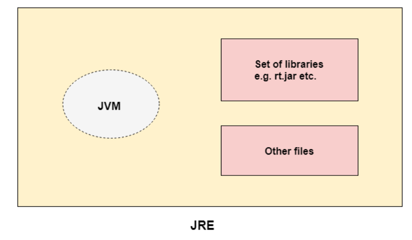

# Java

​	在进一步学习Java之前，必须了解 JDK、JRE 和 JVM 之间的区别。请在此处查看 JVM 的简要概述。 首先看看 JDK、JRE 和 JVM 之间的区别。

## 虚拟机
​	JVM（Java Virtual Machine）是一个抽象机器。之所以称为虚拟机，是因为它在物理上并不存在。它是一个规范，它提供了一个可以在其中执行 Java 字节码的运行时环境。它还可以运行那些用其他语言编写并编译为 Java 字节码的程序。 	JVM 可用于许多硬件和软件平台。JVM、JRE 和 JDK 是平台相关的，因为每个OS的配置彼此不同。然而，Java 是独立于平台的。JVM 的三个概念：规范、实现和实例。 JVM 执行以下主要任务：

- 加载代码
- 验证码
- 执行代码
- 提供运行环境
## JRE
​	JRE 是 Java Runtime Environment 的缩写。它也被编写为 Java RTE。Java 运行时环境是一组用于开发 Java 应用程序的软件工具。它用于提供运行时环境。它是JVM的实现。它实际存在。它包含一组库 + JVM 在运行时使用的其他文件。除了 Sun Micro Systems 之外，其他公司也积极发布了 JVM 的实现。 

## JDK

​	JDK 是 Java Development Kit 的缩写。Java Development Kit (JDK) 是一个软件开发环境，用于开发 Java 应用程序和小程序。它实际存在。它包含 JRE + 开发工具。 

​	

JDK 是甲骨文公司发布的以下任何一种 Java 平台的实现：

- 标准版 Java 平台
- 企业版 Java 平台
- 微型版Java平台

​	JDK 包含私有 Java 虚拟机 (JVM) 和一些其他资源，例如解释器/加载器 (java)、编译器 (javac)、归档器 (jar)、文档生成器 (Javadoc) 等，以完成Java应用程序的开发。 
