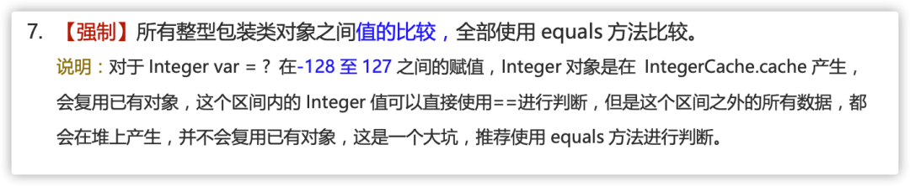

# Java

## Java 中的基本数据类型
Java 中有 8 种基本数据类型，分别为：

- 6 种数字类型：
   - 4 种整数型：byte、short、int、long
   - 2 种浮点型：float、double
- 1 种字符类型：char
- 1 种布尔型：boolean


这 8 种基本数据类型的默认值以及所占空间的大小如下：

| 基本类型 | 位数 | 字节 | 默认值 | 取值范围 |
| --- | --- | --- | --- | --- |
| byte | 8 | 1 | 0 | -128 ~ 127 |
| short | 16 | 2 | 0 | -32768 ~ 32767 |
| int | 32 | 4 | 0 | -2147483648 ~ 2147483647 |
| long | 64 | 8 | 0L | -9223372036854775808 ~ 9223372036854775807 |
| char | 16 | 2 | 'u0000' | 0 ~ 65535 |
| float | 32 | 4 | 0f | 1.4E-45 ~ 3.4028235E38 |
| double | 64 | 8 | 0d | 4.9E-324 ~ 1.7976931348623157E308 |
| boolean | 1 |  | false | true、false |

对于 boolean，官方文档未明确定义，它依赖于 JVM 厂商的具体实现。逻辑上理解是占用 1 位，但是实际中会考虑计算机高效存储因素。另外，Java 的每种基本类型所占存储空间的大小不会像其他大多数语言那样随机器硬件架构的变化而变化。这种所占存储空间大小的不变性是 Java 程序比用其他大多数语言编写的程序更具可移植性的原因之一（《Java 编程思想》2.2 节有提到）。


**注意：**

1. Java 里使用 long 类型的数据一定要在数值后面加上 **L**，否则将作为整型解析。
2. `char a = 'h'` char :单引号，`String a = "hello"` :双引号。

​	这八种基本类型都有对应的包装类分别为：`Byte`、`Short`、`Integer`、`Long`、`Float`、`Double`、`Character`、`Boolean `。包装类型不赋值就是 Null ，而基本类型有默认值且不是 Null。

​	另外，这个问题建议还可以先从 JVM 层面来分析。基本数据类型直接存放在 Java 虚拟机栈中的局部变量表中，而包装类型属于对象类型，对象实例都存在于堆中。相比于对象类型， 基本数据类型占用的空间非常小。

> 《深入理解 Java 虚拟机》 ：局部变量表主要存放了编译期可知的基本数据类型 **（boolean、byte、char、short、int、float、long、double）**、**对象引用**（reference 类型，它不同于对象本身，可能是一个指向对象起始地址的引用指针，也可能是指向一个代表对象的句柄或其他与此对象相关的位置）


## 包装类型的常量池技术
​	Java 基本类型的包装类的大部分都实现了常量池技术。<code>Byte,Short,Integer,Long</code>这 4 种包装类默认创建了数值 **[-128，127]** 的相应类型的缓存数据，`Character` 创建了数值在 **[0,127]** 范围的缓存数据，Boolean 直接返回 True or False。

### Integer 缓存源码：
```java
public static Integer valueOf(int i) {
    if (i >= IntegerCache.low && i <= IntegerCache.high)
        return IntegerCache.cache[i + (-IntegerCache.low)];
    return new Integer(i);
}
private static class IntegerCache {
    static final int low = -128;
    static final int high;
    static {
        // high value may be configured by property
        int h = 127;
    }
}
```

### Character 缓存源码:
```java
public static Character valueOf(char c) {
    if (c <= 127) { // must cache
      return CharacterCache.cache[(int)c];
    }
    return new Character(c);
}

private static class CharacterCache {
    private CharacterCache(){}
    static final Character cache[] = new Character[127 + 1];
    static {
        for (int i = 0; i < cache.length; i++)
            cache[i] = new Character((char)i);
    }

}
```

### Boolean 缓存源码：
```java
public static Boolean valueOf(boolean b) {
    return (b ? TRUE : FALSE);
}
```
如果超出对应范围仍然会去创建新的对象，缓存的范围区间的大小只是在性能和资源之间的权衡。两种浮点数类型的包装类 `Float`，`Double` 并没有实现常量池技术。

```java
Integer i1 = 33;
Integer i2 = 33;
System.out.println(i1 == i2);// 输出 true

Float i11 = 333f;
Float i22 = 333f;
System.out.println(i11 == i22);// 输出 false

Double i3 = 1.2;
Double i4 = 1.2;
System.out.println(i3 == i4);// 输出 false
```


下面来看一下问题。下面的代码的输出结果是 true 还是 false 呢？

```java
Integer i1 = 40;
Integer i2 = new Integer(40);
System.out.println(i1==i2);
```
`Integer i1=40` 这一行代码会发生装箱，也就是说这行代码等价于 `Integer i1=Integer.valueOf(40)` 。因此，`i1` 直接使用的是常量池中的对象。而`Integer i2 = new Integer(40)` 会直接创建新的对象。因此，答案是 false 。记住：**所有整型包装类对象之间值的比较，全部使用 equals 方法比较**。



## 自动装箱与拆箱原理
### 什么是自动拆装箱

- **装箱**：将基本类型用它们对应的引用类型包装起来；
- **拆箱**：将包装类型转换为基本数据类型；

举例：
```java
Integer i = 10;  //装箱
int n = i;   //拆箱
```
上面这两行代码对应的字节码为：
```java
   L1
    LINENUMBER 8 L1
    ALOAD 0
    BIPUSH 10
    INVOKESTATIC java/lang/Integer.valueOf (I)Ljava/lang/Integer;
    PUTFIELD AutoBoxTest.i : Ljava/lang/Integer;

   L2
    LINENUMBER 9 L2
    ALOAD 0
    ALOAD 0
    GETFIELD AutoBoxTest.i : Ljava/lang/Integer;
    INVOKEVIRTUAL java/lang/Integer.intValue ()I
    PUTFIELD AutoBoxTest.n : I
    RETURN
```
从字节码中，可以发现装箱其实就是调用了 包装类的`valueOf()`方法，拆箱其实就是调用了 `xxxValue()`方法。

因此，

- `Integer i = 10` 等价于 `Integer i = Integer.valueOf(10)`
- `int n = i` 等价于 `int n = i.intValue();`

注意：**如果频繁拆装箱的话，也会严重影响系统的性能。应该尽量避免不必要的拆装箱操作。**
