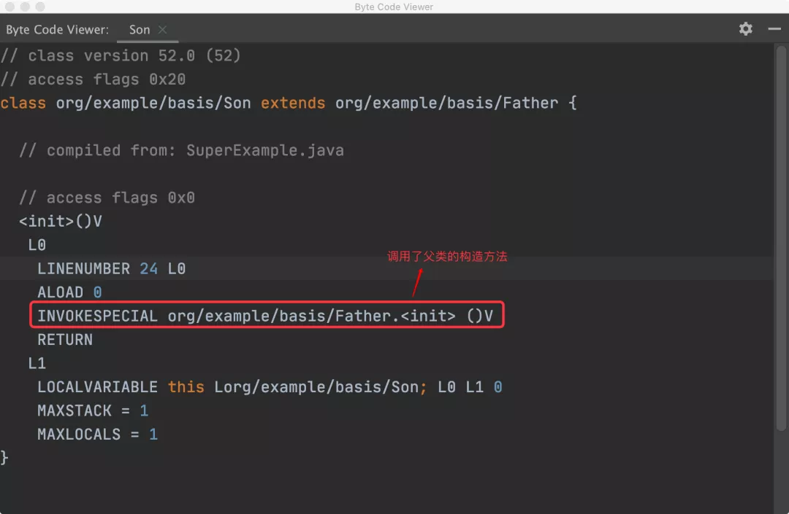
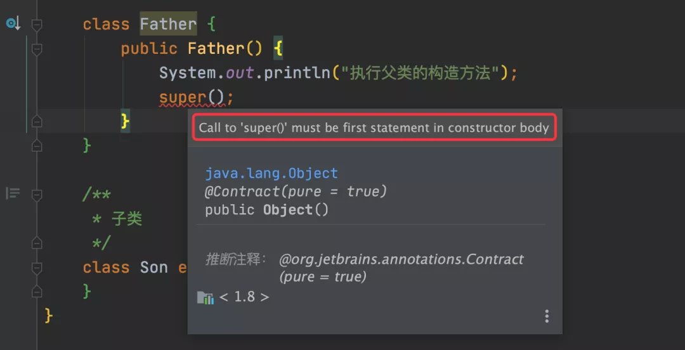
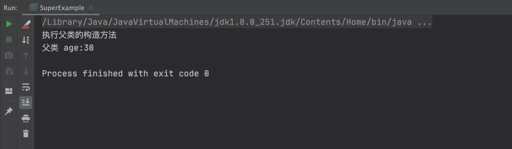
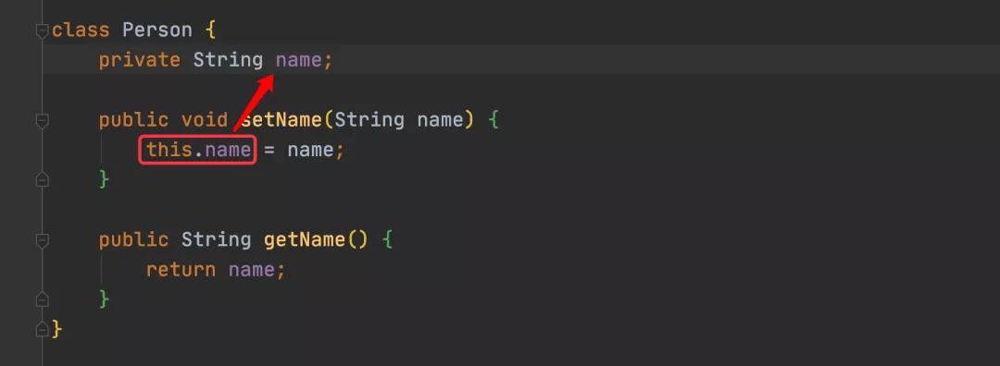
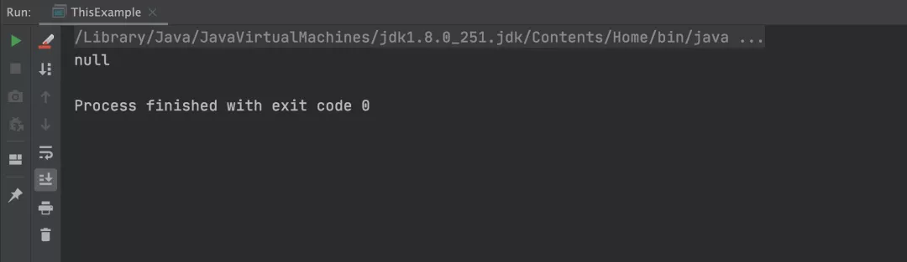
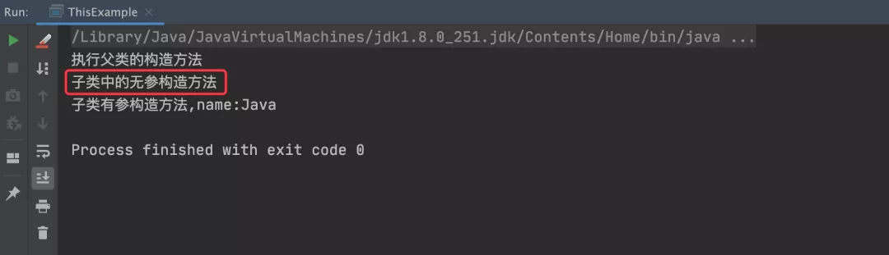
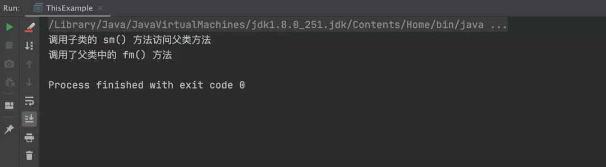

# Java

​	`this` 和 `super` 都是 Java 中常见的关键字，虽然二者在很多情况下都可以被省略，但它们在 Java 中所起的作用是不可磨灭的。它们都是用来起指代作用的，每个类在实例化的时候之所以能调用到 Object 类（Object 类是所有类的父类），全是二者的“功劳”。

## 1、`super` 关键字
​	`	super` 是用来访问父类实例属性和方法的。

### 1.1 `super` 方法使用
​	每个实例类如果没有显示的指定构造方法，那么它会生成一个隐藏的无参构造方法。对于 `super()` 方法也是类似，如果没有显示指定 `super()` 方法，那么子类会生成一个隐藏的 `super()` 方法，用来调用父类的无参构造方法，这就是开篇所说的“每个类在实例化的时候之所以能调用到 Object 类，就是默认 super 方法起作用了”，接下来通过实例来验证一下这个说法。PS：所谓的“显示”，是指在程序中主动的调用，也就是在程序中添加相应的执行代码。
```java
public class SuperExample {
    // 测试方法
    public static void main(String[] args) {
        Son son = new Son();
    }
}

/**
 * 父类
 */
class Father {
    public Father() {
        System.out.println("执行父类的构造方法");
    }
}

/**
 * 子类
 */
class Son extends Father {
}
```
在以上代码中，子类 Son 并没有显示指定 `super()` 方法，运行以上程序，执行的结果如下：


​	从上述的打印结果可以看出，子类 Son 在没有显示指定 `super()` 方法的情况下，竟然调用了父类的无参构造方法，这样从侧面验证了，如果子类没有显示指定 `super()` 方法，那么它也会生成一个隐藏的 `super()` 方法。这一点也可以从此类生成的字节码文件中得到证实，如下图所示：




#### `super` 方法注意事项
​	如果显示使用 `super()` 方法，那么 `super()` 方法必须放在构造方法的首行，否则编译器会报错，如下代码所示：



​	如上图看到的那样，如果 `super()` 方法没有放在首行，那么编译器就会报错：提示 `super()` 方法必须放到构造方法的首行。为什么要把 `super()` 方法放在首行呢？这是因为，只要将 `super()` 方法放在首行，那么在实例化子类时才能确保父类已经被先初始化了。

### 1.2 `super` 属性使用
使用 `super` 还可以调用父类的属性，比如以下代码可以通过子类 Son 调用父类中的 age 属性，实现代码如下：
```java
public class SuperExample {
    // 测试方法
    public static void main(String[] args) {
        Son son = new Son();
    }
}

/**
 * 父类
 */
class Father {
    // 定义一个 age 属性
    public int age = 30;

    public Father() {
        super();
        System.out.println("执行父类的构造方法");
    }
}

/**
 * 子类
 */
class Son extends Father {
    public Son() {
        System.out.println("父类 age:" + super.age);
    }
}
```
以上程序的执行结果如下图所示，在子类中成功地获取到了父类中的 age 属性：




## 2、`this` 关键字
`this` 是用来访问本类实例属性和方法的，它会先从本类中找，如果本类中找不到则在父类中找。

### 2.1 `this` 属性使用
`this` 最常见的用法是用来赋值本类属性的，比如常见的 `setter` 方法，如下代码所示：

上述代码中 this.name 表示 Person 类的 name 属性，此处的 this 关键字不能省略，如果省略就相当于给当前的局部变量 name 赋值 name，自己给自己赋值了。可以尝试一下，将 this 关键字取消掉，实现代码如下：

```java
class Person {
    private String name;
    public void setName(String name) {
        name = name;
    }
    public String getName() {
        return name;
    }
}
public class ThisExample {
    public static void main(String[] args) {
        Person p = new Person();
        p.setName("Fcant");
        System.out.println(p.getName());
    }
}
```
以上程序的执行结果如下图所示：

从上述结果可以看出，将 `this` 关键字去掉之后，赋值失败，Person 对象中的 name 属性就为 null 了。


### 2.2 this 方法使用

可以使用 `this()` 方法来调用本类中的构造方法，具体实现代码如下：
```java
public class ThisExample {
    // 测试方法
    public static void main(String[] args) {
        Son p = new Son("Java");
    }
}

/**
 * 父类
 */
class Father {
    public Father() {
        System.out.println("执行父类的构造方法");
    }
}

/**
 * 子类
 */
class Son extends Father {
    public Son() {
        System.out.println("子类中的无参构造方法");
    }
    public Son(String name) {
        // 使用 this 调用本类中无参的构造方法
        this();
        System.out.println("子类有参构造方法,name:" + name);
    }
}
```
以上程序的执行结果如下图所示：

从上述结果中可以看出，通过 `this()` 方法成功调用到了本类中的无参构造方法。
:::tips
注意：`this()` 方法和 `super()` 方法的使用规则一样，如果显示的调用，只能放在方法的首行。
:::

### 2.3 `this` 访问父类方法
接下来，尝试使用 `this` 访问父类方法，具体实现代码如下：
```java
public class ThisExample {
    public static void main(String[] args) {
        Son son = new Son();
        son.sm();
    }
}

/**
 * 父类
 */
class Father {
    public void fm() {
        System.out.println("调用了父类中的 fm() 方法");
    }
}

/**
 * 子类
 */
class Son extends Father {
    public void sm() {
        System.out.println("调用子类的 sm() 方法访问父类方法");
        // 调用父类中的方法
        this.fm();
    }
}
```
以上程序的执行结果如下：



从上述结果可以看出，使用 `this` 是可以访问到父类中的方法的，`this` 会先从本类中找，如果找不到则会去父类中找。


## 3、`this` 和 `super` 的区别
### 1、指代的对象不同
`super` 指代的是父类，是用来访问父类的；而 `this` 指代的是当前类。

### 2、查找范围不同
`super` 只能查找父类，而 `this` 会先从本类中找，如果找不到则会去父类中找。

### 3、本类属性赋值不同
`this` 可以用来为本类的实例属性赋值，而 `super` 则不能实现此功能。

### 4、`this` 可用于 `synchronized`
因为 `this` 表示当前对象，所以`this` 可用于 `synchronized(this){....}` 加锁，而 `super` 则不能实现此功能。
## 总结
​	`this` 和 `super` 都是 `Java` 中的关键字，都起指代作用，当显示使用它们时，都需要将它们放在方法的首行（否则编译器会报错）。`this` 表示当前对象，`super` 用来指代父类对象，它们有四点不同：指代对象、查找访问、本类属性赋值和 `synchronized` 的使用不同。
