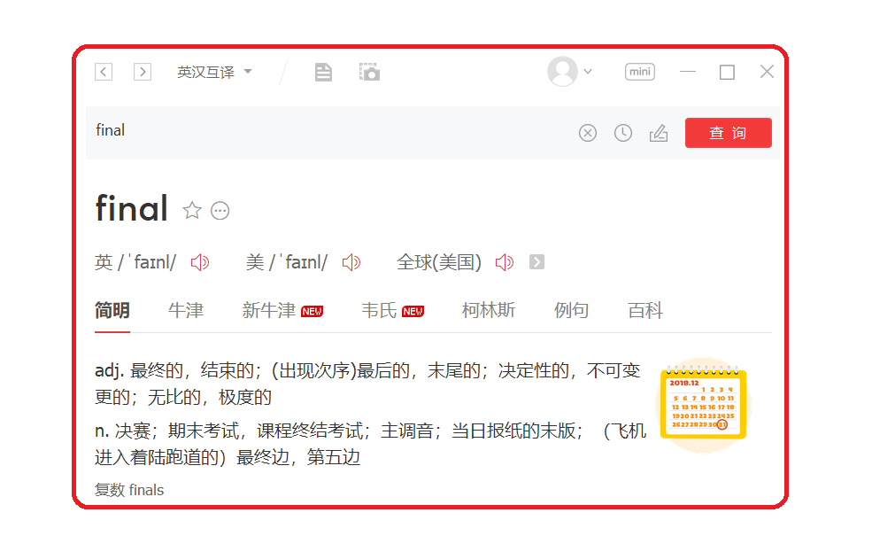
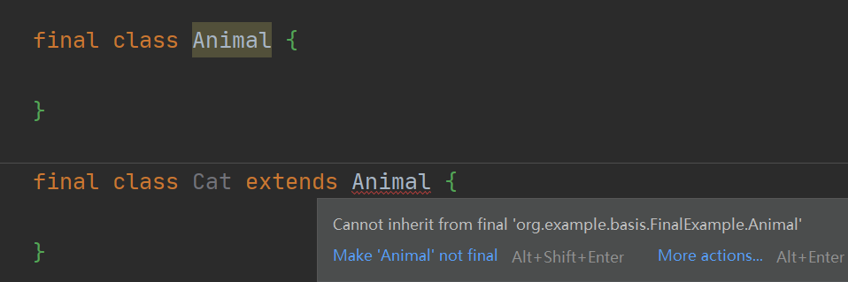
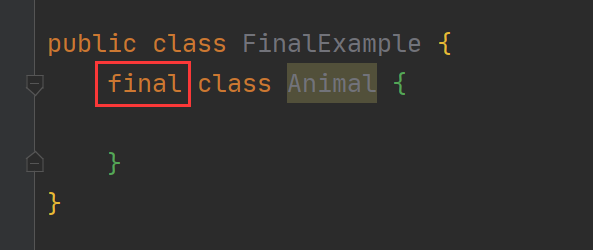
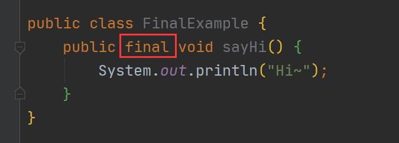
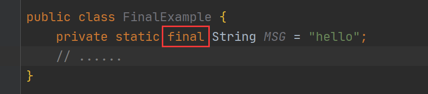
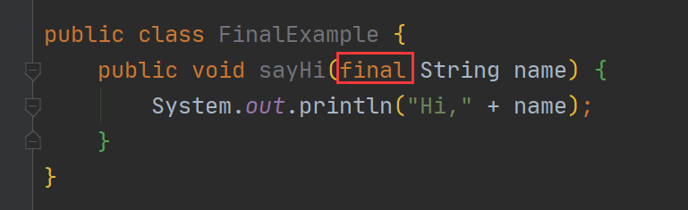
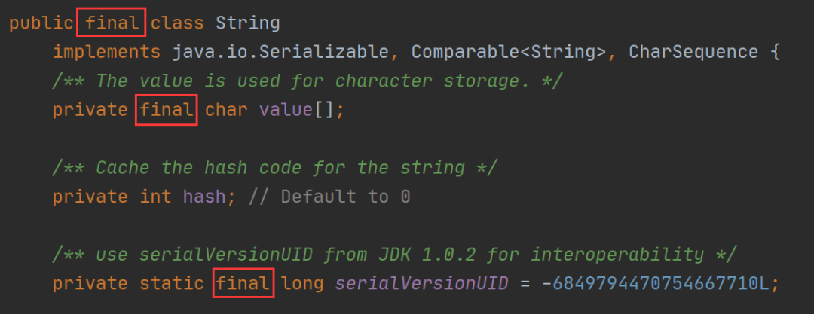

# Java

## `final` 定义
`final` 翻译成中文是“最终”的意思，**它是 Java 中一个常见关键字，使用 ** **final   修饰的对象不允许修改或替换其原始值或定义**




比如类被 `final` 修饰之后，就不能被其他类继承了，如下图所示：




## `final` 的 4 种用法
`final` 的用法有以下 4 种：

1. 修饰类
2. 修饰方法
3. 修饰变量
4. 修饰参数
### 1、修饰类
```java
final class Animal {

}
```



### 2、修饰方法
```java
public class FinalExample {
    public final void sayHi() {
        System.out.println("Hi~");
    }
}
```


### 3、修饰变量
```java
public class FinalExample {
    private static final String MSG = "hello";
    //......
}
```


### 4、修饰参数
```java
public class FinalExample {
    public void sayHi(final String name) {
        System.out.println("Hi," + name);
    }
}
```



## `final` 作用
​	使用 `final` 修饰类可以防止被其他类继承，如 JDK 代码中 String 类就是被 `final` 修饰的，从而防止被其他类继承，导致内部逻辑被破坏。

​	String 类部分源码如下：




## 总结
​	final 是 Java 中常见的一个关键字，被它修饰的对象不允许修改、替换其原始值或定义。final 有 4 种用法，可以用来修饰类、方法、变量或参数。

