## 数据形式
### 标量/向量/矩阵/张量
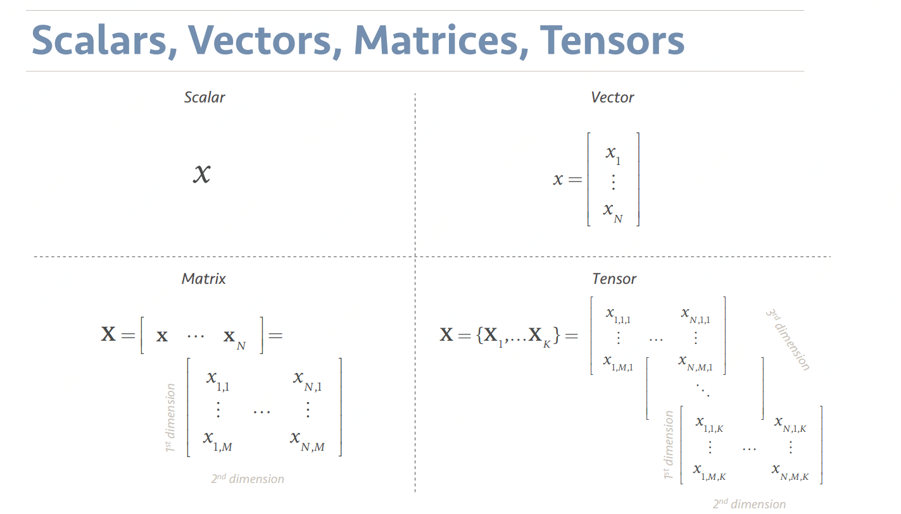

### 1D/2D/3D信号
### 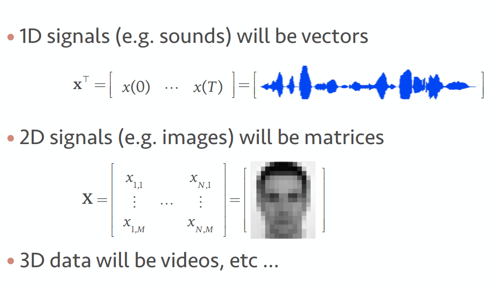

---

## 元素运算
### 加/减(Addition/subtraction)

### 乘(Hadamard product)
 

或  

或

### 除(Division)

将乘法反用

## 矩阵运算

### 转置(Transpose)

### 重塑(Reshaping)
#### vec：回滚回列级（相当于降维度，可帮助避开矩阵或张量）

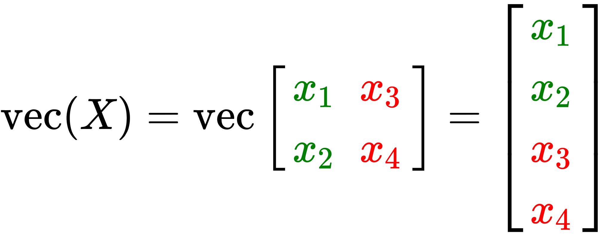

#### vec-transpose：重塑一个的矩阵
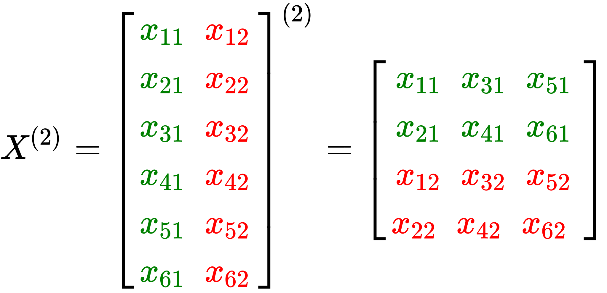

### 迹(Trace)
矩阵主对角线元素之和

### 对角矩阵(Diag)
 

 

### 点乘(Dot product)

### 矩阵-向量乘法(Matrix-vector prodcut)
从点乘运算衍生来，矩阵 的列数必须与向量  的元素数一致

### 矩阵-矩阵乘法(Matrix-matrix product)
矩阵  的列数必须与矩阵  的行数一致，即

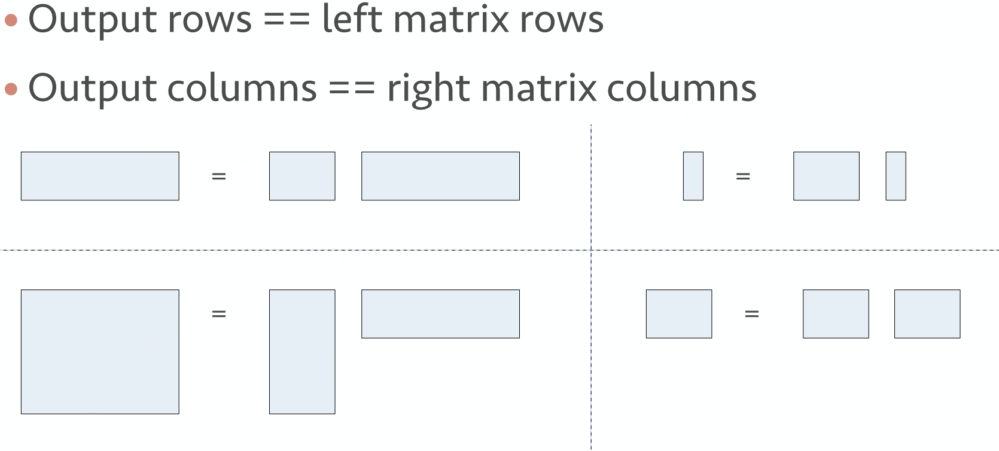

### 对称矩阵(Symmetric)

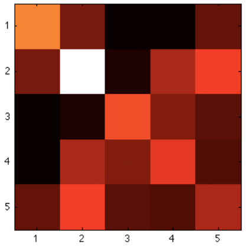

### [正定和半正定(Positve definite&semi-definite)](https://zhuanlan.zhihu.com/p/44860862)
​	正定和半正定这两个词的英文分别是<code>positive definite</code>和<code>positive semi-definite</code>，其中，<code>definite</code>是一个形容词，表示“明确的、确定的”等意思。初学线性代数的读者可能会被这两个词“唬住”，但正定矩阵和半正定矩阵的定义实际上是很简单的 (不考虑复数构成的矩阵)：

+ 【定义1】给定一个的实对称矩阵(即矩阵内元素都是实数的对称矩阵)，若对于任意长度为的非零向量，有恒成立，则矩阵是一个正定矩阵。

+ 【定义2】给定一个的实对称矩阵(即矩阵内元素都是实数的对称矩阵)，若对于任意长度为的非零向量，有恒成立，则矩阵是一个半正定矩阵。注意，正定要求是大于0，半正定可以等于0。

【例1】单位矩阵是否是正定矩阵？

​	解：设向量为非零向量，则。由于，故恒成立，即单位矩阵是正定矩阵。类推，对于任意单位矩阵，给定非零向量.svg)，恒有。所以，单位矩阵是正定矩阵(<code>positive definite</code>)

【例2】实对称矩阵是否是正定矩阵？

解：设向量为非零向量，则，因此，矩阵是正定矩阵。

#### 从二次函数到正定/半正定矩阵

​	在初中数学中，我们学习了二次函数，该函数的曲线会经过坐标原点，当参数时，曲线的“开口”向上，参数时，曲线的“开口”向下。以为例，曲线如下：

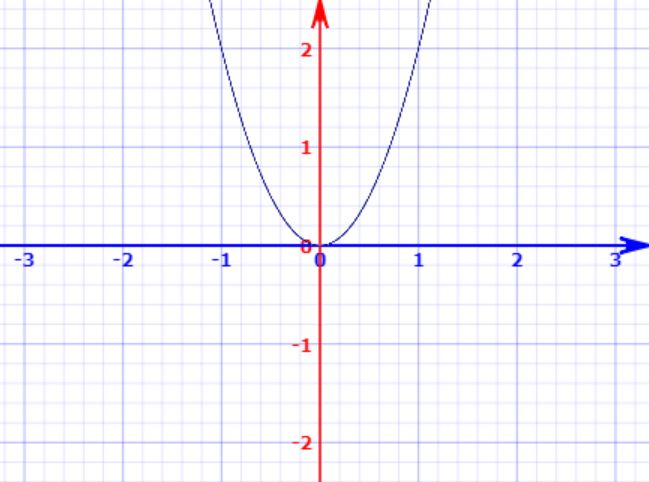

​	实际上，我们可以将视作.svg)的多维表达式。当我们希望对于任意向量.svg)都恒成立，就要求矩阵.svg)是一个半正定矩阵，对应于二次函数，需要使得

​	另外，在.svg)中，我们还知道：若.svg)，则对于任意，有恒成立。这在也有契合之处，当矩阵.svg)是正定矩阵时，对于任意，恒成立

#### 正定矩阵和半正定矩阵的直观解释
【定义3】若给定任意一个正定矩阵和一个非零向量，则两者相乘得到的向量与向量.svg)的夹角恒小于(等价于)

【定义4】若给定任意一个半正定矩阵和一个非零向量，则两者相乘得到的向量与向量.svg)的夹角恒小于或等于(等价于)

【例3】给定向量，对于单位矩阵，则。向量.svg)和.svg)之间的夹角为，即两个向量之间的夹角为0度。

【例4】给定向量，对于实对称矩阵，则。向量.svg)和.svg)之间的夹角为，即两个向量之间的夹角小于.svg)。

#### 协方差矩阵与半正定
​	 协方差的定义：对于任意多元随机变量，协方差矩阵为

​	现给定任意一个向量.svg)，则，其中。由于，因此，，协方差矩阵是半正定的。

### 逆矩阵[非奇异矩阵](inverse)
在线性代数中，给定一个.svg)阶方阵.svg) ，若存在一.svg)阶方阵 ，使得 ，其中  为.svg)阶单位矩阵，则称.svg)是可逆的，且是.svg)的逆矩阵，记作 。

只有正方形.svg)的矩阵，亦即方阵，才可能、但非必然有逆矩阵。若方阵.svg)的逆矩阵存在，则称.svg)为非奇异方阵或可逆方阵。

### 伪逆矩阵[一般化的逆矩阵](pseudoinverse)
​	众所周知只有方阵才有逆矩阵，非方阵没有逆矩阵。这个不和谐的问题已在20世纪初被数学家E. H. Moore等人解决掉了，因为他们发明了一般化的逆矩阵(generalized inverse)，也称为伪逆矩阵(Moore–Penrose pseudoinverse)。对任意一个的矩阵.svg)，的伪逆矩阵必然存在，且必然满足以下四条件：

在应用中，我们利用其性质进行

### [特征值和特征向量(Eigenvalues&Eigenvectors)](https://blog.csdn.net/u010182633/article/details/45921929)
在一般情况下，特征向量矩阵.svg)的特征向量满足下列式子：

其中是所谓的“特征值”的一个标量值。这意味着，向量.svg)上的线性变换.svg)完全由定义。我们可以重写式子为：

然而，假定.svg)不是空向量，等式只能在不可逆的时候才能被定义。如果一个方阵是不可逆的，这意味着它的行列式必须等于零。因此，要找到.svg)的特征向量，我们只需要解决以下公式：

### [奇异值分解(SVD)](http://shartoo.github.io/SVD-decomponent/)
从几何层面上去理解二维的SVD：对于任意的矩阵，通过SVD可以将一个相互垂直的网格(orthogonal grid)变换到另外一个相互垂直的网格。 我们可以通过向量的方式来描述这个事实: 首先，选择两个相互正交的单位向量和, 向量和正交。

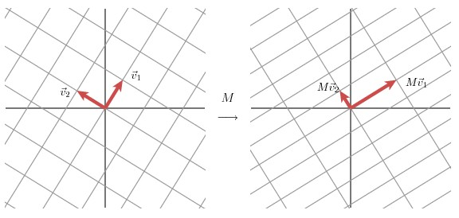

和分别表示和的单位向量，和。和分别表示这不同方向向量上的模，也称作为矩阵的奇异值。

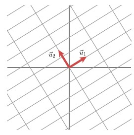

这样我们就有了如下关系式：

​	我们现在可以简单描述下经过线性变换后的向量.svg)的表达形式。由于向量和是正交的单位向量，我们可以得到如下式子（单位向量乘以向量即此向量在单位向量方向上的映射)

这就意味着：

向量内积可以用向量的转置来表示，如下所示：

最终的式子为：

上述的式子经常表示成：

矩阵的列向量分别是，是一个对角矩阵，对角元素分别是对应的.svg)和.svg)，矩阵的列向量分别是。上角标表示矩阵.svg)的转置。

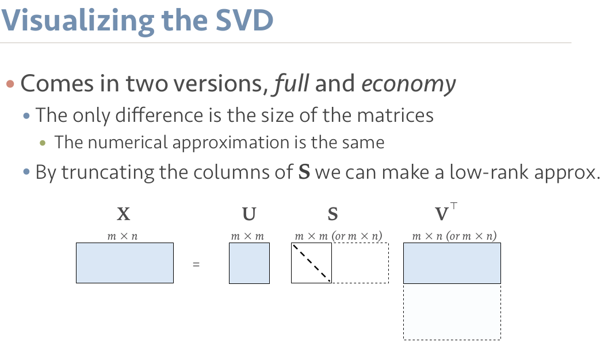

### Norms
#### 2-norms

#### p-norms

#### Frobenius norm
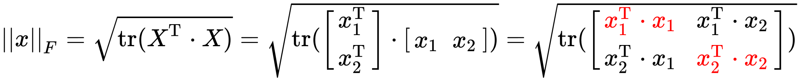

## 张量运算
### Kronecker product
矩阵.svg)中每个元素作为标量去乘矩阵.svg)，其结果对应元素在矩阵.svg)中位置

通过Kronecker products以及vec运算我们可以完成多线性转换

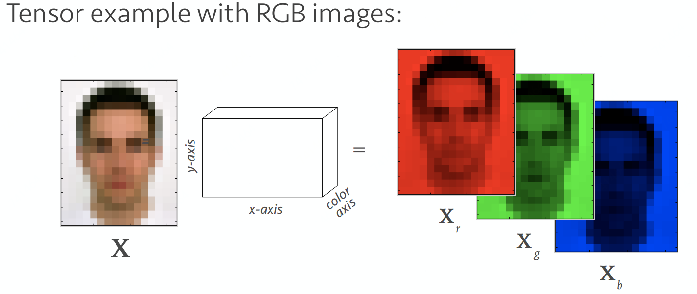

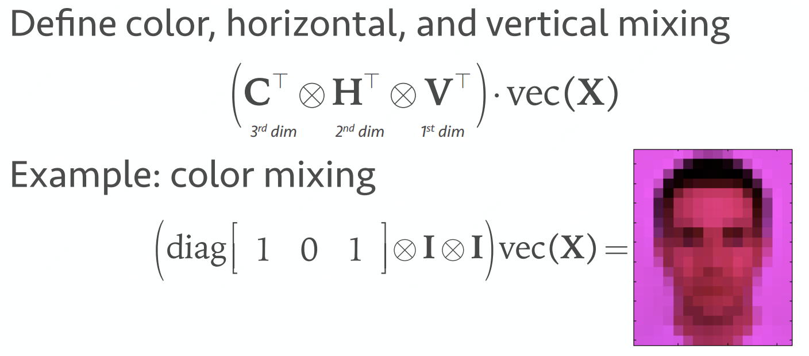

## Source
[http://shartoo.github.io/SVD-decomponent/](http://shartoo.github.io/SVD-decomponent/)

[https://blog.csdn.net/u010182633/article/details/45921929](https://blog.csdn.net/u010182633/article/details/45921929)

[https://github.com/chmx0929/UIUCclasses/blob/master/598MachLrngforSignalProcessng/Slide/Lecture 1 - Intro%2C Linear Algebra.pdf](https://github.com/chmx0929/UIUCclasses/blob/master/598MachLrngforSignalProcessng/Slide/Lecture%201%20-%20Intro%2C%20Linear%20Algebra.pdf)

[https://zhuanlan.zhihu.com/p/44860862](https://zhuanlan.zhihu.com/p/44860862)
