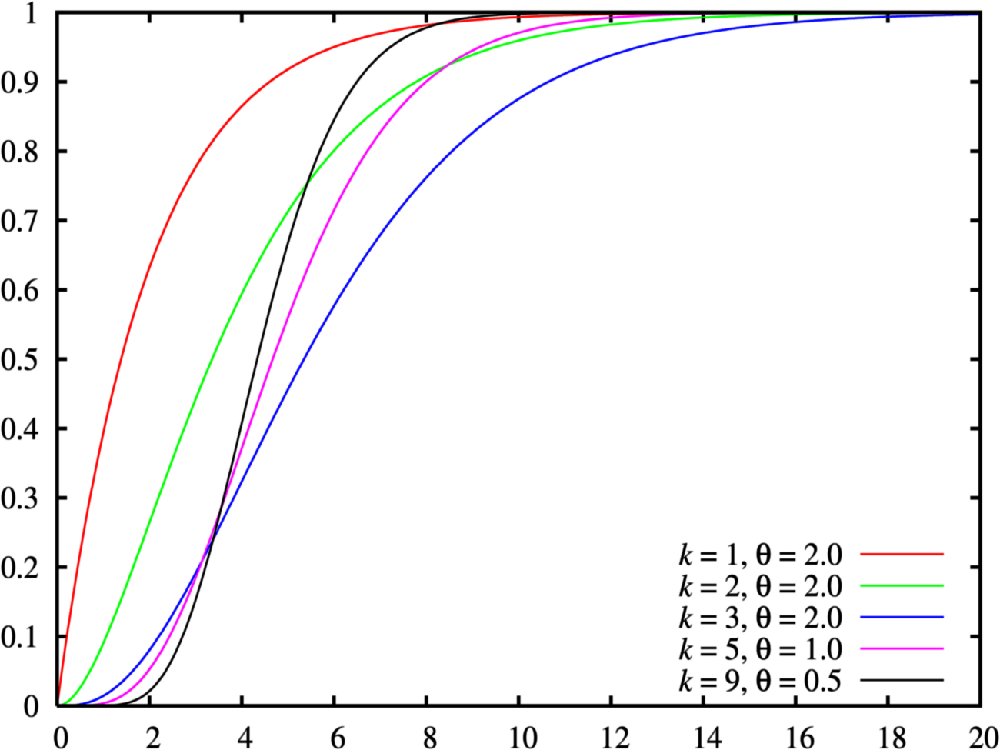
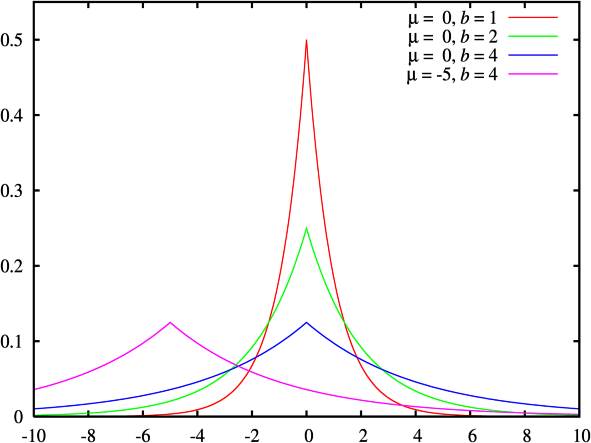
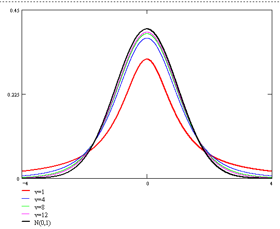

## [PDF vs. PMF vs. CDF](https://www.zhihu.com/question/36853661/answer/69775009)

### PDF(Probability Density Function)

如果.svg)是一元连续性随机变量，那么可以定义他的概率密度函数（probability density function, PDF），有时简称为密度函数。我们用PDF在某一区间上的积分来刻画随机变量落在这个区间中的概率，即

### PMF(Probability Mass Function)

如果.svg)是一元离散性随机变量，那么可以定义它的概率质量函数（probability mass function, PMF）。与连续型随机变量不同，这里的PMF其实就是高中所学的离散型随机变量的分布律，即

比如对于掷一枚均匀硬币，如果正面令，如果反面令。则在状态空间(这是一个伯努利(Bernoulli)随机变量)中，的概率是。那么它的PMF就是

### CDF(Cumulative Distribution Function)

不管.svg)是什么类型（连续/离散/其他）的随机变量，都可以定义它的累积分布函数（cumulative distribution function ,CDF），有时简称为分布函数。CDF的定义是

对于连续型随机变量，那么CDF就是PDF的积分，PDF就是CDF的导数

对于离散型随机变量，其CDF是阶梯状的分段函数，比如举例中的掷硬币随机变量，它的CDF如下

---

## 概率分布
### 伯努利分布(Bernoulli)

伯努利分布是关于布尔变量的概率分布，其连续参数表示变量的概率

### 二项分布(Binomial)

二项分布就是重复.svg)次独立的伯努利试验，即当时，二项分布退化为伯努利分布。在每次试验中只有两种可能的结果，而且两种结果发生与否互相对立，并且相互独立，与其它各次试验结果无关，事件发生与否的概率在每一次独立试验中都保持不变。

一枚硬币扔.svg)次，扔出正面概率为.svg)，得到次正面的概率：

当.svg)非常大且固定时，我们就得到，的正态分布

### 泊松分布(Poisson)

当.svg)非常大且很小时，我们就得到泊松分布。泊松分布可作为二项分布的近似，通常当，时，就可以用泊松公式近似得计算：

由二项分布：

当时([自然底数e介绍](https://www.yuque.com/angsweet/machine-learning/huczfz#DuIdK))：

和

所以，代入上式：

### [多项分布(Multinomial)](http://crescentmoon.info/2012/09/23/%E5%A4%9A%E9%A1%B9%E5%88%86%E5%B8%83%E6%A6%82%E7%8E%87%E5%85%AC%E5%BC%8F%E7%9A%84%E7%90%86%E8%A7%A3/)

​	二项分布的典型例子是扔硬币，硬币正面朝上概率.svg), 重复扔.svg)次硬币，.svg)次为正面的概率即为一个二项分布概率。把二项分布推广至多种状态如掷骰子(6种状态)，就可得多项分布。由二项分布.svg)，第一部分即表示扔.svg)次硬币正面朝上.svg)次有多少种组合，第二部分即扔.svg)次正面概率次背面概率。推广到多项式如下：

​	设我们现在有.svg)个相同箱子，每个箱子都含.svg)个标记为的小球，每次从一个箱子里取出一个小球，表示取出标记为小球的个数，显然(一个箱子取一个球，取出的球总数和箱子数一致)。我们取出个，个...个有多少种取法呢？即下式：

 (每拿个球就表示少了个可拿球箱子)

                             

                                  (又)

                             

这里即多项分布第一部分(表示取出.svg)个.svg)，.svg)个.svg)... .svg)个.svg)有多少种取法)，第二部分显然就是他们的概率与次数作为次方的累乘，即如下公式：

### [伽玛分布(Gamma)](http://www.victoriawy.com/wp-content/uploads/2017/12/LDA%E6%95%B0%E5%AD%A6%E5%85%AB%E5%8D%A6.pdf)

函数，也叫做伽玛函数（Gamma函数），是阶乘函数在实数与复数域上的扩展。如果.svg)为正整数，则：

对于实数部分为正的复数.svg)，伽玛函数定义为：

通过分部积分的方法，可以推导出这个函数有如下递归性质：

我们把数列的通项公式定义从整数集合延拓到实数集合，例如可用通项公式表达。直观的说，也就是可以找到一条平滑的曲线通过通过所有的整数点这些点，从而把定义在整数集上的公式延拓到实数集合。对于阶乘序列，我们可以计算，，那么如何计算呢？

通过欧拉的推导，我们就有了： ，为什么不定义为，可能因为通过Gamma函数构造Beta函数时，Beta函数更协调。

对Gamma函数的定义做一个变形，就可以得到如下式子：

于是，取积分中的函数作为概率密度，就得到一个形式最简单的Gamma分布的密度函数：

如果做一个变换，就得到Gamma分布更一般形式

Gamma分布是统计学的一种连续概率函数。伽玛分布中的参数，称为形状参数(shape parameter)，主要决定了分布曲线的形状；称为尺度参数(rate parameter)或者称为scale parameter，主要决定曲线有多陡。

Gamma分布和众多统计分布都有千丝万缕的联系。我们容易发现，Gamma分布的概率密度和Poisson分布在数学形式上具有高度的一致性：

在Gamma分布的密度中取，得到

两个分布数学形式上一致，只是Poisson分布是离散的，Gamma分布是连续的，可以直观的认为Gamma分布是Poisson分布在正实数集上的连续化版本。

### [贝塔分布(Beta)](https://www.zhihu.com/question/30269898)

贝塔函数(B函数或第一类欧拉积分)，是一个特殊函数，由下式定义：

贝塔函数具有对称性质；当是正整数时，我们可以从Gamma函数定义得到如下式子，它有许多其他形式，比如

假设一均匀分布，随机生成10个数，把这10个数排序，问第7大的数的概率分布是多少？这就是一个Beta分布。

我们先将之一般化，对于一般的情况的概率密度是什么呢？下面，我们尝试计算一下落在一个区间的概率值：

如上图所示，我们把区间划分成，.svg)，三段。我们假定，足够小，只能够容纳一个点，则由排列组合理论可得

所以我们可以得到的概率密度函数为

                                                         

                                                         

                                                         

我们取，，于是

这就是Beta分布

回到上面题目，把，带入其中，得到密度函数

贝塔分布是关于连续变量.svg)的概率分布，它由两个参数.svg)和确定，概率密度函数如下

### [狄利克雷分布(Dirichlet)](https://www.zhihu.com/question/26751755)

狄利克雷分布是关于一组个连续变量的概率分布，.svg)，令，参数，，。Dirichlet是多变量普遍化的Βeta分布，常用于成分分析模型，可以看到，将时，Dirichlet退化为Beta分布。

其中均值， 方差 ，协方差

### 高斯分布(Gaussian)

高斯分布是最常见的数据分布，又称正态分布

，其中均值，协方差

若损失函数使用欧氏距离的平方：

### 拉普拉斯分布(Laplacian)

拉普拉斯分布多用于稀疏模型，比高斯分布要陡，使用绝对距离非欧氏距离

，其中均值，协方差

### 指数分布(Exponential Family)

任何分布写成，其中包含参数，是.svg)的函数，为了标准化

比如高斯：将 ，，，

代入

### [共轭分布(Conjugate)](https://blog.csdn.net/baimafujinji/article/details/51374202)

​	假设变量.svg)服从分布，其中为参数。为变量.svg)的观测样本，假设参数.svg)服从先验分布。若由先验分布和抽样分布(实验数据)决定的后验分布与是同种类型的分布，则称先验分布为分布或的共轭分布(Conjugate Distribution)

​	其中，贝塔分布(Beta)与伯努利分布(Bernoulli)共轭；狄利克雷分布(Dirichlet)与多项分布(Multinomial)共轭；高斯分布的共轭分布仍是高斯分布

​	先验分布反映了某种先验信息；后验分布既反映了先验分布提供的信息，又反映了样本提供的信息。当先验分布与抽样分布(实验数据)共轭时，后验分布与先验分布属于同种类型，这意味着先验信息与样本提供的信息具有某种同一性。于是，若使用后验分布作为进一步抽样的先验分布，则新的后验分布仍将属于同种类型。因此，共轭分布在不少情况下会使得问题得以简化。

## 统计检验

### [t分布(Student's t)](https://zhuanlan.zhihu.com/p/138711532)

​	t检验（t test）又称学生t检验（Student t-test）可以说是统计推断中非常常见的一种检验方法，用于统计量服从正态分布，但方差未知的情况。

​	t检验的前提是要求样本服从正态分布或近似正态分布，不然可以利用一些变换（取对数、开根号、倒数等等）试图将其转化为服从正态分布是数据，如若还是不满足正态分布，只能利用非参数检验方法。不过当样本量大于30的时候，可以认为数据近似正态分布

t检验最常见的四个用途：

1. 单样本均值检验（One-sample t-test）用于检验 **总体方差未知、正态数据或近似正态的单样本的均值是否与已知的总体均值相等**
2. 两独立样本均值检验（Independent two-sample t-test）用于检验 **两对独立的正态数据或近似正态的样本的均值是否相等，这里可根据总体方差是否相等分类讨论**
3. 配对样本均值检验（Dependent t-test for paired samples）用于检验 **一对配对样本的均值的差是否等于某一个值**
4. 回归系数的显著性检验（t-test for regression coefficient significance）用于检验 **回归模型的解释变量对被解释变量是否有显著影响**

​	在概率论和统计学中，学生t-分布（t-distribution），可简称为t分布，用于根据小样本来估计呈正态分布且方差未知的总体的均值。如果总体方差已知（例如在样本数量足够多时），则应该用正态分布来估计总体均值。t分布曲线形态与.svg)（确切地说与[自由度](https://baike.baidu.com/item/%E8%87%AA%E7%94%B1%E5%BA%A6/5936984)）大小有关。与标准正态分布曲线相比，自由度越小，t分布曲线愈平坦，曲线中间愈低，曲线双侧尾部翘得愈高；自由度愈大，t分布曲线愈接近正态分布曲线，当自由度时，t分布曲线为标准正态分布曲线。

​	由于在实际工作中，往往是未知的，常用作为的估计值，为了与u变换区别，称为t变换，统计量t 值的分布称为t分布。 假设.svg)是呈正态分布的独立的随机变量（随机变量的期望值是.svg)，方差是但未知)。 令：

样本均值：， 样本方差：

它显示了数量.svg)呈正态分布且均值为，方差为(标准正态分布)

另一个相关数量：

上式的概率密度函数是：

的分布称为t分布，参数一般称为[自由度](https://www.yuque.com/angsweet/machine-learning/huczfz#aWNn3)，.svg)是伽马函数。

的概率密度函数的形状类似于均值为0方差为1的正态分布，但更低更宽。随着自由度的增加，则越来越接近均值为0方差为1的正态分布。

### [卡方分布(Chi-square)](https://blog.csdn.net/bitcarmanlee/article/details/52279907)

卡方分布()是一种特殊的伽马分布(Gamma)，是统计推断应用最为广泛的概率分布之一，例如假设检验和置信区间的计算。.svg)个独立的标准正态分布变量的平方和服从自由度为.svg)的卡方分布。

若.svg)个独立的随机变量是相互独立， 符合标准正态分布的随机变量（数学期望为.svg) 、方差为.svg)），则随机变量的平方和：

被称为服从[自由度](https://www.yuque.com/angsweet/machine-learning/huczfz#oCTeB)为.svg)的卡方分布，记作：

 或 

### [F分布(F-distribution)](https://blog.csdn.net/suzyu12345/article/details/80135732)

在概率论和统计学里，F-分布(F-distribution)是连续概率分布，被广泛应用于似然比率检验，特别是[方差分析(ANOVA)](https://baike.baidu.com/item/%E6%96%B9%E5%B7%AE%E5%88%86%E6%9E%90)。若总体，与为来自.svg)的两个独立样本，设统计量

则称统计量.svg)服从自由度和的.svg)分布，记为，.svg)分布的概率密度为

## Source

[https://github.com/chmx0929/UIUCclasses/blob/master/598MachLrngforSignalProcessng/Slide/Lecture 2 - Probability%2C Statistics%2C PE.pdf](https://github.com/chmx0929/UIUCclasses/blob/master/598MachLrngforSignalProcessng/Slide/Lecture%202%20-%20Probability%2C%20Statistics%2C%20PE.pdf)
