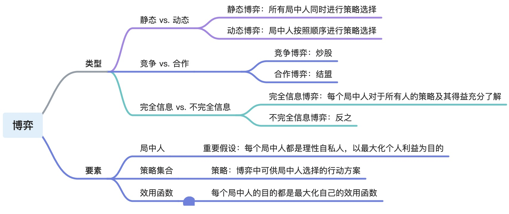

# 博弈的类型与要素

# 纳什均衡
## 定义

- 最佳应对：对于 局中人2 给出的策略，局中人1 可选的策略集合里，能让其获得最大收益的策略，称为局中人1的最佳应对。
- 纳什均衡：如果一个局势下，每个局中人的策略都是相对其他局中人当前策略的最佳应对，则称该局势是一个纳什均衡。

纳什均衡是一个僵局，没有人有打破僵局的积极性，谁动谁就吃亏。

## 例子：囚徒困境

- 局中人：两个囚徒
- 策略：抗拒、坦白
- 效用函数矩阵：
|  |  | 囚徒B | 囚徒B |
| --- | --- | --- | --- |
|  |  | 抗拒 | 坦白 |
| 囚徒A | 抗拒 | -1, -1 | -10, 0  |
| 囚徒A | 坦白 | 0, -10 | -3, -3 |

- 纳什均衡：双方都坦白
   - 一方保持策略不变（坦白），另一方如果改变策略（抗拒），其效用会降低（从-3变成-10） 

# 混合策略纳什均衡
## 定义
混合策略：每个局中人以某个概率分布在其策略集合中选择策略 

混合策略下的纳什均衡：

- 定义和纯策略纳什均衡一致：基于最佳应对定义 
- 必要条件：给定其他局中人的策略选择概率分布的情况下，当前局中人选择任意一个策略获得的期望效用相等

## 例子：剪刀-石头-布 

- 策略
   - 玩家一的策略选择分布记为𝑝={𝑝1, 𝑝2, 1−𝑝1−𝑝2}，分别对应出剪刀、石头、布的概率
   - 玩家二的策略选择分布记为𝑞={𝑞1, 𝑞2, 1−𝑞1−𝑞2}；
- 收益
   - 赢者收益为1，输者收益为-1，平局两人收益都为0
- 假设玩家一的策略不变，玩家二各个选择的期望效用为：
   - 剪刀：0 * 𝑝1 + (-1) * 𝑝2 + 1 * (1−𝑝1−𝑝2) 
   - 石头：1 * 𝑝1 +   0  * 𝑝2 + (-1) * (1−𝑝1−𝑝2) 
   - 布   ：(-1) * 𝑝1 + 1 * 𝑝2 + 0 * (1−𝑝1−𝑝2) 
- 令玩家二的各个策略的效用相等，得到𝑝1=𝑝2=1/3，同理，𝑞1=𝑞2=1/3
- 剪刀-石头-布的混合纳什均衡态 
   - 每个玩家各以1/3的概率选择剪刀、石头和布，期望收益为0

# 帕累托最优与社会最优
## 定义

- 帕累托最优：对于一组策略选择（局势），若不存在其他策略选择使所有参与者得到不少于目前的回报，且至少一个参与者会得到严格高于目前的回报，则这组策略选择为帕累托最优 
- 社会最优：使各个参与者的回报之和最大的策略选择

## 例子

- 囚徒困境
   - 帕累托最优：（抗拒，抗拒）、（抗拒，坦白）、（坦白，抗拒）都是帕累托最优。对于（抗拒，抗拒）这种选择来说，如果囚徒B从抗拒变成坦白，囚徒B的收益是增加了，但是囚徒A收益降低了，不符合帕累托最优，其他同理。
   - 社会最优：两人都抗拒，总收益是 -2
|  |  | 囚徒B | 囚徒B |
| --- | --- | --- | --- |
|  |  | 抗拒 | 坦白 |
| 囚徒A | 抗拒 | -1, -1 | -10, 0  |
| 囚徒A | 坦白 | 0, -10 | -3, -3 |

# 应用
## 拍卖

- 一个卖家、多个买家 
### 首价密封报价拍卖 

- 定义：竞拍者同时向拍卖者提交密封报价，出价最高的竞拍者竞得，以其出价购买该商品 

### 次价密封报价拍卖

- 定义：竞拍者同时向拍卖者提交密封报价，出价最高的竞拍者竞得，以第二高出价购买该商品 

 

## 讨价

- 多个卖家、一个买家 

 

