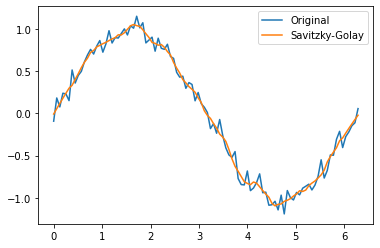
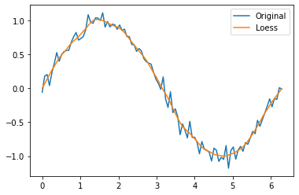
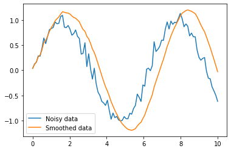

# 算法对比
|  | 优点 | 缺点 |
| --- | --- | --- |
| Savitzky-Golay | <br />- 实现简单<br />- 可以保留曲线的特征<br />- 平滑效果好，能够减少噪声的影响<br /> | <br />- 对于高斯白噪声以外的噪声，效果不好<br />- 对于数据点稀疏的曲线，可能会出现过度拟合的情况<br />- 对于需要高阶多项式拟合的曲线，计算复杂度会增加<br /> |
| Loess | <br />- 可以保留曲线的特征<br />- 能够拟合非线性曲线，平滑效果好<br />- 对于数据点稀疏的曲线也能较好地处理<br /> | <br />- 可能会出现过拟合从而损失曲线的特征<br />- 由于使用局部多项式进行拟合，计算复杂度较高<br />- 平滑效果会随着窗口大小的变化而变化，需要选取合适的窗口大小<br /> |
| Kalman | <br />- 对于多维数据可以做到同时平滑<br />- 对高斯白噪声效果好，平滑效果较好<br />- 通过动态模型进行预测和修正，可以适应动态系统变化<br /> | <br />- 对于非高斯噪声，效果较差<br />- 对于高维数据，计算复杂度会增加<br />- 实现相对复杂，需要了解系统的动态模型<br /> |


# 算法细节
## Savitzky-Golay 平滑
Savitzky-Golay 算法是一种广泛应用于曲线平滑的线性滤波算法。该算法通过拟合多项式来近似曲线，然后使用滑动窗口对每个点进行平滑处理。这种方法可以减少噪声的影响，同时保留曲线的特征。

Savitzky-Golay 平滑算法是一种基于多项式拟合的曲线平滑算法。该算法的核心思想是使用局部多项式来拟合数据，并使用拟合结果来近似估计数据的平滑值。Savitzky-Golay 平滑算法通过寻找最佳拟合多项式的系数来平滑数据，其基本思想是将拟合多项式的系数视为一个线性滤波器的系数，从而实现对数据的平滑。

```python
import numpy as np
from scipy.signal import savgol_filter
import matplotlib.pyplot as plt

# 生成一个带噪声的正弦曲线
t = np.linspace(0, 2*np.pi, 100)
x = np.sin(t) + np.random.normal(0, 0.1, 100)

# 使用Savitzky-Golay算法进行曲线平滑
y = savgol_filter(x, window_length=11, polyorder=2)

# 绘制原始曲线和平滑后的曲线
plt.plot(t, x, label='Original')
plt.plot(t, y, label='Savitzky-Golay')
plt.legend()
plt.show()
```


## Loess 平滑
Loess 平滑算法是一种非参数回归算法，适用于对非线性曲线进行平滑处理。该算法通过在数据点附近拟合局部多项式来平滑曲线。与 Savitzky-Golay 算法相比，Loess 算法具有更高的平滑度，但可能会失去一些曲线特征。

Loess 平滑算法（局部加权散点图拟合算法）是一种基于局部加权回归的曲线平滑算法。该算法的核心思想是对于每个数据点，使用一个局部的加权回归模型来拟合其周围的数据点，从而得到该点的平滑值。Loess 平滑算法的平滑程度可以通过权重函数来调整，这使得该算法能够适应各种不同的数据类型和平滑要求。

```python
import numpy as np
from statsmodels.nonparametric.smoothers_lowess import lowess
import matplotlib.pyplot as plt

# 生成一个带噪声的正弦曲线
t = np.linspace(0, 2*np.pi, 100)
x = np.sin(t) + np.random.normal(0, 0.1, 100)

# 使用Loess算法进行曲线平滑
y = lowess(x, t, frac=0.1, it=0)[:, 1]

# 绘制原始曲线和平滑后的曲线
plt.plot(t, x, label='Original')
plt.plot(t, y, label='Loess')
plt.legend()
plt.show()
```



## Kalman 滤波

Kalman 滤波算法是一种经典的滤波算法，适用于动态系统建模和控制。该算法通过预测和修正来估计系统状态，可以用于曲线平滑和噪声去除。Kalman 滤波算法适用于带有高斯噪声的曲线平滑，但对于非高斯噪声的曲线，可能需要其他算法。

Kalman 滤波算法是一种递归滤波算法，用于动态系统的状态估计和预测。在曲线平滑中，Kalman 滤波算法的核心思想是根据测量值和状态转移方程，对状态进行递归估计和预测，并使用卡尔曼增益来调整预测值和测量值之间的权重。Kalman 滤波算法对于噪声和不确定性具有较好的抗干扰能力，因此在一些特殊场合，如传感器数据处理和机器人路径规划等方面得到广泛应用。

```python
import numpy as np
import matplotlib.pyplot as plt
from filterpy.kalman import KalmanFilter

# 生成一组噪音数据
t = np.linspace(0, 10, 100)
y = np.sin(t) + np.random.normal(0, 0.1, 100)

# 生成一个滤波器对象
kf = KalmanFilter(dim_x=2, dim_z=1)
kf.x = np.array([0, 0])  # 设置初始化状态 
kf.F = np.array([[1, 1], [0, 1]])  #设置状态转移矩阵 
kf.H = np.array([[1, 0]])  #测量矩阵 
kf.P = np.diag([1, 1])  #协方差矩阵 
kf.Q *= 1e-5  # 过程噪声方差 
kf.R = 0.1  # 测量噪声方差 

#使用Kalman滤波器来预测和更新状态，最后将平滑的位置保存到列表中
xhat_list = []
P_list = []
for i in range(len(t)):
    kf.predict()
    kf.update(y[i])
    xhat_list.append(kf.x[0])
    P_list.append(kf.P[0, 0])

#绘制对比图
plt.plot(t, y, label='Noisy data')
plt.plot(t, xhat_list, label='Smoothed data')
plt.legend()
plt.show()
```


# Source
[有没有比较优秀的曲线平滑算法啦？求推荐? - 知乎](https://www.zhihu.com/question/491650506/answer/3134150489)
