# 模型
## 一生三
基于小学数学知识我们可知是一条直线，确定了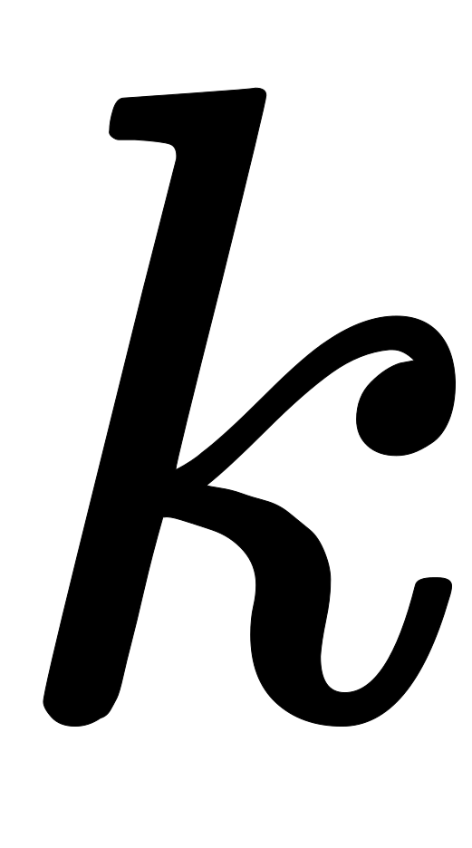和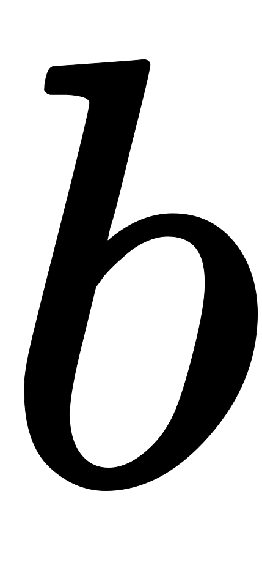就可以在图上画出一条直线。算法最基础本质的任务其实就是：**确定参数****和****，找到这条直线**。如下图，

- 左图(分类)：一条最合适的线区分两种点，比如横轴为体重，纵轴为身高，红蓝为男女
- 右图(回归)：一条线拟合点的趋势，比如0-20岁体重变化

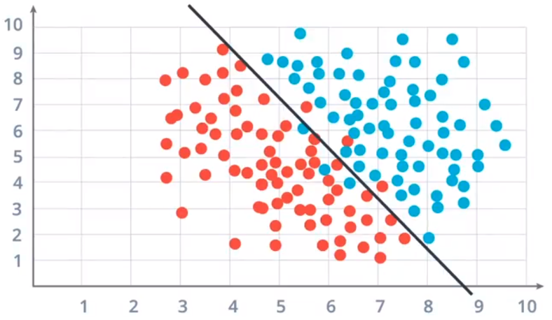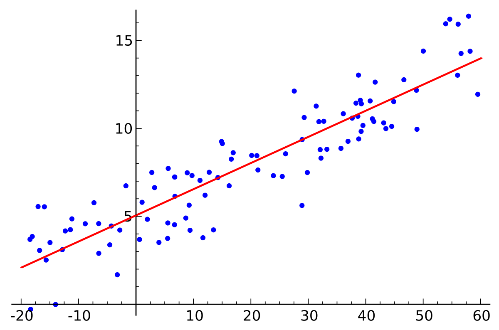

从一元推广到多元(多个，即有多个自变量)，我们把斜率换成权重，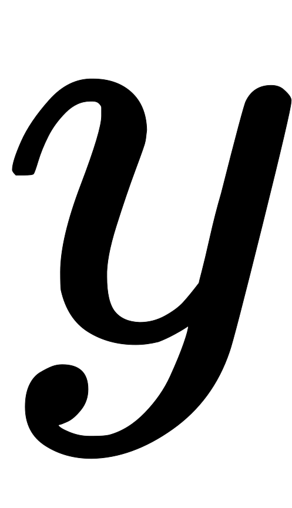换成函数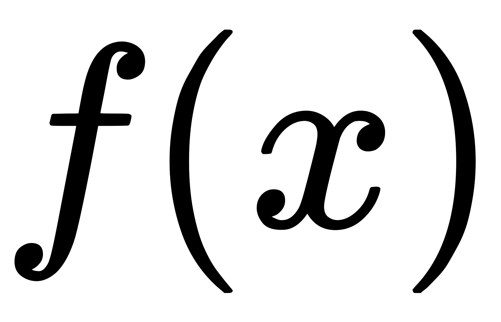表示：

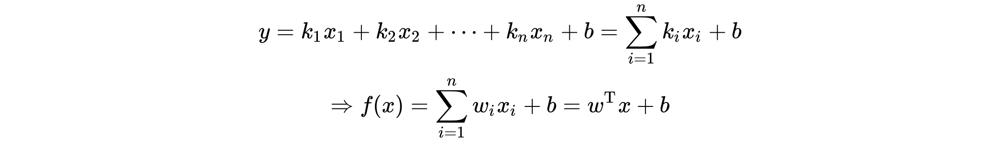

一切的起点就是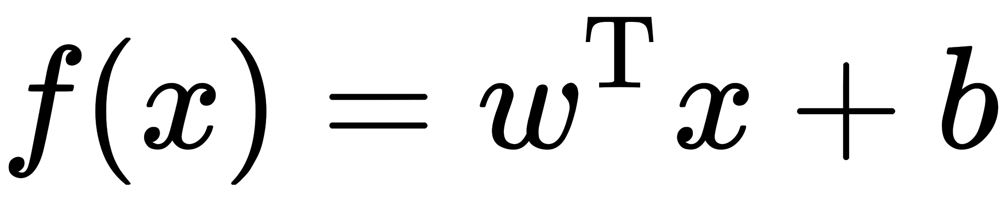，只不过做了不同方面的优化

- 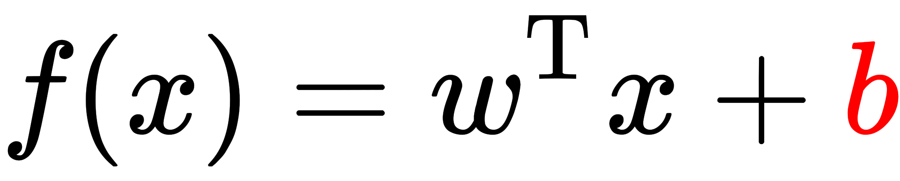，对做优化，引出了[岭回归](https://www.yuque.com/angsweet/machine-learning/ji-qi-xue-xi_ji-qi-xue-xi_xian-xing-mo-xing#a3929cd4)、[Lasso](https://www.yuque.com/angsweet/machine-learning/ji-qi-xue-xi_ji-qi-xue-xi_xian-xing-mo-xing#a3929cd4)、[弹性网络](https://www.yuque.com/angsweet/machine-learning/ji-qi-xue-xi_ji-qi-xue-xi_xian-xing-mo-xing#a3929cd4)等模型
- 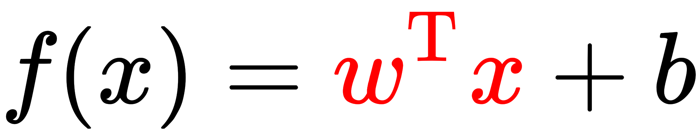，对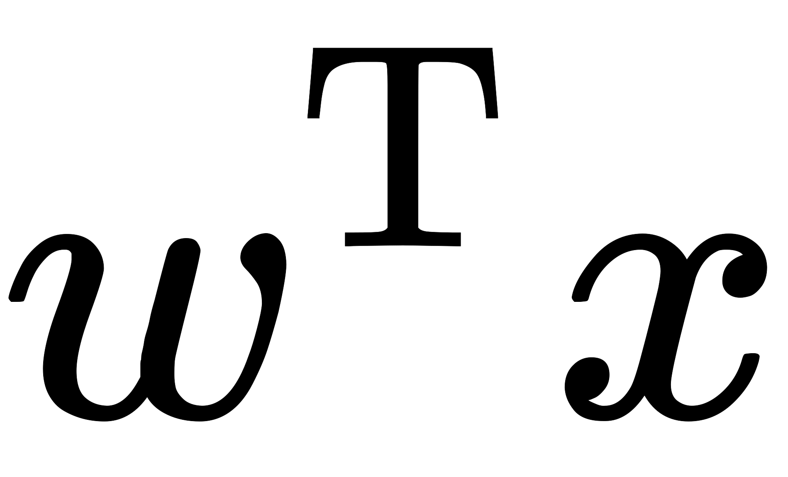做优化，引出了[SVM](https://www.yuque.com/angsweet/machine-learning/ji-qi-xue-xi_ji-qi-xue-xi_zhi-chi-xiang-liang-ji)、[FM](https://www.yuque.com/angsweet/machine-learning/bcfpcs#Hyc1X)、[FFM](https://www.yuque.com/angsweet/machine-learning/bcfpcs#4JrZP)等模型
- 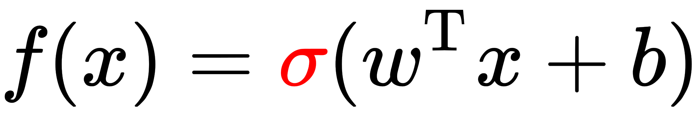，在外部添加映射(激活)函数，引出了[LR](https://www.yuque.com/angsweet/machine-learning/ji-qi-xue-xi_ji-qi-xue-xi_xian-xing-mo-xing#6993c24f)、[DNN(MLP)](https://www.yuque.com/angsweet/machine-learning/cugayd)等模型

## 非线性
这里针对第一种(对做优化)暂时不做展开，重点讲一下后两种，因为我们问题变了，或者说实际问题要比上面图里举得例子复杂得多，比如下图，需要一条曲线才能分开两类点，即大多数实际问题都是非线性的，需要非线性方法解决，后两种优化即可实现非线性变化

### 升维度
，对做优化，既然二维解决不了问题，那就升维度，像下面的北京四合院，想画出右下图绿线区分阴影和红门怎么画，二维非线性，但可能升到三维就是线性了

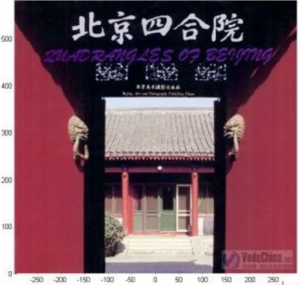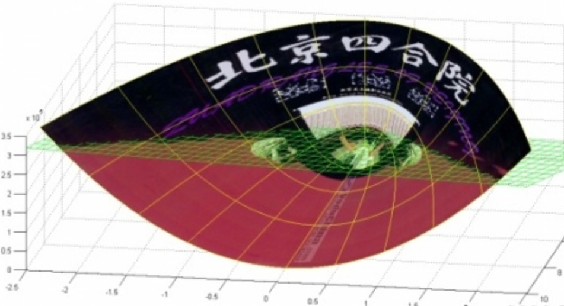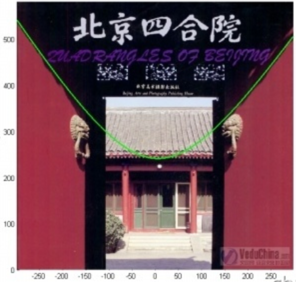 组合自变量特征，根据组合方式不同即为不同模型：

   - [SVM](https://www.yuque.com/angsweet/machine-learning/ji-qi-xue-xi_ji-qi-xue-xi_zhi-chi-xiang-liang-ji)：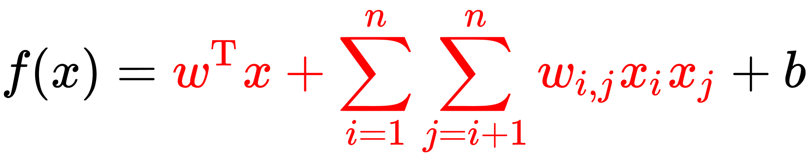，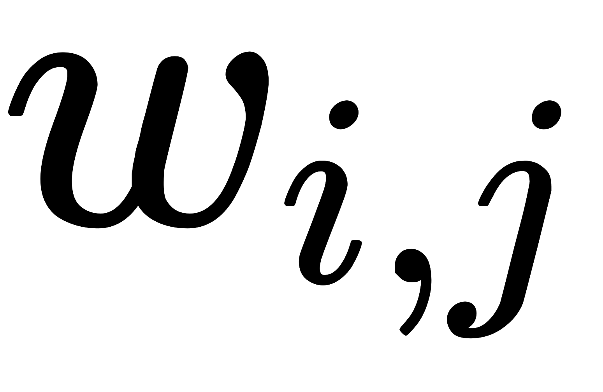为特征组合参数
   - [FM](https://www.yuque.com/angsweet/machine-learning/bcfpcs#Hyc1X)：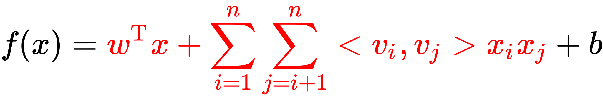，为特征向量内积
   - [FFM](https://www.yuque.com/angsweet/machine-learning/bcfpcs#4JrZP)：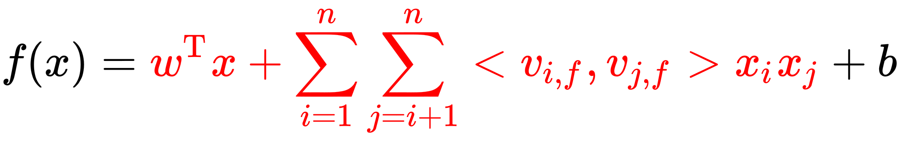，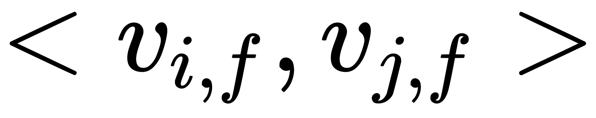为特征场矩阵

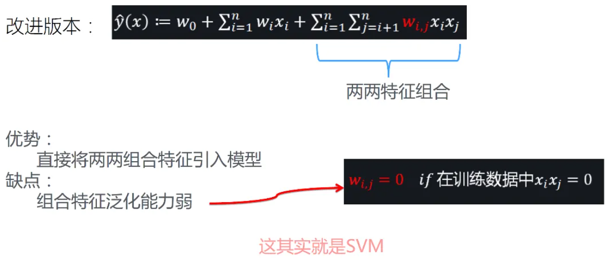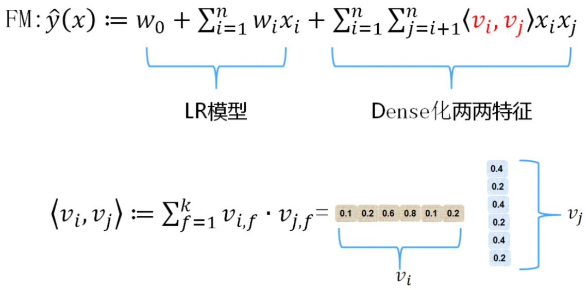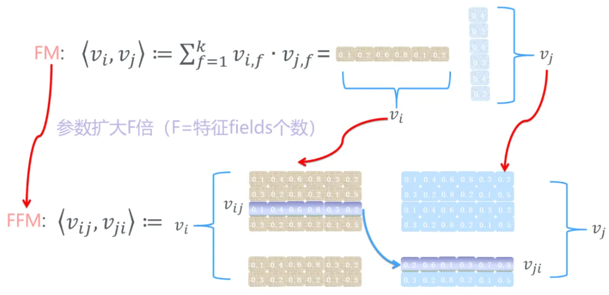

### 拆任务
，在外部添加映射(激活)函数，即将线性的输出通过特定的映射(激活)函数映射到另一维度，从而实现非线性变化，[多个这种非线性模块组合在一起理论上就能解决所有问题(万能近似定理)](https://www.yuque.com/angsweet/machine-learning/shen-du-xue-xi_shen-du-xue-xi_readme)：

   - [LR](https://www.yuque.com/angsweet/machine-learning/ji-qi-xue-xi_ji-qi-xue-xi_xian-xing-mo-xing#6993c24f)：，为sigmoid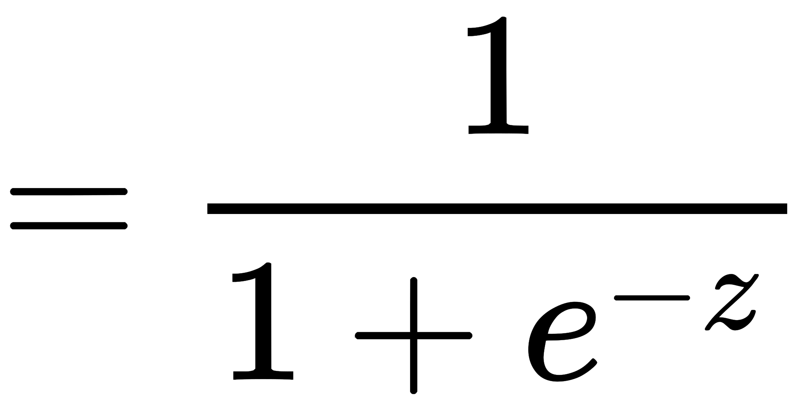，代入即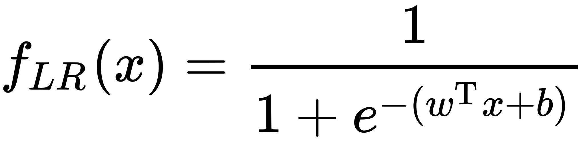
   - [DNN](https://www.yuque.com/angsweet/machine-learning/cugayd)：，为ReLU等[激活函数](https://www.yuque.com/angsweet/machine-learning/shen-du-xue-xi_shen-du-xue-xi_shen-du-qian-kui-wang-luo_ji-huo-han-shu)，多个连接即DNN，如下图

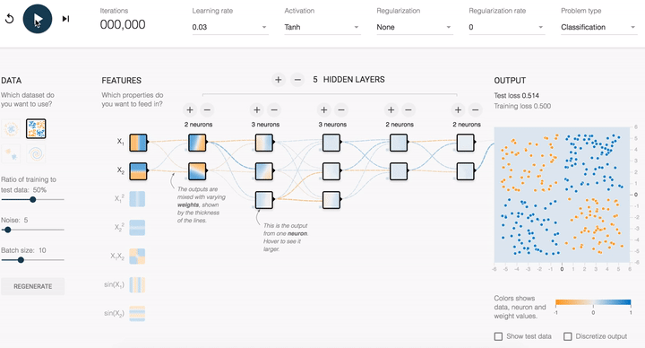

## 殊同归
实践上将两者相结合，发现效果有进一步提升，引出了目前互联网公司主流的两个推荐模型

   - [wide&deep](https://www.yuque.com/angsweet/machine-learning/qhvt6g)：LR+DNN
   - [deepFM](https://www.yuque.com/angsweet/machine-learning/gzs4s6)：FM+DNN

---

# 求参
就像最开始说的，是一条直线，确定了和就可以在图上画出一条直线。算法最基础本质的任务其实就是：**确定参数****和****，找到这条直线**。这一部分我们聊一聊怎么确定参数和，这里直接以最火的深度学习模型做讲解，更详细的论述见[深度学习](https://www.yuque.com/angsweet/machine-learning/shen-du-xue-xi_shen-du-xue-xi_readme)

## 深度学习

### 多层结构
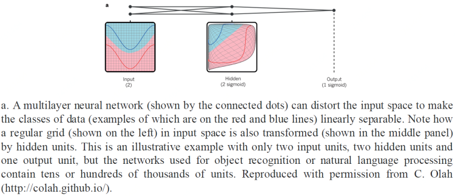
### 链式法则

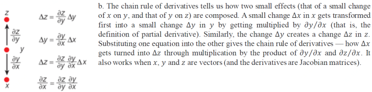

### 前馈传播
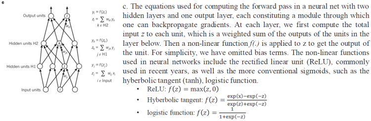
### 反向传播
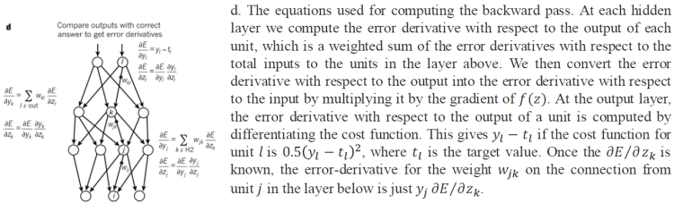
## 梯度下降

# 数据

我们了解了模型，就需要有数据输入去喂给模型，让其通过数据的学习，学到人为解决问题的经验。

