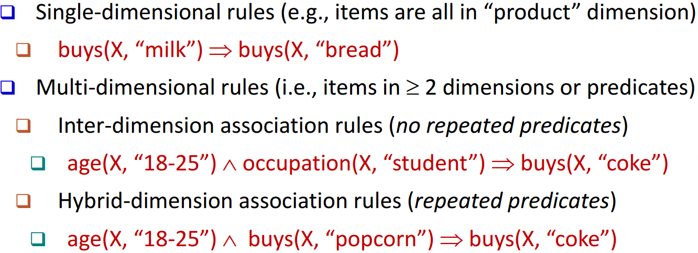
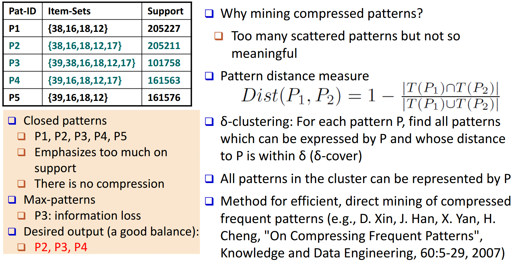
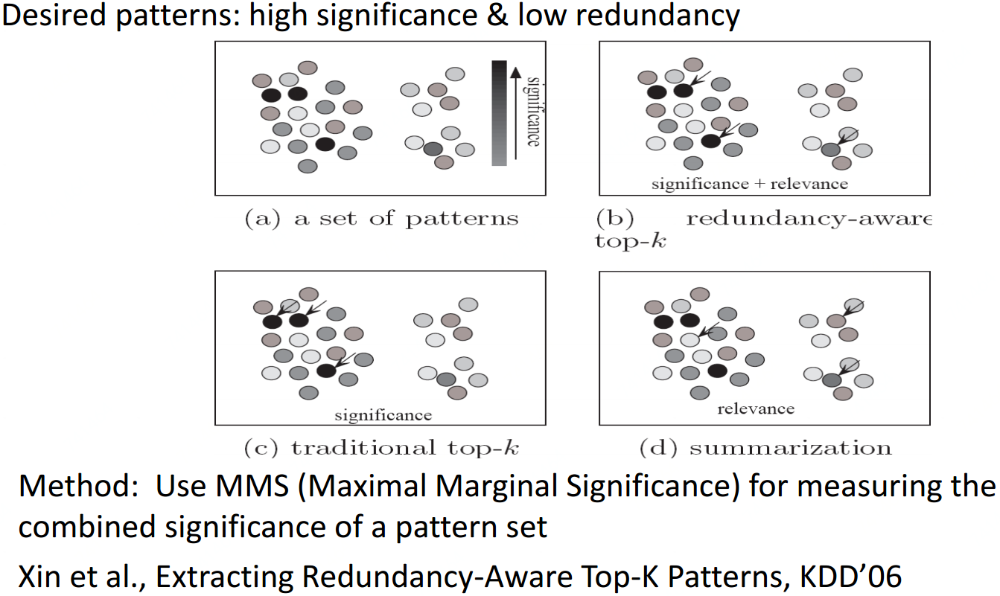

## **多等级频繁项集**

比如在level 1中牛奶的支持度为0.1，level 2中脱脂牛奶为0.02，非脱脂牛奶为0.06

一般用最小的min-support传递给下一次level来解决

## 多维度频繁项集

## 数值关联挖掘

比如年龄与薪水，两个数值型数据同时出现的相关问题的讨论

1. 基于预分层级的静态离散分析：数据立方聚合
2. 基于数据分布的动态离散分析
3. 聚类：每个维度聚类，再相关联
4. 偏差分析：性别(女)->薪水(均值$7/hr(两性一共$9/hr))

## **稀有模式与**负模式挖掘

**稀有模式：**有一些项集支持度非常低(比如买很贵的手表交易在所有订单中)

**负模式：**不太可能同时出现的模式(限牌，一顾客同时买两辆汽车)

## 压缩及低冗余项集挖掘

### 压缩数据

### 低冗余

