# 高维及庞大项集
```
初始化：利用一个算法挖掘粗所有项比较少的频繁项集，比如3-项集
迭代：
    在每一轮，随机从当前的模式池选择出K种子模式
    对于每个的选择出的种子模式，我们找到所有以种子模式为中心且在界限内的模式(聚类)
    所有这些被找到的模式融合一起生成一个父模式集合
    所有的父模式集合作为下一轮的模式池进入下一次迭代
终止：在此轮迭代开始时，当前模式池包含不超过K模式
```

---


# 序列模式
## 项集数据和序列数据

首先我们看看项集数据和序列数据有什么不同，如下图所示。

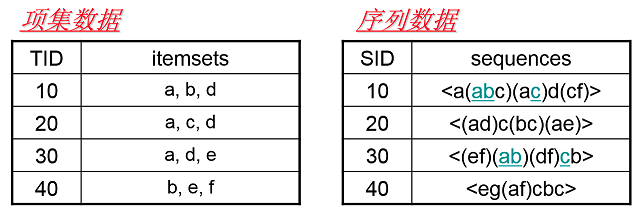

左边的数据集就是项集数据，在Apriori和FP Tree算法中我们也已经看到过了，每个项集数据由若干项组成，这些项没有时间上的先后关系。而右边的序列数据则不一样，它是由若干数据项集组成的序列。比如第一个序列，它由a，abc，ac，d，cf共5个项集数据组成，并且这些项集有时间上的先后关系。对于多于一个项的项集我们要加上括号，以便和其他的项集分开。同时由于项集内部是不区分先后顺序的，为了方便数据处理，我们一般将序列数据内所有的项集内部按字母顺序排序。

注:序列模式的序列是指项集是有相互顺序的，但项集内部是没有顺序的。


## 子序列与频繁序列

了解了序列数据的概念，我们再来看看什么是子序列。子序列和我们数学上的子集的概念很类似，也就是说，如果某个序列所有的项集在序列中的项集都可以找到，则就是的子序列。当然，如果用严格的数学描述，子序列是这样的：

对于序列和序列，如果存在数字序列，满足，则称是的子序列。当然反过来说，是的超序列。

而频繁序列则和我们的频繁项集很类似，也就是频繁出现的子序列。比如对于下图，支持度阈值定义为50%，也就是需要出现两次的子序列才是频繁序列。而子序列是频繁序列，因为它是图中的第一条数据和第三条序列数据的子序列，对应的位置用蓝色标示。

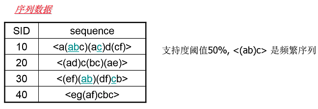


## GSP

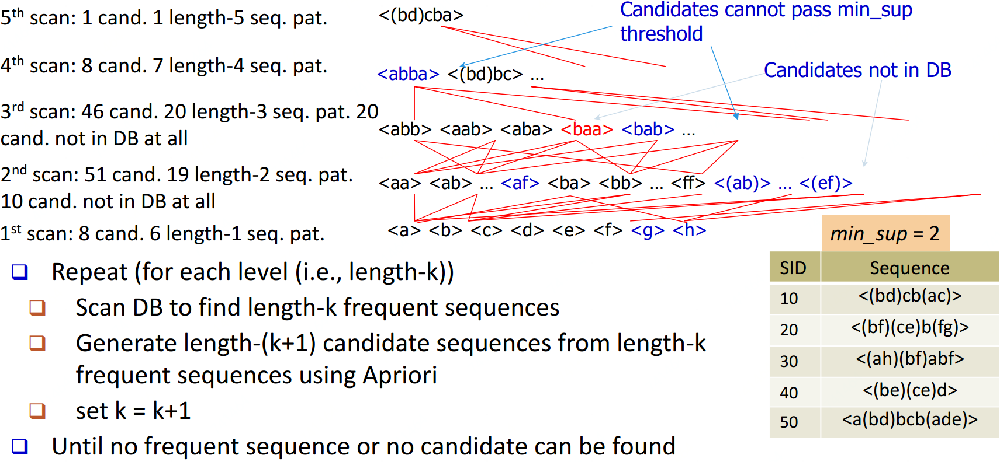


## SPADE

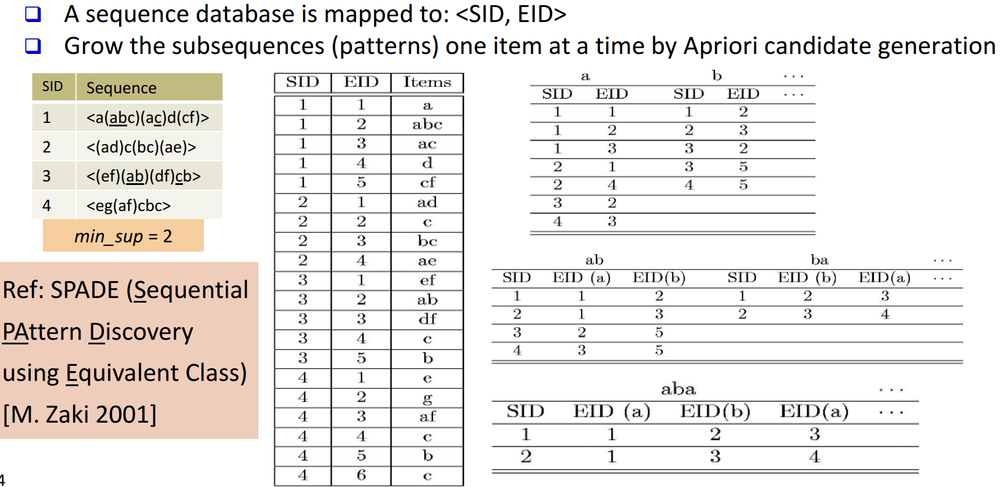


## PrefixSpan

PrefixSpan算法的全称是Prefix-Projected Pattern Growth，即前缀投影的模式挖掘。里面有前缀和投影两个词。那么我们首先看看什么是PrefixSpan算法中的前缀prefix。

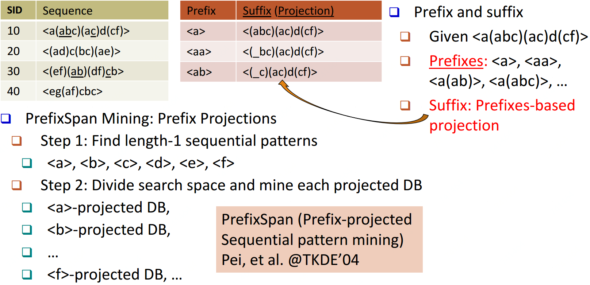

在PrefixSpan算法中的前缀prefix通俗意义讲就是序列数据前面部分的子序列。如果用严格的数学描述，前缀是这样的：序列和序列，。满足，而，则称是的前缀。比如对于序列数据，而，则是的前缀。当然的前缀不止一个，比如也是的前缀。

看了前缀，我们再来看前缀投影，其实前缀投影这儿就是我们的后缀，有前缀就有后缀嘛。前缀加上后缀就可以构成一个我们的序列。下面给出前缀和后缀的例子。对于某一个前缀，序列里前缀后面剩下的子序列即为我们的后缀。如果前缀最后的项是项集的一部分，则用一个“_”来占位表示。

下面这个例子展示了序列的一些前缀和后缀，还是比较直观的。要注意的是，如果前缀的末尾不是一个完全的项集，则需要加一个占位符。

在PrefixSpan算法中，相同前缀对应的所有后缀的结合我们称为前缀对应的投影数据库。

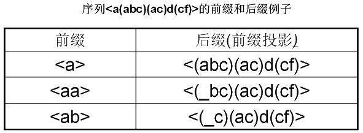

PrefixSpan算法由于不用产生候选序列，且投影数据库缩小的很快，内存消耗比较稳定，作频繁序列模式挖掘的时候效果很高。比起其他的序列挖掘算法比如GSP，FreeSpan有较大优势，因此是在生产环境常用的算法。

PrefixSpan运行时最大的消耗在递归的构造投影数据库。如果序列数据集较大，项数种类较多时，算法运行速度会有明显下降。因此有一些PrefixSpan的改进版算法都是在优化构造投影数据库这一块。比如使用伪投影计数。

不过scikit-learn始终不太重视关联算法，一直都不包括这一块的算法集成。当然使用大数据平台的分布式计算能力也是加快PrefixSpan运行速度一个好办法。比如Spark的MLlib就内置了PrefixSpan算法。

### 算法思路

现在我们来看看PrefixSpan算法的思想，PrefixSpan算法的目标是挖掘出满足最小支持度的频繁序列。那么怎么去挖掘出所有满足要求的频繁序列呢。回忆Aprior算法，它是从频繁1项集出发，一步步的挖掘2项集，直到最大的K项集。PrefixSpan算法也类似，它从长度为1的前缀开始挖掘序列模式，搜索对应的投影数据库得到长度为1的前缀对应的频繁序列，然后递归的挖掘长度为2的前缀所对应的频繁序列...以此类推，一直递归到不能挖掘到更长的前缀挖掘为止。

比如对应于我们第二节的例子，支持度阈值为50%。里面长度为1的前缀包括，我们需要对这7个前缀分别递归搜索找各个前缀对应的频繁序列。如下图所示，每个前缀对应的后缀也标出来了。由于只在序列4出现，支持度计数只有1，因此无法继续挖掘。我们的长度为1的频繁序列为。去除所有序列中的，即第4条记录变成。

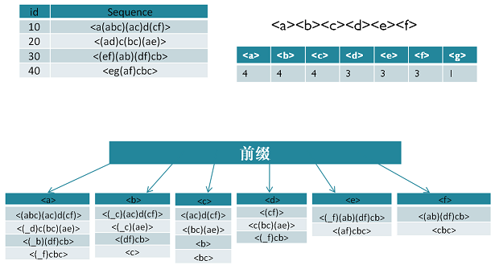

现在我们开始挖掘频繁序列，分别从长度为1的前缀开始。这里我们以为例子来递归挖掘，其他的节点递归挖掘方法和一样。

方法如下图，首先我们对的后缀进行计数，得。注意和不一样的，因为前者是在和前缀不同的项集，而后者是和前缀同项集。由于此时都达不到支持度阈值，因此我们递归得到的前缀为的2项频繁序列为和。

接着我们分别递归和为前缀所对应的投影序列。首先看前缀，此时对应的投影后缀只有，此时支持度均达不到阈值，因此无法找到以为前缀的频繁序列。现在我们来递归另外一个前缀。以为前缀的投影序列为，此时进行支持度计数，结果为，只有满足支持度阈值，因此我们得到前缀为的三项频繁序列为。

我们继续递归以为前缀的频繁序列。由于前缀对应的投影序列支持度全部不达标，因此不能产生4项频繁序列。至此以为前缀的频繁序列挖掘结束，产生的频繁序列为。

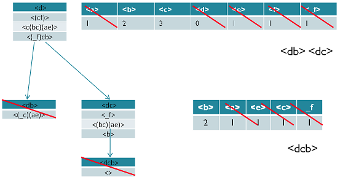

同样的方法可以得到其他以为前缀的频繁序列。


### 算法流程

输入：序列数据集和支持度阈值

输出：所有满足支持度要求的频繁序列集

1. 找出所有长度为1的前缀和对应的投影数据库
2. 对长度为1的前缀计数，将支持度低于阈值的前缀项从数据集删除，同时得到所有的频繁1项序列，
3. 对于每个长度为满足支持度要求的前缀进行递归挖掘：
   1. 找出前缀所对应的投影数据库。如果投影数据库为空，则递归返回
   2. 统计对应投影数据库中各项的支持度计数。如果所有项的支持度计数都低于阈值，则递归返回
   3. 将满足支持度计数的各个单项和当前的前缀进行合并，得到若干新的前缀
   4. 令，前缀为合并单项后的各个前缀，分别递归执行第3步

### Code实现

[https://spark.apache.org/docs/2.3.0/mllib-frequent-pattern-mining.html](https://spark.apache.org/docs/2.3.0/mllib-frequent-pattern-mining.html)

```python
from pyspark import SparkContext
from pyspark import SparkConf
from  pyspark.mllib.fpm import PrefixSpan

sc = SparkContext("local","testing")

data = [
   [['a'],["a", "b", "c"], ["a","c"],["d"],["c", "f"]],
   [["a","d"], ["c"],["b", "c"], ["a", "e"]],
   [["e", "f"], ["a", "b"], ["d","f"],["c"],["b"]],
   [["e"], ["g"],["a", "f"],["c"],["b"],["c"]]
   ]
rdd = sc.parallelize(data, 2)
model = PrefixSpan.train(rdd, 0.5,4)

sorted(model.freqSequences().collect())
```


## CloSpan(针对closed sequential patterns)

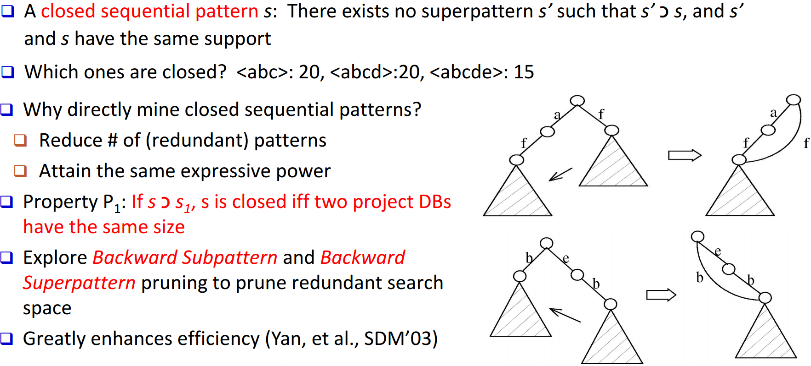

## 基于约束的序列模式挖掘

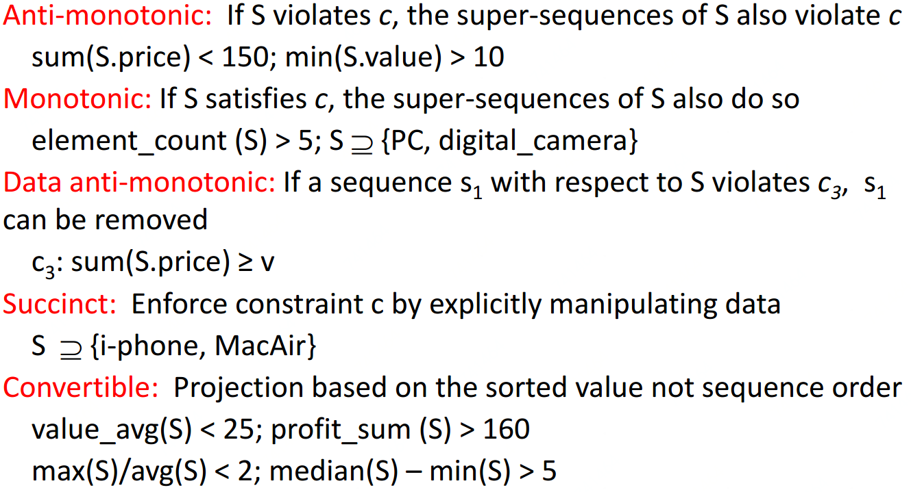

<a name="waJBC"></a>
### 基于时间约束的序列模式挖掘

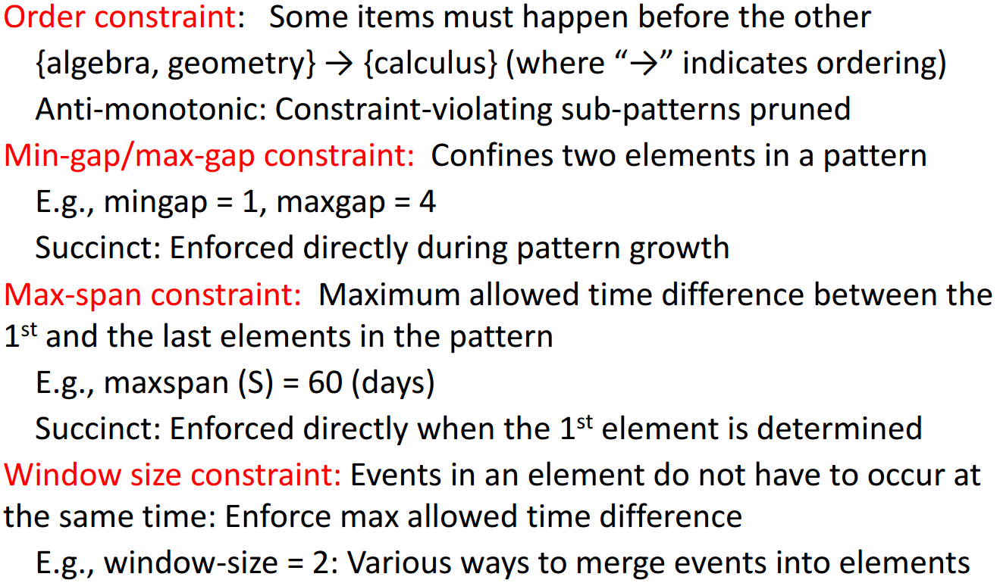

---


# 图模式
## 方法分类

候选集生成方式：Apriori vs. Pattern growth (FSG vs. gSpan)

搜索顺序：广度 vs. 深度

重复子图剔除：被动 vs. 主动(gSpan)

支持度计算：GASTON, FFSM, MoFa

模式发现顺序：Path->Tree->Graph (GASTON)


## 基于Apriori的方法

候选集生成 -> 候选集剪枝 -> 支持度计算 -> 候选集剔除  迭代这四步至无法生成候选集或不满足支持度

候选集生成时扩展节点(AGM算法)还是扩展边(FSG算法)都可以，但是经测试是扩展边更高效


## 基于Pattern-Growth的方法

按深度优先来扩展边，从k边子图->(k+1)边子图->(k+2)边子图...

问题：这样会生成很多重复子图

解决：1、定义一个子图生成顺序  2、DFS生成树，用深度优先搜索扁平图  3、gSpan


### gSpan

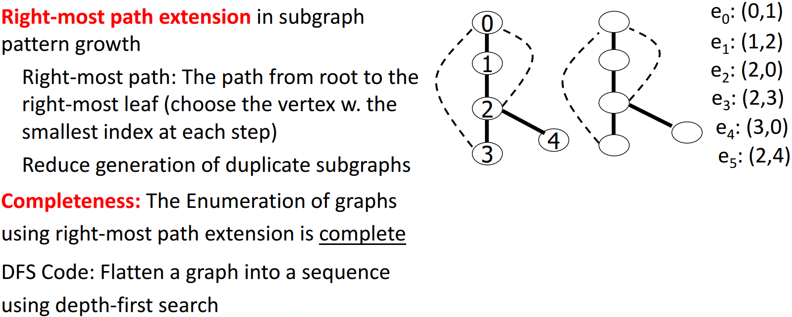

<a name="2d5caeb7"></a>
## 闭合图模式挖掘

如果不存在与高频图有相同支持度的父图，则是闭合的
<a name="FfDHa"></a>
### CloseGraph

<a name="S2nez"></a>
# Source

[https://blog.csdn.net/anshuai_aw1/article/details/85235044](https://blog.csdn.net/anshuai_aw1/article/details/85235044)
