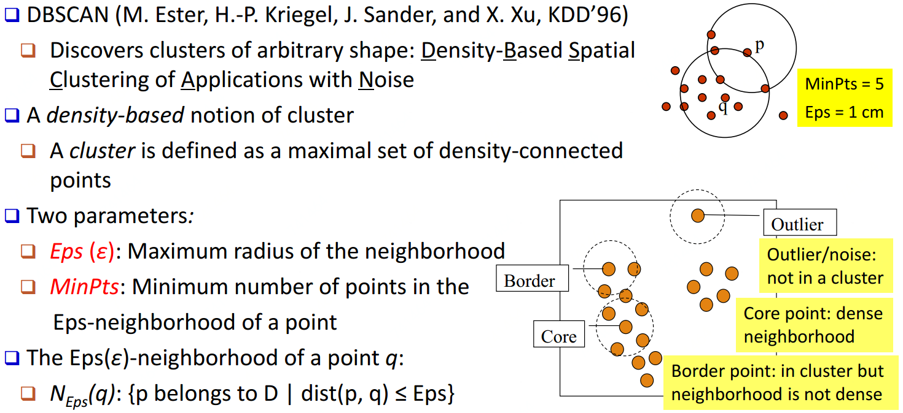
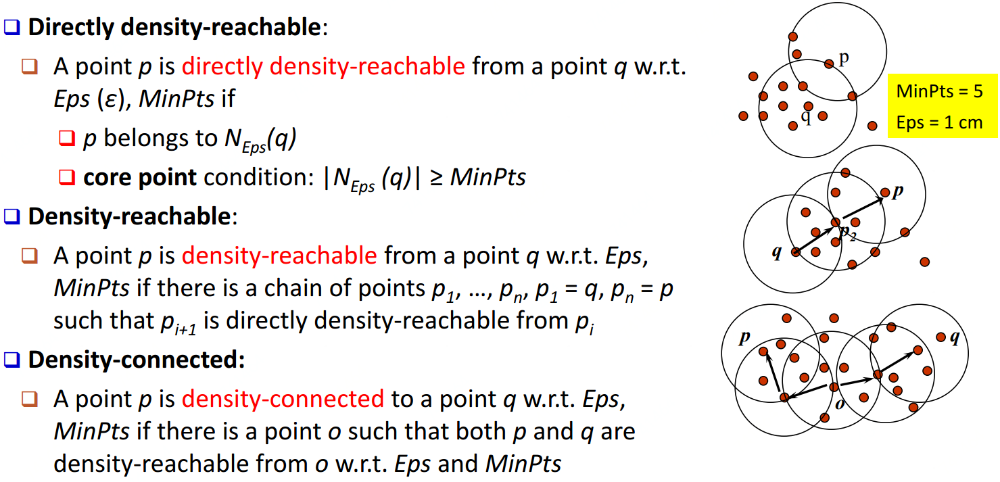
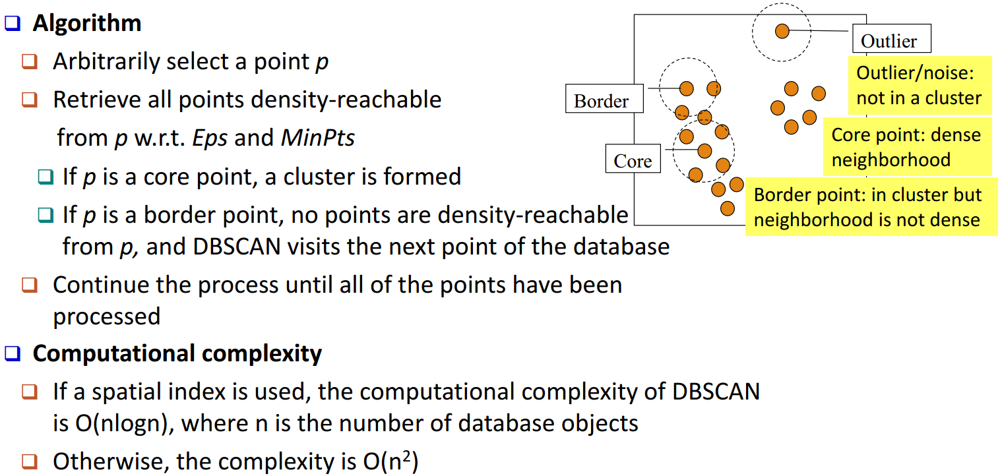
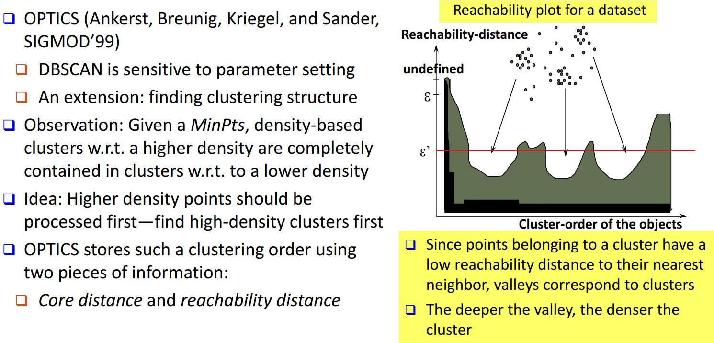
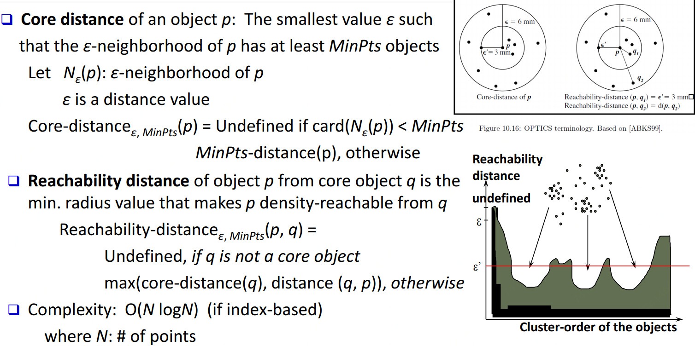
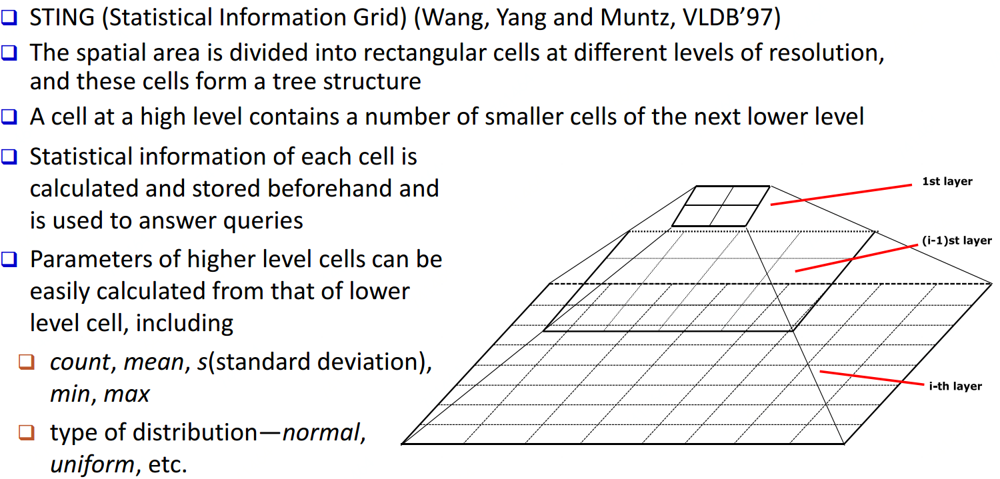
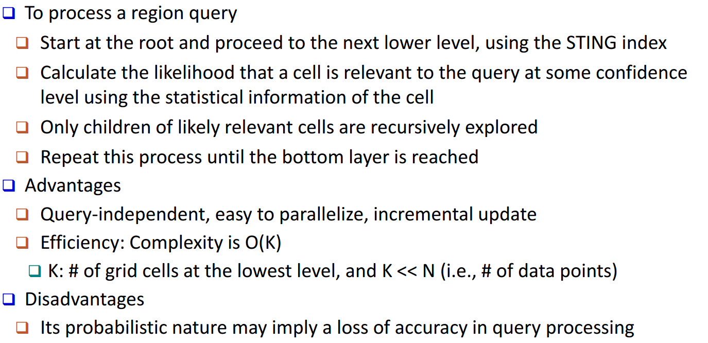
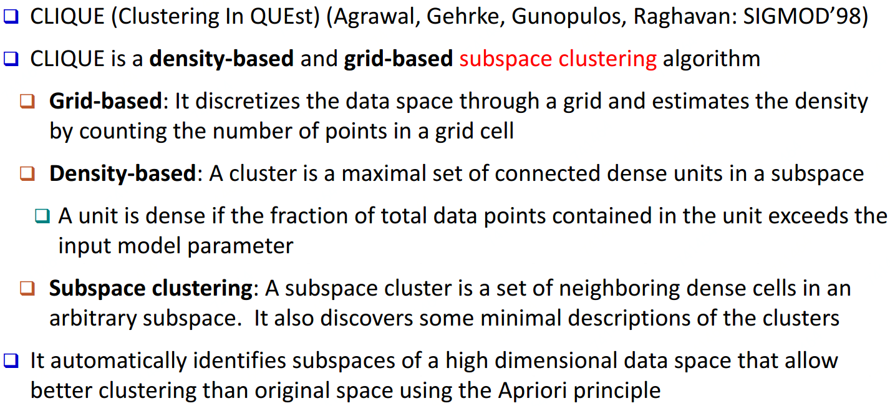
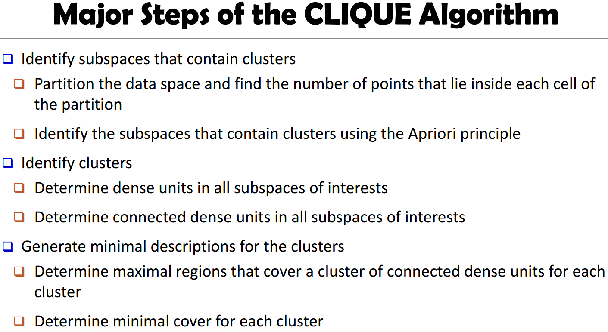

基于密度方法：DBSCAN、OPTICS    基于网格方法：STING、CLIQUE

## 基于密度方法

### DBSCAN(Density-Based Spatial Clustering of Applications with Noise)
  

### OPTICS(Ordering Points To Identify Clustering Structure)
 

## 基于网格方法

### STING(A Statistical Information Grid Approach)
 

### CLIQUE(Grid-Based Subspace Clustering)
 
