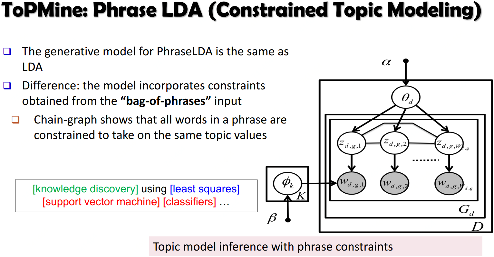
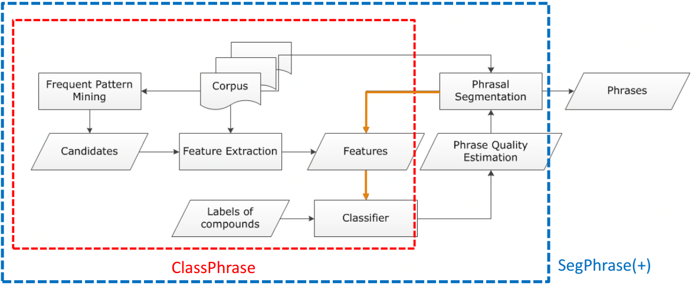
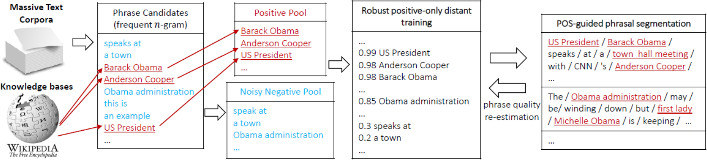

## 短语质量评价标准

Popularity：更精确的好于较精确的，比如"information retrieval" vs. "cross-language information retrieval"

Concordance：符合常规说法，比如浓茶一般说"strong tea"，遇到"powerful tea"就不太符合了

Informativeness：含有信息量，比如"this paper"虽然高频出现但没信息量没区分度

Completeness：要具有完整性，比如"vector machine" vs. "support vector machine"

## 方案1：短语与主题同时推断

基本思路：Generate bag-of-words -> Generate sequence of tokens

缺点：这种方案复杂度高，运算慢，且易过拟合

**Bigram Topic Model[Wallach'06]：**

1. 概率生成模型，下一词的生成基于前一个词和主题的条件概率

**Topic N-Grams(TNG)[Wang, et al.'07]：**

1. 根据文本顺序生成词语的概率模型；
2. 通过连接连续的bigram(通过Bigram Topic Model生成)来创建n-grams

**Phrase-Discovering LDA(PDLDA)[Lindsey, et al.'12]：**

1. 将每个句子视为一个词语的时间序列；
2. PDLDA假定生成参数(主题)周期性变化；
3. 基于之前个词与当前短语主题生成每个词

## 方案2：先主题生成后短语构建

基本思路：Post bag-of-words model inference, visualize topics with n-grams，短语构建作为LDA之后步骤

缺点：这个方案中的符记在同一个短语中可能被赋予不同的主题，短语质量依赖于词的主题标签准不准

**TurboTopic[Blei&Lafferty'09]：**

1. 在语料中执行LDA模型来给每个符记赋一个主题标签；
2. 将相连的相同主题标签；
3. 当全部有意义相连的词合并后终止合并迭代

**KERT[Danilevsky, et al.'14]：**

1. 在每一个主题中运行频繁项集挖掘；
2. 基于四个评价标准(Popularity、Discriminativeness、Condordance、Completeness)执行短语排序

## 方案3：先短语挖掘后主题模型

基本思路：Prior bag-of-words model inference, mine phrases and impose on the bag-of-words model

缺点：主题推断依赖于文档的正确分割

**ToPMine[El-Kishky et al.VLDB'15]：**

1. 执行高频连续频繁项集挖掘来获取候选短语和他们的频数；
2. 根据重要性得分，对相邻的unigrams进行凝聚合并(这一步切分每个文档放入"bag-of-phrases")；
3. 新形成的词组作为输入传递给PhraseLDA（这是一个扩展LDA，它限制短语中的所有单词，每个单词共享相同的潜在主题)

 [**SegPhrase系列**](https://github.com/shangjingbo1226/SegPhrase)

1. ClassPhrase：频繁项挖掘，特征抽取，分类
2. SegPhrase：短语切分和短语质量估计
3. SegPhrase+：多一轮迭代来加强以挖掘的短语质量

**ClassPhrase：**

1. 频繁项集挖掘，挖掘频繁项作为候选短语集(这一步可保证生成短语在输入语料库的Popularity)
2. 特征抽取
   1. 检查候选集里每个候选短语的置信度，看看他们一同出现的概率是不是比纯随机要高(这一步保证Concordance)，可采用Pointwise mutual information或者Pointwise KL divergence来判断
   2. 检查Informativeness，比如是不是起止词都是非停用词，IDF值检验一下，有书名号，引号之类的连接的词
3. 分类，用个分类器比如随机森林，分类短语质量"support vector machine":1，"the experiment shows":0

**SegPhrase：**解决合理切分问题

将一个句子用最大似然切割，过滤掉整流频率较低的短语(不合理的短语应该很少出现在切分的结果中)

**SegPhrase+：**多跑一轮以加强短语切分

用整改频率，重新计算之前基于原始频率计算的特征

[AutoPhrase：](https://github.com/shangjingbo1226/AutoPhrase)

