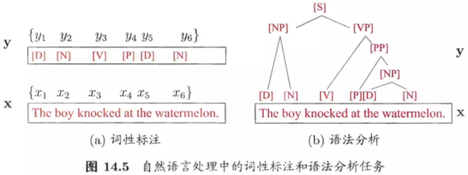
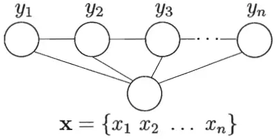

## 条件随机场

条件随机场(Conditional Random Field, CRF)是一种判别式无向图模型。生成式模型是直接对联合分布建模，而判别式模型则是对条件分布进行建模。条件随机场是给定随机变量条件下，随机变量的马尔可夫随机场。

设与是随机变量，是在给的条件下的条件概率分布。若随机变量构成一个无向图表示的马尔可夫随机场，即

对任意结点成立，则称条件概率分布为条件随机场。式中表示在图中与结点有边连接的所有结点，表示结点以外所有结点，为结点对应的随机变量。

## 链式条件随机场

这里主要介绍定义在线性链上的特殊的条件随机场，称为线性链条件随机场(Linear Chain Conditional Random Field)。线性链条件随机场可以用于标注问题。这时，在条件随机概率模型中，是输出变量，表示标记序列，是输入变量，表示需要标注的观测序列。也把标记序列称为状态序列。学习时，利用训练数据集通过极大似然估计或正则化的极大似然估计得到条件概率模型；预测时，对于给定的输入序列，求出条件概率最大的输出序列。

设，均为线性链表示的随机变量序列，若在给定随机变量序列的条件下，随机变量序列的条件概率分布构成条件随机场，即满足马尔可夫性

，(在i=1和n时只考虑单边)

则称为线性链条件随机场。在标注问题中，表示输入观测序列，表示对应的输出标记序列或状态序列。

## [条件随机场运行过程](https://www.zhihu.com/question/35866596/answer/236886066)

请看第一张概率图模型构架图，CRF上面是马尔科夫随机场（马尔科夫网络），而条件随机场是在给定的随机变量（具体，对应观测序列）条件下，随机变量（具体，对应隐状态序列的马尔科夫随机场。 广义的CRF的定义是：满足的马尔科夫随机场叫做条件随机场。不过一般说CRF为序列建模，就专指CRF线性链（linear chain CRF）：

概率无向图的联合概率分布可以在因子分解下表示为：

而在线性链CRF示意图中，每一个（）对为一个最大团,即在上式中。并且线性链CRF满足。

**所以CRF的建模公式如下：**

我要敲黑板了，这个公式是非常非常关键的，注意递推过程啊，是怎么从跳到的

不过还是要多啰嗦一句，想要理解CRF，必须判别式模型的概念要深入你心。正因为是判别模型，所以不废话，我上来就直接为了确定边界而去建模，因为我创造出来就是为了这个分边界的目的的。比如说序列求概率（分类）问题，我直接考虑找出函数分类边界。所以才为什么会有这个公式。所以再看到这个公式也别懵逼了，he was born for discriminating the given data from different classes. 就这样。不过待会还会具体介绍特征函数部分的东西。除了建模总公式，关键的CRF重点概念在MEMM中已强调过：**判别式模型**、**特征函数**。

**特征函数**

上面给出了CRF的建模公式：

- 下标i表示我当前所在的节点（token）位置。
- 下标k表示我这是第几个特征函数，并且每个特征函数都附属一个权重，也就是这么回事，每个团里面，我将为构造M个特征，每个特征执行一定的限定作用，然后建模时我再为每个特征函数加权求和。
- 是用来归一化的，为什么？想想LR以及softmax为何有归一化呢，一样的嘛，形成概率值。
- 再来个重要的理解。这个表示什么？具体地，表示了在给定的一条观测序列条件下，我用CRF所求出来的隐状态序列的概率，注意，这里的I是一条序列，有多个元素（一组随机变量），而至于观测序列，它可以是一整个训练语料的所有的观测序列；也可以是在inference阶段的一句sample，比如说对于序列标注问题，我对一条sample进行预测，可能能得到，即条隐状态，但我肯定最终选的是最优概率的那条（by viterbi）。这一点希望你能理解。

对于CRF，可以为他定义两款特征函数：转移特征&状态特征。我们将建模总公式展开：

其中：为处的转移特征，对应权重,每个都有个特征,转移特征针对的是前后token之间的限定。举个例子：

为处的状态特征，对应权重,每个都有个特征。举个例子：

不过一般情况下，我们不把两种特征区别的那么开，合在一起：

满足特征条件就取值为1，否则没贡献，甚至你还可以让他打负分，充分惩罚。

再进一步理解的话，我们需要把特征函数部分抠出来：

是的，我们为打分，满足条件的就有所贡献。最后将所得的分数进行log线性表示，求和后归一化，即可得到概率值……完了又扯到了log线性模型。现在稍作解释：

我觉得对LR或者sotfmax熟悉的对这个应该秒懂。然后CRF完美地满足这个形式，所以又可以归入到了log-linear models之中。

### **模型运行过程**

模型的工作流程，跟MEMM是一样的：

1. 先预定义特征函数
2. 在给定的数据上，训练模型，确定参数
3. 用确定的模型做`序列标注问题`或者`序列求概率问题`

### **学习训练过程**

一套CRF由一套参数λ唯一确定（先定义好各种特征函数）。

同样，CRF用极大似然估计方法、梯度下降、牛顿迭代、拟牛顿下降、IIS、BFGS、L-BFGS等等。各位应该对各种优化方法有所了解的。其实能用在log-linear models上的求参方法都可以用过来。

### **序列标注过程**

还是跟HMM一样的，用学习好的CRF模型，在新的sample（观测序列）上找出一条概率最大最可能的隐状态序列。

只是现在的图中的每个隐状态节点的概率求法有一些差异而已,正确将每个节点的概率表示清楚，路径求解过程还是一样，采用viterbi算法。

啰嗦一下，我们就定义i处的局部状态为,表示在位置i处的隐状态的各种取值可能为I，然后递推位置处的隐状态，写出来的DP转移公式为：

这里没写规范因子是因为不规范化不会影响取最大值后的比较。

### **序列求概率过程**

跟HMM举的例子一样的，也是分别去为每一批数据训练构建特定的CRF，然后根据序列在每个MEMM模型的不同得分概率，选择最高分数的模型为wanted类别。

## Source

[https://www.zhihu.com/question/35866596/answer/236886066](https://www.zhihu.com/question/35866596/answer/236886066)
