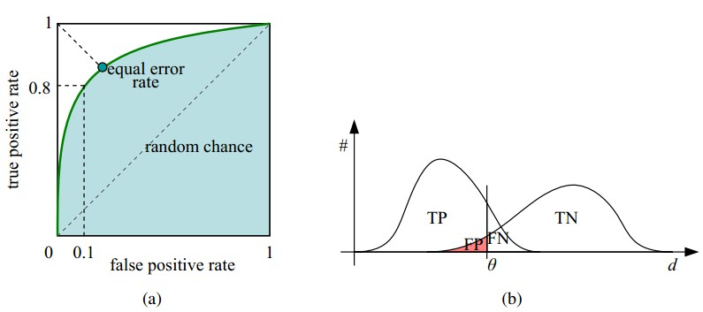
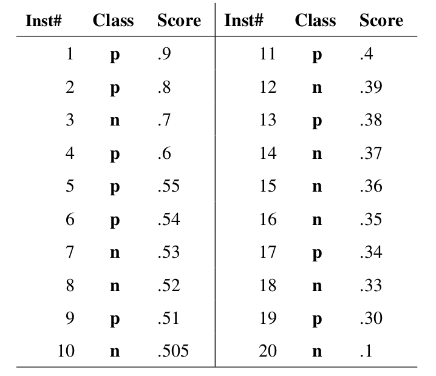
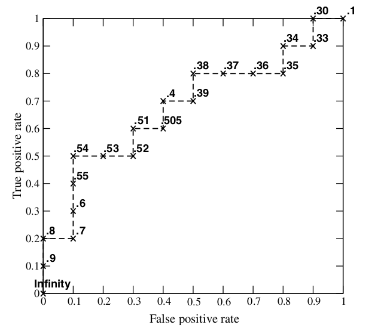
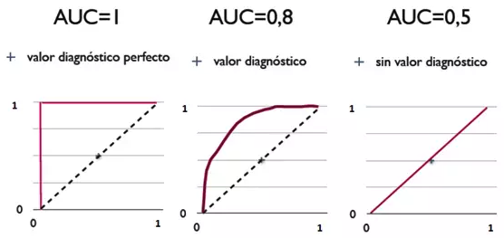
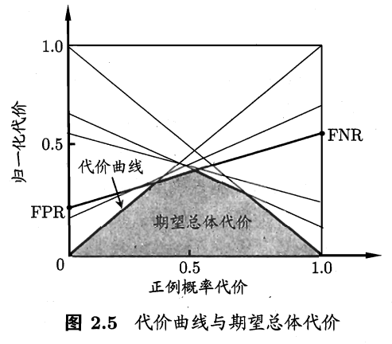
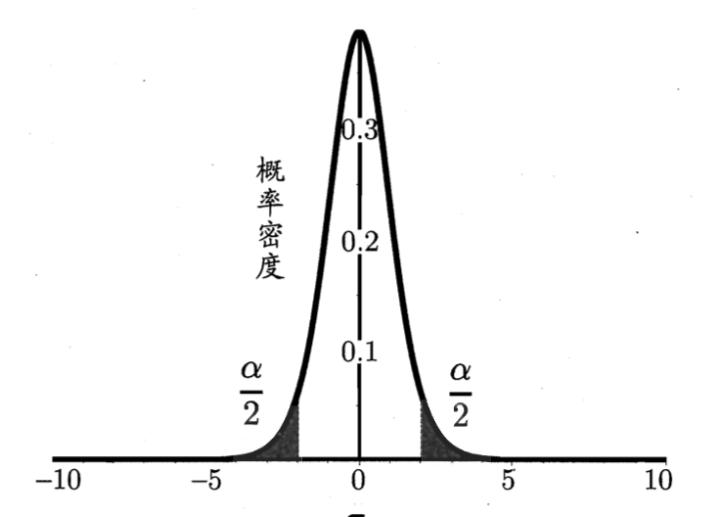
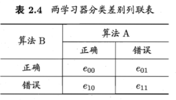
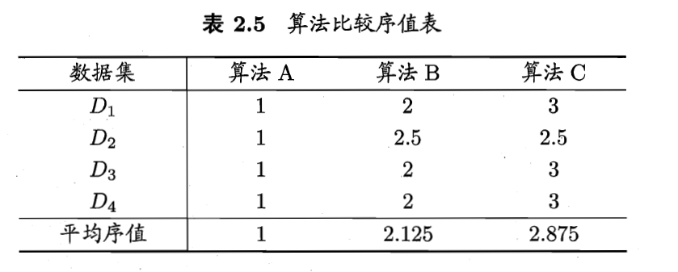
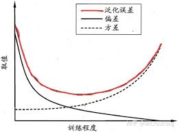

## 经验误差与过拟合

个样本中有个分类错误，则

错误率：        精度： 

实际预测输出与样本真实输出的差异为“”误差”，在训练集上的误差为“训练误差”(training error)或“经验误差”，在新样本上的误差为“泛化误差”。

我们事先并不知道新样本什么样，所以实际能做的是努力使经验误差最小化。然而，我们真正希望的是，在新样本能表现很好的学习器。当一个学习器把训练样本学的“太好了”，很可能把训练样本的特点当成了一般性质，导致泛化能力下降，这种情况成为“过拟合”，相对的“欠拟合”即对训练样本未学好。

---

## 评估方法

通常我们通过实验测试来对学习器的泛化误差进行评估而做出选择，为此，需要使用一个“测试集”来测试学习器对新样本的判别能力。下面介绍几种常见的数据集划分训练集及测试集的做法。

另外，数据量充足时用留出法或交叉验证法，数据集比较小时可以使用自助法。

### 留出法

直接将数据集划分为两个互斥的集合，其中一个为训练集，另一个为测试集，即。需要注意的是训练/测试集的划分要尽可能保持数据分布的一致性，避免因数据划分过程引入额外的偏差而对最终结果产生影响，例如在分类任务中至少要保持样本的类别比例相似，如果从采样的角度来看，此类采样方式通常称为“分层采样”。

即便在给定训练/测试集的样本比例后，仍存在多种划分数据集的方式，且单次使用留出法得到的估计结果往往不够稳定可靠。在使用留出法时，一般采用若干次随机划分、重复进行实验评估后取平均值作为留出法的评估结果。此外，我们将至的样本用于训练，剩余样本用于测试，以保证训练集或测试集不会太小导致结果差别大

### 交叉验证法

先将数据集划分为个大小相同的互斥子集，即，每个子集都尽可能保持数据分布的一致性。然后每次用个子集的并集作为训练集，余下的哪个子集作为测试集，这样就得到了组训练/测试集，从而可进行次训练和测试，最终返回的是这个结果的均值。

与留出法相似，将数据集划分为个子集的同样存在多种划分方式。为减少因样本划分不同而引入的差别，折交叉验证通常要随机使用不同的划分重复次。最终的评估结果是这次折交叉验证结果的均值，例如常见的有“10次10折交叉验证”。

另外留一法，即数据集中有个样本，即为留一法，留一法训练集与实际数据集只差了1个样本，所以评估结果往往被认为较准确。而当数据集很大的时候，即需要计算个模型，消耗过大。

### 自助法

给定包含个样本的数据集，我们对它进行采样产生数据集：每次随机从中挑选一个样本，并将其拷贝放入，然后再将该样本放回初始数据集中，使得该样本在下次采集时仍有可能被采到；重复执行次后，我们就得到了包含个样本的数据集。

显然，中一部分样本会在中出现多次，而另一部分样本不出现，样本在次采样中始终不被采到的概率是，取极限得到

即初始数据集中约有36.8%的样本并未出现在采样数据集中，于是我们可将用作训练集，用作测试集。这样，实际评估的模型与期望评估的模型都使用个训练样本，而我们仍有数据总量约1/3的、没在训练集中出现的样本用于测试。

自主法在数据集小、难以划分训练/测试集时很有用，且能从初始数据集产生多个不同的训练集，对集成学习等方法有很大好处。但是自助法改变了原始数据分布，会引入估计偏差。

---

## 性能度量

性能度量：衡量模型泛化能力的评价标准

回归任务最常用的性能度量--“均方差(Mean Squared Error)”:

    

### 错误率与精度

错误率是分类错误的样本数占样本总数的比例，精度则是分类正确的样本数占样本总数的比例。

对样例集，分类错误率定义为：

精度定义为：

更一般的，对于数据分布和概率密度函数，错误率与精度可分别描述为：

 

### 查准率、查全率与F1
| 真实情况 | 预测结果 | 预测结果 |
| --- | --- | --- |
|  | 正例 | 反例 |
| 正例 | TP（真正例） | FN（假反例） |
| 反例 | FP（假正例） | TN（真反例） |

#### 查准率(Precision)

#### 查全率(Recall)

#### P-R曲线

#### F1度量

#### F-score

### [ROC与AUC](https://www.jianshu.com/p/c61ae11cc5f6)

很多学习器是为测试样本产生一个实值或概率预测，然后将这个预测值与一个分类阈值进行比较，若大于阈值则分为正类，否则为反类。例如我们对每个样本出一个之间的实值，然后与比较，大于为正例，否则为反例。这个实值或概率预测结果的好坏直接决定了学习器的泛化能力。实际上，我们根据预测结果将测试样本排序，“最可能”是正例的排在最前面，“最不可能”是正例的排在最后面。这样，分类过程就相当于在这个排序中以某个“截断点”将样本分为两部分，前一部分判作正例，后部分为反例。

我们根据任务需求来采取不同的截断点，例如更重视“查准率”，则在排序靠前位置截断；若重视“查全率”，则选择较后位置。因此排序好坏直接影响学习器泛化能力好坏，ROC曲线既从这个角度出发来研究学习期的泛化能力。

ROC曲线的纵轴是“真正例率”(True Positive Rate)，横轴是“假正例率”(False Positive Rate)：

        

AUC(Area Under ROC Curve)如名字所示，即ROC曲线下面积

#### ROC

理性情况下，我们有无限个样本，ROC是一条平滑的曲线，然而现实中，我们只有有限个数据，所以：

假如我们已经得到了所有样本的概率输出（属于正样本的概率），现在的问题是如何改变“discrimination threashold”？我们根据每个测试样本属于正样本的概率值从大到小排序。下图是一个示例，图中共有20个测试样本，“Class”一栏表示每个测试样本真正的标签（p表示正样本，n表示负样本），“Score”表示每个测试样本属于正样本的概率。

接下来，我们从高到低，依次将“Score”值作为阈值threshold，当测试样本属于正样本的概率大于或等于这个threshold时，我们认为它为正样本，否则为负样本。举例来说，对于图中的第4个样本，其“Score”值为0.6，那么样本1，2，3，4都被认为是正样本，因为它们的“Score”值都大于等于0.6，而其他样本则都认为是负样本。每次选取一个不同的threshold，我们就可以得到一组FPR和TPR，即ROC曲线上的一点。这样一来，我们一共得到了20组FPR和TPR的值，将它们画在ROC曲线的结果如下图：

 简单描述一下怎么画的，可以看到我们取的点，共20个，其中10个p(positive)，所以y坐标进行10等分；10个n(negtive)，所以横坐标进行10等分。然后Score从高往低降，我们就依次有了...

#### AUC

首先AUC值是一个概率值，当你随机挑选一个正样本以及一个负样本，当前的分类算法根据计算得到的Score值将这个正样本排在负样本前面的概率就是AUC值。当然，AUC值越大，当前的分类算法越有可能将正样本排在负样本前面，即能够更好的分类。

从AUC判断分类器（预测模型）优劣的标准：

- AUC = 1，是完美分类器，采用这个预测模型时，存在至少一个阈值能得出完美预测。绝大多数预测的场合，不存在完美分类器。
- 0.5 < AUC < 1，优于随机猜测。这个分类器（模型）妥善设定阈值的话，能有预测价值。
- AUC = 0.5，跟随机猜测一样（例：丢铜板），模型没有预测价值。
- AUC < 0.5，比随机猜测还差；但只要总是反预测而行，就优于随机猜测。

 我面试候选人时喜欢问的题：现有100个广告候选，放入ctr模型后得到Score值(预估的用户点击概率)。取阈值大于0.5，即Score>0.5的10个广告对用户进行曝光。记录表现，Class行中p即positive(用户点击了广告)，n为negtive(用户未点击广告)。请基于表现计算AUC值或ROC点坐标

| Score | 0.9 | 0.8 | 0.7 | 0.6 | 0.55 | 0.54 | 0.53 | 0.52 | 0.51 | 0.505 |
| --- | --- | --- | --- | --- | --- | --- | --- | --- | --- | --- |
| Class | p | p | n | p | p | p | n | n | p | n |

由条件可知，共10个物料，我们预测用户都会点。实际有6个被点击，4个未被点击，所以ROC的纵轴6等分，横轴4等分。题目已经给出物料按score排序，所以从高到低： (0, 1/6) - 对应score为0.9且用户点击了 (0, 2/6) - 对应score为0.8且用户点击了 (1/4, 2/6) - 对应score为0.7且用户未点击... 得到所有点(0, 1/6)，(0, 2/6)，(1/4, 2/6)，(1/4, 3/6)，(1/4, 4/6)，(1/4, 5/6)，(2/4, 5/6)，(3/4, 5/6)，(3/4, 6/6)，(4/4, 6/6)。点都获得了，可计算出AUC为0.75

### 代价敏感错误率与代价曲线

实践中有不同类型错误造成不同后果：比如体检，将健康人误诊断为患者，虽然增加进一步检查麻烦，但是要把患者误诊为健康人可能会丧失生命；再比如银行人脸识别门禁等等情况。为权衡不同类型错误所造成的不同损失，可为错误赋予“非均等代价”。

| 真实类别 | 预测类别 | 预测类别 |
| --- | --- | --- |
| 真实类别 | 第0类 | 第1类 |
| 第0类 | 0 | cost_{01} |
| 第1类 | cost_{10} | 0 |

之前指标我们只计算不同错误次数，代价敏感的错误率是对应错误乘以其错误代价：

绘制代价曲线：代价曲线的横轴为正例概率代价，纵轴为归一化代价

    

其中，或是样例为正例的概率；FNR是假反例率；FPR是假正例率。

---

## 比较检验

有了实验评估方法和性能度量，就可以对学习器性能进行比较了。但实际操作起来，我们并不能直接取得性能度量的值然后比大小，因为我们希望模型有很好的泛化能力，然而我们实验评估是获得测试集上的性能，两者的对比结果可能未必相同；测试集上的性能与测试集选取有很大关系，怎样论证测试集选取；机器学习算法很多有一定的随机性。

所以就需要用比较检验，基于检验结果我们可推断出有多大的把握学习器A的泛化性能比学习器B好。下面用错误率作为性能度量，用表示。

### 单个学习器泛化进行检验

泛化错误率为的学习器在一个样本上犯错的概率是；测试错误率意味着在个测试样本中恰有个被误分类。测试误分类概率：

给定测试错误率，则解可知，在时最大，增大时减小

#### 二项检验

由上面所述，是符合二项分布的，我们可用二项检验来应对。考虑假设，则在（这里反映了结论的“置信度”）的概率内所能观察到的最大错误率如下式计算：

此时若测试错误率小于临界值，则根据二项检验可得出结论：在的显著度下，假设不能被拒绝，即能以的置信度认为，学习器的泛化错误率不大于；否则该假设可被拒绝，即在的显著度下可任务学习器的泛化错误率大于。

#### t检验

在很多时候我们并非仅做一次留出法估计，而是通过多次重复留出法或是交叉验证法等进行多次训练/测试，这样会得到多个测试错误率，此时可使用t检验(t-test)。

假定我们得到了个测试错误率，，则平均测试错误率和方差为

    

考虑到这个测试错误率可看作泛化错误率的独立采样，则变量：

下图为服从自由度为的t分布，其中

对假设和显著度，我们可计算出当测试错误率均为时，在概率内能观测到的最大错误率，即临界值。这里考虑双边假设，如上图所示，两边阴影部分各有的面积；假定阴影部分范围分别为和。若平均错误率与之差位于临界值范围内，则不能拒绝假设，即可认为泛化错误率为，置信度为；否则可拒绝该假设，即在该显著度下可认为泛化错误率与有显著不同。常用取值的和。

### 不同学习器泛化进行检验

#### 交叉验证t检验

对两个学习器和，若我们使用折交叉验证法得到的测试错误率分别为和，其中和是在相同的第折训练/测试集上得到的结果，则可用折交叉验证“成对t检验”来进行比较检验。这里的基本思想是若两个学习器的性能相同，则它们使用相同的训练/测试集得到的测试错误率应相同，即

具体来说，对折交叉验证产生的对测试错误率：先对没对结果求差，；若两个学习器性能相同，则差值均值应为零。因此，可根据差值来对“学习器与性能相同”这个假设做t检验，计算出差值的均值和方差，在显著度下，若变量

小于临界值，则假设不能被拒绝，即认为两个学习器的性能没有显著差别；否则可认为两个学习器的性能有显著差别，且平均错误率较小的那个学习器性能较优。这里是自由度为的t分布上尾部累积分布为的临界值。

欲进行有效的假设检验，一个重要前提是测试错误率均为泛化错误率的独立采样。然而，通常情况下由于样本有限，在使用交叉验证等实验估计方法时，不同轮次的训练集会有一定程度的重叠，这就使得测试错误率实际上并不独立，会导致过高估计假设成立的概率。为缓解这一问题，可采用“交叉验证”法。

交叉验证是做5次2折交叉验证，在每次2折交叉验证之前随机将数据打乱，使得5次交叉验证中的数据划分不重复。对两个学习器和，第次2折交叉验证将产生两对测试错误率，我们对它们分别求差，得到第1折上的差值和第2折上的差值。为缓解测试错误率的非独立性，我们仅计算第1次2折交叉验证的两个结果的平均值，但对每次2折实验的结果都计算出其方差。变量

服从自由度为5的t分布，其双边检验的临界值。

#### McNemar检验

对二分类问题，使用留出法不仅可估计出学习器和的测试错误率，还可获得两学习器分类结果的差别，即两者都正确、都错误、一个正确一个错误的样本数，如下表所示

若我们做的假设是两学习器性能相同，则应有，那么变量应当服从正态分布。McNemar检验考虑变量

服从自由度为1的分布，即标准正态分布变量的平方。给定显著度，当以上变量值小于临界值时，不能拒绝假设，即认为两学习器的性能没有显著差别；否则拒绝假设，即认为两者性能有显著差别，且平均错误率较小的那个学习器性能较优。自由度为1的检验的临界值当时为，时为。

#### Friedman检验与Nemenyi后续检验

交叉验证t检验和McNemar检验都是在一个数据集上比较两个算法的性能。而在很多时候，我们会在一组数据集上对多个算法进行比较。当有多个算法参与比较时，一种做法是在每个数据集上分别列出两两比较的结果，这时即可用交叉验证t检验和McNemar检验；另一种方法更为直接，即使用基于算法排序的Friedman检验。

假定我们用四个数据集对算法进行比较。首先，使用留出法或交叉验证法得到每个算法在每个数据集上的测试结果，然后再每个数据集上根据测试性能由好到坏排序，并将排名作为值赋予，若算法的测试性能相同，则评分序值。然后对四个数据集的结果计算平均序值

若“所有算法的性能相同”这个假设被拒绝，则说明算法的性能显著不同。这时需进行“后续检验”来进一步区分各算法。常用的有Nemenyi后续检验。Nemenyi检验计算出平均序值差别的临界值域

---

## 偏差与方差

对学习算法除了通过实验估计其泛化性能，人们往往还希望了解它“为什么”具有这样的性能。“偏差-方差分解”是解释学习算法泛化性能的一种重要工具。

偏差-方差分解试图对学习算法的期望泛化错误率进行拆解。我们知道，算法在不同训练集上学得的结果很可能不同，即便这些训练集是来自同一个分布。对测试样本，令为在数据集中的标记，为的真实标记，为训练集上学得模型在上的预测输出。以回归任务为例，学习算法的期望预测为：

使用样本数相同的不同训练集产生的方差为

噪声为

期望输出与真实标记的差别称为偏差(bias)，即

假定噪声期望为零，即。通过简单的多项式展开合并，可对算法的期望泛化误差进行分解：

      

于是，

也就是说，泛化误差可分解为偏差、方差与噪声之和。

偏差度量了学习算法的期望预测与真是结果的偏离程度，即刻画了学习算法本身的拟合能力；方差度量了同样大小的训练集的变动所导致的学习性能的变化，即刻画了数据扰动所造成的影响；噪声则表达了在当前任务上任何学习算法所能达到的期望泛化误差的下界，即刻画了学习问题本身的难度。偏差-方差分解说明，泛化性能是由学习算法的能力、数据的充分性以及学习任务本身的难易程度所共同决定的。给定学习任务，为了取得更好的泛化能力，则需使偏差较小，即能够充分拟合数据，并且使方差较小，即使得数据扰动产生的影响小。

一般来说，偏差与方差是有冲突的，这成为偏差-f你观察窘境。下图给出了一个示意图。给定学习任务，假定我们能控制学习算法的训练程度，则在训练不足时，学习器的拟合能力不够强，训练数据的扰动不足以使学习器产生显著变化，此时偏差主导了泛化错误率；随着训练程度的加深，学习器的拟合能力逐渐增强，训练数据发生的扰动渐渐能被学习器学到，方差逐渐主导了泛化误差；在训练程度充足后，学习器的拟合能力已非常高，训练数据发生的轻微扰动都会导致学习器发生显著变化，若训练数据自身的，非全局的特性被学习器学到了，则将发生过拟合。

## Source

[https://github.com/chmx0929/UIUCclasses/blob/master/412DataMining/PDF/08ClassBasic.pdf](https://github.com/chmx0929/UIUCclasses/blob/master/412DataMining/PDF/08ClassBasic.pdf) [https://www.jianshu.com/p/c61ae11cc5f6](https://www.jianshu.com/p/c61ae11cc5f6)
